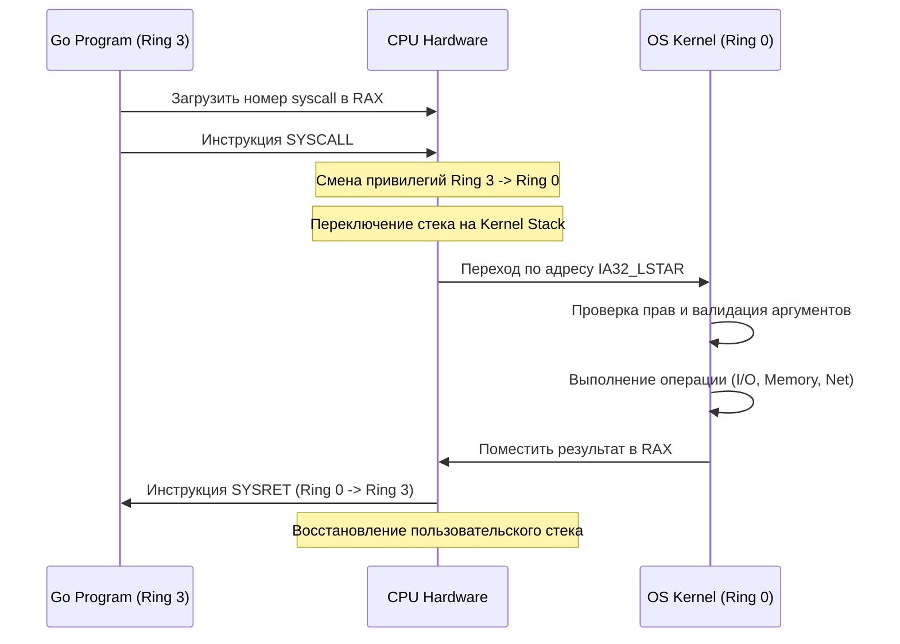

## Граница между User Space и Kernel Space

Ваша программа на Go исполняется в **User Space** (пространстве пользователя). В этом режиме процессор находится в состоянии с ограниченными правами (**Ring 3** в архитектуре x86-64). В этом режиме программе *запрещено* напрямую обращаться к железу: она не может сама отправить пакет в сеть, записать байт на диск или изменить таблицу страниц.

Если бы любая программа могла писать в любой сектор диска или менять права процессора, одна ошибка в коде или один уязвимый пакет уничтожили бы всю систему.

Для выполнения таких операций программа должна использовать **Системный вызов (System Call)**. Это контролируемый, атомарный переход из User Space в **Kernel Space** (пространство ядра, **Ring 0**), где у процессора есть неограниченные права.

## Механизм перехода в ядро (Under the Hood)

Системный вызов — это не просто "функция". Это смена привилегий, контекста и режима исполнения процессора.

Когда вы вызываете в Go `os.ReadFile()` или `net.Dial()`, рантайм Go (точнее, пакет `syscall` и `runtime`) подготавливает аргументы и инициирует переход.

### 1. Аргументы и регистры CPU
Linux x86-64 использует строго определенный ABI (Application Binary Interface) для передачи параметров в ядро:

| Аргумент | Регистр | Назначение |
|----------|---------|------------|
| Номер syscall | `RAX` | Например, `read` = 0, `write` = 1, `mmap` = 9 |
| Аргумент 1 | `RDI` | Указатель на буфер, номер файла, адрес памяти |
| Аргумент 2 | `RSI` | Размер буфера, флаги |
| Аргумент 3 | `RDX` | Дополнительные флаги или адрес |
| Аргумент 4 | `R10` | (вместо `RCX` для оптимизации вызовов) |
| Аргумент 5 | `R8` | ... |
| Аргумент 6 | `R9` | ... |

Результат выполнения всегда возвращается в `RAX`. Отрицательное значение (например, `-14` для `EFAULT`) означает ошибку.

### 2. Инструкции перехода
Процессор использует специальные инструкции для безопасного прыжка в Ring 0:
- `SYSCALL` / `SYSRET`: Быстрый путь (modern x86-64). Прыгает по заранее заданным адресам в IDT (MSR `IA32_LSTAR`).
- `SYSENTER` / `SYSEXIT`: Аналог для Intel.
- `INT 0x80`: Легаси-путь (32-битный Linux). Медленнее из-за полного сохранения состояния.



## Механика и цена перехода (Mechanical Sympathy)

Для бэкенд-разработчика понимание стоимости syscall — это ключ к написанию высокопроизводительного кода. 

**Системный вызов — это очень дорогая операция.** 

Когда исполняется инструкция `SYSCALL`, происходит следующее:
1. **Сброс конвейера процессора (Pipeline Flush):** Предсказание ветвлений, кэши инструкций и данные в L1/L2 кэшах процессора становятся невалидными. Процессору нужно заново загрузить инструкции в конвейер.
2. **Смена стеков:** Переключение с пользовательского стека на стек ядра. Это вызывает `cache miss` для кэш-линий стека.
3. **TLB Shootdown:** Если syscall меняет таблицу страниц (например, `mmap` или `brk`), кэш TLB (Translation Lookaside Buffer) на всех ядрах должен быть инвалидирован. Это синхронная операция с межпроцессорным прерыванием (IPI).
4. **Контекстное переключение:** Сохранение регистров, флагов, дескрипторов сегментов.

**Стоимость:** От 200 до 5000 тактов CPU (nanoseconds range), в зависимости от типа syscall и состояния кэшей. При нагрузке в миллионы RPS, сотни тысяч syscall-ов в секунду превращаются в узкое место, даже если CPU загружен на 5%.

> [!warning] Ловушка / Gotcha
> Пример из жизни: запись в файл.
> Если вы будете писать в файл по одному байту:
> ```go
> for _, b := range data {
>     file.Write([]byte{b}) // Каждый раз вызывает syscall 'write'
> }
> ```
> Ваша программа будет работать бесконечно медленно. 99% времени CPU будет тратить на сброс конвейера и смену стека, а не на запись данных.

**Как это лечится? Буферизацией и агрегацией.**
В Go для этого есть пакет `bufio`. Он создает в памяти (в User Space) большой буфер (например, 4 КБ). Вы записываете данные в этот буфер (простая операция с памятью, очень быстро), и только когда буфер заполняется, Go делает **один** системный вызов `write`, отправляя сразу все 4 КБ данных. Это сокращает количество переключений контекста в тысячи раз.

## Go runtime и блокирующие системные вызовы

В Go системные вызовы обрабатываются особенно интересно из-за планировщика горутин (G-M-P).

Когда горутина делает **блокирующий** syscall (например, чтение с диска или TCP-сокета), она блокирует весь системный тред (M), на котором работает. Если бы планировщик просто "ждал", остальные горутины на этом треде простаивали бы.

### Механизм Hand-off и Pinning
1. **Pinning:** В момент входа в syscall Go runtime "прибивает" (pin) горутину к текущему треду M. Это гарантирует, что ядро не потеряет дескрипторы и контекст.
2. **Detection:** Планировщик (в отдельном тредe `sched`) видит, что тред M ушел в blocking syscall.
3. **Hand-off:** Планировщик "отцепляет" горутину от треда, переводит её в состояние `Gwaiting` (вызывает `gopark`), и передает управление другой горутине на этом же треду. Если тредов не хватает, он создает новый тред ОС (`mksyscall` -> `newm`).
4. **Wake-up:** Когда syscall завершается, ядро возвращает управление. Go runtime видит это, переводит горутину в `Grunnable` (`goready`), и добавляет её в очередь планировщика (P).

```go
// Псевдокод внутреннего устройства runtime в Go 1.14+
// Когда горутина делает blocking syscall:
if isBlockingSyscall() {
    runtime.gopark(lockAddr, waitReason, traceEv) // Усыпляем горутину
    runtime.munpin() // Отцепляем от треда M
    // Планировщик может создать новый тред или переназначить P
}

// Когда syscall возвращается:
if syscallRet > 0 || (syscallRet == -1 && errno != EAGAIN) {
    runtime.goready(g, 0) // Будим горутину
}
```

> [!tip] Собеседование
> **Вопрос:** Что произойдет, если горутина сделает блокирующий syscall и не вернется (зависнет в ядре)?
> **Ответ:** Тред M будет заблокирован навсегда. Планировщик Go не может его убить. Это приведет к утечке тредов ОС и падению производительности всей программы, так как другие горутины не смогут исполняться на этом треде. Именно поэтому в Go принято использовать неблокирующие сокеты (`SetDeadline`, `SetReadDeadline`) или `io_uring`/`epoll` для управления временем ожидания на уровне приложения, а не ядра.

## Ловушки и практики оптимизации

1. **Минимизация syscall:** Используйте `bufio`, `bytes.Buffer`, `sync.Pool` для буферов. Избегайте мелких аллокаций и чтений.
2. **`mmap` вместо `Read/Write`:** Для больших файлов или часто читаемых данных используйте `mmap`. Он создает отображение файла в виртуальную память. Чтение работает как доступ к RAM. Запись происходит через Page Fault (lazy allocation) и write-back ядром. Это убирает syscall на каждый байт.
3. **`io_uring` (Linux 5.1+):** Современная замена `epoll` + `readv/writev`. Позволяет отправлять I/O запросы в ядро один раз, а результаты получать асинхронно. Go 1.21+ активно внедряет `io_uring` в `netpoller` и `os` пакеты.
4. **CGO и syscall:** Каждый переход в CGO (`#cgo`) и обратно — это отдельный syscall и контекстный переход. Избегайте частых вызовов CGO в hot-path.

> [!info] Под капотом
> В Go 1.22+ планировщик научился "предугадывать" завершение syscall. Если горутина сделала non-blocking syscall (например, `epoll_wait` с таймаутом), runtime может использовать `futex` (Fast Userspace Mutex) для оптимизации ожидания, избегая лишних переключений в ядро, если событие уже наступило.

## Собеседование: На что смотрят на интервью

| Вопрос | Ожидаемый ответ (Senior/Lead) |
|--------|-------------------------------|
| Почему syscall дорог? | Сброс конвейера, инвалидация TLB, смена стека, проверка прав, переход из Ring 3 в Ring 0. |
| Как Go scheduler справляется с блокирующим syscall? | Pinning goroutine to M, hand-off к другому M, gopark/goready, создание новых M при нехватке. |
| Как отличить blocking от non-blocking syscall? | Blocking: `read`/`write`/`accept` без `O_NONBLOCK`. Non-blocking: с флагом `O_NONBLOCK` или через `epoll`/`kqueue`. |
| Что такое `futex` в контексте Go? | Fast Userspace Mutex. Позволяет мьютексам и каналам работать в user-space. Переход в ядро только при contention (конкуренции). |
| Как оптимизировать сетевой бэкенд? | `io_uring`, `TCP_NODELAY`, `SO_REUSEPORT`, пулинг соединений, `bufio`, отказ от мелких аллокаций, tuning `net.core.somaxconn`. |

## Итог

1. **Системные вызовы** — это контролируемый переход из User Space (Ring 3) в Kernel Space (Ring 0) для доступа к привилегированным ресурсам.
2. **Стоимость** огромна из-за сброса конвейера CPU, инвалидации TLB и смены контекста. Каждый syscall должен быть оправдан.
3. **Go runtime** интеллектуально обрабатывает блокирующие вызовы через механизм pinning/hand-off, чтобы не терять производительность планировщика.
4. **Оптимизация** строится на буферизации, `mmap`, `io_uring` и агрегации запросов.

Мы разобрали сам механизм запроса ресурсов у ядра. В следующей статье мы детально пройдемся по конкретным системным вызовам, которые бэкенд-разработчик использует ежедневно: `read`, `write`, `accept`, `mmap`, `epoll_ctl`, `clone` и другим.