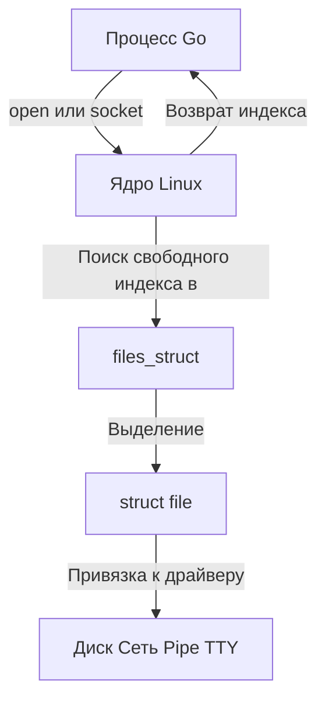

## Философия «Всё есть файл» и зачем это Go-разработчику

В Unix-подобных системах (включая Linux) действует фундаментальная абстракция: **любое устройство, ресурс или канал связи представляется как файл**. Сетевой сокет, пайп, терминал, диск, `/dev/null` или `/dev/zero` — всё это для ядра и пользовательских программ является файлами.

Для Go-разработчика это не просто историческая данность, а ключ к пониманию работы `io.Reader` / `io.Writer`, сетевого стека и асинхронного `IO`. Понимание файловой модели позволяет писать предсказуемый код, избегать утечек ресурсов и эффективно работать с системными лимитами.

## Что такое файловый дескриптор (FD) «под капотом»

Файловый дескриптор (File Descriptor, FD) — это **не указатель на файл** и не структура данных. Это **маленькое целое число** (обычно `int32`), которое служит индексом в таблице открытых файлов текущего процесса.

Когда вы вызываете системный вызов `open()` или `socket()`, ядро:
1. Выделяет структуру `struct file` (описание файла) в ядре.
2. Ищет свободный индекс в таблице `struct files_struct` текущего процесса (обычно начиная с наименьшего свободного номера).
3. Возвращает этот индекс в пользовательское пространство.



**Ключевой момент:** Таблица FD — это простой массив указателей. Поиск свободного дескриптора работает за **O(1)** или **O(log N)** в зависимости от реализации, что делает открытие файлов крайне быстрым. Однако при большом количестве открытых дескрипторов ядро может использовать bitmaps или RB-деревья для оптимизации поиска.

## VFS: Магия унификации ресурсов

Чтобы абстракция «всё есть файл» работала, ядро использует **VFS (Virtual File System)** — слой виртуальной файловой системы. VFS предоставляет единый интерфейс `read`, `write`, `close`, `lseek` для любых ресурсов.

В ядре Linux каждый открытый ресурс описывается тремя уровнями:
1. **FD (индекс в таблице процесса)** — локальный для процесса.
2. **File Description (`struct file`)** — глобальный объект ядра, содержит текущую позицию чтения/записи (`f_pos`), флаги (`O_APPEND`, `O_NONBLOCK`), права доступа.
3. **Inode (`struct inode`)** — метаданные на диске (для обычных файлов) или структура драйвера (для сокетов/пайпов).

> [!info] Под капотом
> В Go пакет `os` и `syscall` работают именно с `struct file`. Когда вы вызываете `file.Read()`, Go делает syscall `read(fd, buf, len)`. Ядро по `fd` находит `struct file`, проверяет права, вызывает `f_op->read` (указатель на функцию драйвера) и копирует данные из ядра в пользовательскую память.

## Управление дескрипторами в Go: Идиомы и ловушки

Go предоставляет высокоуровневый обертку `os.File`, но под капотом это просто обертка над FD. Понимание того, как Go управляет дескрипторами, критично для production-кода.

### 1. `os.NewFile` и ручное управление
Если вы работаете с низкоуровневыми API (например, получаете FD из `syscall` или `net.Conn`), вы должны явно создать Go-обертку:
```go
import (
    "os"
    "syscall"
)

func handleRawFD() error {
    // Допустим, мы получили FD из внешнего API
    rawFD := int32(42)
    
    // Создаем обертку. Второй аргумент — имя для дебага/логов.
    // Важно: os.NewFile НЕ делает dup! Он просто забирает владение.
    f := os.NewFile(rawFD, "custom-resource")
    if f == nil {
        return syscall.EBADF
    }
    defer f.Close() // Явное закрытие обязательно!
    
    // Работа с файлом...
    return nil
}
```

### 2. `O_CLOEXEC` и предотвращение утечек
При вызове `exec.Command` или `fork()` дочерний процесс наследует таблицу FD родителя. Если вы открыли сокет или файл без флага `O_CLOEXEC`, он автоматически откроется в дочернем процессе, что может привести к:
- Утечке ресурсов (child держит дескриптор открытым после `exec`).
- Конфликтам (несколько процессов пишут в один сокет/лог).
- Нарушению безопасности (child получает доступ к приватным ресурсам).

> [!warning] Ловушка / Gotcha
> **Утечка дескрипторов при fork/exec** — одна из самых частых проблем в Go-микросервисах. Если вы используете `syscall.Open` или `net.Listen`, всегда проверяйте, поддерживает ли драйвер флаг `O_CLOEXEC`. В Go 1.11+ большинство функций из `os` и `net` устанавливают его автоматически, но низкоуровневые `syscall` вызовы требуют явного указания.

```go
import (
    "os"
    "syscall"
)

func openWithCloexec(path string) (*os.File, error) {
    fd, err := syscall.Open(path, syscall.O_RDWR|syscall.O_CLOEXEC, 0644)
    if err != nil {
        return nil, err
    }
    return os.NewFile(uintptr(fd), path), nil
}
```

### 3. `os.File` vs `net.Conn` vs raw `syscall`
- `os.File` — оптимизирован для `read/write` с буферизацией, поддерживает `io.Reader/Writer`, `io.Seeker`.
- `net.Conn` — обертка над сокетами. В Go 1.11+ `net.Conn` реализует `io.ReaderAt` и `io.WriterTo` только если underlying FD поддерживает `sendfile` или `splice`.
- `syscall` — нулевая абстракция. Используется в `netpoller` и для `epoll`/`kqueue`.

> [!tip] Собеседование
> **Вопрос:** Что произойдет, если Go-программа упадет с `panic` и не вызовет `defer file.Close()`?
> **Ответ:** В Unix при завершении процесса (любым способом, включая `panic` и `SIGKILL`) ядро автоматически закрывает все дескрипторы процесса. Однако в production это **недопустимая практика**. Утечка FD приводит к:
> 1. Исчерпанию лимита `ulimit -n` (процесс перестанет открывать новые файлы/сокет).
> 2. Невозможности корректного `graceful shutdown`.
> 3. Непредсказуемому поведению при `fork` или использовании `exec.Command`.
> Go не гарантирует вызов `defer` при `SIGKILL` или аппаратных сбоях, поэтому явное `Close()` — обязательный паттерн.

## Механическая симпатия: Стоимость и оптимизация

### 1. Поиск FD и VFS overhead
Каждый `read`/`write` проходит через:
`User Space -> Syscall -> files_struct lookup -> struct file validation -> VFS dispatch -> Driver`
Этот путь добавляет **несколько десятков тактов CPU**. В высоконагруженном Go-сервере (10k+ RPS) вызовы `os.File` могут стать узким местом по сравнению с raw `syscall` или `epoll`-циклами.

### 2. Лимиты и масштабируемость
Каждый открытый FD потребляет память в ядре (~1-2 КБ на `struct file` + `struct inode`). При 100k одновременных соединений (например, WebSocket или gRPC) вы подходите к системному лимиту.

> [!warning] Ловушка / Gotcha
> **ulimit и Docker/K8s**: В контейнерах лимит FD часто наследуется от хоста или ставится в `ulimit -n`. Если Go-сервер не закрывает соединения вовремя, он быстро достигнет `EMFILE` (Too many open files). Всегда мониторьте `go sysfs` и `go goroutines` в pprof.

### 3. Zero Copy и FD
Понимание FD позволяет использовать `splice` и `sendfile` для передачи данных между диском и сетью без копирования в user space. В Go это реализуется через `syscall.Sendfile` или `golang.org/x/sys/unix`, что критично для статических файлов или проксирования.

## Итоги

1. **FD — это индекс**, а не указатель. Таблица дескрипторов работает за O(1).
2. **VFS унифицирует** диск, сеть, пайпы и терминалы под единый интерфейс `read/write/close`.
3. **Go управляет FD через `os.File`**, но требует явного `Close()`. GC не спасает от утечек FD в production.
4. **`O_CLOEXEC` обязателен** при работе с низкоуровневыми syscall и `fork/exec`.
5. **Лимиты и overhead** FD напрямую влияют на масштабируемость высоконагруженных Go-серверов.

Мы разобрали фундаментальный механизм доступа к ресурсам. Но как эти ресурсы передаются между процессами без создания новых соединений? В следующей статье мы погрузимся в `[[26. Pipe, Named Pipe и перенаправление потоков]]`, где разберем, как Linux реализует канальную передачу данных и как Go использует это для асинхронного пайплайна.