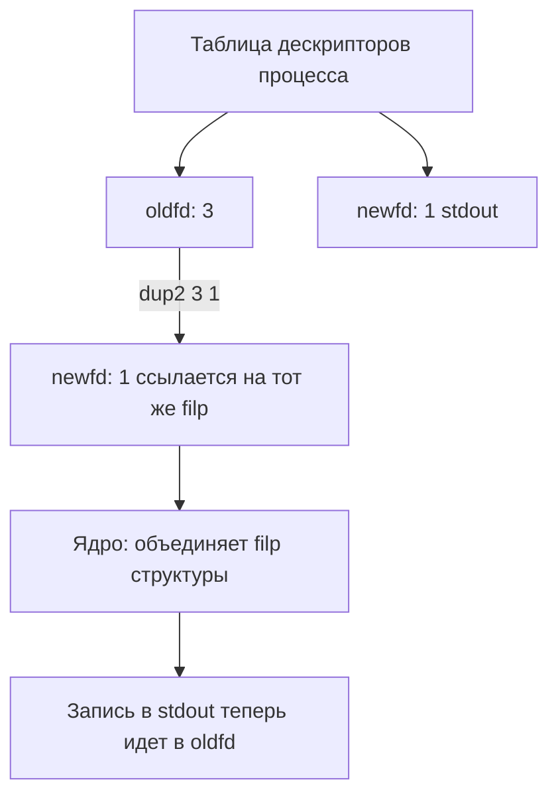

## Введение: Философия «труб» в Unix

В Unix-экосистеме данные передаются не через сложные протоколы или сериализацию, а через потоки байтов. **Pipe (пайп)** — это однонаправленный канал связи, который позволяет одной программе передавать данные другой. Это краеугольный камень философии Unix: «Пиши программы, которые делают только одну вещь, но делают её хорошо. Пиши программы, которые работают вместе. Пиши программы, которые обрабатывают потоки текста, потому что это универсальный интерфейс».

Для Go-разработчика понимание пайпов критично, так как `io.Reader` и `io.Writer` во многом копируют эту модель. В Go мы редко работаем с сишными дескрипторами напрямую, но когда мы запускаем внешние процессы, настраиваем `gRPC`-потоки или работаем с `net.Conn`, мы по сути оперируем виртуальными или реальными пайпами.

В этой статье мы разберем:
- Неименованные пайпы (`Pipe`) и их устройство в ядре Linux.
- Именованные пайпы (`FIFO`) для межпроцессного взаимодействия.
- Механизм перенаправления потоков (`dup2`) и как его реализует Go.
- Production-ready паттерны работы с `os/exec` и типичные deadlock-ловушки.

> [!info] Под капотом
> В Linux пайп реализуется через структуру `pipe_inode_info` в ядре. Это кольцевой буфер (ring buffer), обычно размером 64 КБ (зависит от версии ядра и конфигурации). Данные копируются из пользовательского пространства в ядро через `copy_from_user`/`copy_to_user`. Граница `PIPE_BUF` (обычно 4096 байт) гарантирует атомарность записи: если размер данных ≤ `PIPE_BUF`, запись не будет прервана другими процессами.

## Неименованный Pipe: Жизнь в кольцевом буфере

Неименованный пайп создается системным вызовом `pipe()` или `pipe2()`. Он возвращает массив из двух файловых дескрипторов: `[readfd, writefd]`.

```go
// Упрощенный вызов из Go
fds, err := syscall.Pipe2([]int{0, 1}, syscall.O_CLOEXEC)
if err != nil {
    // обработка ошибки
}
readFD := fds[0]
writeFD := fds[1]
```

### Механика работы
1. **Запись:** Процесс пишет данные в `writefd`. Ядро копирует их в свой кольцевой буфер.
2. **Чтение:** Процесс читает из `readfd`. Ядро копирует данные из буфера в пользовательский буфер.
3. **Блокировка (Blocking):** 
   - Если буфер полон, `write()` блокирует вызывающую горутину/поток до освобождения места.
   - Если буфер пуст, `read()` блокируется до появления данных.
4. **Non-blocking режим:** Флаг `O_NONBLOCK` меняет поведение: вместо блокировки возвращается `EAGAIN` или `EWOULDBLOCK`.

> [!warning] Ловушка / Gotcha
> **Deadlock при заполнении буфера.** Если размер данных превышает 64 КБ (размер буфера пайпа) и вы не читаете данные параллельно, записывающий процесс/горутина уйдет в бесконечный `EAGAIN` или блокировку. В Go это классическая причина утечек горутин при работе с `os/exec`.

## Именованный Pipe (FIFO): Постоянство без состояния

Неименованный пайп живет только пока живы процессы, которые его создали. Для взаимодействия несвязанных процессов (например, веб-сервис и фоновый воркер) используются **FIFO** (First-In-First-Out).

```bash
mkfifo /tmp/app_pipe
```

### Особенности FIFO
- **Файловая система:** Существование в виде специального файла (`p` в `ls -l`).
- **Открытие:** `open()` на FIFO блокируется, пока другой процесс не откроет другой конец (чтение или запись), если не указан `O_NONBLOCK`.
- **Синхронизация:** FIFO не хранит данные на диске. Это чисто оперативный канал. Данные исчезают после закрытия последнего дескриптора.

В Go открытие FIFO требует осторожности, так как `os.Open()` может заблокировать поток навсегда:

```go
fifoPath := "/tmp/app_pipe"
f, err := os.OpenFile(fifoPath, os.O_RDONLY|os.O_NONBLOCK, 0)
// В production всегда оборачивайте в контекст и запускайте в горутине
```

## Перенаправление потоков: магия dup2

Когда вы в терминале пишете `cmd > output.txt` или `cmd | grep error`, оболочка не делает магию. Она манипулирует таблицей файловых дескрипторов текущего процесса.

### Как работает `dup2`
Системный вызов `dup2(oldfd, newfd)` копирует запись из таблицы дескрипторов `oldfd` в `newfd`. Если `newfd` уже был открыт, он автоматически закрывается.



**Ключевые нюансы для Go:**
1. **`O_CLOEXEC`:** Всегда используйте этот флаг при создании пайпов или дублировании дескрипторов. Без него файловые дескрипторы «утекут» в дочерние процессы после `fork`/`exec`, что приведет к утечкам ресурсов или сложным race conditions.
2. **`filp` в ядре:** `dup2` не копирует данные. Он увеличивает счетчик ссылок (`f_count`) на структуре `file` (filp) в ядре. Поэтому `close()` на одном из дескрипторов не закрывает канал, пока не будет вызван на всех копиях.

## Go-идиомы: Работа с `os/exec` и пайпами

В Go нет прямого аналога PHP `popen()` или Python `subprocess.Popen` с синхронным чтением по умолчанию. Идиоматичный подход требует явного управления жизненным циклом горутин и дескрипторов.

### Production-ready паттерн запуска команды с чтением stdout

```go
package main

import (
	"context"
	"io"
	"log"
	"os/exec"
	"strings"
)

func runWithPipe(ctx context.Context, cmdPath string, args []string) (string, error) {
	cmd := exec.CommandContext(ctx, cmdPath, args...)
	
	// Получаем пайп для чтения stdout
	stdoutPipe, err := cmd.StdoutPipe()
	if err != nil {
		return "", fmt.Errorf("create stdout pipe: %w", err)
	}
	
	// Буфер для накопления результата
	var sb strings.Builder
	
	// Запускаем команду (не блокирует, возвращает сразу)
	if err := cmd.Start(); err != nil {
		return "", fmt.Errorf("start command: %w", err)
	}
	
	// Горутина читает пайп. io.Copy закрывает пайп автоматически,
	// когда дочерний процесс закроет свой stdout.
	errCh := make(chan error, 1)
	go func() {
		_, copyErr := io.Copy(&sb, stdoutPipe)
		errCh <- copyErr
	}()
	
	// Ждем завершения процесса
	waitErr := cmd.Wait()
	
	// Проверяем ошибки чтения из пайпа
	if copyErr := <-errCh; copyErr != nil {
		return "", fmt.Errorf("pipe read error: %w", copyErr)
	}
	
	// cmd.Wait() возвращает nil, если процесс завершился с кодом 0
	if waitErr != nil {
		return "", fmt.Errorf("command exited with error: %w", waitErr)
	}
	
	return sb.String(), nil
}
```

### Почему нельзя делать `cmd.Output()` в production?
`cmd.Output()` (и `cmd.CombinedOutput()`) создают буфер в памяти и читают весь вывод, блокируя вызывающий поток. Если внешний процесс выводит мегабайты логов или зависает, ваше Go-приложение получит `fatal error: out of memory` или deadlock. Всегда используйте `io.Pipe` или `io.Reader` с контекстом.

## Ловушки и корнер-кейсы

> [!tip] Собеседование
> **Вопрос:** Как избежать deadlock при чтении stdout/stderr внешней команды в Go?
> **Ответ:** 
> 1. Никогда не читайте stdout и stderr в одной горутине последовательно, если они могут заполнить буферы пайпов одновременно.
> 2. Запускайте чтение каждого пайпа в отдельной горутине.
> 3. Используйте `cmd.StdoutPipe()` и `cmd.StderrPipe()` до `cmd.Start()`.
> 4. Обязательно вызывайте `cmd.Wait()` в основной горутине после завершения чтения, иначе процесс останется «зависшим» (zombie) и дескрипторы не освободятся.

> [!warning] Ловушка / Gotcha
> **EOF и закрытие пайпа.** Если записывающий процесс не закроет свой конец пайпа, читающая горутина будет висеть на `Read()` вечно, ожидая данных, которые никогда не придут. В Go это лечится `defer pipe.Close()` или использованием `context.WithCancel` для принудительного закрытия дескрипторов при таймауте.

> [!info] Под капотом
> **Разница между `pipe` и `FIFO`:** 
> - `pipe()` выделяет память в ядре и связывает два дескриптора одного процесса. Работает быстрее (нет системного вызова `open`/`stat` для поиска в inode).
> - `mkfifo` создает объект в VFS (Virtual File System). При `open()` ядро проверяет права доступа, ищет inode, блокируется до подключения второй стороны. Подходит для IPC между несвязанными процессами и для интеграции с bash-скриптами.

## Сравнение с другими языками

| Аспект | Go | PHP / Python | C / C++ |
|--------|----|--------------|---------|
| **Модель данных** | `io.Reader` / `io.Writer` (потоки) | Ресурсы / объекты File | `int` (fd) |
| **Конкурентность** | Горутины + `cmd.Start()` + `cmd.Wait()` | `popen()` (блокирующий) или `subprocess` (асинхронный) | `fork()` + `pipe()` + `dup2()` + `execve()` |
| **Управление памятью** | Автозакрытие пайпов при `io.Copy` завершении | Ручное `fclose()` или GC (ненадежно) | Ручное `close(fd)`, риск утечек |
| **Безопасность** | `O_CLOEXEC` по умолчанию в `os/exec` | Часто требует явного указания | Всегда нужен `O_CLOEXEC` или `fcntl(FD_CLOEXEC)` |

Go избавляет разработчика от рутины с `fork`/`dup2`/`execve`, но требует понимания механики пайпов, чтобы не уронить приложение при работе с тяжелыми внешними процессами или медленным сетевым IO.

## Итог

1. **Pipe** — это кольцевой буфер в ядре Linux. Его размер ограничен (обычно 64 КБ). Заполнение буфера приводит к блокировке `write()`.
2. **FIFO** — именованный пайп в файловой системе. Используется для IPC между несвязанными процессами. Требует аккуратного управления флагами открытия (`O_NONBLOCK`, `O_CLOEXEC`).
3. **Перенаправление** работает через `dup2`, который дублирует ссылки на структуру `filp` в ядре, а не копирует данные.
4. **В Go** всегда разделяйте чтение stdout/stderr на отдельные горутины, используйте `cmd.Start()` + `io.Copy` + `cmd.Wait()`, и никогда не полагайтесь на `cmd.Output()` для больших объемов данных.
5. **Deadlock** при работе с пайпами возникает из-за несбалансированного чтения/записи или отсутствия закрытия дескрипторов. Контекст `context.Context` — ваш главный инструмент для отмены операций.

Мы разобрали байтовые потоки и файловые дескрипторы. Но что делать, когда пайпы становятся слишком тяжелыми или нужны двунаправленные связи между процессами на одной машине? В следующей статье мы погрузимся в: [[27. Unix Domain Socket]], чтобы понять, как ОС оптимизирует локальную сетевую коммуникацию без накладных расходов TCP/IP.