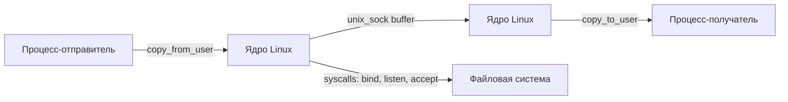

## Что такое Unix Domain Socket (UDS)

**Unix Domain Socket (UDS)** — это механизм межпроцессного взаимодействия (IPC), который использует классический API сокетов, но полностью изолирован внутри ядра операционной системы. В отличие от сетевых сокетов, UDS не задействует стек протоколов IP/TCP/UDP, маршрутизацию, ARP или проверку контрольных сумм. Это «частная магистраль» внутри ядра, предназначенная исключительно для обмена данными между процессами на одном хосте.

Для Go-разработчика UDS критически важен, потому что:
*   **Docker и контейнеризация** используют UDS для связи между демонами и клиентскими CLI.
*   **gRPC и HTTP/2** поддерживают UDS как транспорт для локальных микросервисов, экономя ресурсы сетевого стека.
*   Он позволяет избежать конфликтов портов и накладных расходов на `localhost`-соединения.
*   Поддерживает передачу файловых дескрипторов (FD passing), что невозможно через обычный TCP.

## Типы сокетов и пространства имен (Namespaces)

В ядре Linux UDS поддерживает три типа, реализующие разные семантики:

1. `SOCK_STREAM` — надежный, потоковый, ориентированный на байты (аналог TCP). Гарантирует порядок доставки и отсутствие дубликатов.
2. `SOCK_DGRAM` — ненадежный, пакетный, ориентированный на сообщения (аналог UDP). Сообщения могут теряться или приходить вне порядка.
3. `SOCK_SEQPACKET` — надежный, пакетный. Гарантирует доставку целых сообщений в порядке отправки.

UDS использует два типа пространств имен (namespaces) для привязки адреса:

> [!info] Под капотом
> **Filesystem (Файловая система):** Сокет привязывается к реальному пути на диске (например, `/tmp/app.sock`). Это обычный файл типа `socket` (отображается как `s` в `ls -l`). Ядро отслеживает его через `struct unix_inode_info`.
> **Abstract (Абстрактное пространство):** Специфично для Linux. Путь начинается с байта `\0`. Сокет существует только в памяти ядра и не имеет представления в файловой системе. Автоматически удаляется при завершении процесса, но подвержен коллизиям имен без проверки `stat()`.

## Под капотом: Ядерная реализация и производительность

Когда процесс вызывает `socket(AF_UNIX, SOCK_STREAM, 0)`, ядро создает объект `struct sock` с привязкой к `struct unix_sock`. В отличие от сетевого стека, здесь отсутствует очередь SYN, таймауты повторной передачи и алгоритмы управления перегрузкой (congestion control).

Передача данных происходит через буферы ядра (`sk_buff`), которые копируются из пользовательского пространства процесса-отправителя в ядро, а затем напрямую копируются в адресное пространство процесса-получателя. Современные версии ядра оптимизируют этот путь через `unix_sendpage` и `splice()`, позволяя частично обходить копирование буфера (Zero Copy), если данные уже находятся в `page cache`.



**Почему UDS быстрее TCP loopback?**
При использовании `127.0.0.1:8080` пакет проходит через:
`Приложение -> TCP -> IP -> Loopback Driver -> IP -> TCP -> Приложение`.
Каждый этап включает парсинг заголовков, проверку контрольных сумм, поиск в таблице маршрутизации и переключение контекстов сетевого стека. UDS пропускает все слои IP/TCP, оставаясь в пространстве `AF_UNIX`, что дает прирост производительности на **20-40%** и снижает задержку на **10-30%**.

> [!tip] Собеседование
> **Вопрос:** Почему UDS не может быть быстрее, чем разделяемая память (Shared Memory)?
> **Ответ:** UDS все еще использует системные вызовы `sendmsg`/`recvmsg`, копирование данных через `copy_from_user`/`copy_to_user` и блокировки ядра для синхронизации очередей. Shared Memory (POSIX `shm_open` или `mmap`) позволяет процессам работать с одной физической страницей RAM без копирования и syscall-ов, что делает его самым быстрым IPC, но требует ручной реализации потокобезопасности (мьютексов, семафоров).

## Идиоматичная работа с UDS в Go

В стандартной библиотеке Go транспорт UDS активируется через тип сети `unix`.

### Сервер
```go
package main

import (
	"fmt"
	"log"
	"net"
	"os"
)

func main() {
	path := "/tmp/my_service.sock"

	// Удаляем старый сокет, если он остался после краша предыдущего запуска
	os.Remove(path)

	listener, err := net.Listen("unix", path)
	if err != nil {
		log.Fatalf("Ошибка привязки сокета: %v", err)
	}
	defer listener.Close()
	defer os.Remove(path) // Гарантированная очистка

	fmt.Printf("Сервер слушает: %s\n", path)

	for {
		conn, err := listener.Accept()
		if err != nil {
			log.Printf("Ошибка accept: %v", err)
			continue
		}
		go handleConnection(conn)
	}
}

func handleConnection(conn net.Conn) {
	defer conn.Close()
	buf := make([]byte, 1024)
	n, err := conn.Read(buf)
	if err != nil {
		log.Printf("Ошибка чтения: %v", err)
		return
	}
	fmt.Printf("Получено: %s\n", string(buf[:n]))
}
```

### Клиент
```go
package main

import (
	"log"
	"net"
	"os"
)

func main() {
	path := "/tmp/my_service.sock"

	// Проверка существования сокета перед подключением
	if _, err := os.Stat(path); os.IsNotExist(err) {
		log.Fatalf("Сокет %s не существует", path)
	}

	conn, err := net.Dial("unix", path)
	if err != nil {
		log.Fatalf("Ошибка подключения: %v", err)
	}
	defer conn.Close()

	_, err = conn.Write([]byte("Hello UDS"))
	if err != nil {
		log.Fatalf("Ошибка записи: %v", err)
	}
}
```

> [!warning] Ловушка / Gotcha
> **Абстрактные сокеты в Go:** Стандартная библиотека `net` поддерживает абстрактные сокеты только если путь начинается с `\x00`. Однако на Linux это работает нестабильно из-за ограничений `SOCK_MAX_ADDR` и поведения libc. Для продакшена рекомендуется использовать файловые сокеты или специализированные библиотеки (`github.com/mdlayher/socket`).
> **Очистка:** Если процесс падает с `panic`, файл сокета остается в системе. Последующий запуск выбросит `address already in use`. Всегда используйте `defer os.Remove(path)` или запускайте `unlink` перед `bind`.

## Продвинутые возможности и типичные ловушки

### Передача файловых дескрипторов (FD Passing)
UDS позволяет передавать открытые файлы, каналы или другие сокеты между процессами через механизм `SCM_RIGHTS`. Это фундамент для архитектур типа Docker (передача дескриптора stdin/stdout в контейнер) или пулов воркеров.

```go
// Сервер (отправка FD)
fd, _ := os.Open("/tmp/data.bin")
cmsg := unix.UnixRights(int(fd))
msg := &unix.Mmsghdr{
   Hdr: unix.Mhdr{
        Control: unix.Cmsghdr{
            Level: unix.SOL_SOCKET,
            Type:  unix.SCM_RIGHTS,
            Len:   unix.CmsgSpace(4),
        },
        Iov: []unix.Iovec{{Base: &[]byte{'A'}[0]}},
    },
    MsgHdr: unix.Mhdr{},
}
unix.Sendmmsg(listenerFD, []*unix.Mmsghdr{cmsg}, 0)

// Клиент (прием FD)
// Используется recvmsg с буфером для CMSG. Извлеченный дескриптор 
// оборачивается в os.NewFile(uintptr(fd), "").
```

### Лимиты путей и права доступа
*   **Длина пути:** Исторически `UNIX_PATH_MAX` = 108 байт. В современных ядрах (Linux 3.4+) лимит снят, но `bind()` все равно требует, чтобы путь не выходил за пределы доступной памяти.
*   **Права:** Файловые UDS наследуют права файловой системы. Если сокет создан от `root`, он будет недоступен для обычного пользователя без `chmod 777` (что опасно). Абстрактные сокеты по умолчанию доступны всем процессам с доступом к ядру.

> [!tip] Собеседование
> **Вопрос:** Как отличить UDS от TCP loopback на уровне ОС?
> **Ответ:** Через `ss -x` или `netstat -x`. UDS показывает тип `u_str` и путь в файловой системе. Также UDS не имеет IP-адресов и портов, поэтому `getsockopt(conn, SOL_SOCKET, SO_PEERNAME)` вернет путь к сокету, а `SO_TYPE` будет `SOCK_STREAM`/`SOCK_DGRAM`.

## Сравнение с другими IPC-механизмами

| Механизм | Скорость | Синхронизация | Передача FD | Надежность | Сфера применения в Go |
|----------|----------|---------------|-------------|------------|-----------------------|
| **Unix Domain Socket** | Высокая | Встроена (потоки/пакеты) | ✅ `SCM_RIGHTS` | ✅ Ядро гарантирует доставку | Локальные микросервисы, Docker, gRPC |
| **TCP Loopback** | Средняя | TCP state machine | ❌ | ✅ Сеть/ядро | Универсально, но избыточно для localhost |
| **Pipes / Named Pipes** | Высокая | Half-duplex (обычно) | ❌ | ✅ | Локальный обмен потоками, CI/CD пайплайны |
| **Shared Memory** | Максимальная | Ручная (Mutex/Semaphore) | ❌ | ❌ Риск race condition | Высокочастотный трейдинг, кэширование |
| **HTTP/REST** | Низкая | Прикладной уровень | ❌ | ✅ Прокси/балансировщики | Кросс-языковая интеграция, API Gateway |

## Итог

Unix Domain Socket — это не просто «сокет без сети», а оптимизированный ядерный механизм IPC, который экономит циклы процессора, избегает сетевого стека и предоставляет продвинутые возможности вроде передачи файловых дескрипторов. Для Go-разработчика понимание UDS необходимо для:
1. Настройки высокопроизводительных локальных транспортных слоев (gRPC, HTTP/2).
2. Интеграции с контейнерными рантаймами и системными демонами.
3. Избегания утечек ресурсов (zombie sockets) и проблем с правами доступа.

В следующей статье мы разберем, как Go-программы могут реагировать на внешние события и сигналы ядра: [[28. Сигналы в Linux]].