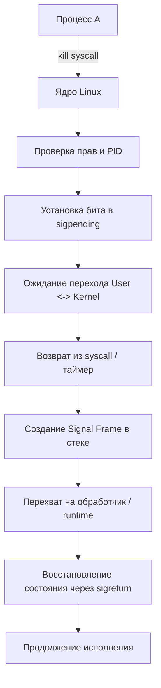

## Что такое сигналы и зачем они нужны бэкенду

**Сигналы (Signals)** — это асинхронные программные прерывания, которые ядро ОС отправляет процессу для уведомления о событиях: запрос на завершение, доступ к запрещённой памяти, разрыв канала связи, изменение состояния дочернего процесса и т.д.

В отличие от системных вызовов (которые синхронны и инициируются программой явно), сигналы доставляются **непредсказуемо во времени**. Для Go-разработчика это означает, что обработка сигналов — это не просто «повесить хук», а управление состоянием приложения в условиях гонки данных и прерывания потока исполнения.

Зачем это бэкенду:
1. **Graceful Shutdown**: Корректное завершение работы сервиса (закрытие соединений, drain очереди, запись логов) при получении `SIGTERM`.
2. **Межпроцессное взаимодействие**: Управление демоном, перезагрузка конфигурации (`SIGHUP`), отладка (`SIGUSR1`).
3. **Обработка ошибок рантайма**: Перехват `SIGSEGV` (падение), `SIGPIPE` (запись в закрытый сокет), `SIGFPE` (деление на ноль).

## Механизм доставки: ядро и user space

Чтобы понять, как信号 достигает вашей программы, нужно заглянуть в состояние потока выполнения (Thread Control Block, TCB) в ядре Linux.

Каждый тред ОС имеет два bitmap-поля в ядре:
- `sigpending` — битовая маска **ожидания**. Устанавливается, когда сигнал отправлен, но ещё не доставлен.
- `sigmask` — битовая маска **блокировки**. Сигналы, установленные здесь, игнорируются до момента очистки маски.

Когда другой процесс или пользователь вызывает `kill(pid, SIGTERM)`, ядро:
1. Ищет целевой тред по PID/TID.
2. Проверяет права доступа (UID/GID, capabilities).
3. Устанавливает соответствующий бит в `sigpending`.
4. Если тред заблокирован (`sigmask`), сигнал остаётся в `pending`.
5. Если тред выполняется, ядро **не прерывает его мгновенно**. Сигнал доставляется только при переходе из **Kernel Space** обратно в **User Space**:
   - Возврат из системного вызова.
   - Разрешение `Page Fault`.
   - Срабатывание таймера (preemption).

В момент доставки ядро:
1. Сохраняет регистры CPU и текущий указатель стека.
2. Подготавливает **Signal Frame** на вершине пользовательского стека.
3. Меняет `RIP` (Instruction Pointer) на адрес обработчика сигнала.
4. После выполнения обработчика вызывается инструкция `sigreturn`, ядро восстанавливает состояние и продолжает выполнение программы.



> [!info] Под капотом
> В Linux используется `rt_sigaction` вместо устаревшего `sigaction`. Разница в поддержке **real-time сигналов** (сигналы 32-64) с приоритетами и очередями доставки. Go runtime использует именно `rt_sigaction` для регистрации хуков.

## Ключевые сигналы Linux для разработки

| Сигнал | Код | Поведение по умолчанию | Применимость в Go |
|--------|-----|------------------------|-------------------|
| `SIGINT` | 2 | Termination | Ctrl+C. Перехватывается для graceful shutdown. |
| `SIGTERM` | 15 | Termination | Основной сигнал для остановки сервисов в K8s/Docker. |
| `SIGKILL` | 9 | Termination | **Невозможно перехватить или проигнорировать.** Немедленное убийство тредов. |
| `SIGPIPE` | 13 | Termination | Запись в закрытый pipe/сокет. В Go по умолчанию игнорируется. |
| `SIGHUP` | 1 | Termination | Закрытие терминала или перезапуск менеджера сервисов. Часто для reload конфига. |
| `SIGUSR1` | 10 | Termination | Пользовательский. Используется для отладки, переоткрытия логов. |
| `SIGCHLD` | 17 | Ignore | Изменение состояния дочернего процесса. Важно для `os/exec`. |
| `SIGSTOP` | 19 | Stop | **Невозможно перехватить.** Временная остановка процесса. |

> [!warning] Ловушка / Gotcha
> `SIGKILL` и `SIGSTOP` обрабатываются ядром на уровне планировщика. Они **не проходят** через обработчики сигналов, не вызывают `sigframe` и не дают приложению шанса на cleanup. Если вы видите, что ваш сервис не останавливается по `SIGTERM`, а зависает или падает через 10 секунд, значит, он либо не обрабатывает `SIGTERM`, либо ядро отправляет `SIGKILL` из-за `OOMKilled` или `liveness probe`.

## Сигналы в Go: Идиоматичный подход и под капотом

Go сознательно абстрагирует низкоуровневую работу с сигналами, чтобы избежать проблем **async-signal-safety**. В C/C++ в обработчике можно вызывать только определённый набор функций (например, `write`, `signal`), иначе поведение не определено. Go runtime берёт всю грязную работу на себя.

### Как работает `os/signal`

Пакет `os/signal` не регистрирует прямой C-хук. Вместо этого:
1. Go runtime блокирует целевые сигналы через `rt_sigprocmask` на всех тредях, кроме основного.
2. На основном тредe запускается фоновый goroutine, который блокируется на системном вызове `sigwaitinfo` (или аналогичном).
3. Когда сигнал приходит, ядро разблокирует `sigwaitinfo`, runtime получает номер сигнала.
4. Runtime сериализует сигнал и кладёт его в **channel**.
5. Ожидающая горутина разблокируется.

```go
package main

import (
	"context"
	"log"
	"net/http"
	"os"
	"os/signal"
	"syscall"
	"time"
)

func main() {
	// 1. Создаём контекст с отменой по сигналу
	ctx, cancel := signal.NotifyContext(context.Background(), os.Interrupt, syscall.SIGTERM)
	defer cancel()

	// 2. Настраиваем HTTP сервер
	srv := &http.Server{
		Addr:    ":8080",
		Handler: http.NewServeMux(),
	}

	// 3. Запускаем сервер в отдельной горутине
	go func() {
		if err := srv.ListenAndServe(); err != http.ErrServerClosed {
			log.Fatalf("HTTP server error: %v", err)
		}
	}()

	// 4. Ждём сигнал или ошибку сервера
	<-ctx.Done()
	log.Println("shutting down gracefully...")

	// 5. Graceful shutdown сервера с таймаутом
	shutdownCtx, shutdownCancel := context.WithTimeout(context.Background(), 10*time.Second)
	defer shutdownCancel()

	if err := srv.Shutdown(shutdownCtx); err != nil {
		log.Fatalf("HTTP server forced shutdown: %v", err)
	}

	log.Println("server exited properly")
}
```

### Под капотом `os/signal`
- Channel по умолчанию имеет **буфер размером 1** на каждый зарегистрированный сигнал.
- Если сигнал приходит, а channel полон (goroutine не успела считать), сигнал **безвозвратно теряется**. Это критично в высоконагруженных сервисах.
- `signal.NotifyContext` (Go 1.15+) — современный идиоматичный способ. Он создаёт контекст, который отменяется при получении сигнала. Внутренне использует тот же механизм, но привязывает отмену к `context` lifecycle, что идеально ложится на dependency injection и middleware.

## Ловушки и каверзные вопросы с собеседований

### 1. SIGPIPE: Тихий убийца
По умолчанию запись в закрытый pipe или сокет вызывает `SIGPIPE`, что завершает процесс. В Go пакеты `net`, `os` и `io` автоматически игнорируют `SIGPIPE` на старте. Однако, если вы работаете с raw socket или CGO, падение гарантировано.
```go
// Явное игнорирование для чистоты эксперимента или специфичных случаев
signal.Ignore(syscall.SIGPIPE)
```

### 2. EINTR и прерванные системные вызовы
Когда сигнал доставляется, ядро может прервать блокирующий syscall (например, `read` или `accept`), вернув ошибку `EINTR`. 
- В Go это **абстрагировано**: netpoller и стандартная библиотека автоматически перезапускают syscall или возвращают корректные ошибки Go (`syscall.EINTR` маппится на соответствующий error).
- В C/C++ вы обязаны проверять `errno == EINTR` и вызывать syscall повторно.

### 3. Гонка данных при cleanup
Классическая ошибка на собеседованиях:
```go
// ПЛОХОЙ ПРИМЕР
var wg sync.WaitGroup
sigCh := make(chan os.Signal, 1)
signal.Notify(sigCh, syscall.SIGTERM)

go func() {
    <-sigCh
    wg.Add(1)
    go cleanup(wg) // Race condition: cleanup может начаться до того, как сервер остановится
}()
```
Правильный паттерн всегда использует `context` или `sync.Once` для координации shutdown фаз.

### 4. Сигналы vs Context cancellation
`context.WithCancel` работает в пределах одного процесса. Сигналы — это IPC-механизм уровня ОС. Если ваш сервис развёрнут в K8s, `SIGTERM` отправляется kubelet. Если вы просто отмените контекст, процесс продолжит жить, но K8s убьёт его через `SIGKILL` по таймауту. Всегда слушайте оба.

## Сравнение с другими языками

| Язык | Механизм обработки | Особенности |
|------|-------------------|-------------|
| **Go** | `os/signal` + runtime channel | Безопасно, асинхронно, буферизованный канал (потеря сигналов при перегрузке), нет проблем с async-signal-safety. |
| **Java** | JVM catches `SIGTERM` | JVM перехватывает `SIGTERM`, запускает shutdown hooks, затем вызывает `System.exit()`. `SIGKILL` убивает JVM сразу. |
| **Python** | `signal.signal()` | Из-за GIL обработчики сигналов выполняются в основном потоке. Если основной поток заблокирован (например, в `time.sleep` или сетевом вызове), сигнал не доставится до разблокировки. |
| **C/C++** | `sigaction()` + manual frame | Требуется ручное управление стеком, строгие ограничения на вызываемые функции (async-signal-safe), риск undefined behavior при некорректной регистрации. |
| **PHP** | CLI signals | В SAPI CLI PHP игнорирует большинство сигналов, кроме `SIGTERM`/`SIGINT`, которые завершают скрипт. В FPM/PHP-FPM сигналы обрабатываются master-процессом для управления workers. |

## Итоги

1. Сигналы — асинхронные события уровня ОС, доставляемые через `sigpending` и `sigmask`.
2. Доставка происходит при переходе из Kernel в User Space, с созданием `Signal Frame` в стеке.
3. Go runtime берёт на себя всю работу с `rt_sigaction` и `rt_sigprocmask`, предоставляя безопасный channel-based API (`os/signal`).
4. `SIGKILL` нельзя перехватить. `SIGTERM` — стандарт для graceful shutdown.
5. Буфер канала `os/signal` (размер 1) может привести к потере сигналов в пиковых нагрузках. Используйте `signal.NotifyContext` для интеграции с lifecycle.
6. Понимание сигналов критично для работы с K8s, Docker, отладки падений и проектирования отказоустойчивых сервисов.

Мы разобрали, как процесс реагирует на внешние события. Но как сам процесс становится фоновым сервисом, который живёт годами, перезапускается и управляется? В следующей статье мы перейдём к теме: [[29. Демоны и фоновые процессы]].