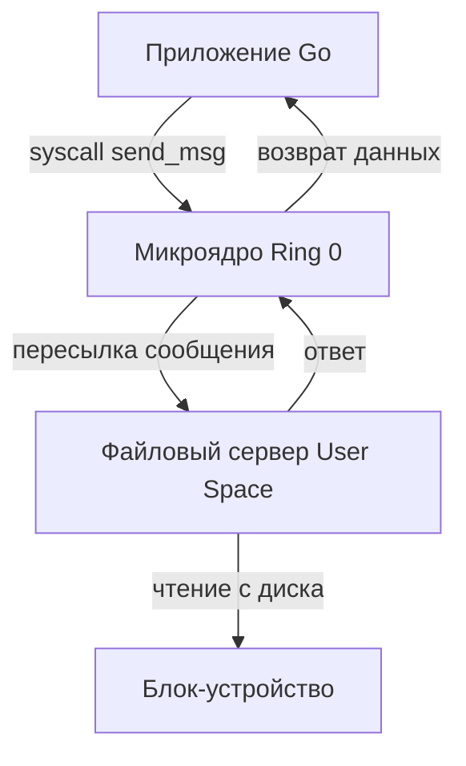

## Почему архитектура ядра определяет границы производительности

Ядро операционной системы — это не просто «драйвер для железа». Это фундаментальный менеджер ресурсов, который решает, кто, когда и с какими правами получит доступ к CPU, памяти и периферии. Для Go-разработчика выбор архитектуры ядра в целевой среде выполнения напрямую влияет на стоимость системных вызовов, стоимость переключения контекста, поведение `sync.Mutex`, работу `netpoller` и даже на то, как контейнеры изолируют процессы.

Поговорим о трёх основных парадигмах: монолитной, микроядерной и гибридной. Разберём, где живут сервисы, как они общаются и почему это важно для написания высоконагруженного бэкенда.

## Монолитное ядро (Monolithic Kernel)

В этой архитектуре **все** критически важные сервисы работают в привилегированном режиме ядра (Ring 0 / Kernel Space): драйверы устройств, файловая система, сетевой стек, управление памятью и планировщик.

**Лидеры:** Linux, FreeBSD, OpenBSD.

### Как это работает
Все компоненты скомпилированы в единый бинарный образ ядра. Вызов `read()` от файловой системы `ext4` или `tcp_connect()` от стека `TCP/IP` — это просто вызов функций внутри одного адресного пространства ядра. Нет необходимости переходить в User Space, копировать данные через IPC и возвращаться обратно.

> [!info] Под капотом
> В Linux монолитное ядро не означает «монолитный код». Архитекторы используют модульную загрузку (`insmod`, `modprobe`). Драйверы могут быть вынесены в отдельные `.ko` файлы, но при загрузке они **встраиваются в адресное пространство ядра**. Они получают доступ к внутренним структурам ядра напрямую.

**Плюсы:**
- Максимальная производительность. Внутренние вызовы сервисов — это обычные функции.
- Простая отладка на уровне ядра (kdump, ftrace).
- Исторически лучшее покрытие железа (особенно для серверов и облаков).

**Минусы:**
- **Отсутствие изоляции.** Ошибка в драйвере GPU или сетевой карты (`panic in kernel`) уносит с собой всё приложение, включая Go-процесс.
- Сложность поддержки кодовой базы при росте числа устройств.

## Микроядро (Microkernel)

Философия: **в Ring 0 только то, что критично для безопасности и минимального управления ресурсами**. Всё остальное (драйверы, ФС, сетевой стек, IPC) работает в виде отдельных процессов в User Space.

**Лидеры:** QNX, Minix, L4, seL4 (используются в авионике, automotive, embedded).

### Как это работает
Приложение хочет прочитать файл? Оно отправляет сообщение процессу `fs-server` через IPC. `fs-server` обрабатывает запрос, читает с диска и возвращает ответ. При этом происходит:
1. Перехват системного вызова ядром.
2. Переключение контекста в Ring 0.
3. Отправка сообщения через ядро (копирование буфера).
4. Переключение контекста обратно в `fs-server`.
5. Переключение обратно в приложение.

**Плюсы:**
- **Высокая отказоустойчивость.** Краш драйвера или файловой системы убивает только один процесс. Система продолжает работать.
- Простота верификации безопасности (ядро seL4 формально доказано как корректное).

**Минусы:**
- **Огромная стоимость IPC.** Каждое пересечение границы User/Kernel требует контекстного переключения и копирования данных.
- Сложность отладки распределённых процессов.
- Не подходит для высоконагруженных I/O-серверов без экстремальной оптимизации IPC.

## Гибридное ядро (Hybrid Kernel)

Компромисс. Критически важные для производительности компоненты (сетевой стек, драйверы устройств) запускаются в Ring 0, но архитектура допускает вынесение сервисов в User Space. Граница размыта.

**Лидеры:** Windows NT, macOS XNU.

### Как это работает
Ядро предоставляет API для загрузки драйверов в Ring 0. Сетевой стек Windows (NDIS/TCP/IP) работает в ядре. Но многие службы (например, службы печати или файловых шарингов) могут работать в User Space. macOS XNU сочетает Mach-микроядро (для IPC и адресных пространств) с BSD-слоем (сетевой стек, POSIX API), который работает преимущественно в Ring 0.

**Плюсы:**
- Сохраняет производительность монолита для hot-path.
- Позволяет изолировать некоторые сервисы для стабильности.

**Минусы:**
- Сложность проектирования. Граница между «быстрым» и «надёжным» путями становится размытой.
- Унаследованные проблемы монолита (баги в драйверах всё ещё могут обрушить систему).

## Механика под капотом: IPC, контекстные переключения и память

Архитектура ядра определяет **стоимость коммуникации** между компонентами. Это критично для понимания, почему Go runtime так сильно завязан на Linux.

### 1. Стоимость IPC и контекстного переключения
В микроядре каждое обращение к ФС или сети проходит через ядро. На современных CPU переключение контекста (смена Ring 0 <-> Ring 3, очистка TLB, сохранение регистров) стоит ~1000-3000 тактов. Если IPC оптимизирован плохо, можно потерять 5-10 микросекунд на каждый `read`/`write`.

В монолите Linux используется **Zero-Copy IPC** внутри ядра. Драйвер сетевой карты кладет пакет в `sk_buff`, сетевой стек напрямую разбирает его, а `syscalls` просто копируют данные из ядра в пользовательский буфер (через `copy_from_user`). Это на порядки быстрее.

### 2. Память и изоляция
- **Монолит:** Все сервисы делят одно адресное пространство ядра. Утечка памяти в драйвере может исчерпать `vmalloc` или повредить кэш ядра, что приведёт к `kernel panic`.
- **Микроядро:** Каждый сервер имеет своё адресное пространство. Краш изолирован. Но это требует частого переключения MMU (TLB shootdown), что замедляет работу на NUMA-системах.

> [!warning] Ловушка / Gotcha
> Многие считают, что микроядро «всегда медленнее». Это не совсем так. Современные микроядра (L4, seL4) используют оптимизированный IPC через регистры CPU и shared memory pages, сводя накладные расходы к ~100-200 тактам. Однако для высоконагруженного бэкенда, где миллионы пакетов в секунду проходят через сетевой стек, архитектура всё равно диктует ограничения.

## Влияние архитектуры на Go Runtime и бэкенд-разработку

Go runtime спроектирован под реалии **Linux (монолит)** и POSIX-совместимых систем. Понимание архитектуры ядра объясняет, почему многие примитивы работают именно так:

### 1. `sync.Mutex` и futex
В Linux монолите мьютексы используют системный вызов `futex` (Fast Userspace Mutex). Если мьютекс свободен, захват происходит полностью в User Space (атомарная инструкция `CMPXCHG`). Только при конкуренции происходит переход в ядро для блокировки горутины. В микроядре этот путь был бы медленнее из-за IPC-оверхеда на каждый `futex` wait.

### 2. `netpoller` и epoll
Go использует `epoll` (Linux) или `kqueue` (BSD/macOS) для асинхронного I/O. В монолитном ядре `epoll` работает внутри сетевого стека, отслеживая события драйверов через callback-механизмы. Это позволяет Go обрабатывать сотни тысяч соединений на одном тредe без блокировок. На микроядре аналогичная функциональность потребовала бы вынесения сетевого стека в User Space, что усложнило бы `netpoller`.

### 3. Контейнеризация и изоляция
Современный бэкенд почти всегда работает в контейнерах. Контейнеры используют **namespaces** (изоляция PID, NET, MNT) и **cgroups** (ограничение CPU/Mem). Эти механизмы реализованы на уровне ядра Linux. В микроядре контейнеризация была бы невозможна в текущем виде, так как нет единого централизованного менеджера ресурсов.

> [!tip] Собеседование
> **Вопрос:** Почему Go runtime так сильно оптимизирован под Linux, и что произойдёт, если запустить его на микроядре?
> **Ответ:** Go использует `epoll`, `epoll_pwait`, `futex`, `mmap` и `getcpu` как фундаментальные примитивы планировщика горутин и сетевого стека. На микроядре эти системные вызовы либо отсутствуют, либо имеют высокую стоимость IPC. Go пришлось бы переписывать `netpoller` и `sync.Mutex` под другую модель IPC (например, shared memory + message passing), что увеличило бы размер бинаря и снизило производительность hot-path. Именно поэтому Go-бэкенды доминируют в Linux-облаках, а не в embedded-микроядрах.

## Итог

1. **Монолит (Linux)** — скорость и простота, но уязвимость к драйверам. Идеально для облачных серверов.
2. **Микроядро (QNX)** — стабильность и изоляция, но высокая стоимость IPC. Идеально для safety-critical систем.
3. **Гибрид (Windows/macOS)** — компромисс, размытие границ, наследие совместимости.
4. Для Go-разработчика архитектура ядра определяет **стоимость системных вызовов**, доступность `epoll`/`futex` и возможности контейнеризации. Go runtime делает ставку на Linux-монолит, что объясняет его доминирование в бэкенд-индустрии.

Мы разобрали, как ядро организует ресурсы. Следующий логический шаг — понять, как система загружается с нуля и где в этом процессе появляется само ядро. Переходим к: `[[4. Загрузка компьютера. BIOS, UEFI, Bootloader и старт ядра.md]]`.