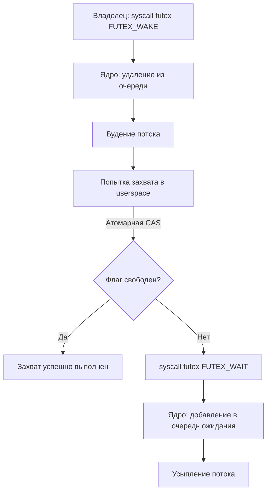

## Введение: Эволюция от блокировок к примитивам

В предыдущих разделах мы разобрали, как ОС управляет памятью, переключает контексты и обрабатывает прерывания. Но как синхронизировать доступ к общим ресурсам, не платя за каждое обращение полный контекстный switch? Здесь на сцену выходят примитивы синхронизации: `Spinlock`, `Mutex` и `Semaphore`.

В Go их абстракции (`sync.Mutex`, `sync/semaphore`) кажутся простыми, но за ними скрывается сложный танец между userspace, ядром и CPU-кэш-когерентностью. Понимание их устройства критично для написания высоконагруженного кода и прохождения хардовых интервью.

## Spinlock: Busy-waiting и цена cache coherency

**Spinlock** (блокировка с активным ожиданием) — это примитив, который не усыпляет вызывающий поток, а циклически проверяет состояние флага с помощью атомарных инструкций.

### Под капотом: Атомарность и MESI
В многопроцессорных системах (SMP) данные хранятся в кэшах L1/L2 каждого ядра. Когда ядро хочет изменить общую переменную, оно должно гарантировать, что другие ядра видят только одно актуальное значение. Это обеспечивается протоколом **MESI** (Modified, Exclusive, Shared, Invalid).

Spinlock использует инструкцию `LOCK CMPXCHG` (Compare-And-Swap). Процессор выставляет сигнал `LOCK#` на шине, получая монопольный доступ к кэш-линии. Если флаг свободен — мы захватываем его за несколько тактов. Если занят — ядро просто крутится в цикле (`while !trylock()`).

> [!warning] Ловушка / Gotcha
> **Cache Thrashing (пинг-понг кэш-линий):** При высокой конкуренции кэш-линия, содержащая флаг, постоянно переходит в состояние `Invalid` на ядрах, которые не владеют блокировкой. Это убивает производительность. Spinlock эффективен только при:
> 1. Крайне коротких критических секциях (< 100 инструкций).
> 2. Низкой конкуренции.
> 3. Одноядерных средах (где переключение контекста дороже, чем спин).

## Блокирующий Mutex и архитектура futex

Блокирующий `Mutex` усыпляет горутины/потоки, когда блокировка занята. На уровне Linux это реализуется через **futex** (Fast Userspace Mutex).

### Как работает futex (пошагово)
1. **Userspace Fast Path:** Программа пытается захватить мьютекс атомарной инструкцией `CMPXCHG`. Если успешно — работаем.
2. **Slow Path:** Если флаг занят, вызывается системный вызов `futex()`. Ядро создает внутреннюю очередь ожидания (`waitqueue`) и переводит вызывающий поток в состояние `TASK_UNINTERRUPTIBLE` (усыпляет его).
3. **Wake Up:** Когда владелец отпускает мьютекс, он тоже вызывает `futex()` с флагом `WAKE_OP`. Ядро будит поток из очереди и возвращает управление.

> [!info] Под капотом
> В ядре Linux структура `futex` хранится в `fs/futex.c`. Очередь ожидания — это стандартный `wait_queue_head_t`. Переход из `TASK_RUNNING` в `TASK_UNINTERRUPTIBLE` требует полного контекстного переключения, что стоит ~1000-10000 CPU-тактов.

## Semaphore: Обобщение mutex

`Semaphore` — это примитив с внутренним счетчиком (N) и очередью ожидания. Разрешает до N одновременных читателей/писателей.

* **Linux:** `sem_wait()`/`sem_post()` вызывают syscalls `semop()` или `futex` в зависимости от реализации libc.
* **Go:** Пакет `sync/semaphore` (с версии 1.21) реализует бесконечные и конечные семафоры. Внутренне он использует структуру `semaRoot` с двойным linked-list (`next`, `prev`) для очередей ожидания (`g` структур), полностью обходясь без syscalls, если конкуренция низкая.

## Mechanical Sympathy: CPU, кэш-линии и контекстные переключения

Для Senior/Lead инженера критично понимать стоимость операций:

| Примитив | Механизм блокировки | Стоимость при конкуренции | Влияние на CPU |
|----------|---------------------|--------------------------|----------------|
| Spinlock | Атомарный цикл (CAS) | Низкая (если contention < 10%) | Высокий (busy-wait, кэш-линии в MESI) |
| Mutex (futex) | userspace CAS + kernel sleep | Средняя/Высокая | Низкий (поток спит, CPU свободен) |
| Semaphore | Счетчик + очередь | Зависит от N и contention | Аналогично Mutex |

**Ключевой инсайт:** Контекстный switch в Linux требует смены стека ядра, обновления `task_struct`, инвалидации TLB и переключения `CSR` (Control Status Register). Это не "бесплатно". Go runtime минимизирует эту стоимость за счет **адаптивного спиннинга** и **мультиплексирования горутин**.

## Go-реализация: Почему мы не используем OS-мьютексы?

В C++ или Java `std::mutex`/`ReentrantLock` часто напрямую оборачивают `pthread_mutex` или `futex`. В Go это невозможно из-за модели планировщика `M-P-G`.

### Внутреннее устройство `sync.Mutex`
Поле состояния `mutex` в структуре `sync.Mutex` — это битовая маска:
* Бит 0: заблокировано
* Бит 1: заблокировано для блокировки (блокировка для блокировки)
* Бит 2: заблокировано для пробуждения
* Старшие биты: количество ожидающих горутин (`waiters`)

При `Lock()` Go делает следующее:
1. Атомарно проверяет флаг. Если свободен — захватывает и выходит.
2. Если занят, проверяет `waiters`. Если 0 — пытается `SpinLock` (до ~4 итераций).
3. Если спин не удался, вызывает `runtime_SemacquireMutex()`, который:
   * Добавляет `g` в очередь ожидания (linked list).
   * Делает `syscall futex` для усыпления.
   * При пробуждении проверяет, действительно ли он получил блокировку (спрайт-пробуждение / spurious wakeup).

> [!tip] Собеседование
> **Вопрос:** Почему `sync.Mutex` не использует системный `pthread_mutex` напрямую?
> **Ответ:** Системный мьютекс блокирует ОС-поток (`m`). Если горутине нужно ждать, а она привязана к `m`, все остальные горутины на этом `m` останавливаются (thread parking). Go реализует свой мьютекс, который будит именно `g` из очереди, а не `m`, позволяя планировщику перемапить оставшиеся горутины на другие треды.

## Ловушки, corner-case и вопросы с собеседований

### 1. Lock Convoying (Конвой блокировок)
Когда много горутин борются за один `Mutex`, они выстраиваются в FIFO-очередь. Если критическая секция длинная, конвой растет, увеличивая latency. 
**Решение:** Используйте `sync.RWMutex` для read-heavy workload, или разбивайте критические секции, или используйте `sync/semaphore` с `N > 1`.

### 2. Priority Inversion (Инверсия приоритетов)
Низкоприоритетная горутина держит мьютекс, высокоприоритетная ждет. Планировщик переключает низкоприоритетную на CPU, блокируя высокоприоритетную.
**В Go:** Планировщик не имеет жестких приоритетов в классическом понимании, но `sync.Mutex` внедряет механизм **priority inheritance** через очередь `waitq`: при пробуждении приоритет мьютекса поднимается до приоритета ожидающей горутины, предотвращая starvation.

### 3. Gotcha: `sync.Mutex` не реентерабельный
В отличие от `std::recursive_mutex` в C++, `sync.Mutex` в Go не позволяет одной горутине захватить его дважды. Это вызовет deadlock. Если нужна рекурсия — используйте `sync.Mutex` + `sync.Cond` или пересмотрите архитектуру.

### 4. Сравнение с другими языками
* **PHP/Java:** Используют OS-потоки + OS-мьютексы. Блокировка = блокировка потока. Высокая стоимость при высокой конкурентности.
* **Go:** Green threads + userspace scheduler + custom futex-based mutex. Блокировка = постановка `g` в очередь. Стоимость ~в 10-100 раз ниже на высоких нагрузках.
* **C++:** `std::mutex` часто оборачивает `pthread`. Высокая производительность, но нет green threads.

## Итоги

1. **Spinlock** эффективен только при коротких критических секциях и низкой конкуренции. Избегает контекстного switch, но создает трафик cache coherency (MESI).
2. **Mutex (futex)** — золотой стандарт. Комбинирует fast path в userspace (CAS) с slow path в kernel (sleep/wake). Экономит CPU, но платит за context switch.
3. **Semaphore** обобщает mutex до N-конкурентности. В Go реализован через `semaRoot` с linked-list очередей `g`, избегая syscalls.
4. **Go не использует OS-мьютексы** напрямую, потому что блокировка потока (`m`) остановила бы все горутины на нем. Runtime-мьютекс работает с очередью `g`.
5. **Архитектурный совет:** Не оптимизируйте мьютексы на раннем этапе. Профилируйте через `pprof` (блокировка) и `sync/atomic` для счетчиков. Избегайте длинных критических секций внутри `Lock()`.

Мы разобрали, как примитивы синхронизации работают на стыке userspace и ядра. Следующий логичный шаг — понять, как эти механизмы приводят к классическим проблемам многопоточных систем и как их выявлять на практике. В следующей статье мы перейдем к: [[34. Deadlock, Livelock, Starvation.md]].