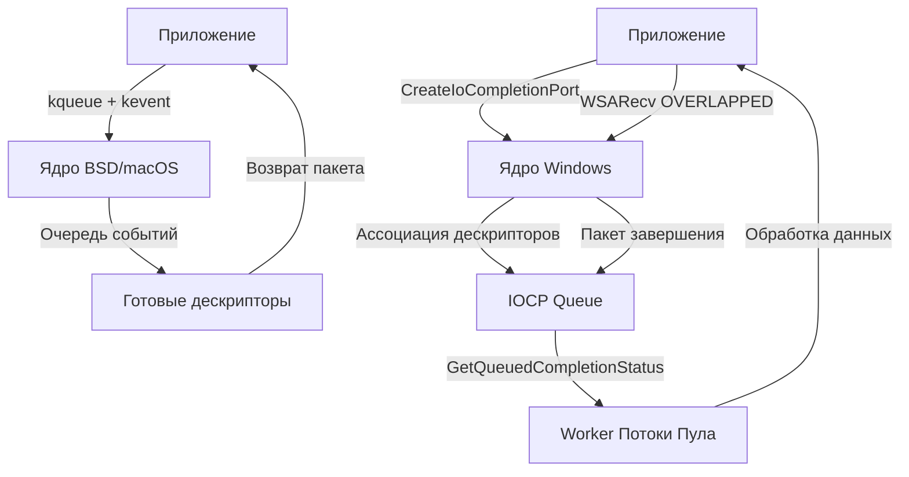

## Введение: Разные философии I/O

Linux доминирует в серверной разработке, но Go должен работать на macOS, FreeBSD, OpenBSD и Windows. Каждая из этих ОС реализует I/O multiplexing и асинхронное взаимодействие с железом через совершенно разные механизмы. Для Go-разработчика понимание разницы между `kqueue` и `IOCP` — это не просто академическое знание, а ключ к диагностике производительности, пониманию поведения `net/http` и планировщика горутин на разных платформах.

В Linux мы привыкли к `epoll`, который работает по модели **event notification** (опрос готовых дескрипторов). BSD/macOS пошли по пути `kqueue`, а Windows — по пути `IOCP` (I/O Completion Ports). Разберем, как они устроены под капотом, чем принципиально отличаются и как Go Runtime объединяет их в единый `netpoller`.

## kqueue: Декларативная модель событий BSD/macOS

В BSD-семействе (FreeBSD, macOS, OpenBSD) ядро предоставляет механизм **kqueue** (kernel queue). Это высокопроизводительный интерфейс для уведомления приложения об изменении состояния файловых дескрипторов, таймеров или сигналов.

### Устройство под капотом
В отличие от `epoll`, где вы создаете единый контекст и добавляете туда дескрипторы, `kqueue` работает на уровне **очередей событий**. Процесс вызывает системный вызов `kqueue()` и получает новый дескриптор очереди. Далее через `kevent()` вы регистрируете фильтры:
- `EVFILT_READ` / `EVFILT_WRITE` — готовность сокета или файла
- `EVFILT_TIMER` — аппаратные таймеры
- `EVFILT_SIGNAL` — получение сигналов ядра

Каждый зарегистрированный фильтр привязывается к конкретному дескриптору. Ядро создает внутренние структуры (обычно это хеш-таблицы с цепочками и связными списками внутри `sys/kern/kern_kqueue.c`), которые отслеживают состояние. Когда событие происходит, ядро помещает пакет `kevent` в очередь, связанную с дескриптором. Приложение вызывает `kevent()` с нулевым timeout, и ядро возвращает только те события, которые действительно произошли.

> [!info] Под капотом
> Внутреннее представление `kqueue` в ядре FreeBSD/macOS опирается на структуру `kqueue` (ядро) и `knote` (привязка к дескриптору). При регистрации фильтра ядро создает `knote` и добавляет его в список зависимостей. Это позволяет реализовать сложные сценарии: например, автоматическую регистрацию `EVFILT_WRITE` при открытии сокета в состоянии `LISTEN`. Стоимость регистрации события близка к O(1), а стоимость получения готовых событий — O(n), где n — количество изменившихся дескрипторов за период ожидания.

## IOCP: Модель завершения операций Windows

Windows не использует `epoll` или `kqueue`. Вместо этого она реализует **I/O Completion Ports** (IOCP). Это механизм, основанный на парадигме **completion notification** (уведомление о завершении), а не опросе состояния.

### Устройство под капотом
IOCP работает в три этапа:
1. **Создание порта:** Вызов `CreateIoCompletionPort()` возвращает дескриптор порта завершения.
2. **Ассоциация дескрипторов:** Вызовите `CreateIoCompletionPort()` повторно, передав файловый дескриптор или сокет. Ядро привязывает его к порту.
3. **Запуск асинхронного I/O:** Вы используете `ReadFile` / `WSARecv` с флагом `OVERLAPPED`. Вместо того чтобы блокировать поток, ядро планирует операцию и возвращает управление немедленно.
4. **Получение результата:** Приложение вызывает `GetQueuedCompletionStatus()`. Если операция еще не завершена, поток блокируется внутри ядра. Как только I/O заканчивается, ядро создает **Completion Packet** (пакет завершения) и помещает его в очередь порта. Блокированный поток пробуждается, забирает пакет и обрабатывает данные.

Ключевая особенность IOCP — встроенный пул потоков. При создании порта можно указать количество worker-потоков. Ядро автоматически распределяет завершение операций по этим потокам, предотвращая создание "thundering herd" (лавинного пробуждения потоков).

> [!warning] Ловушка
> IOCP не работает с классическим `select` или `poll`. Если вы попытаетесь использовать стандартные POSIX-функции ожидания на Windows, они будут эмулированы через `GetQueuedCompletionStatus` с таймаутом, что приведет к серьезным потерям производительности и ложным срабатываниям.

## Архитектурное сравнение: BSD vs Windows

| Характеристика | kqueue (BSD/macOS) | IOCP (Windows) |
|---|---|---|
| **Парадигма** | Event Notification (опрос готовых дескрипторов) | Completion Notification (ожидание завершения операций) |
| **Модель потоков** | Приложение само опрашивает очередь (`kevent`) | Ядро само пробуждает потоки из пула при завершении I/O |
| **API сложность** | Высокая (структуры `kevent`, флаги `EV_ADD/EV_DELETE`) | Средняя (абстракция `OVERLAPPED` + Completion Packets) |
| **Масштабирование** | Ограничено количеством дескрипторов и syscall overhead | Высокое за счет внутреннего ядра-пула потоков |
| **Таймеры** | `EVFILT_TIMER` с точностью до наносекунд | Отдельные механизмы (Timer Queue API) или `WaitForSingleObjectEx` |

## Как Go Runtime абстрагирует эти механизмы

Go не заставляет разработчика писать платформо-зависимый код. Пакет `runtime` содержит `netpoll`, который инкапсулирует различия.

На **macOS/BSD** (`netpollkqueue.go`):
1. При старте Go создает один дескриптор `kqueue`.
2. При открытии сокета или файла Go вызывает `kevent` с флагами `EVFILT_READ | EV_ADD` и `EVFILT_WRITE | EV_ADD`.
3. В цикле `runtime.netpoll` вызывает `kevent` с timeout. Как только ядро возвращает готовый дескриптор, Go помечает соответствующую горутину как `runnable` и пробуждает планировщик.

На **Windows** (`netpollwindows.go`):
1. Go создает один IOCP порт через `CreateIoCompletionPort`.
2. Все открытые дескрипторы ассоциируются с этим портом.
3. При инициализации асинхронного I/O Go выделяет структуру `runtime.netpollLink` и передает её в `WSARecv`/`ReadFile` через поле `lpOverlapped`.
4. `runtime.netpoll` вызывает `GetQueuedCompletionStatus`. Когда ядро возвращает пакет, Go извлекает указатель на `netpollLink`, находит связанную горутину и переводит её в состояние `runnable`.

> [!tip] Собеседование
> **Вопрос:** Почему `netpoll` на Windows выглядит иначе, чем на Linux/macOS?
> **Ответ:** Windows не предоставляет универсального механизма опроса дескрипторов. IOCP требует явного создания асинхронных операций с `OVERLAPPED`. Go вынужден выделять дополнительные структуры для отслеживания состояния каждого сокета и полагаться на ядро для пробуждения потоков. Это делает Go-рантайм на Windows более зависимым от пула потоков ядра, но компенсирует это внутренней оптимизацией `IOCP`.

## Ловушки и архитектурные нюансы

1. **Различия в TCP стекe:** Windows реализует TCP/IP стек иначе. Состояния сокетов, таймауты `TIME_WAIT` и поведение `SO_REUSEADDR` могут отличаться от Linux. Это влияет на graceful shutdown и переподключение сервисов.
2. **Таймеры на macOS:** `kqueue` таймеры привязаны к дескриптору очереди. Если очередь закрывается, таймеры уничтожаются. Go должен корректно управлять жизненным циклом `kqueue` дескриптора, чтобы избежать утечек.
3. **Производительность IOCP:** На Windows производительность высоконагруженного сервера сильно зависит от размера пула потоков. Если потоков мало, `GetQueuedCompletionStatus` будет блокироваться, создавая очередь ожидания. Go пытается балансировать это через `runtime.gopark` и асинхронное пробуждение.
4. **Cross-platform testing:** Тесты, полагающиеся на точные тайминги или поведение `epoll`, могут падать или вести себя некорректно на macOS/Windows из-за разной granularity таймеров и очереди событий.

## Итог

`kqueue` и `IOCP` — это две разные философии взаимодействия с I/O подсистемой ОС. `kqueue` дает разработчику полный контроль над опросом событий, но требует самостоятельного управления потоками. `IOCP` снимает эту нагрузку с приложения, делегируя распределение работы ядру через модель завершения операций.

Go Runtime успешно абстрагирует обе модели через `netpoll`, позволяя писать переносимый код без потери производительности. Понимание этих механизмов помогает диагностировать проблемы с пробуждением горутин, утечки дескрипторов и аномалии в поведении сети на разных платформах.

В следующей статье мы детально разберем, как именно Go netpoller реализует эти абстракции в коде, какие структуры данных использует для отслеживания готовых горутин и как происходит пробуждение планировщика.

[[38. Как netpoller Go использует epoll и kqueue.md]]