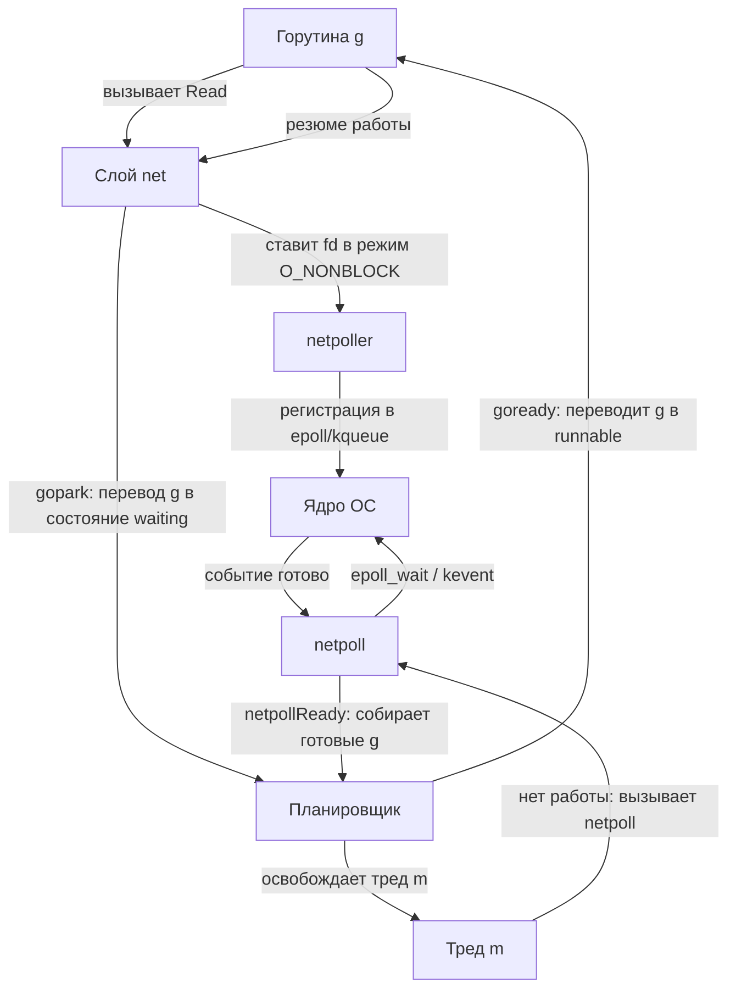

## Зачем Go нужен собственный Netpoller

В предыдущих статьях мы разбирали, как ОС уведомляет о готовности данных через `epoll` (`[[36. select, poll и epoll]]`) и `kqueue` (`[[37. kqueue и IOCP. Чем отличаются BSD и Windows]]`). Но почему Go не использует их напрямую в пользовательском коде, а оборачивает в собственный механизм `netpoller`?

Ответ кроется в модели планирования горутин. В отличие от Java или C#, где 1 горутина = 1 системный тред (`pthread`), Go мультиплексирует тысячи горутин на ограниченное число тредов ОС. Если горутина выполнит блокирующий системный вызов (например, `read` на сокет, который ещё не готов), она заморозит привязанный к ней тред (`m`). Это разрушит балансировку нагрузки между `p` (logical processors) и приведёт к starvation других горутин.

Go Runtime решает эту проблему, перехватывая все сетевые и неблокирующие файловые I/O на уровне рантайма и превращая их в **событийно-ориентированные операции** через `netpoller`.

## Epoll и kqueue: Краткий взгляд со стороны ОС

Оба механизма служат одной цели: уведомить процесс о готовности файловых дескрипторов без опроса (`polling`).

| Механизм | ОС | API | Особенности |
|----------|----|-----|-------------|
| `epoll` | Linux | `epoll_create`, `epoll_ctl`, `epoll_wait` | O(1) для готовых событий. Использует хеш-таблицу в ядре. |
| `kqueue` | BSD, macOS, FreeBSD | `kqueue`, `kevent` | Универсальный механизм событий (не только I/O). Использует связные списки готовых событий. |

В `[[35. Асинхронный IO и блокирующий IO]]` мы видели, что оба подхода работают по принципу **edge-triggered** (срабатывают при изменении состояния), но требуют от приложения явного управления состоянием дескрипторов. Go берёт эту власть себе.

## Архитектура Netpoller в Go Runtime

Go не создаёт отдельный процесс или тред для каждого `epoll`/`kqueue` инстанса. Вместо этого в `runtime` существует единый глобальный объект `netpoller`, который инициализируется при старте программы.

```go
// Упрощённо, из runtime/netpoll.go
type netpoller struct {
    fd int // epollfd или kqueue fd
    // ... внутренние поля для отслеживания дескрипторов
}
```

При запуске программы вызывается `netpollInit`:
1. На Linux: `epoll_create1(EPOLL_CLOEXEC)`.
2. На BSD/macOS: `kqueue()`.

Все сетевые операции (`net.Dial`, `conn.Read`, `conn.Write`) не вызывают `read`/`write` напрямую. Вместо этого они:
1. Выставляют флаги `O_NONBLOCK` на дескрипторе.
2. Регистрируют дескриптор в `netpoller` через `epoll_ctl(EPOLL_CTL_ADD)` или `kevent`.
3. Если событие ещё не готово, горутина переводится в состояние `waiting` через `gopark`.

## Под капотом: Как связываются Goroutine и ядро

Связь между планировщиком Go и ядром ОС осуществляется через два ключевых компонента: `sysmon` и `m` (thread).



### Ключевые детали реализации

1. **`EPOLLONESHOT` и `EV_ONESHOT`**: Go использует однократные события. После того как ядро сообщает о готовности, дескриптор автоматически снимается с мониторинга. Приложение должно явно перерегистрировать его. Это предотвращает *thundering herd* (лавину пробуждений) и гарантирует, что мы не пропустим события, если данные ещё не прочитаны до конца.
2. **`sysmon` и `netpoll`**: Тред мониторинга (`sysmon`) просыпается каждые 10 мс (адаптивно) и вызывает `netpoll(0)`. Если `netpoll` находит готовые события, он собирает список проснувшихся горутин и возвращает их в планировщик.
3. **`netpollReady`**: Функция рантайма, которая принимает список `g` из ядра и вызывает `goready(g, 0)`. Это переводит `g` из состояния `waiting` в `runnable`, добавляя в локальную или глобальную очередь `p`.
4. **Атомарность регистрации**: Регистрация и снятие дескрипторов происходит в критических секциях с захватом `netpollLock`. Это гарантирует, что мы не потеряем событие, если горутина вызвала `Close()` в момент, когда ядро уже отправило уведомление.

> [!info] Под капотом
> В современных версиях Go (1.14+) `netpoll` использует `EPOLLONESHOT` на Linux и `EV_ONESHOT` на BSD. Это архитектурное решение позволяет рантайму точно контролировать жизненный цикл дескриптора. Если бы Go использовал level-triggered режим, ядро могло бы постоянно будить `sysmon` о готовом событии, пока данные не будут полностью прочитаны, создавая избыточную нагрузку на планировщик.

> [!warning] Ловушка / Gotcha
> Если вы используете `syscall` пакеты напрямую для блокирующих вызовов (например, `syscall.Read` на обычном файле), это **не** попадёт в `netpoller`. Блокирующий syscall заморозит тред `m`. Если на этом `m` висят другие горутины, они тоже встанут в ожидание. Это классическая ошибка при переходе с PHP/Python, где блокирующее I/O не критично из-за модели 1:1.

## Mechanical Sympathy: Производительность и кэш-линии

Почему `netpoller` быстрее, чем создание тредов ОС для каждого соединения?

1. **Снижение Context Switch**: Переключение контекста между `m` и ядром требует сброса TLB, смены стека и сохранения регистров. `epoll_wait` и `kevent` работают в O(1) и минимизируют количество переходов User/Kernel.
2. **Кэш-локальность CPU**: Один тред `m` обслуживает сотни горутин, постоянно находясь в кэше L1/L2 процессора. Планировщик Go не тратит такты на инвалидацию кэша при переключении на другие ядра.
3. **Отсутствие `pthread` overhead**: Каждый тред ОС требует ~8 МБ стека по умолчанию. `netpoller` позволяет держать тысячи соединений с минимальным потреблением памяти, так как стек горутин начинает с 2 КБ и растёт экспоненциально.

> [!tip] Собеседование
> **Вопрос:** Что произойдёт, если все треды `m` будут заблокированы на сетевом I/O в `netpoller`?
> **Ответ:** Ничего страшного, так как `netpoller` не блокирует `m` навсегда. Он использует неблокирующий `epoll_wait` с таймаутом. Если событий нет, `m` переходит в спящий режим или обслуживает другие задачи. Если же мы имеем в виду блокирующие `syscall`, то Go может создать дополнительный тред через `runtime.startm`, но это дорого. Правильный ответ: Go использует `sysmon` для периодического опроса готовых событий, поэтому треды не простаивают, а горутины пробуждаются асинхронно.

## Сравнение с другими экосистемами

| Экосистема | Механизм | Подход | Критика |
|------------|----------|--------|---------|
| **Go** | `epoll`/`kqueue` + `netpoll` | Глобальный инстанс + `sysmon` | Простая модель, но глобальная блокировка `netpollLock` может стать узким местом при >100k соединений. |
| **Node.js / libuv** | `epoll`/`kqueue` | Event Loop в одном трде | Всё в одном потоке. При CPU-bound задачах блокирует весь event loop. |
| **Java NIO** | `epoll` | `Selector` на каждый поток | Требует ручной настройки пула тредов. Сложнее в поддержке. |
| **Rust / tokio** | `io_uring` (Linux) / `epoll` | Zero-copy + async runtime | Современный подход, но `io_uring` пока менее переносим. |

Go выбрал путь компромисса: единый `netpoller` упрощает код рантайма, а атомарные операции и `EPOLLONESHOT` минимизируют contention. Для большинства бэкенд-задач этой архитектуры хватает с запасом.

## Итог

1. **Netpoller** — это слой абстракции Go Runtime над `epoll` и `kqueue`, превращающий блокирующее I/O в событийно-ориентированное.
2. **`EPOLLONESHOT` / `EV_ONESHOT`** гарантируют точный контроль и предотвращают лавину пробуждений.
3. **`sysmon` и `m`** периодически опрашивают ядро через `netpoll`, пробуждая горутины через `goready`.
4. **Механика**: Снижение контекстных переключений, сохранение кэш-линий CPU, отказ от `pthread` накладных расходов.
5. **Ловушка**: Прямые блокирующие `syscall` не проходят через `netpoller` и могут заморозить тред `m`.

Мы закончили с тем, как Go управляет готовностью сетевых и файловых дескрипторов. Следующий шаг — понять, что происходит с данными после того, как они успешно записаны в файловую систему, и как ОС кэширует I/O. В следующей статье мы разберем: `[[39. Файловые системы. Что происходит после write]]`.