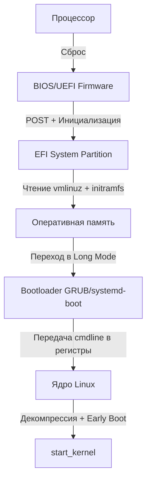

## От нажатия кнопки питания до `start_kernel()`

Пока ваш Go-сервер запускается в Docker-контейнере или на виртуальной машине в облаке, за его «холодным стартом» стоит цепочка системных переходов, занимающая от 100 мс до нескольких секунд. Понимание этого процесса критично для:
1. **Оптимизации cold start** в serverless и контейнерных средах.
2. **Настройки безопасности** (Secure Boot, tamper-proof загрузка).
3. **Отладки** системных сбоев, когда приложение не может инициализироваться из-за ограничений ядра или файловой системы.
4. **Архитектурных решений** при работе с bare-metal, k8s-нодами и кастомными ядрами.

Мы разберём, как процессор переходит из состояния «выключено» в состояние, готовое исполнять `main()`, и почему этот путь делится на строгие этапы с жёсткими ограничениями.

## Эра BIOS и MBR: Лимиты 1980-х

**BIOS (Basic Input/Output System)** — это прошивка, зашитая в ROM материнской платы. При подаче питания CPU начинает исполнять код из фиксированного адреса (`0xFFFFFFF0` в x86-64), где находится точка входа BIOS.

1. **POST (Power-On Self-Test)**: Инициализация контроллеров, проверка RAM, инициализация шин PCIe/USB.
2. **Поиск загрузочного устройства**: BIOS опрашивает диски в порядке, заданном в BIOS Setup.
3. **MBR (Master Boot Record)**: Первый сектор диска (512 байт). Содержит код загрузчика (первая стадия) и таблицу разделов.
4. **Перехват управления**: Код в MBR загружает вторую стадию загрузчика из первого раздела диска в память и прыгает на него.

> [!warning] Ловушка / Gotcha
> Лимит в 512 байт для MBR-загрузчика привёл к тому, что ранние загрузчики были примитивными. Они не умели читать сложные файловые системы, поэтому использовали «boot sector hacks» или требовали отдельный `/boot` раздел с простой ФС (ext2). Это ограничивало возможности шифрования и динамической разметки.

## UEFI и GPT: Современный стандарт

**UEFI (Unified Extensible Firmware Interface)** заменил BIOS, решив его архитектурные ограничения:
- **GPT (GUID Partition Table)**: Убирает лимит в 4 раздела и 2 ТБ. Таблица разделов хранится в начале и конце диска.
- **EFI System Partition (ESP)**: Отдельный раздел с файловой системой FAT32. Содержит PE/COFF исполняемые файлы драйверов и загрузчиков.
- **32/64-битный режим**: UEFI исполняется в защищённом режиме, поддерживая драйверы, сетевые стеки и графику до старта ОС.
- **Secure Boot**: Цепочка доверия (Root Key → Vendor Key → Bootloader → Kernel). Подпись ядра проверяется криптографически. Подпись отсутствует или невалидна — загрузка блокируется.

> [!info] Под капотом
> UEFI рассматривает драйверы как приложения. Сетевой стек, драйверы GPU и файловые системы (NTFS, ext4) — это UEFI-приложения (`*.efi`), которые загружаются в память и вызываются BIOS через стандартные вызовы. Это делает загрузку модульной, но увеличивает размер прошивки и время POST.

## Bootloader: GRUB, systemd-boot и загрузка ядра

Загрузчик (GRUB2, systemd-boot, rEFInd) выполняет критическую работу по подготовке среды для ядра:

1. **Загрузка ядра (`vmlinuz`)**: Чтение сжатого образа ядра из ESP в RAM.
2. **Загрузка initramfs**: Временная файловая система в RAM, содержащая драйверы для корневого раздела (LVM, RAID, шифрование, сетевые драйверы).
3. **Переключение в 64-битный режим**: Переход из Protected Mode в Long Mode (x86-64).
4. **Передача параметров ядра**: Строка `cmdline` (`root=`, `rw`, `quiet`, `console=`, `kvm=off` и т.д.) передаётся через регистр `rsi` на стеке.

## Старт ядра Linux: От `head.S` до `start_kernel()`

Ядро Linux загружается не как обычная программа, а как **multiboot** образ. Процесс делится на фазы:

### 1. Early Boot (`arch/x86/boot/head.S`)
- Ядро распаковывается (`decompress_kernel`).
- Инициализация IDT (Interrupt Descriptor Table), GDT, TSS.
- Включение MMU и установка базовых маппингов памяти.
- **Важно**: На этом этапе нет защиты памяти, нет виртуальной памяти в полном смысле, нет аллокаторов. Работает только минимальный набор ассемблерных трюков.

### 2. SMP Startup
- Boot CPU (первый процессор) выполняет инициализацию.
- Через **IPI (Inter-Processor Interrupt)** запускаются остальные ядра.
- Каждое ядро выполняет `start_secondary()`, инициализирует локальные структуры `percpu`, подготавливает `mmap` и передаёт управление в `start_kernel()`.

### 3. `start_kernel()` и `rest_init()`
- Инициализация подсистем: `mm_init()`, `sched_init()`, `irq_init()`, `pid_hash_init()`.
- Создание **PID 1** (`init` или `systemd`). Ядро не может создать процесс через `fork` до инициализации структур ядра. Поэтому PID 1 создаётся вручную через `kernel_thread()`.
- Вызов `rest_init()`, который:
  1. Запускает `kthreadd` (PID 2, управляет ядром).
  2. Создаёт `kernel_init` (PID 1), который монтирует корневую ФС, переключается с `initramfs` на `rootfs` и исполняет `/sbin/init`.

> [!info] Под капотом
> Структура `task_struct` в ядре содержит поле `state` (TASK_RUNNING, TASK_UNINTERRUPTIBLE и т.д.). До `sched_init()` эта структура даже не инициализирована. Именно поэтому первые системные вызовы (`syscall`) недоступны до завершения `start_kernel()`.

## Почему это важно для Go-разработчика?

1. **Cold Start в контейнерах и Lambda**: Цепочка `boot → init → containerd → docker → go runtime → main()` занимает время. Оптимизация `initramfs`, использование `eBPF` для быстрого монтирования, и `init`-функции в Go (`sync.Once`) напрямую влияют на latency.
2. **Инициализация в Go**: Функции `init()` выполняются после загрузки бинарника, но до `main()`. Если `init()` делает сетевые вызовы или инициализирует глобальные мьютексы, это происходит *до* того, как ОС полностью настроила сетевой стек и планировщик. Это может вызывать race conditions при запуске в кластере.
3. **Параметры ядра**: `vm.max_map_count`, `fs.file-max`, `net.core.somaxconn` — эти параметры устанавливаются в cmdline или через `sysctl`. Неправильные значения приведут к `too many open files` или `connection reset` под нагрузкой.
4. **Безопасность**: Secure Boot блокирует загрузку кастомных модулей ядра (`insmod`). В Go-приложениях, использующих CGO с внешними библиотеками, это может сломать сборку или запуск.

> [!tip] Собеседование
> **Вопрос:** Чем отличается создание PID 1 от создания обычных процессов через `fork()`?
> **Ответ:** `fork()` требует полностью инициализированной подсистемы памяти (`mm_struct`), планировщика (`runqueue`) и таблицы файлов (`files_struct`). На этапе раннего старта ядра этих структур ещё нет. Поэтому PID 1 создаётся через `kernel_thread()`, который вручную выделяет `task_struct`, настраивает стек ядра и напрямую вызывает `ret_from_fork()`. Обычные процессы рождаются через `copy_process()` с полным клонированием ресурсов.
> 
> **Вопрос:** Почему `initramfs` часто делают initrd (ramdisk)?
> **Ответ:** Исторически `initrd` — это блочное устройство в RAM, монтируемое как ext2. `initramfs` — это cpio-архив, распаковываемый в tmpfs. Cpio быстрее распаковывается, не требует драйверов блочных устройств на раннем этапе и позволяет использовать сжатие (gzip/zstd), что критично для cold start в облаках.

## Итог

1. **BIOS/UEFI** — это firmware, инициализирующее железо и передающее управление загрузчику.
2. **Bootloader** загружает ядро и initramfs в RAM, переключает CPU в 64-битный режим и передаёт `cmdline`.
3. **Ядро** проходит через `head.S` (early boot), включает MMU, инициализирует `percpu` данные и создаёт PID 1 через `kernel_thread()`.
4. **Go-разработчику** важно понимать, что `main()` выполняется на фоне полностью инициализированного ядра, но параметры ядра и порядок монтирования ФС напрямую влияют на производительность и стабильность сервиса.

В следующей статье мы разберём: `[[5. Процессы. Жизненный цикл процесса в ОС.md]]`, чтобы понять, как ОС управляет состояниями процессов, их переходами между режимами готовности, выполнения и ожидания, а также механизмами завершения.