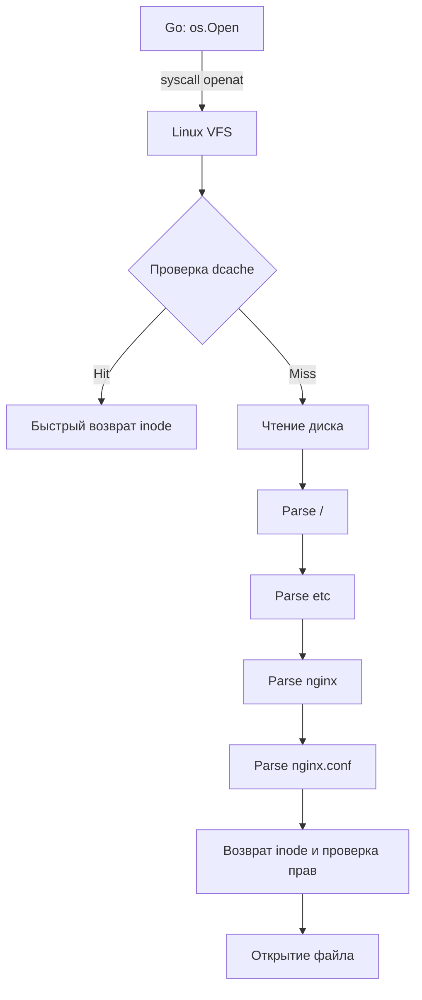

## Виртуальная файловая система (VFS) и абстракция

Когда вы вызываете `os.Open("/etc/nginx/nginx.conf")`, Go не просто «открывает файл». Он делегирует этот запрос ядру Linux, которое должно пройти по сложному графу метаданных, чтобы сопоставить текстовый путь с физическими блоками на диске. В Linux этот процесс абстрагирован через **VFS (Virtual File System)**. 

VFS — это слой ядра, который позволяет вашим приложениям использовать единый API (`open`, `read`, `write`, `stat`) независимо от того, смонтирована ли под ним `ext4`, `xfs`, `btrfs`, `NFS` или `tmpfs`. Для реализации этой абстракции ядро использует три фундаментальные структуры данных в оперативной памяти: `super_block`, `inode` и `dentry`. Понимание их устройства критично для диагностики проблем с I/O-латентностью, работы с hardlink/symlink и оптимизации файловой подсистемы.

## Superblock: Паспорт смонтированной файловой системы

`superblock` (суперблок) — это глобальный контейнер метаданных для **всей смонтированной файловой системы**. Он не относится к конкретным файлам, а описывает правила игры для всей ФС.

> [!info] Под капотом
> В ядре Linux суперблок представлен структурой `struct super_block`. Он хранится в нескольких местах на физическом носителе (для отказоустойчивости при повреждении диска) и загружается в память при выполнении `mount`.

**Что внутри:**
*   `s_magic` — магическое число ФС (например, `0xEF53` для ext4). Ядро проверяет его, чтобы определить тип ФС.
*   `s_blocksize` — размер блока (обычно 4 КБ). Все операции чтения/записи выравниваются по этому размеру.
*   `s_inodes_count`, `s_free_inodes_count` — общее и свободное количество inode.
*   `s_maxbytes` — максимальный размер файла (зависит от архитектуры указателей на блоки).
*   `s_op` — таблица указателей на функции драйвера конкретной ФС (`ext4_fill_super`, `xfs_init` и т.д.).

Если суперблок поврежден, ядро монтирует ФС в режиме `ro` (read-only) или отказывается монтировать её вовсе. В Go это отражается ошибкой `fs.ReadStat` или `os.Stat` с кодом `EBADF`/`EIO`.

## Inode: ДНК файла (и почему там нет имени)

`inode` (information node) — структура метаданных **конкретного файла или каталога**. Имя файла в inode **не хранится**. Это фундаментальное отличие Unix-файловых систем от Windows NTFS или macOS APFS.

> [!info] Под капотом
> В ядре: `struct inode`. Содержит поля `i_ino` (номер), `i_mode` (права и тип), `i_uid`/`i_gid`, `i_size`, `i_blocks`, `i_atime`/`i_mtime`/`i_ctime`, `i_nlink` (hardlink count) и массив указателей на блоки данных (`i_block[EXT4_DIRECT_BLOCKS]`).

**Ключевые поля:**
*   `i_mode` — биты прав доступа и тип (`S_IFREG` — обычный файл, `S_IFDIR` — каталог, `S_IFLNK` — symlink).
*   `i_nlink` — количество hardlink, указывающих на этот inode. Когда `i_nlink` падает до 0, ядро помечает данные как свободные и освобождает inode.
*   `i_mtime` — время изменения *содержимого*.
*   `i_ctime` — время изменения *метаданных* (права, владелец, inode номер). **Ловушка:** `i_ctime` обновляется даже если вы поменяли права через `chmod`, не трогая данные.
*   Указатели на данные: `ext4` использует прямые, одно- и двухуровневые косвенные указатели для поддержки файлов размером до 16 ТБ.

## Dentry: Кэш имен и директорий

`dentry` (directory entry) — связка **«имя -> inode»**. Она нужна для разрешения путей. Каталоги в Unix — это просто файлы, содержащие бинарные записи вида `[длина имени][имя][inode номер]`.

> [!warning] Ловушка / Gotcha
> Поиск файла по пути — это не магия, а последовательный парсинг каталогов. Если папка не находится в кэше ядра, происходит чтение с диска. Это медленно.

Для ускорения доступа ядро использует **dcache** (directory entry cache). При обращении к `/home/user/file.txt` ядро:
1. Проверяет `dentry` для `/home`. Если есть hit — быстро переходит дальше.
2. Если miss — читает блок каталога с диска, ищет запись `user`, создает новый `dentry`, кладет в кэш и возвращает `inode`.

`dentry` кэшируется до тех пор, пока на него есть ссылки. При удалении файла (`unlink` или `rm`) ядро удаляет `dentry` из кэша, но сам `inode` остается в памяти, пока `i_nlink` не станет 0 и счетчик ссылок `inode` не упадет до 0.

## Разрешение пути: Как ОС находит файл

Процесс разрешения пути (`/etc/nginx/nginx.conf`) выглядит как обход графа:



Каждый переход между каталогами требует проверки права `execute` (`x`) для пользователя/группы. Отсутствие `x` на папке `nginx` сделает файл `nginx.conf` абсолютно недоступным, даже если у вас есть `r` на него.

## Влияние на Go-приложения и производительность

В Go работа с файловой системой происходит через пакет `os`, который обертывает системные вызовы `openat2`, `statx`, `readlink`. Понимание `inode` и `dentry` помогает избежать классических антипаттернов:

1. **Глубокая вложенность путей:** Каждый уровень `/` требует отдельного lookup в dcache. При высокой конкуренции это вызывает `dcache thrashing` (вытеснение кэша) и рост latency.
2. **Один каталог с миллионами файлов:** Поиск в каталоге — это линейный или хеш-операция. При `readdir` ядро читает блоки каталога целиком. Если файлов слишком много, это создает нагрузку на Page Cache и CPU.
3. **Hardlink vs Symlink:** `os.Link` создает новую запись в dentry-таблице, указывающую на существующий inode. `os.Symlink` создает отдельный файл, содержащий строку пути. Symlink требует дополнительного разрешения пути при чтении.

```go
package main

import (
	"fmt"
	"log"
	"os"
	"syscall"
)

func inspectFile(path string) {
	// Используем syscall.Stat для прямого доступа к inode метаданным
	// без дополнительных аллокаций, которые делает os.Stat
	info, err := syscall.Stat(path)
	if err != nil {
		log.Fatalf("syscall.Stat failed: %v", err)
	}

	// Преобразуем syscall.Stat_t в os.FileInfo для удобства
	fileInfo := os.FileInfo(&osStatWrapper{info})

	fmt.Printf("Путь: %s\n", path)
	fmt.Printf("Inode #: %d\n", info.Ino)
	fmt.Printf("Hardlinks: %d\n", info.Nlink)
	fmt.Printf("Размер: %d байт\n", info.Size)
	fmt.Printf("Права: %o\n", info.Mode().Perm())
	fmt.Printf("Тип: %s\n", fileInfo.Mode().Type())
}

// Обертка для приведения syscall.Stat_t к os.FileInfo
type osStatWrapper struct {
	syscall.Stat_t
}

func (w *osStatWrapper) Name() string       { return "" }
func (w *osStatWrapper) Size() int64        { return w.Stat_t.Size }
func (w *osStatWrapper) Mode() os.FileMode  { return os.FileMode(w.Stat_t.Mode) }
func (w *osStatWrapper) ModTime() time.Time { return time.Unix(w.Stat_t.Mtim.Sec, int64(w.Stat_t.Mtim.Nsec)) }
func (w *osStatWrapper) IsDir() bool        { return w.Mode().IsDir() }
func (w *osStatWrapper) Sys() interface{}   { return &w.Stat_t }

func main() {
	inspectFile("/etc/hostname")
}
```
> [!note] Примечание
> `syscall.Stat_t` доступен только в Linux/Unix. Для кроссплатформенности используйте `os.Stat`, но помните о накладных расходах на создание `os.FileInfo`. В hot-path (например, в высокочастотных брокерах или сетевых прокси) прямой syscall через `syscall` пакет или `unsafe` может дать прирост за счет отсутствия аллокаций.

## > [!tip] Собеседование

**Вопрос 1:** Что хранится в inode? Почему имя файла не хранится там?
**Ответ:** В inode хранятся права, владелец, размеры, время модификации (atime/mtime/ctime) и указатели на физические блоки данных. Имя не хранится, потому что один и тот же inode может иметь множество имен (hardlink). Имя — это свойство каталога (dentry), а не файла.

**Вопрос 2:** Чем `ctime` отличается от `mtime`? Почему `stat` показывает странный `ctime`?
**Ответ:** `mtime` обновляется при записи данных. `ctime` обновляется при изменении *любой* метадаты (права, владелец, inode номер). Если вы сделали `chmod`, `mtime` останется старым, а `ctime` обновится. Это частая ловушка при мониторинге изменений конфигурационных файлов.

**Вопрос 3:** Что произойдет с файлом, если удалить все hardlink, но процесс держит его открытым?
**Ответ:** `i_nlink` упадет до 0, и ядро пометит inode как свободный (не сможет быть пересоздан). Однако данные на диске не удалятся, пока счетчик ссылок `i_count` (активные дескрипторы) не станет 0. Файл станет «невидимым» для файловой системы, но продолжает занимать место, пока процесс не закроет дескриптор.

**Вопрос 4:** Как `dentry cache` влияет на производительность Go-сервиса?
**Ответ:** При высокой нагрузке на чтение файлов по длинным путям или в глубоких деревьях кэш может вытесняться (dcache thrashing). Это приводит к увеличению количества disk I/O и context switch. Оптимизация: плоская структура каталогов, использование `tmpfs` для часто читаемых конфига/кешей, настройка `sysctl vm.vfs_cache_pressure`.

## Итог

1. **VFS** абстрагирует разные ФС, но под капотом работает с тремя структурами ядра.
2. **Superblock** — паспорт всей смонтированной ФС (магия, размеры, лимиты).
3. **Inode** — метаданные файла (права, владелец, указатели на блоки). Имя там **не хранится**.
4. **Dentry** — кэш имен в памяти. Ускоряет разрешение путей, но может стать узким местом при большой вложенности или «раздувании» каталогов.
5. **Для Go-разработчика:** Глубокие пути и огромные каталоги убивают производительность из-за miss dcache и disk I/O. Используйте `syscall.Stat` в hot-path, избегайте hardlink-ловушек и мониторьте `ctime` правильно.

Мы разобрали статическую структуру хранения метаданных. Но что происходит, когда вы меняете данные? Почему `write` не пишет сразу на диск и как файловые системы гарантируют целостность при отключении питания? В следующей статье мы закроем фундаментальный вопрос: [[41. Журналируемые файловые системы]].