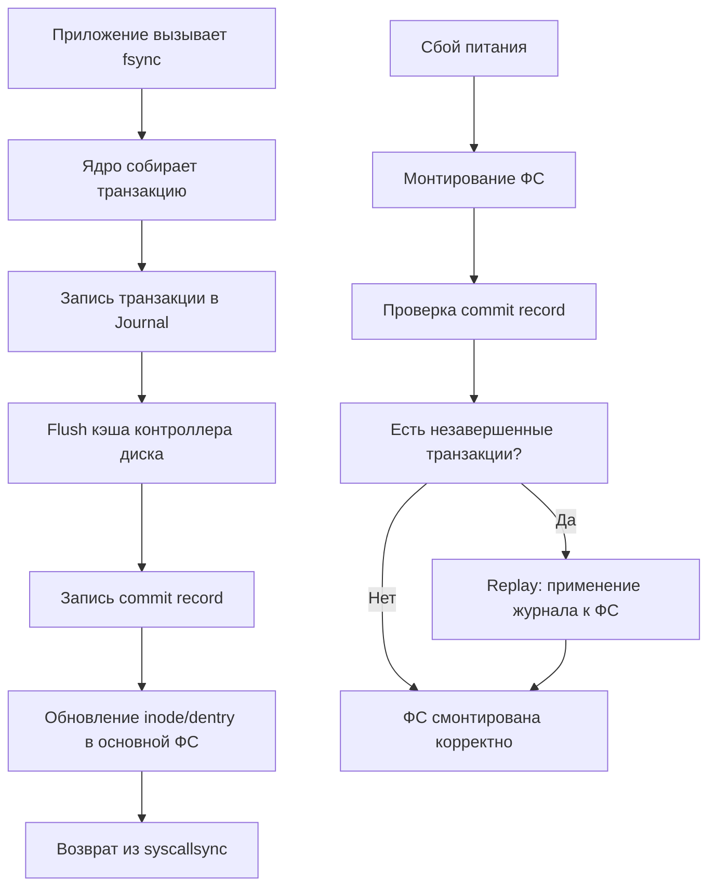

## Проблема согласованности и цена «смерти» диска

В предыдущей статье мы разобрали, как файловая система мапит логические блоки на физические через `[[40. Устройство файловых систем. inode, dentry, superblock]]`. Но есть фундаментальная проблема: диск и контроллеры имеют собственные кэши, а ОС использует `[[42. Буферизация IO и Page Cache]]`. Когда вы вызываете `Write()` в Go, данные не попадают на физический диск мгновенно. Они лежат в Page Cache, а потом могут быть сброшены на диск в произвольном порядке оптимизацией планировщика ввода-вывода (I/O scheduler).

Что произойдет, если в момент записи измененного `inode` или указателя на блок данных отключится питание? Файловая система окажется в **несогласованном состоянии (Inconsistent State)**: метаданные будут указывать на данные, которых физически нет на диске, или структура дерева каталогов разорвется. При следующем монтировании `fsck` (file system check) будет вынужден проводить долгий и агрессивный ремонт, а часть данных будет безвозвратно потеряна.

Для решения этой проблемы в современных FS применяется механизм **Журналирования (Journaling)**.

## Что такое журналируемая файловая система?

Журнал — это выделенная область на диске (обычно блок-устройство или выделенные блоки), которая хранит **примитивные транзакции** до их фактического применения к основной файловой системе.

Подход полностью повторяет принцип **Write-Ahead Logging (WAL)**, используемый в СУБД (PostgreSQL, MySQL, Redis). Любое изменение структуры файловой системы (создание файла, удаление, изменение размера) сначала записывается в журнал как атомарное действие. Только после успешной фиксации записи в журнале (commit) файловая система приступает к изменению основных метаданных и данных.

> [!info] Под капотом
> Журнал — это не «резервная копия». Это **очередь отложенных операций**. Рантайм ФС (например, ядро Linux) пишет в журнал последовательный поток байт. При чтении он парсит эту последовательность и применяет изменения к `inode` и `dentry` кэшу. Журнал имеет фиксированный размер и работает как кольцевой буфер (ring buffer).

### Основные режимы журналирования

Не все ФС одинаковы. В Linux (EXT4, XFS, Btrfs) различают три режима, которые напрямую влияют на баланс между **дискретностью (durability)** и **производительностью**:

1. `data=ordered` (по умолчанию в EXT4/XFS)
    *   Метаданные и данные сначала попадают в журнал.
    *   **Критичное отличие:** Перед записью метаданных в основную ФС, ФС гарантирует, что **все затронутые данные** уже записаны на диск.
    *   Гарантирует, что при падении питания мы не получим «обрезанный» файл с нулями в конце.
2. `data=writeback`
    *   Журналируются **только метаданные**. Данные пишутся в основную ФС асинхронно и могут быть сброшены на диск *после* коммита метаданных.
    *   **Риск:** При падении питания файл может быть смонтирован, но его содержимое будет устаревшим или содержать мусор из Page Cache.
    *   **Применение:** Временные файлы, логи, кэши, где потеря данных допустима ради скорости.
3. `data=journal`
    *   И метаданные, и данные пишутся в журнал, а затем копируются в основную ФС.
    *   Максимальная безопасность, но **минимальная производительность** (двойная запись на диск). Используется крайне редко.

## Как журнал работает внутри: процесс коммита и восстановления

Когда приложение вызывает `fsync()` или `sync()`, ядро не просто «сбрасывает кэш». Оно инициирует процесс **Journal Commit**:

1. **Захват транзакции:** Ядро собирает все измененные `dentry`, `inode` и блоки данных в одну транзакцию.
2. **Запись в журнал:** Транзакция записывается в журнал последовательно. Запись в журнал всегда атомарна на уровне блока (обычно 4 КБ).
3. **Flush (Сброс):** Ядро вызывает `flush` для области журнала, принудительно выталкивая данные из кэша контроллера диска на физический носитель. Здесь включается **Write Barrier** — команда контроллеру SSD/HDD: «Не переставляй порядок записей, все данные должны записаться физически».
4. **Метка коммита:** В конец журнала пишется запись `commit record` с таймстампом и ID транзакции.
5. **Применение:** Только теперь ядро разрешает изменить `inode` и `dentry` кэш в основной ФС.



> [!warning] Ловушка / Gotcha
> **Write Barriers и SSD:** Контроллеры SSD агрессивно переупорядочивают записи для выравнивания износа (wear leveling). Если вы пишете в журнал, а потом в основную ФС, SSD может записать данные из основной ФС раньше, чем коммит-запись из журнала. При падении питания вы потеряете целостность. 
> Ядро Linux использует команду `FLUSH` или `WRITE BARRIER` через `libata`/`nvme`, чтобы заставить контроллер сбросить внутренние кэши в правильном порядке. Отключение барьеров (`barrier=0` в mount) дает прирост скорости, но делает ФС уязвимой к крашам. В продакшене это **недопустимо**.

## Влияние на бэкенд и Go: fsync и durability

Для Go-разработчика, пишущего высоконагруженные сервисы или обертки над СУБД, понимание журналирования критично.

### `os.File.Sync()` vs `syscall.Fsync()`

В Go метод `file.Sync()` вызывает системный вызов `fsync()`. Он гарантирует, что **все** данные и метаданные файла зафиксированы на диске.

Если вам нужна только гарантия сохранения *данных* (без обновления времени изменения файла `mtime`), используйте `fdatasync()`. В Go его можно вызвать через пакет `syscall`:

```go
package main

import (
    "log"
    "os"
    "syscall"
)

func writeWithDsync(path string, data []byte) error {
    f, err := os.OpenFile(path, os.O_CREATE|os.O_WRONLY|os.O_TRUNC, 0644)
    if err != nil {
        return err
    }
    defer f.Close()

    // Запись в Page Cache (быстро, но асинхронно)
    if _, err := f.Write(data); err != nil {
        return err
    }

    // Принудительный сброс только данных на диск.
    // Метаданные (размер, права, mtime) обновятся позже планировщиком.
    // Работает быстрее, чем Sync(), так как пропускает обновление метаданных.
    if err := syscall.Fdatasync(int(f.Fd())); err != nil {
        return err
    }

    return nil
}
```

### Почему `fsync` — это узкое место производительности?

1. **Блокировка контекста:** `fsync` блокирует горутину до физического подтверждения записи на носителе. На HDD это 5-15 мс. На NVMe SSD — 0.1-0.5 мс, но это все равно на порядки медленнее записи в RAM.
2. **Write Amplification:** Журналируемая ФС пишет данные дважды (в журнал + в основную ФС). На SSD это сокращает срок службы ячеек NAND.
3. **Синхронность в Go:** Если вы вызываете `Sync()` в каждом запросе, вы убиваете пропускную способность. Идиоматичный Go-бэкенд не делает `Sync()` на каждый чих. Он полагается на пакетные записи или делегирует гарантию целостности СУБД/БД.

> [!tip] Собеседование
> **Вопрос:** Почему базы данных (PostgreSQL, Redis) используют собственный WAL, а не полагаются на журналирование ФС?
> **Ответ:** Журнал ФС работает на уровне блоков (обычно 4 КБ) и метаданных. Он не понимает семантику записей БД. Если вы пишете 1 МБ данных, ФС может разбить это на 256 блоков в журнале. При падении питания БД не сможет восстановить транзакцию, так как журнал ФС не хранит границы бизнес-операций. Собственный WAL БД позволяет фиксировать изменения в порядке их применения к индексу/данным, обеспечивая **crash consistency на уровне бизнес-логики**, а не файловой системы.

## Сравнение подходов: Go vs Классические ООП-языки

*   **Java/C#:** Частый паттерн — `FileChannel.force(true)`. Работает аналогично `fsync`, но JVM может кэшировать дескрипторы. В Go дескриптор открыт явно через `os.Open`, и `Sync()` вызывает чистый syscall, минуя лишние абстракции рантайма.
*   **PHP:** В PHP нет прямого контроля над `fsync`. `file_put_contents` полагается на буферизацию libc и сброс при закрытии файла. Для критичных к данным задач в PHP обычно используют PDO с `commit()` или Redis с `SAVE`, так как прямой доступ к диску ограничен.
*   **Go:** Дает полный контроль. Вы можете открыть файл с флагом `O_SYNC` или `O_DSYNC`, чтобы ядро автоматически форсировало запись на каждый `Write`. Это полезно для логгеров или телеметрии, но требует понимания цены `write latency`.

## Итог

1. **Журнал (Journal)** — это механизм Write-Ahead Logging на уровне ФС, предотвращающий рассинхронизацию метаданных и данных при сбоях питания.
2. **Режимы:** `data=ordered` (безопасно, стандарт), `data=writeback` (быстро, для временных данных), `data=journal` (максимальная защита, низкая скорость).
3. **Цена фиксации:** `fsync()` вызывает flush кэша контроллера диска и write barrier. Это дорогая операция, которую нельзя делать на каждый запрос.
4. **В продакшене:** Делегируйте durability СУБД или используйте пакетные записи. Никогда не отключайте write barriers (`barrier=0`) на продакшн-серверах.

Мы разобрали, как ФС гарантирует целостность данных при крахе. Но что происходит, когда эти данные лежат в памяти, и как ядро управляет их перемещением между RAM и диском? В следующей статье мы углубимся в  [[42. Буферизация IO и Page Cache]], чтобы понять, почему `Write()` в Go почти никогда не пишется на диск сразу и как это влияет на производительность.