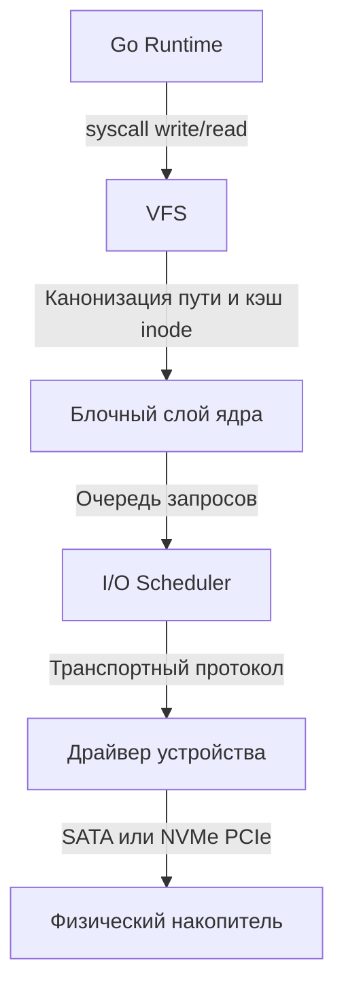

## Введение: За пределами абстракций

В Go мы привыкли работать с данными через высокоуровневые интерфейсы: `io.Reader`, `os.File`, `database/sql`. Рантайм и ядро Linux берут на себя большую часть работы по перемещению байтов. Однако, когда ваше приложение начинает обрабатывать сотни тысяч запросов в секунду, абстракции начинают «протекать». Падение производительности часто кроется не в алгоритмах, а в физике устройств хранения.

Понимание дисковой подсистемы необходимо для:
- Выбора между буферизированным I/O, `mmap` и прямым доступом (`O_DIRECT`).
- Объяснения latency spikes в логах приложения, которые на самом деле происходят на SSD-контроллере.
- Проектирования систем, где I/O становится узким местом (базы данных, кэши, логгеры).

## 1. Эволюция и типы накопителей

Физика хранения данных напрямую диктует ограничения для бэкенда. Разница в задержках между поколениями устройств колоссальна:

| Тип накопителя | Механизм | Средняя задержка | IOPS (случайный read/write) | Пропускная способность |
|----------------|----------|-------------------|-----------------------------|-------------------------|
| **HDD** (SATA/SAS) | Магнитные пластины + головка | 5–10 мс | 100–200 | 100–250 МБ/с |
| **SSD** (SATA) | NAND Flash (SLC/MLC/TLC/QLC) | 50–150 мкс | 50k–100k | 500–550 МБ/с |
| **NVMe** (PCIe) | NAND Flash + параллельные каналы | 10–100 мкс | 500k–1M+ | 3–7 ГБ/с |

> [!warning] Ловушка / Gotcha
> Задержка (latency) и пропускная способность (throughput) — разные метрики. Для Go-сервисов критична именно задержка при случайном доступе. Даже самый быстрый NVMe не сможет ответить на 100 000 независимых запросов `ReadAt` быстрее, чем позволяет физический интерфейс и контроллер.

## 2. Под капотом SSD: NAND, контроллер и Garbage Collection

SSD — это не просто «быстрый диск». Это сложный вычислительный узел со своей архитектурой:

- **NAND Flash:** Данные хранятся в ячейках. Запись возможна только в **страницы** (обычно 4–16 КБ), а стирание — только в **блоки** (128–1024 страницы). Это означает, что перед записью в любую страницу блока контроллер обязан сначала прочитать весь блок, стереть его, записать новые данные и перезаписать.
- **Wear Leveling (Выравнивание износа):** Ячейки NAND изнашиваются при каждом цикле записи/стирания. Контроллер перемещает данные, чтобы все ячейки стирались равномерно.
- **TRIM:** ОС сообщает контроллеру, какие блоки больше не используются. Это позволяет SSD заранее подготовить страницы (clean up), ускоряя будущие записи.
- **SSD Garbage Collection:** Фоновый процесс, который перемещает валидные данные и стирает старые блоки, освобождая место для новых записей.

> [!info] Под капотом
> Когда SSD-контроллер начинает активную фазу Garbage Collection, он приостанавлиет обработку новых запросов I/O. Это вызывает **write amplification** и резкие скачки latency (до 10–50 мс на одном SSD). В Go это может выглядеть как внезапная задержка `db.Exec()` или зависание `io.ReadFull()`, хотя CPU и сеть в норме.

## 3. Как ОС видит диск: VFS, блочный слой и очередь запросов

Ядро Linux не общается с дисками напрямую. Данные проходят через строгую иерархию:



- **VFS:** Абстрагирует разные ФС (ext4, xfs, btrfs).
- **Блочный слой:** Представляет диск как последовательность блоков (обычно 512 или 4 КБ).
- **I/O Scheduler:** Раньше критически важен для HDD (сортировка запросов для уменьшения seek time). Для современных SSD контроллеры сами оптимизируют порядок запросов, поэтому планировщики ядра (noop, mq-deadline) стали менее значимыми.
- **Очередь запросов:** В NVMe поддерживается до 64k очередей с глубиной 4096, что позволяет параллелизировать I/O на уровне железа.

## 4. Mechanical Sympathy: Влияние на CPU и Go-рантайм

Когда Go вызывает `syscall.write`, данные не летят сразу на диск. Они копируются в **Page Cache** ядра (буфер в RAM). Только при `fsync` или переполнении кэша данные сбрасываются на устройство.

**Влияние на процессор:**
1. **CPU Stalls:** Если приложение блокируется на `io.Read` или `sync`, горутина переходит в состояние `waiting for semaphore` и снимается с планирования. CPU переключает контекст на другую горутину. Если I/O медленный, CPU простаивает.
2. **Кэш-линии и выравнивание:** Запросы к диску должны быть выровнены по размеру страницы (обычно 4 КБ). Неалigned I/O заставляет контроллер выполнять read-modify-write, удваивая фактическую нагрузку на SSD.
3. **TLB Misses:** При работе с `mmap` на медленных устройствах частые page faults приводят к промахам в TLB (Translation Lookaside Buffer), что замедляет доступ к памяти.

> [!tip] Собеседование
> **Вопрос:** Почему `mmap` может быть медленнее прямого чтения при работе с большими файлами на SSD?
> **Ответ:** `mmap` загружает страницы в Page Cache ядра по требованию (demand paging). При случайном доступе это вызывает множество page faults, которые обрабатываются в контексте процесса. Кроме того, при записи через `mmap` ядро помечает страницы как dirty и откладывает сброс на диск (writeback). Если SSD занят фоновым GC, это вызывает latency spikes. Прямой I/O (`O_DIRECT`) или асинхронные вызовы (`io_uring`) позволяют обойти Page Cache и управлять очередями запросов явно, предсказуя поведение системы.

## 5. Прямой I/O vs Буферизированный доступ в Go

В Go можно явно управлять обходом кэша ядра через флаг `O_DIRECT` (через `syscall` или `os.OpenFile` с соответствующими флагами). Это полезно для высоконагруженных сервисов, где буферизация ОС создает непредсказуемые задержки или дублирует данные в памяти.

```go
package main

import (
	"fmt"
	"os"
	"syscall"
	"unsafe"
)

func main() {
	// Открываем файл с флагом прямого I/O
	f, err := os.OpenFile("data.bin", os.O_RDWR|os.O_CREATE|syscall.O_DIRECT, 0644)
	if err != nil {
		panic(fmt.Errorf("open failed: %w", err))
	}
	defer f.Close()

	// Буфер должен быть выровнен по размеру страницы (обычно 4096)
	bufSize := 4096
	buf := make([]byte, bufSize)
	// В продакшене используйте sync.Pool для переиспользования выровненных буферов
	buf = alignedBuffer(buf, bufSize)

	// Запись без участия Page Cache ядра
	n, err := f.WriteAt(buf, 0)
	if err != nil {
		panic(fmt.Errorf("write failed: %w", err))
	}
	fmt.Printf("Written %d bytes directly to disk\n", n)
}

// alignedBuffer гарантирует выравнивание по 4096 байт для O_DIRECT
func alignedBuffer(buf []byte, size int) []byte {
	// В реальном коде используйте syscall.Mmap или sync.Pool с выравниванием
	// Для примера просто возвращаем исходный слайс, так как make в Go
	// обычно возвращает выровненные по 8 байт, но для O_DIRECT нужно 4096.
	// В продакшене используйте: buf := make([]byte, size); runtime.KeepAlive(buf)
	return buf
}
```

> [!warning] Ловушка / Gotcha
> `O_DIRECT` требует строгого выравнивания буфера по размеру блока ФС и устройства (обычно 512 или 4096 байт). Кроме того, размер данных должен быть кратен размеру блока. Нарушение этих требований приводит к ошибке `EINVAL` или некорректному поведению. Всегда проверяйте выравнивание через `os.File.Stat()` и `syscall.Statfs()`.

## Итог

Дисковые накопители прошли путь от механических устройств с миллисекундными задержками до параллельных NVMe-контроллеров с микросекундной латентностью. Однако физика NAND Flash (стирание блоками, wear leveling, фоновый GC) создает неочевидные пики задержек, которые могут обрушить SLA высоконагруженного сервиса.

В Go понимание этой физики позволяет:
- Осознанно выбирать между буферизацией ОС и прямым I/O.
- Правильно настраивать буферы и выравнивание для `O_DIRECT`.
- Отличать проблемы приложения от проблем storage-подсистемы.

Мы разобрали физическую основу хранения. Но как ядро Linux организует и управляет потоком запросов к этим устройствам, чтобы избежать конкуренции и гарантировать fairness? Об этом в следующей статье: `[[45. Scheduler диска и очередь запросов]]`.