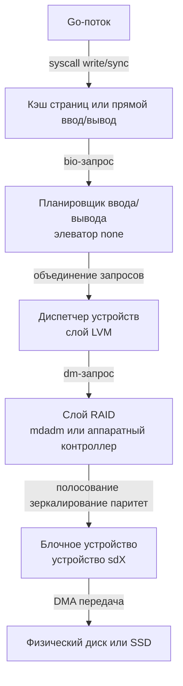

## Фундамент хранения данных: RAID, LVM и абстракция блоков

Для Go-разработчика, строящего высоконагруженные системы, понимание стека хранения критично не меньше, чем понимание работы `netpoller` или `sync.Pool`. Любая операция записи (`os.WriteFile`, `json.Encoder`, `sql.Exec`) в конечном итоге проходит через сложный путь: пользователя -> ядро -> файловая система -> LVM -> RAID-контроллер -> физическое устройство. Задержки на каждом этапе накапливаются, а некорректная конфигурация может превратить миллисекундные `fsync` в секундные блокировки.

В этом разделе мы разберем, как абстракции уровня блоков (`block devices`) маскируют физическое железо, какие компромиссы скрываются за уровнями RAID и LVM, и как это влияет на поведение Go-рантайма при синхронизации данных.

## RAID: От дублирования к полосованию

**RAID** (Redundant Array of Independent Disks) — технология объединения нескольких физических дисков в один логический блок с заданными характеристиками отказоустойчивости и производительности.

В контексте бэкенда мы сталкиваемся с двумя реализациями:
1. **Аппаратный RAID:** Контроллер на материнской плате или отдельной карте (HBA/RAID card). Обработка striping/mirroring происходит в специализированном процессоре контроллера. Часто оснащается Battery-Backed Write Cache (BBWC) или Flash-кэшем.
2. **Программный RAID:** Реализуется ядром Linux (mdadm). Требует CPU-циклов, но гибче в управлении и не привязывает нас к вендорскому железу.

### Ключевые уровни и их влияние на I/O

| Уровень | Принцип | Чтение | Запись | Применимость в Go-стеке |
|:---|:---|:---|:---|:---|
| `0` | Striping (полосование) | `N * скорость` | `N * скорость` | Не дает отказоустойчивости. Только для временных кэшей или `tmpfs` на SSD. |
| `1` | Mirroring (зеркало) | `2x скорость` (зависит от контроллера) | `1x скорость` (ждет оба диска) | Идеально для `boot` или критичных к durability логов. |
| `5` | Striping + Parity | `~1x скорость` | **Высокая задержка** (read-modify-write) | Опасен для баз данных и частых `fsync`. |
| `6` | Striping + 2 Parity | `~1x скорость` | **Еще выше задержка** | Только для холодных архивов. |
| `10` | Mirror + Stripe | `~1x скорость` | `~1x скорость` (на 1 зеркало) | **Стандарт для высоконагруженных Go-сервисов.** |

> [!info] Под капотом
> **Write Penalty** — цена записи на RAID. На RAID 5/6 перед записью новых данных контроллер должен считать старые данные и паритет, вычислить новый паритет и записать всё на диск. Это превращает одну логическую запись в 4 физических I/O. На уровне ядра это видно как всплеск `iowait` и увеличение latency даже при пустом CPU.
> 
> В Go это проявляется так: вызов `file.Sync()` или `db.Exec()` с `sync=True` может блокировать горутину на 50-200ms вместо ожидаемых 1-5ms, если под капотом стоит программный RAID 5 без кэша контроллера.

## LVM и логические тома: Управление абстракциями

**LVM** (Logical Volume Manager) — слой абстракции между файловыми системами и физическими дисками. Позволяет создавать динамические томные группы, тонкое выделение места и снимки.

Архитектура LVM строится на трех уровнях:
1. **PV (Physical Volume):** Физический диск или раздел, помеченный меткой `LVM2`.
2. **VG (Volume Group):** Пул ресурсов из PV. LVM управляет пространством здесь.
3. **LV (Logical Volume):** Виртуальный диск внутри VG, который монтируется как `/dev/mapper/...`.

> [!tip] Собеседование
> **Вопрос:** В чем разница между LVM и стандартным разделом `/dev/sda1` с точки зрения производительности?
> **Ответ:** LVM добавляет один уровень косвенной адресации. При каждом I/O ядро должно пройти через `dm` (device-mapper) драйвер, свериться с таблицами отображения и применить правила (например, thin provisioning). Нагрузка микроскопическая, но при паттернах с мелкими случайными записями (<4KB) это может добавить 2-5% overhead из-за дополнительной обработки в ядре и проверки метаданных thin-provisioning.

### Thin Provisioning и Snapshots
Thin provisioning выделяет место логически, но физически байты записываются только при реальной записи. Это экономит место, но добавляет задержку при первом обращении к блоку (`block allocation overhead`).

Snapshots LVM работают на уровне COW (Copy-On-Write). При изменении блока в оригинальном LV, оригинальный блок копируется в snapshot, а новый записывается в оригинал. Для Go-приложений, активно пишущих в БД, частые снимки LVM могут вызвать **snapshot split** и деградацию записи, так как каждый `fsync` теперь требует чтения из snapshot-копии.

## Под капотом: Путь I/O через блок-слой

Когда Go-приложение вызывает `os.File.Sync()` или использует `O_DIRECT`, данные не попадают на диск мгновенно. Они проходят строгую иерархию:

### Как это влияет на производительность Go?
1. **I/O Scheduler:** В современных NVMe/SSD дисках планировщик ядра часто отключается (`none`), так как контроллер диска сам управляет очередью запросов. Для HDD он все еще важен (выравнивание запросов по цилиндрам).
2. **Request Merging:** Ядро пытается объединить соседние запросы от разных горутин в один `bio`. Это снижает количество физических операций, но может увеличить latency для одиночных `fsync`.
3. **Cache Coherency:** Если под RAID стоит контроллер с BBWC, `fsync` может завершиться мгновенно, так как контроллер подтверждает запись в свой кэш. Это **опасно**: при отключении питания данные потеряются, если батарея разрядится. В Go это означает, что `file.Sync()` не гарантирует durability на диске, а только на контроллере.

> [!warning] Ловушка / Gotcha
> **Оптимистичный кэш RAID-контроллера**
> Если вы используете RAID-контроллер с кэшем и политикой `WriteBack`, вызов `fsync` в Go может вернуть `nil` ошибку, хотя данные еще не на диске. Для критичных данных (платежи, аудит) всегда настраивайте политику `WriteThrough` или используйте `O_DSYNC`/`O_SYNC` с пониманием, что это принудительно выключит кэш контроллера для этой операции, убивая производительность в 10-50 раз.
> 
> В Go это лечится на уровне драйвера БД или через `syscall.Fsync(fd)` с явным ожиданием завершения, но аппаратная задержка не исчезнет.

## Влияние на Go-приложения и системный дизайн

### 1. `bufio` и буферизация против LVM/RAID
Пакет `bufio` в Go уменьшает количество системных вызовов, собирая данные в User Space. Но если под капотом стоит LVM thin-provisioning или RAID 5, каждый вызов `write` (даже из `bufio`) будет обрабатываться драйвером `dm` и контроллером. 
**Рекомендация:** Для высоконагруженных сервисов используйте `O_DIRECT` (через `syscall.Open`) для обхода Page Cache, полагаясь на кэш контроллера RAID, и выставляйте размер буфера кратным размеру блока устройства (обычно 4KB или 8KB).

### 2. `fsync` и durability
В Go стандартная практика `db.Sync()` или `file.Sync()` блокирует горутину до подтверждения записи. На стеке LVM+RAID это время может варьироваться от 1ms (NVMe) до 100ms+ (HDD RAID 5). 
**Архитектурный паттерн:** Не вызывайте `Sync()` на каждый запрос. Используйте паттерн **Write-Ahead Log (WAL)** с периодической синхронизацией (например, каждые 100ms или по накоплению 1MB). Это сглаживает пики задержки и позволяет RAID-контроллеру эффективно агрегировать запросы.

### 3. Мониторинг и профилирование
При падении latency Go-сервиса не смотрите только на `pprof`. Проверьте:
- `iostat -x 1` -> `await` и `%util`. Если `await` > 10ms на SSD, проблема в стеке хранения (LVM/CRC или нехватка кэша).
- `dmsetup status` -> количество активных запросов в `device-mapper`.
- `raidstat` или `megacli` -> состояние кэша контроллера (WB/WT, battery status).

## Итог

1. **RAID** — это не просто отказоустойчивость, а фундаментальный фактор задержки. RAID 5/6 убивает запись из-за read-modify-write. Для Go-бэкендов с частыми транзакциями выбирайте RAID 10 или NVMe-зеркало.
2. **LVM** добавляет слой абстракции и COW-оверхед. Thin provisioning удобен для DevOps, но опасен для production с жесткими SLA по latency.
3. **Путь I/O** в Linux проходит через Page Cache -> I/O Scheduler -> Device Mapper -> RAID -> Диск. Каждый этап может буферизировать или блокировать запрос.
4. **Go-специфика:** `bufio` снижает syscall, но не отменяет аппаратных задержек. `fsync` и `O_DIRECT` пробивают кэш ядра, но упираются в кэш контроллера RAID. Настройка политики кэша и периодическая синхронизация критичны для стабильности.

Мы разобрали, как данные ложатся на физическое железо и как абстракции маскируют реальную стоимость операций. В следующей статье мы перейдем к сетевому стеку: [[47. Сетевая подсистема ОС.md]], где разберем, как пакеты проходят от сокета до физической карты и какие узкие места возникают на границе ядра и пользователя.