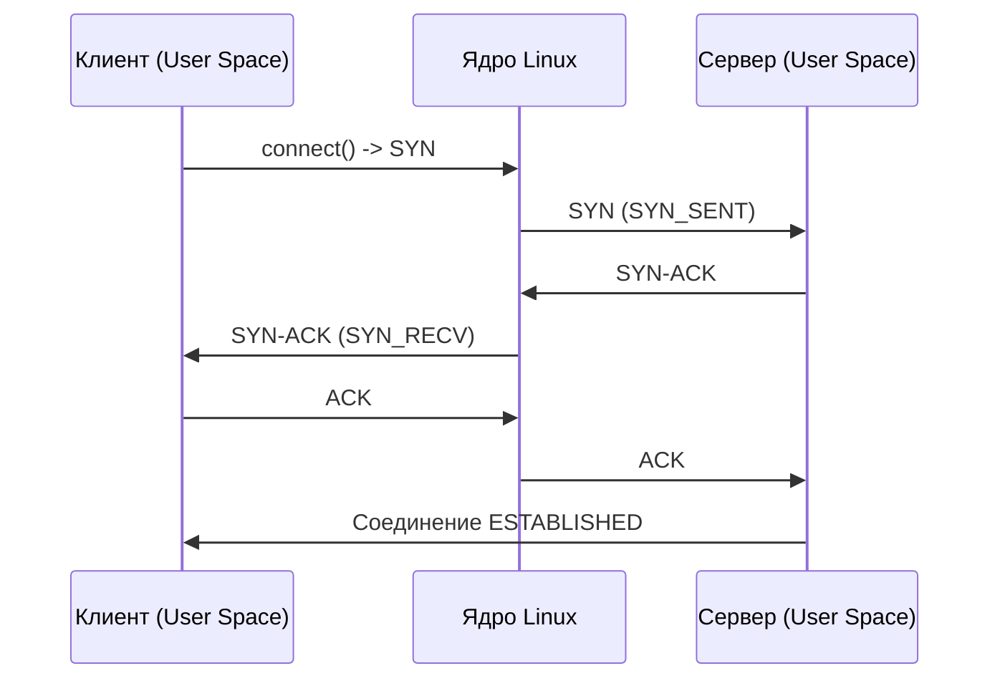

## Введение: Сокеты как мост между приложением и сетью

Для Go-разработчика понимание работы сокетов — это не просто знание API, а фундамент для написания высоконагруженных серверов. В Go всё, что связано с сетью, абстрагировано пакетом `[[5. Учебник по Go (Основы и синтаксис)]].net`, но за этой абстракцией скрывается сложный механизм взаимодействия с ядром Linux, TCP-стеком и планировщиком.

Когда вы вызываете `net.Listen`, `Listener.Accept` или `Conn.Read`, вы инициируете цепочку системных вызовов, аллокаций в ядре и переключений контекста. Понимание того, как рождается TCP-соединение, как ядро управляет его состоянием и как Go runtime извлекает данные из очередей, критически важно для отладки утечек, тюнинга пропускной способности и подготовки к хардкорным собеседованиям.

## BSD Socket API и файловая система Linux

В Linux все ресурсы унифицированы через VFS (Virtual File System). Сокет — это не просто сетевой endpoint, а полноценный файловый дескриптор. Это означает, что к нему применимы те же системные вызовы, что и к файлам: `read`, `write`, `close`, `poll`, `select`. Именно поэтому интерфейс `net.Conn` реализует `io.Reader` и `io.Writer`.

Процесс создания серверного сокета сводится к классическому BSD API (через обертки в Go):

1. `socket(AF_INET, SOCK_STREAM, IPPROTO_TCP)` — создает дескриптор.
2. `bind(fd, addr)` — привязывает сокет к IP:Port.
3. `listen(fd, backlog)` — переводит сокет в состояние ожидания входящих соединений.
4. `accept(fd, ...)` — извлекает из очереди готовое соединение.

> [!info] Под капотом
> В ядре Linux вызов `socket()` выделяет `struct file` (для VFS) и `struct socket` (для сетевого стека). Они связаны через `f_op->socket`. TCP-соединение, в свою очередь, описывается структурой `struct tcp_sock`, которая наследуется от `struct sock`. Все состояния (SYN_SENT, ESTABLISHED, FIN_WAIT и т.д.) хранятся в поле `sk_state` внутри `struct sock`.

## Жизненный цикл TCP-соединения (3-way handshake)

TCP гарантирует надежную доставку через управление состоянием. Перед тем как данные начнут передаваться, клиент и сервер должны синхронизировать начальные последовательные номера (ISN) и согласовать параметры окна.



Ключевой момент: `listen()` **не создает** соединений. Он лишь сообщает ядру, что сокет готов принимать входящие `SYN`-пакеты и формировать две очереди: `syn_table` и `accept_queue`. Когда handshake завершается успешно, сокет перемещается в `accept_queue`, откуда `accept()` забирает его в пользовательское пространство.

## Под капотом: Ядро Linux и структура `struct sock`

Когда handshake завершается, в ядре создается полноценный TCP-сокет. Для бэкенд-разработчика важно понимать, где живут данные:

- `sk_buff` — структура пакета. Ядро копирует данные из сетевой карты в `sk_buff`, затем помещает их в кольцевой буфер `sk->sk_rmem_alloc` (receive buffer).
- `sk_sndbuf` и `sk_rmembuf` — размеры буферов отправки и приема. По умолчанию обычно 212 КБ, но настраиваются через `SO_SNDBUF`/`SO_RCVBUF`.
- `sk_write_queue` и `sk_read_queue` — очереди `sk_buff` для отправленных и полученных данных.

Когда `accept()` вызывается в Go, ядро делает `copy_to_user()` из `struct tcp_sock` в структуру `sockaddr`, возвращает дескриптор нового сокета и удаляет запись из `accept_queue`. Это **тяжелая операция**: аллокация `struct sock`, инициализация таймеров (`TCP_TIMEWAIT`, `TCP_DELACK`), выделение памяти под буферы и вызов `sk->sk_state_change` для уведомления epoll.

> [!warning] Ловушка / Gotcha
> Если `accept_queue` заполняется (обычно лимит `net.core.somaxconn` в Linux, по умолчанию 128), новые SYN-пакеты отбрасываются ядром. Клиент получает `ETIMEDOUT` или `ECONNREFUSED`, хотя сервер физически доступен. В Go это лечится передачей большого числа в `net.Listen("tcp", addr)` или изменением параметра ядра.

## Go-реализация: `net` пакет и взаимодействие с ядром

Go не создает отдельный тред на каждое соединение. Вместо этого `netpoller` (базированный на `epoll` в Linux или `kqueue` в BSD/macOS) регистрирует файловые дескрипторы слушателя и активных соединений в одном из пулов.

```go
package main

import (
	"context"
	"log"
	"net"
	"time"
)

func main() {
	// 1. Создание слушателя. Go автоматически ставит SO_REUSEADDR и SO_REUSEPORT.
	addr := ":8080"
	ln, err := net.Listen("tcp", addr)
	if err != nil {
		log.Fatalf("listen error: %v", err)
	}
	defer ln.Close()

	// 2. Запуск accept-цикла в отдельной горутине
	go func() {
		for {
			conn, err := ln.Accept()
			if err != nil {
				// Ошибка может быть временной (accept4 вернул EBADF при shutdown)
				if ne, ok := err.(net.Error); ok && ne.Temporary() {
					continue
				}
				log.Printf("accept error: %v", err)
				return
			}

			// 3. Управление жизненным циклом соединения
			go handleConn(conn)
		}
	}()

	// 4. Graceful shutdown через context
	<-context.Background().Done()
	ln.Close()
}

func handleConn(conn net.Conn) {
	defer conn.Close()
	// Установка таймантов на чтение/запись
	conn.SetReadDeadline(time.Now().Add(30 * time.Second))
	conn.SetWriteDeadline(time.Now().Add(10 * time.Second))

	buf := make([]byte, 4096)
	for {
		n, err := conn.Read(buf)
		if err != nil {
			return // EOF или timeout
		}
		_, err = conn.Write(buf[:n])
		if err != nil {
			return
		}
	}
}
```

**Как это работает под капотом Go:**
1. `net.Listen` вызывает `syscall.Socket`, `syscall.Bind`, `syscall.Listen`.
2. `Accept()` делает `syscall.Accept4` с флагом `SOCK_CLOEXEC`. Если очередь пуста, сокет переводится в non-blocking режим, и `Accept4` возвращает `EAGAIN`.
3. `netpoller` через `epoll_ctl(EPOLL_CTL_ADD)` подписывается на `EPOLLIN` (готовность к чтению) и `EPOLLHUP/EPOLLERR`.
4. Когда приходит пакет, ядро вызывает callback `netpollwake`, который пробуждает горутину через `runtime.goready` и канал `netpoll`.
5. `conn.Read()` вызывает `syscall.Read` (или `readv`). Если данные есть в `sk->sk_rmem_alloc`, копирование происходит за один проход. Если нет, горутина засыпает через `epoll_wait` с таймаутом от `SetReadDeadline`.

> [!tip] Собеседование
> **Вопрос:** Как `SetReadDeadline` реализуется в Go? Создается ли новый таймер ядра?
> **Ответ:** Нет. Go использует `epoll` с таймаутом. При установке дедлайна `netpoller` переподписывает сокет на `EPOLLERR` и добавляет/обновляет таймер в `poller`. Когда таймер срабатывает, `epoll_wait` возвращает дескриптор, и Go возвращает `os.ErrDeadlineExceeded`. Это атомарная операция в рамках одного `epoll`-цикла, без создания дополнительных ядерных таймеров.

## Ловушки, оптимизации и вопросы с собеседований

### 1. `SO_REUSEADDR` vs `SO_REUSEPORT`
Go по умолчанию устанавливает оба флага при `Listen`. 
- `SO_REUSEADDR` позволяет привязаться к адресу, если есть сокеты в `TIME_WAIT` или `CLOSE_WAIT`.
- `SO_REUSEPORT` позволяет нескольким процессам/горутинам привязаться к одному порту. Ядро Linux (с 3.9) самостоятельно балансирует входящие соединения между ними (SO_REUSEPORT load balancing), что критично для многопроцессных Go-серверов.

### 2. `TCP_NODELAY` и алгоритм Нагла
По умолчанию TCP включает алгоритм Нагла (Nagle's Algorithm), который буферизует маленькие пакеты, ожидая подтверждения предыдущих данных. Это экономит трафик, но убивает latency в RPC и чатах. В Go:
```go
conn.(*net.TCPConn).SetNoDelay(true) // Отключает Nagle
```

### 3. `TIME_WAIT` и `CLOSE_WAIT`: не путать
- `TIME_WAIT` — состояние клиента (или сервера при инициации закрытия). Держит сокет 2MSL (~60с), чтобы убедиться, что финальный ACK дошел. Защита от "затерянных" пакетов.
- `CLOSE_WAIT` — состояние сервера, когда удаленная сторона отправила `FIN`, но мы **не закрыли сокет**. Это почти всегда утечка соединений в коде (забыли `conn.Close()` или ошибка в логике).

### 4. `accept4` vs `accept`
Go использует `accept4` с флагами `SOCK_CLOEXEC` и `SOCK_NONBLOCK`. Это атомарно устанавливает `O_CLOEXEC` (дескриптор закроется при `execve`) и переводит сокет в неблокирующий режим. Старый `accept` требовал двух отдельных вызовов `fcntl`, что создавало race condition.

> [!warning] Ловушка / Gotcha
> Если вы используете `net/http`, не закрывайте `conn` вручную после `ServeHTTP`. `net/http` сам управляет пулом соединений (`http.Transport`). Двойное закрытие приведет к `EBADF` и падению сервера.

## Итог

Мы разобрали, как `net` пакет Go транслируется в системные вызовы Linux, как рождается TCP-соединение через 3-way handshake и как ядро управляет состоянием через `struct sock` и буферы `sk_buff`. Понимание этого моста между User Space и Kernel Space позволяет:
1. Отлаживать `TIME_WAIT`/`CLOSE_WAIT` и утечки соединений.
2. Настраивать `SO_REUSEPORT`, `SO_BACKLOG` и таймауты для high-load сценариев.
3. Писать код, который минимизирует context switch и аллокации в ядре.

В следующей статье мы углубимся в внутреннюю кухню очередей ядра: [[49. Backlog, SYN Queue и Accept Queue]], разберем, как `somaxconn` и `tcp_max_syn_backlog` влияют на устойчивость сервера под DDoS-атаками и пиковыми нагрузками.