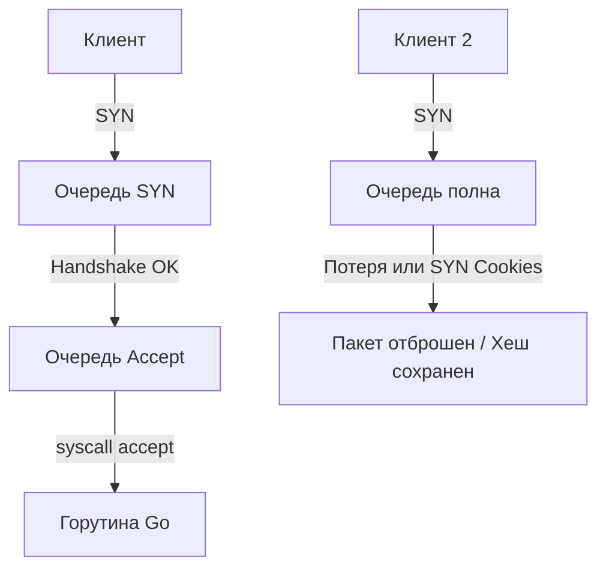

## Введение: Почему Go не спасет от падения ядра

Когда вы пишете высоконагруженный HTTP-сервер на Go, часто возникает иллюзия, что контроль над соединением полностью в ваших руках. Вы запускаете `http.Server.ListenAndServe()`, получаете горутины, работаете с контекстами. Но если нагрузка растет, вы внезапно начнете видеть в логах `accept: too many open files` или клиенты будут молча терять соединения без `context deadline exceeded`. Причина почти всегда не в Go-коде, а в том, что соединения умирают на границе между User Space и Kernel Space.

В этой статье мы разберем два критически важных буфера в сетевом стеке Linux: **SYN Queue** и **Accept Queue**. Понимание их работы, лимитов и поведения при переполнении — обязательный навык для Senior/Lead, который проектирует отказоустойчивые системы.

## Два уровня очередей в TCP-стеке

TCP-соединение не появляется мгновенно. Оно проходит через несколько состояний, и каждое состояние обслуживается своей внутренней структурой ядра. Для бэкенд-разработчика важны два буфера, которые формируются на стороне сервера при вызове `listen()`.

### SYN Queue: Фильтр на входе

Когда клиент отправляет первый пакет `SYN`, ядро Linux не создает полноценный сокет. Оно выделяет легковесную структуру `request_sock` и помещает её в **SYN Queue** (очередь полуподключений). Здесь соединение находится в состоянии `SYN_RECV`.

*   **Зачем это нужно:** Чтобы отсечь SYN-flood атаки и не тратить ресурсы на полноценный `socket` и `inode` для соединений, которые могут так и не завершить handshake.
*   **Лимит:** Задается параметром `net.ipv4.tcp_max_syn_backlog` (по умолчанию в современных Linux обычно 1024–4096).
*   **Поведение при переполнении:** Если очередь полна, ядро начинает отбрасывать входящие `SYN`. Если включены SYN Cookies (`net.ipv4.tcp_syncookies=1`), ядро вместо отбрасывания вычисляет криптографический хеш из параметров соединения и возвращает его в `SYN-ACK`. Клиент вернет его в `ACK`, и только тогда ядро создаст полноценный сокет. Это спасает от DDoS, но добавляет CPU-накладку на проверку хеша.

### Accept Queue: Воронка для Go-рантайма

Когда handshake завершается (`SYN-ACK` отправлен, `ACK` получен), ядро переводит соединение в состояние `ESTABLISHED` и перемещает его из SYN Queue в **Accept Queue**. Здесь соединение ждет, пока ваша программа вызовет `accept()`.

*   **Лимит:** Глобальный лимит `net.core.somaxconn` (по умолчанию 128 в старых ядрах, 4096 в новых). Лимит конкретного сокета не может превышать `somaxconn`.
*   **Поведение при переполнении:** Если очередь полна, ядро **молча отбрасывает** новые `SYN`-пакеты. Клиент не получает ошибки `ECONNREFUSED` сразу, он ждет таймаута TCP. Для Go это выглядит как внезапное «исчезновение» новых соединений под нагрузкой.



## Под капотом: Ядерные структуры и аллокации

В Linux ядро использует несколько вложенных структур для управления этими очередями:

1.  `struct sock` — базовая структура сетевого объекта. Для слушающего сокета выделяется структура с флагом `SOCK_LISTEN`.
2.  `struct listen_sock` — хранит параметры `backlog`, `qlen` (текущий размер очереди) и `max_qlen`.
3.  `struct request_sock_queue` — связный список `request_sock`. Каждый элемент содержит `tcp_request_sock` с таймером retransmit. Если клиент не ответит в течение `tcp_synack_retries` (обычно 5), элемент удаляется.

**Mechanical Sympathy:** При высокой нагрузке на Accept Queue возникает contention на блокировке очереди (`listen_lock`). Эта блокировка находится на уровне ядра и блокирует другие потоки, пытающиеся вызвать `accept()` на том же сокетe. В Go это означает, что горутины, ожидающие `Accept()`, не просто ждут в очереди планировщика, а блокируют системный тред (M), который в свою очередь ждет освобождения ядерной мьютексной переменной. Это создает каскадный эффект задержек.

## Взаимодействие Go runtime с очередями

Go-разработчики часто удивляются, почему `net.Listen("tcp", ":8080")` не позволяет задать размер очереди. Это архитектурное решение стандарта: Go делегирует управление системными лимитами ОС.

```go
package main

import (
	"fmt"
	"log"
	"net"
	"net/http"
	"syscall"
	"golang.org/x/sys/unix"
)

func main() {
	// 1. Создаем сырой сокет
	addr, _ := net.ResolveTCPAddr("tcp", "0.0.0.0:8080")
	listener, err := net.ListenTCP("tcp", addr)
	if err != nil {
		log.Fatal(err)
	}
	defer listener.Close()

	// 2. Настраиваем backlog через syscall
	// UnixListener позволяет получить файловый дескриптор
	ul, _ := listener.(*net.TCPListener)
	fd, _ := ul.File()
	defer fd.Close()

	// Устанавливаем SO_MAX_CONN (backlog)
	err = unix.SetsockoptInt(int(fd.Fd()), unix.SOL_SOCKET, unix.SO_MAX_CONN, 65535)
	if err != nil {
		log.Printf("Warning: failed to set backlog: %v", err)
	}

	// 3. Запускаем сервер
	httpServer := &http.Server{Addr: ":8080"}
	if err := httpServer.Serve(ul); err != http.ErrServerClosed {
		log.Fatalf("HTTP server error: %v", err)
	}
}
```

**Важные нюансы:**
*   `somaxconn` ограничивает максимальное значение `SO_MAX_CONN`. Если вы попытаетесь поставить `65535`, а в системе `somaxconn=128`, ядро усекает значение до `128`.
*   Go не создает отдельную горутину на каждое соединение по умолчанию. `net/http` использует `poll.FD` и `netpoller`. Когда `accept()` возвращает новый сокет, он регистрируется в `epoll`/`kqueue`. Пока соединение не в очереди, оно не потребляет CPU.
*   В отличие от Java (`ServerSocket.accept()` с параметром backlog) или Python, Go требует явного обращения к `syscall` или `golang.org/x/sys/unix` для тонкой настройки. Это не баг, а принцип минимальной абстракции.

> [!warning] Ловушка / Gotcha
> **Молчаливое падение соединений.**
> Если Accept Queue переполнена, ядро отбрасывает пакеты. Клиент не получает `Connection refused`. Он ждет TCP-таймаута (обычно 15–30 секунд). В логах Go-сервера вы увидите `accept: too many open files` или `use of closed network connection` только если переполнение произошло на уровне системных лимитов процессов (`ulimit -n`), а не ядра. Всегда мониторьте `netstat -s | grep listen` и `ss -lnt` в production.

> [!tip] Собеседование
> **Вопрос:** Чем отличается `somaxconn` от `tcp_max_syn_backlog`?
> **Ответ:** `somaxconn` — глобальный лимит для Accept Queue (полностью установленных соединений, ожидающих `accept()`). `tcp_max_syn_backlog` — лимит для SYN Queue (полуподключений, ожидающих завершения handshake). При DDoS-атаке первой переполняется SYN Queue, затем, если флуд продолжается и handshake проходит, переполняется Accept Queue. Настройка должна учитывать оба параметра.

## Тонкая настройка и мониторинг в production

Для высоконагруженных сервисов (API gateways, load balancers, real-time backends) стандартные значения недостаточны.

```bash
# Глобальный лимит для Accept Queue
sysctl -w net.core.somaxconn=65535

# Лимит для SYN Queue (защита от SYN-flood)
sysctl -w net.ipv4.tcp_max_syn_backlog=65535

# Включить SYN Cookies (автоматически, если очередь полна)
sysctl -w net.ipv4.tcp_syncookies=1

# Отключить принудительный сброс соединений при переполнении (по умолчанию 0)
sysctl -w net.ipv4.tcp_abort_on_overflow=0
```

**Мониторинг:**
*   `ss -lnt` — показывает текущий размер очереди в колонке `Recv-Q` и `Send-Q`. Для слушающего сокета `Recv-Q` = размер Accept Queue.
*   `netstat -s | grep -i listen` — показывает `listen drops` и `listen overflows`. Если `listen overflows > 0`, вы теряете соединения.
*   `perf trace -e accept,connect` — позволяет увидеть latency `accept()` syscall и узкие места.

> [!info] Под капотом
> **Почему Go не ставит 65535 по умолчанию?**
> Потому что это системный параметр ядра. В разных дистрибутивах и версиях Linux значения `somaxconn` различаются (128, 4096, 65535). Го-рантайм не имеет права менять глобальные параметры ядра без `CAP_NET_ADMIN`. Это принцип least privilege: приложение настраивает только свои ресурсы, а инфраструктура (ansible, k8s, systemd) настраивает ядро.

## Итог

1.  **SYN Queue** фильтрует полуподключенные соединения. Переполнение лечится SYN Cookies, но добавляет CPU-накладку.
2.  **Accept Queue** ждет вызова `accept()`. Переполнение ведет к молчаливой потере соединений клиентами.
3.  **Go runtime** не скрывает эти лимиты, но требует явного обращения к `syscall` для их увеличения.
4.  **Мониторинг** `Recv-Q` в `ss` и `listen overflows` в `netstat` — обязательная часть SRE-практик для бэкенда.
5.  **Тюнинг** должен быть комплексным: ядро (`somaxconn`) + процесс (`ulimit -n`) + Go (`http.Server` connection limits).

Мы разобрали, как соединения попадают в ваше приложение. Но что происходит с ними после завершения работы? Почему сокет остается в состоянии `TIME_WAIT` и блокирует порт? В следующей статье мы разберем [[50. TIME_WAIT, CLOSE_WAIT и проблемы сокетов]], чтобы закрыть цикл жизненного цикла TCP-соединения на уровне ядра.