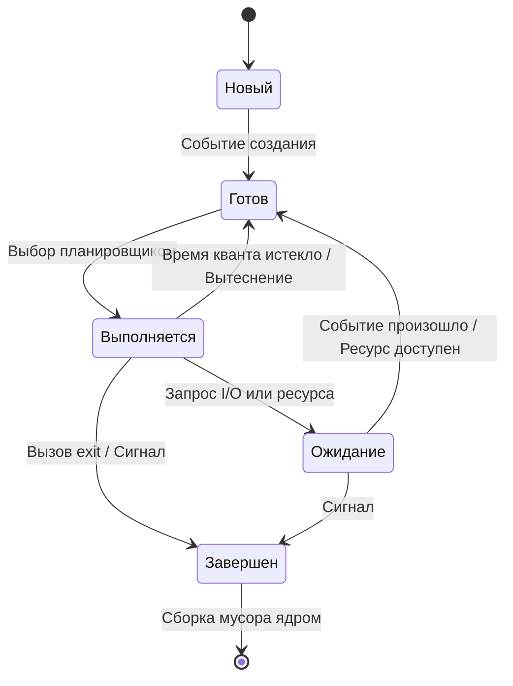

## Что такое процесс в современной ОС

Для Go-разработчика, который привык мыслить горутинами и каналами, понятие «процесс» может казаться архаизмом. Однако понимание процесса — это фундамент для работы с ресурсными ограничениями, изоляцией, межпроцессным взаимодействием и отладкой высоконагруженных систем.

**Процесс** — это экземпляр исполняемой программы, которому ядро ОС выделяет изолированное виртуальное адресное пространство, набор файловых дескрипторов, переменные окружения, права доступа и уникальный идентификатор (`pid`). 

Ключевое свойство процесса — **изоляция**. Если один процесс упадет с `panic` или получит `SIGSEGV`, ядро не позволит ему исказить память другого процесса. Это радикально отличается от треда ОС или горутины Go, которые делят адресное пространство и требуют явной синхронизации.

> [!info] Под капотом
> В Linux процесс — это не магическая сущность, а **структура данных** `task_struct` в пространстве ядра. Ядро не «запускает» процесс, оно создает объект `task_struct`, выделяет ему страницу таблиц трансляции адресов (Page Tables) и добавляет его в очередь планировщика. Пока планировщик не выберет этот `task_struct`, процесс не существует для CPU.

---

## Жизненный цикл процесса

Жизненный цикл процесса описывается конечным автоматом из пяти основных состояний. Переходы между ними управляются планировщиком ОС и событиями (прерываниями, системными вызовами, сигналами).



1. **Новый (New):** Процесс создан, но ядро еще не подготовило все структуры (не выделило память, не создало `task_struct`).
2. **Готов (Ready):** Процесс готов к исполнению, но ждет выделения процессорного времени. Находится в очереди планировщика.
3. **Выполняется (Running):** Инструкции процесса исполняются CPU. На многоядерной системе процесс может быть распределен по ядрам, но в каждый момент времени он исполняется на одном `M` (в терминологии Go) или ядре.
4. **Ожидание/Блокировка (Waiting/Blocked):** Процесс ждет завершения внешней операции (чтение с диска, сетевой сокет, мьютекс). Не потребляет CPU.
5. **Завершен (Terminated):** Процесс завершился. В Linux это состояние `TASK_ZOMBIE`, пока родитель не вызовет `wait()`.

---

## Под капотом: task_struct и флаги состояний

В Linux состояние процесса хранится в поле `state` структуры `task_struct`. Это не просто enum, а битовая маска, позволяющая процессу находиться в нескольких логических состояниях одновременно (например, прерываемое ожидание + остановленный по сигналу).

| Флаг ядра | Значение для разработчика |
|-----------|---------------------------|
| `TASK_RUNNING` | Процесс в состоянии `Готов` или `Выполняется`. Находится в runqueue планировщика. |
| `TASK_INTERRUPTIBLE` | Ждет событие (I/O, сигнал). Может быть разбужен асинхронным сигналом (`SIGINT`, `SIGTERM`). |
| `TASK_UNINTERRUPTIBLE` | Ждет событие, но **игнорирует сигналы**. Обычно используется для критичного I/O (монтирование ФС, ожидание диска). |
| `TASK_ZOMBIE` | Процесс завершился, но родитель не вызвал `wait()`. `task_struct` частично очищен, но `pid` и статус остаются в таблице. |
| `TASK_STOPPED` | Остановлен сигналом `SIGSTOP`, `SIGTSTP` или трассировкой (`ptrace`). |

> [!warning] Ловушка / Gotcha
> Состояние `TASK_ZOMBIE` не потребляет память процесса (стек, heap, page tables освобождены ядром), но **занимает PID**. Если родитель не вызовет `wait()`, PID не будет переиспользован, что может привести к исчерпанию пула идентификаторов (`/proc/sys/kernel/pid_max`) и невозможности создавать новые процессы.

---

## Механика переходов и стоимость изоляции

Переход из `Выполняется` в `Готов` (вытеснение) или в `Ожидание` (блочинг) требует **переключения контекста (Context Switch)**. 

1. **Сохранение состояния CPU:** Регистры, указатель стека, флаги состояния (`RIP`, `RSP`, `RFLAGS` в x86-64) сохраняются в `task_struct` текущего процесса.
2. **Очистка MMU:** Если новый процесс использует другое виртуальное адресное пространство, ядро обновляет CR3 (регистра базового адреса PML4) и вызывает **TLB Shootdown** — инвалидацию кэша трансляции адресов на всех ядрах. Это одна из самых дорогих частей переключения.
3. **Кэш-когерентность:** Данные кэша L1/L2 предыдущего процесса становятся «грязными» для нового. CPU должен сбросить или пометить кэш-линии как недействительные, что вызывает промахи кэша (cache miss) на старте нового процесса.

**Стоимость:** Современный Context Switch на x86-64 стоит от 2 до 5 микросекунд. Для сравнения, системный вызов без перехода в ядро (~100 нс) в 50 раз дешевле, а вызов внутри одного процесса (~50 нс) в 100 раз дешевле. Именно поэтому Go предпочитает горутины (легковесные переключения в User Space) вместо создания нового ОС-процесса для каждого запроса.

> [!tip] Собеседование
> **Вопрос:** Почему микросервисы часто развертывают в отдельных процессах (или контейнерах), а не используют многопоточность в одном процессе?
> **Ответ:** Изоляция памяти и стабильность. Падение одного сервиса не «убьет» память другого. Также это упрощает масштабирование (можно запустить N копий процесса) и настраивать лимиты ресурсов (cgroups, ulimit) на уровне ОС. Компромисс — стоимость IPC и сетевых вызовов между процессами.

---

## Go-специфика: Процессы против Горутин и управление через os/exec

Go runtime **не создает** новые ОС-процессы. При запуске `go run` или `go build` запускается **один** процесс. Внутри него `runtime` управляет пулом OS-потоков (`M`) и мапит на них горутины (`G`). 

Если вам нужна истинная изоляция (например, запуск стороннего бинарника, обход GIL-аналога, или запуск тяжелого вычисления с гарантией падения без утечки памяти), используется пакет `os/exec`.

```go
package main

import (
	"fmt"
	"os/exec"
	"context"
)

func runIsolatedTask(ctx context.Context) error {
	// Команда: echo "Hello from subprocess"
	cmd := exec.CommandContext(ctx, "echo", "Hello from subprocess")
	
	// Redirect stdout/stderr to capture output
	output, err := cmd.CombinedOutput()
	if err != nil {
		// exec.ExitError содержит код возврата
		var exitErr *exec.ExitError
		if errors.As(err, &exitErr) {
			return fmt.Errorf("subprocess failed with code %d: %s", exitErr.ExitCode(), string(output))
		}
		return err
	}
	
	fmt.Printf("Output: %s\n", output)
	return nil
}
```

### Управление жизненным циклом в Go
- `cmd.Start()`: Создает процесс, но не ждет завершения. Возвращает `*os.Process`.
- `cmd.Wait()`: Блокирует текущую горутину до завершения дочернего процесса. **Обязательно** вызывает `waitpid()` в ядре, превращая `TASK_ZOMBIE` в `TASK_DEAD` и освобождая PID.
- `cmd.Process.Release()`: Отказ от контроля над процессом. Процесс продолжает жить, но Go перестает отслеживать его статус. **Не вызывает wait()**, оставляя процесс в состоянии зомби до ручного завершения или перезагрузки.

> [!info] Под капотом
> Когда вы вызываете `exec.Command`, Go делает `fork()` (копирует `task_struct` и page tables с флагом COW), а затем `execve()` (загружает новый бинарник в память, заменяя старый код и данные). Это классическая пара `fork + exec`, о которой мы поговорим в [[6. Как Linux создает процессы. fork, exec, wait.md]].

---

## Ловушки и типичные вопросы с собеседований

### 1. Zombie vs Orphan процессы
- **Zombie:** Дочерний процесс завершился, родитель не вызвал `wait()`. Статус сохраняется в ядре. **Решение:** Вызвать `cmd.Wait()` в Go или настроить обработчик сигналов `SIGCHLD` в родителе.
- **Orphan (сирота):** Родитель завершился раньше дочернего. Ядро автоматически переносит `ppid` дочернего процесса в `init` (PID 1) или `systemd`. **Решение:** Не требует действий, но полезно знать для отладки утечек ресурсов.

### 2. Resource Limits (ulimit / rlimit)
Процессы имеют лимиты на количество открытых файлов (`nofile`), размер стека (`stack`), макс. количество процессов (`nproc`). В Go их можно менять через `syscall.Setrlimit`. Превышение лимита завершает процесс сигналом `SIGKILL` (например, `ulimit: open files limit exceeded`).

### 3. Вопрос на собеседовании
> *«В чем разница между процессом и горутиной с точки зрения переключения контекста и потребления памяти?»*
> 
> **Ответ:** Процесс требует переключения MMU (CR3), инвалидации TLB и смены page tables. Потребляет ~1-8 МБ на стеке + overhead ядра. Горутина переключается в User Space через `gostart`/`goexit`, меняет только указатели `g` и `m`, использует стеки, растущие динамически (стартовый ~2 КБ, может расширяться до сотен МБ при реаллокации). Context switch горутины стоит ~100-200 нс против ~2-5 мкс у ОС-процесса.

---

## Итог

1. Процесс — это изолированный экземпляр программы с собственным виртуальным адресным пространством и `task_struct` в ядре.
2. Жизненный цикл включает состояния `Новый → Готов → Выполняется → Ожидание → Завершен`. Переходы управляются планировщиком и событиями.
3. Переключение между процессами дорого из-за смены контекста, инвалидации TLB и кэш-промахов.
4. В Go процессы создаются через `os/exec`. Всегда вызывайте `cmd.Wait()` или `cmd.Process.Release()`, чтобы избежать утечки PID и накопления зомби.
5. Для высоконагруженного бэкенда Go предпочитает горутины внутри одного процесса. ОС-процессы используются для изоляции, разделения ресурсов или запуска сторонних бинарников.

Следующий шаг — понять, как именно ядро создает и уничтожает эти процессы. В статье [[6. Как Linux создает процессы. fork, exec, wait.md]] мы разберем системные вызовы, Copy-On-Write и механизм очистки памяти.