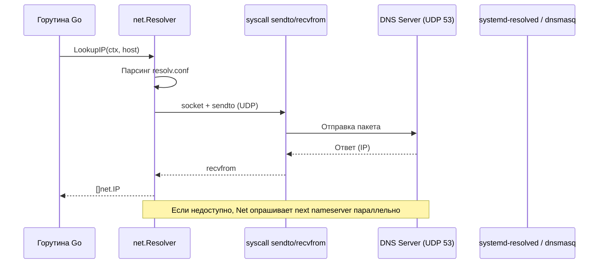

## Введение

Для бэкенд-разработчика DNS — это не просто «преобразование имени в IP». Это первый и самый критичный сетевой вызов в жизненном цикле любого HTTP-запроса, gRPC-клиента или фоновой задачи. Задержка DNS, кэш-промахи, блокирующие системные вызовы и специфика парсинга конфигурации напрямую влияют на tail-latency вашего сервиса.

В классических стеках (C, Java, PHP) разрешение доменов делегируется libc (`getaddrinfo`, `gethostbyname`). В Go архитектура намеренно отделена от системной libc для предсказуемости и безопасности. Разберём, как ОС и Go на самом деле работают с DNS, где прячутся системные вызовы и как настроить резолвер для production.

## Архитектура DNS-разрешения в ОС

В Linux разрешение имён не происходит «волшебным образом». Это конвейер, управляемый файлом `/etc/resolv.conf` и механизмом NSS (Name Service Switch).

Файл `/etc/resolv.conf` — это единственная точка конфигурации для DNS-клиентов в POSIX-системах. Ключевые директивы:

| Директива | Назначение | Влияние на производительность |
|-----------|------------|-------------------------------|
| `nameserver` | IP-адреса DNS-серверов (максимум 3) | Определяет, куда уходят UDP-пакеты. Порядок важен в libc, но не в Go. |
| `search` | Список доменов для подстановки | Увеличивает количество запросов. Каждая горутина может сделать до `len(search)` DNS-запросов. |
| `ndots` | Порог количества точек в имени | Если в имени меньше точек, чем `ndots`, к имени добавляются `search`-домены. |
| `timeout` / `attempts` | Таймаут и количество попыток на сервер | Влияет на блокировку горутины при недоступности DNS. |

> [!info] Под капотом
> При запуске процесса libc читает `/etc/resolv.conf` один раз и кэширует его в структуре `struct res_state`. Если файл меняется (например, Docker перезапускает контейнер), libc должен быть перезапущен или использовать `nsswitch.conf` с кэшем (`systemd-resolved`, `dnsmasq`). Go по умолчанию игнорирует изменения `resolv.conf` после старта процесса, что повышает стабильность, но усложняет отладку в динамических средах.

## libc и `getaddrinfo`: Классический подход

В C/C++/Java/PHP сетевые операции часто проходят через libc. Функция `getaddrinfo()` — это обёртка, которая:
1. Парсит `/etc/resolv.conf` и `/etc/hosts`.
2. Проверяет `search` домены и `ndots`.
3. Отправляет UDP-пакет на порт 53 первого `nameserver`.
4. Если ответ обрезан (`TC` flag = 1) или требуется TCP (AXFR, большие ответы), повторяет запрос через TCP.
5. Возвращает массив `struct addrinfo` (IPv4 + IPv6).

**Системные вызовы:** `socket(AF_INET, SOCK_DGRAM, IPPROTO_UDP)`, `sendto()`, `recvfrom()`, `close()`. В случае таймаута или ошибки TCP: `socket(AF_INET, SOCK_STREAM, IPPROTO_TCP)`, `connect()`, `write()`, `read()`, `close()`.

> [!warning] Ловушка / Gotcha
> В glibc все `nameserver` опрашиваются **последовательно**. Если первый DNS-сервер недоступен, libc ждёт `timeout` (по умолчанию 5 секунд), прежде чем перейти ко второму. В высоконагруженных системах это создаёт «эффект домино» при частичном падении инфраструктуры.

## Go-резолвер: `netgo`, `netcgo` и `net.Resolver`

Go изначально избегал зависимости от libc для сетевых операций. Это решало проблемы с утечками памяти в `net/http` и блокировками при `CGO_ENABLED=1`.

### Режимы работы
| Переменная `netdns` | Поведение | Где используется |
|---------------------|-----------|------------------|
| `cgo` (устар.) | Вызывает libc `getaddrinfo` | Старые сборки, специфичные интеграции |
| `go` (по умолчанию) | Чистый Go резолвер (`netgo`) | Все современные сборки `GOOS=linux`, `darwin`, `windows` |
| `experimentalgo` | Новый конкурентный резолвер с кэшированием | Тесты производительности, будущий дефолт |

### Как работает `netgo`
Go парсит `/etc/resolv.conf` самостоятельно, но с важными отличиями:
- **Параллельный опрос:** Все `nameserver` опрашиваются **одновременно** (round-robin). Первый валидный ответ побеждает. Это радикально снижает задержку.
- **`ndots` и `search`:** Реализованы аналогично glibc, но Go не подставляет `search` домены для `localhost` или IP-адресов.
- **Кэш:** В `netgo` кэш DNS отсутствует (по умолчанию). Каждый `net.Dial` или `net.LookupIP` может инициировать новый запрос.

```go
package main

import (
	"context"
	"fmt"
	"log"
	"net"
	"time"
)

func main() {
	// 1. Создаём резолвер с кастомным таймаутом и DNS-сервером
	resolver := &net.Resolver{
		PreferGo: true, // Гарантирует использование netgo, даже если включён CGO
		Dial: func(ctx context.Context, network, address string) (net.Conn, error) {
			d := net.Dialer{
				Timeout: time.Second * 2,
			}
			// Явно указываем DNS-сервер (обход /etc/resolv.conf)
			return d.DialContext(ctx, "udp", "1.1.1.1:53")
		},
	}

	ctx, cancel := context.WithTimeout(context.Background(), time.Second*5)
	defer cancel()

	addrs, err := resolver.LookupIP(ctx, "ip4", "example.com")
	if err != nil {
		log.Fatalf("DNS lookup failed: %v", err)
	}

	for _, ip := range addrs {
		fmt.Println(ip)
	}
}
```

> [!tip] Собеседование
> **Вопрос:** Почему в Alpine Linux (musl libc) Go-приложения иногда не могут резолвить домены, а в Debian (glibc) работают?
> **Ответ:** `musl` имеет ограниченную поддержку `/etc/resolv.conf`. Он не поддерживает директиву `search` и `ndots` корректно, а также требует, чтобы `nameserver` был первым в файле. Если в Docker-образе на Alpine `/etc/resolv.conf` содержит закомментированные строки или опции до `nameserver`, musl-резолвер (если используется `netcgo`) может сломаться. `netgo` парсит файл строго и игнорирует невалидные строки, поэтому `GOOS=linux GOARCH=amd64 CGO_ENABLED=0 go build` решает проблему.

## Mechanical Sympathy: Сеть, кэш и блокировки

Разбор DNS с точки зрения CPU и памяти:

1. **UDP-пакет (DNS query):** Размер ~50-70 байт. Идёт через `sendto()` (syscall), попадает в `ip_output()`, маршрутизатор, DNS-сервер. Ответ возвращается через `recvfrom()`. В Go это происходит в `net.UDPConn` через `ReadFromUDP()`.
2. **TLB и кэш процессора:** При первом запросе к новому DNS-серверу происходит `Page Fault` для загрузки таблиц маршрутизации и DNS-кэша ОС. Если DNS-сервер кэширован в `systemd-resolved`, запрос уходит локально через Unix Domain Socket (`/run/systemd/resolve/resolv.conf`), что исключает сетевой стек и переключение контекста.
3. **Блокировка горутин:** `net.Dial` по умолчанию блокирует горуину до завершения DNS. В Go 1.20+ добавлен `net.Resolver` с `DialContext`, но базовый `net.Dial` всё ещё использует синхронный путь. Для высоконагруженных сервисов всегда кэшируйте IP или используйте `net.Resolver` с контекстом.
4. **Аллокации:** Каждый `LookupIP` создаёт слайсы `[]net.IP`, `[]string` (для `LookupHost`). При миллионе запросов в секунду это создаёт нагрузку на GC. Используйте `sync.Pool` или кэш (`hashicorp/golang-lru`), если резоллите одни и те же хосты.



> [!warning] Ловушка / Gotcha
> `ndots:5` в Kubernetes. Если в `resolv.conf` кластера стоит `ndots:5`, а вы обращаетесь к сервису по имени `my-svc` (0 точек), Go добавит `search` домены: `my-svc.svc.cluster.local`, `svc.cluster.local`, `cluster.local`. Это означает **до 4 DNS-запросов** вместо одного. В микросервисах с высокой частотой коммуникаций это убивает latency. Всегда используйте полные FQDN (`my-svc.default.svc.cluster.local`) или уменьшайте `ndots` до 1-2.

## Итоги

1. **OS vs Go:** libc опрашивает DNS последовательно и кэширует `resolv.conf`. Go (`netgo`) опрашивает параллельно, парсит конфигурацию самостоятельно и не кэширует DNS по умолчанию.
2. **Системные вызовы:** DNS-резолвер вызывает `socket`, `sendto`, `recvfrom`. При недоступности DNS горутина блокируется до `context` таймаута.
3. **`musl` vs `glibc`:** В контейнеризации выбирайте `CGO_ENABLED=0` для предсказуемого поведения. `netgo` не зависит от системной libc.
4. **Оптимизация:** Кэшируйте IP, используйте `net.Resolver` с кастомным `Dial`, контролируйте `ndots` в кластерах.

Мы разобрали, как имя превращается в IP на уровне ядра и рантайма. Следующий шаг — понять, как ОС ограничивает ресурсы процессов, чтобы DNS-флуд или утечка сокетов не уронили хост. В статье [[52. Ограничения ОС. ulimit, cgroups, quotas.md]] разберём `ulimit`, `cgroups` и лимиты файловых дескрипторов, критичные для сетевых сервисов на Go.