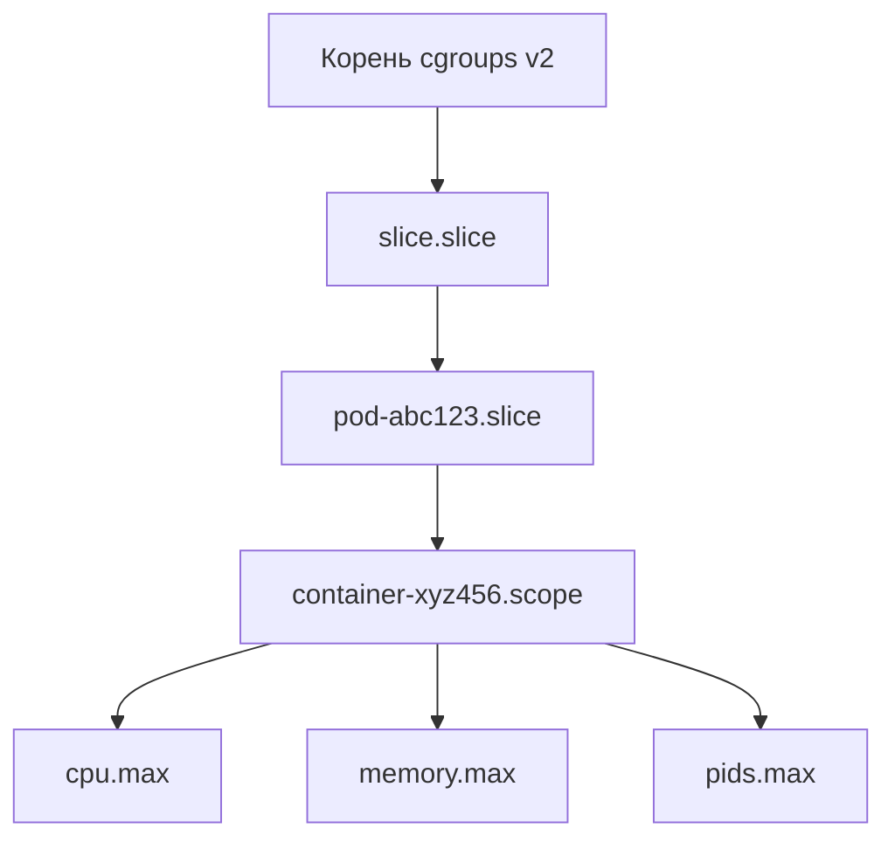

## Введение: Почему ограничения — это не только про DevOps

Для Go-разработчика лимиты — это не абстрактные настройки операционной системы. Это границы, в которых работают планировщик горутин, `netpoller`, сборщик мусора и аллокатор памяти. Игнорирование `ulimit` или `cgroups` приводит к `EMFILE` в продакшене, `OOMKilled` в Kubernetes и неочевидным падениям при пиковых нагрузках.

Понимание того, где заканчивается user-space и начинается принудительное вмешательство ядра, позволяет писать предсказуемые и отказоустойчивые приложения.

## Традиционные ограничения: ulimit и limits.conf

Linux использует систему **Resource Limits** (ограничения ресурсов), которые применяются на уровне ядра к каждому процессу (task). Они делятся на `soft` (текущее значение, может быть увеличено до `hard`) и `hard` (максимум, до которого может подняться soft, изменить может только root).

Ключевые лимиты для бэкенда:
- `RLIMIT_NOFILE` (или `nofile`): максимальное количество открытых файловых дескрипторов (FD). Влияет на `netpoller`, логирование, пулы соединений к БД.
- `RLIMIT_NPROC`: максимальное количество процессов/потоков, которые может создать пользователь.
- `RLIMIT_AS` (или `maxrss`): ограничение на объем виртуальной/физической памяти.
- `RLIMIT_CPU` и `RLIMIT_FSIZE`: таймаут по CPU и максимальный размер файла.

Проверка текущих лимитов:
```bash
ulimit -a
cat /proc/$$/limits
```

> [!info] Под капотом
> В ядре Linux каждый процесс (task_struct) содержит массив `struct rlimit rlim[RLIM_NLIMITS]`. Когда программа делает `open()`, `dup()`, `accept()`, ядро проверяет `rlim[RLIMIT_NOFILE].rlim_cur`. Если лимит исчерпан, syscall возвращает `-1` с кодом `EMFILE` (too many open files) или `ENOSPC` (no space left on device для inode).

Настройка лимитов происходит через:
1. Команду `ulimit -n 65535` в сессии.
2. Файл `/etc/security/limits.conf` (PAM).
3. Директиву `LimitNOFILE` в unit-файле systemd.

> [!warning] Ловушка / Gotcha
> `ulimit` работает только в рамках текущей оболочки и её дочерних процессов. Он **не** работает для процессов, запущенных через `systemd`, `cron` или `docker run` (если не передано `--ulimit`). В контейнеризованной среде `ulimit` часто игнорируется, и ограничения накладываются исключительно через `cgroups`.

## cgroups (control groups): Современный стандарт изоляции

`ulimit` имеет два больших недостатка: он не работает в контейнерах и не ограничивает потребление ресурсов динамически. Здесь на сцену выходят **cgroups** (контрольные группы).

### cgroups v1 vs v2

В v1 каждый контроллер (`cpu`, `memory`, `pids`, `blkio`) монтировался в отдельную файловую систему (`/sys/fs/cgroup/cpu`, `/sys/fs/cgroup/memory` и т.д.). Иерархия была плоской, что приводило к конфликтам и двойному учету ресурсов.

cgroups v2 унифицировал это. Единая точка монтирования `/sys/fs/cgroup`, контроллеры подключаются динамически к поддиректориям (slice/units). В Kubernetes используется именно v2.



### Ключевые контроллеры для Go

- `cpu.max`: `quota period` (например, `20000 100000` = 20% CPU). Влияет на `netpoller` и GC. Если CPU ограничен жестко, GC может не успевать, heap растет, приложение падает по timeout.
- `memory.max`: Лимит памяти. Go не читает его автоматически. Если процесс превысит `memory.max`, ядро убьет его через OOM Killer.
- `pids.max`: Лимит на количество PID. Go создает горутины в userspace, но при работе с `syscall`, `os/exec`, `Cgo` или `netpoller` (в некоторых режимах) могут потребоваться новые потоки ОС. Превышение `pids.max` вернет `EAGAIN` или убьет процесс.

> [!tip] Собеседование
> **Вопрос:** Почему Go не может самостоятельно ограничить потребление памяти, если запущен в контейнере с cgroups?
> **Ответ:** Go-рантайм работает в user space и видит только виртуальную память процесса. Он не знает о границах cgroups. Если Heap превысит `memory.max`, GC не успеет сработать вовремя, и ядро убьет процесс. Начиная с Go 1.19, добавлена переменная `GOMEMLIMIT`, которая заставляет GC работать агрессивнее, но она не заменяет настройку `memory.max` в инфраструктуре.

## Quotas (Квоты): Диск и пользователи

Квоты ограничивают дисковое пространство на уровне файловой системы (`ext4`, `xfs`). Управляются через `quota`/`quotaon` и `/etc/fstab` (опции `usrquota`, `grpquota`).

Для Go-разработчика это актуально, когда приложение пишет логи, дампы БД или кэширует данные на диск. Превышение квоты возвращает `ENOSPC` или `EDQUOT`. Go не имеет встроенных механизмов обхода квот — это задача уровня ОС и файловой системы.

## Go Runtime и ограничения: Что происходит под капотом

При старте Go-приложения рантайм проверяет лимиты через `getrlimit`. Если `RLIMIT_NOFILE` меньше ~1024, может произойти паника или некорректная работа `netpoller`.

### Взаимодействие с памятью и GC

Go аллоцирует память в куче (heap) через `mmap`. Если `memory.max` в cgroups установлен жестко, а `GOMEMLIMIT` не настроен, GC будет работать в режиме "panic on allocation" или не успевать очищать память. Heap растет, виртуальная память (VSS) может превысить физическую, что приведет к `OOMKilled`.

```go
// Правильная настройка для контейнерной среды
// В Dockerfile или Kubernetes manifest:
// ENV GOMEMLIMIT=512MiB
// limits:
//   memory: 1Gi
//   cpu: 500m
```

### Взаимодействие с FD и netpoller

`netpoller` использует `epoll` (Linux) или `kqueue` (BSD/macOS). Каждый сокет, лог-файл, соединение к БД занимает FD. Если лимит исчерпан:
- `net.Dial` вернет ошибку `too many open files`.
- `os.File` не сможет открыться.
- `netpoll` не сможет зарегистрировать новый сокет.

В Go 1.14+ `netpoller` стал асинхронным и более эффективным, но он все равно упирается в `RLIMIT_NOFILE` на уровне ядра.

> [!warning] Ловушка / Gotcha
> В Kubernetes `resources.requests.memory` — это не лимит, а гарантия. `resources.limits.memory` — это `memory.max` в cgroups. Если Go приложение использует `GOMEMLIMIT`, оно должно быть установлено в значение **меньше** `limits.memory`, обычно на 10-20% меньше, чтобы оставить место под стек, кэш ядра, heap metadata и GC overhead.

## Отладка и мониторинг лимитов

1. Проверка лимитов процесса: `cat /proc/<pid>/limits`
2. Мониторинг cgroups: `cat /sys/fs/cgroup/<path>/memory.current` и `memory.max`
3. Ошибки FD: `lsof -p <pid> | wc -l`
4. В Kubernetes: `kubectl top pod` + `kubectl describe pod` (секция Limits/Requests)

## Итог

1. `ulimit` — традиционный механизм ядра, работает в рамках сессии, но игнорируется в контейнерах.
2. `cgroups v2` — современный стандарт изоляции, контролирует CPU, память, PIDs на уровне ядра.
3. Go рантайм не знает о cgroups автоматически, требует настройки `GOMEMLIMIT` и учета overhead.
4. Игнорирование лимитов ведет к `EMFILE`, `OOMKilled` и нестабильной работе `netpoller`.
5. Для продакшена: настраивайте `LimitNOFILE` в systemd, `resources.limits` в K8s, и всегда задавайте `GOMEMLIMIT`.

Мы разобрали, как ОС ограничивает ресурсы процесса. В следующей статье мы посмотрим, как эти ограничения реализованы на практике в контейнерах: [[53. Контейнеры под капотом. namespaces и cgroups]], чтобы понять, как Go-приложение оказывается изолированным в кластере.