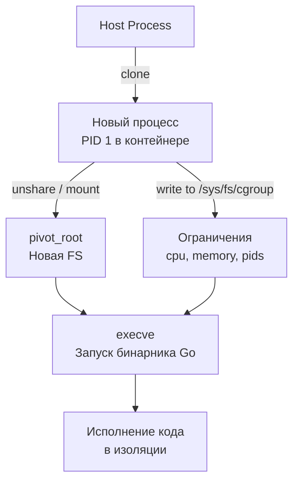

## Контейнеры: иллюзия виртуализации или реальная изоляция?

Многие разработчики ошибочно полагают, что контейнеры — это «лёгкие виртуальные машины». Это фундаментально неверно. Виртуальная машина эмулирует железо, запускает отдельное ядро ОС и требует гипервизора. Контейнер — это **обычный процесс Linux**, которому ядро просто ограничивает видимость на системные ресурсы и накладывает финансовые лимиты.

Вся магия контейнеризации (Docker, containerd, LXC) строится на двух механизмах ядра Linux:
1. **Namespaces** — изоляция. Процесс видит только свою часть ресурсов.
2. **cgroups** (control groups) — ограничение и учёт. Процесс не может потреблять больше выделенного CPU, RAM или IOPS.

Когда вы запускаете `docker run`, вы не создаёте новую машину. Вы просите ядро создать процесс с другими флагами и привязать его к контрольной группе. Нагрузка на CPU при переключении контекста между контейнерами и обычными процессами **абсолютно одинакова**. Нет эмуляции, нет трансляции адресов, нет гипертрейдинга. Именно поэтому Go, работающий внутри контейнера, выдаёт производительность bare-metal.

## Namespaces: виртуальные окна в системные ресурсы

**Namespace** — это механизм ядра, который создаёт изолированное «окно» в системные ресурсы. Процесс внутри namespace не видит процессов, файлов, сетевых интерфейсов или пользователей, находящихся за его границами.

В современном ядре Linux существует 7 типов namespaces:

| Тип | Флаг | Что изолирует |
|---|---|---|
| `PID` | `CLONE_NEWPID` | Пространство идентификаторов процессов. Внутри контейнера ваш процесс всегда будет PID 1. |
| `NET` | `CLONE_NEWNET` | Сетевой стек, интерфейсы, iptables, порты. |
| `MNT` | `CLONE_NEWNS` | Точка монтирования файловой системы. Позволяет сделать `pivot_root`. |
| `UTS` | `CLONE_NEWUTS` | Имя хоста и доменное имя. |
| `IPC` | `CLONE_NEWIPC` | Семафоры, очереди сообщений, разделяемая память. |
| `USER` | `CLONE_NEWUSER` | Маппинг UID/GID между хостом и контейнером (key feature для non-root). |
| `CGROUP` | `CLONE_NEWCGROUP` | Контрольные группы (изолирует иерархию cgroups). |

> [!info] Под капотом
> В ядре Linux каждый `task_struct` (представление процесса) содержит указатели на структуры `struct nsproxy`. При создании процесса через `clone()` ядро проверяет флаги. Если флаг установлен, ядро выделяет новую структуру namespace, копирует в неё состояние текущего, но изолирует внутренние списки (например, PID tree или socket list). Процесс просто получает указатель на новый `nsproxy`, и все последующие системные вызовы (`stat`, `socket`, `fork`) используют это новое окно. С точки зрения CPU и кэшей L1/L2 — никаких дополнительных операций.

Создание namespace происходит на уровне системных вызовов:
- `clone()` — создание процесса с новыми namespace.
- `unshare()` — разделение текущих ресурсов namespace у уже запущенного процесса.
- `setns()` — присоединение процесса к существующему namespace (используется, например, `docker exec`).

## Cgroups: жесткие ограничения ресурсов

Если namespaces дают процессу иллюзию отдельной системы, то **cgroups** не дают ему сломать хост, потребляя всё.

Cgroups v2 (современный стандарт, с ядра 5.3+) использует единую иерархию. Ресурсы не размазаны по разным подсистемам, как в v1, а управляются через единый контрольный файл в `/sys/fs/cgroup/`.

### Ключевые контроллеры v2:
- `cpu.max` — ограничение CPU. Формат: `quota period` (например, `100000 100000` = 100% одного ядра).
- `memory.max` — лимит физической памяти (RAM + swap). При превышении ядро начинает агрессивно чистить кэш или вызывает OOM Killer.
- `memory.high` — мягкий лимит. При превышении процесс получает уведомления и должен освободить память, но не умирает сразу.
- `pids.max` — максимальное количество процессов/горутин.
- `io.max` — контроль IOPS и throughput для блочных устройств.

> [!warning] Ловушка / Gotcha
> В Go память распределяется через `mmap` и `brk`. Если контейнер упирается в `memory.max`, следующий `runtime.Grow` или аллокация `make([]byte, ...)` не вызовет панику Go. Она вернёт ошибку `ENOMEM` на уровне ядра, которую Go-рантайм преобразует в `panic: runtime error: invalid memory address or nil pointer dereference` или `fatal error: out of memory`. Отладка таких падений требует понимания, что проблема не в утечке памяти в вашем коде, а в лимите cgroup.

## Как это работает вместе: от docker run до вашего Go-процесса

Полный цикл запуска контейнера выглядит как последовательность низкоуровневых операций:



1. **`clone()` с флагами**: Ядро создаёт новый `task_struct` с новыми `nsproxy`.
2. **`pivot_root()`**: Корневая файловая система процесса заменяется на образ контейнера (overlayfs/overlay2).
3. **Настройка cgroups**: Рантайм пишет лимиты в `/sys/fs/cgroup/docker/<id>/cpu.max`. Процесс теперь жестко ограничен.
4. **`execve()`**: Заменяет образ процесса на ваш Go-бинарник. Горутины, каналы, `runtime.g` — всё работает как обычно, но под надзором ядра.

## Go и низкоуровневая работа с изоляцией

В стандартной библиотеке Go нет прямых методов для работы с namespace/cgroups, но пакет `golang.org/x/sys/unix` даёт полный доступ к syscall.

Пример: как в Go определить, работает ли процесс внутри cgroup v2, и прочитать лимит памяти:

```go
package main

import (
	"fmt"
	"os"
	"strconv"

	"golang.org/x/sys/unix"
)

func main() {
	// Проверяем, смонтирована ли файловая система cgroup v2
	var stat unix.Statfs_t
	if err := unix.Statfs("/sys/fs/cgroup", &stat); err != nil {
		fmt.Fprintf(os.Stderr, "Ошибка чтения cgroup: %v\n", err)
		os.Exit(1)
	}

	// CGROUP2_SUPER_MAGIC = 0x63677270
	if stat.Type != 0x63677270 {
		fmt.Println("cgroup v2 не обнаружен. Работает cgroup v1 или его нет.")
		return
	}

	// Читаем лимит памяти текущего cgroup
	// Путь зависит от runtimes, часто это /sys/fs/cgroup/memory.max или memory.current
	// Для демо читаем текущее потребление
	data, err := os.ReadFile("/sys/fs/cgroup/memory.current")
	if err != nil {
		fmt.Fprintf(os.Stderr, "Не удалось прочитать лимит: %v\n", err)
		return
	}

	// Парсим байты
	limit, err := strconv.ParseInt(string(data), 10, 64)
	if err != nil {
		fmt.Fprintf(os.Stderr, "Ошибка парсинга: %v\n", err)
		return
	}

	fmt.Printf("Текущее потребление памяти в cgroup: %d байт (%.2f MB)\n", limit, float64(limit)/1024/1024)
}
```

> [!tip] Собеседование
> **Вопрос:** Как Go-приложение должно реагировать на OOM Killer внутри контейнера?
> **Ответ:** На уровне приложения перехватывать OOM невозможно, так как процесс убивается ядром (`SIGKILL`). Однако можно:
> 1. Слушать `memory.high` через inotify и gracefully уменьшать нагрузку (отключать тяжелые задачи, сбрасывать кэш).
> 2. Использовать `systemd` или `docker` healthcheck для перезапуска упавших контейнеров.
> 3. В коде использовать `runtime/debug.SetMemoryLimit()` (Go 1.19+) для мягкого ограничения аллокаций до уровня cgroup, чтобы избежать агрессивного OOM.

## Ловушки и вопросы с собеседований

### 1. Почему `docker run` не требует root?
Благодаря `USER namespace`. При маппинге `UID 0` внутри контейнера в `UID 1000` на хосте, процессы внутри видят себя как root, но на уровне ядра они не имеют привилегий. Это безопасно, но ломает некоторые syscall, требующие реального UID 0 (например, `CAP_NET_RAW` для `ping`).

### 2. Разница между `clone` и `fork`?
`fork` копирует весь адресный процесс (Copy-on-Write). `clone` — это суперсетевой `fork`, который позволяет выбрать, какие ресурсы копировать, а какие разделять (стек, маппинги памяти, namespaces). Именно `clone` с флагами используется для создания горутин в Go и процессов в контейнерах.

### 3. Что происходит с горутинами при переключении cgroup CPU?
Ничего особенного. Go scheduler работает в User Space. Если процесс упирается в `cpu.max`, ядро просто не планирует его на CPU (возвращает `EAGAIN` или игнорирует запрос на переключение контекста). Go runtime увидит, что горутина не выполняется, и переключится на другую. Задержки будут, но deadlocks не возникнет.

### 4. Как связать Go-сервер с сетью конкретного контейнера?
По умолчанию `net.Listen(":8080")` биндится на `0.0.0.0` хоста. Чтобы привязаться к интерфейсу внутри контейнера, нужно использовать `SO_BINDTODEVICE` через `syscall.SetsockoptString` или создавать `veth`-пару и настраивать routing в `NET namespace`.

## Итог

Контейнеры — это не магия, а точечная манипуляция ядром Linux. **Namespaces** дают процессу иллюзию отдельной системы, а **cgroups** не позволяют ему навредить хосту. Для Go-разработчика это означает:
1. Производительность контейнеров идентична bare-metal.
2. Память и CPU лимиты работают на уровне ядра, а не рантайма.
3. Отладка OOM и CPU throttling требует понимания `cgroup v2` и поведения ядра при нехватке ресурсов.
4. Глубокое понимание `clone`, `mount` и syscall критично для написания кастомных рантаймов, оркестраторов или высоконагруженных сервисов, работающих в изолированных окружениях.

В следующей статье мы углубимся в механизмы изоляции и разберем, как именно Linux разделяет процессы, почему `ptrace` работает только внутри одного namespace, и как устроена безопасность на уровне ядра.

Переходите к: [[54. Изоляция процессов в Linux.md]]