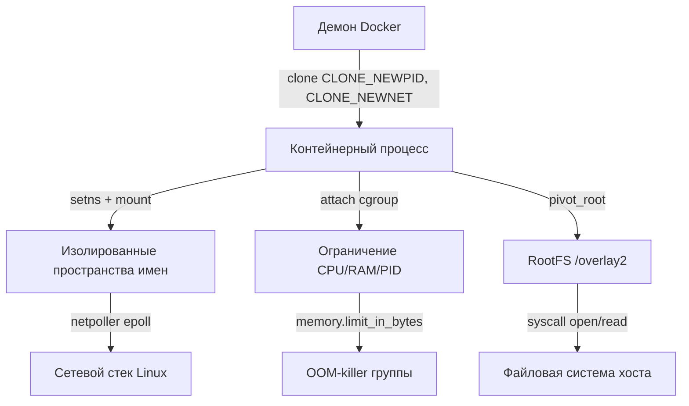

## Фундамент контейнеризации: Namespaces и cgroups

В современной бэкенд-разработке на Go мы редко работаем с «голым» сервером. Почти каждое приложение живет внутри контейнера, оркестрируемого Kubernetes. Но контейнер — это не виртуальная машина. Это всего лишь процесс с наложенными на него ограничениями.

В Linux изоляция достигается не за счет эмуляции железа, а через комбинацию двух ядреных механизмов: **Namespaces** (пространства имен) и **cgroups** (контрольные группы). Понимание их устройства критично для Go-разработчика, так как они напрямую влияют на работу `runtime`, сетевой стек, обработку сигналов и поведение приложения под нагрузкой.

## Namespaces: Виртуализация системных ресурсов

**Namespaces** — это механизм ядра Linux, который скрывает от процесса одни ресурсы системы и показывает ему изолированную копию других. С точки зрения программы, она работает в «своей» виртуальной машине, хотя физически делит ядро с сотнями других процессов.

Под капотом ядро хранит указатели на структуры `struct namespace` внутри `task_struct` (внутреннее представление процесса/потока в Linux). Когда процесс вызывает системный вызов, ядро проверяет тип namespace текущего `task_struct` и возвращает данные из изолированного хранилища, а не из глобального состояния.

### Типы пространств имен (Linux 5.x+)
| Namespace | Что изолирует | Внутренняя структура ядра |
|-----------|---------------|---------------------------|
| `UTS`     | Имя хоста, доменное имя | `struct uts_namespace` |
| `IPC`     | Системные V-семфоры, очереди сообщений, shared memory | `struct ipc_namespace` |
| `Network` | Сетевые интерфейсы, таблицы маршрутизации, iptables, порты | `struct net` |
| `Mount`   | Иерархию точек монтирования (`/proc`, `/sys`, файловые системы) | `struct fs_struct` |
| `PID`     | Таблицу процессов. PID 1 внутри контейнера ≠ PID 1 на хосте | `struct pid` |
| `User`    | Маппинг UID/GID. Процесс может быть `root` внутри, но обычным пользователем снаружи | `struct user_namespace` |
| `Cgroup`  | Иерархию контрольных групп | `struct cgroup` |

> [!info] Под капотом
> При создании процесса с флагом `CLONE_NEWPID` (через `clone()` или `unshare()`), ядро выделяет новую структуру `pid_namespace` и создает «корневой» PID (обычно 1) в этом пространстве. Все дочерние процессы получают PID, начиная с 1, относительно этой иерархии. На хосте тот же процесс будет иметь реальный PID, который можно увидеть в `/proc/<real_pid>/ns/pid`.

## cgroups: Контроль и ограничение ресурсов

Если Namespaces дают процессу **иллюзию** изоляции, то cgroups обеспечивают **фактическое** ограничение ресурсов. Без них контейнер мог бы занять всю оперативную память или CPU хоста, убив все соседние сервисы (OOM-killer просто не знал бы, кого убивать первым).

cgroups (Control Groups) — это механизм учета, ограничения и приоритизации ресурсов (CPU, RAM, IO, network) для группы процессов.

### Как это работает под капотом
В ядре Linux cgroups реализованы через подсистемы (`cgroup_subsys`). При запросе ресурсов (например, аллокации памяти или планировании CPU) ядро проходит по иерархии `cgroup` текущего процесса и проверяет лимиты:
- **CPU**: Планировщик (`sched_tick`) проверяет `cpu.cfs_quota_us`. Если лимит исчерпан, процесс переходит в состояние `throttled` (ожидание в очереди `throttle_list`), а не просто получает меньше времени.
- **Memory**: Аллокатор (`__alloc_pages`) проверяет `memory.max`. При превышении активируется `OOM-killer` внутри этой группы, а не на всем хосте.
- **PIDs**: `pids.max` ограничивает количество `task_struct`, которые ядро может выделить для этой группы.

> [!warning] Ловушка / Gotcha
> **cgroups v1 vs v2**: В v1 подсистемы были раздроблены (`cpu`, `memory`, `blkio`). В v2 они объединены в единую иерархию. Go-приложения, написанные до 2018 года, могут некорректно парсить `/sys/fs/cgroup/cpu,cpuacct/` вместо `/sys/fs/cgroup/cpu.max`. Всегда проверяйте версию cgroups в продакшене через `stat -fc %T /sys/fs/cgroup/`.

## Комбинация в Docker и Kubernetes

Контейнер — это не магия. Это формула:
`Контейнер = Процесс + Namespaces + cgroups + RootFS`

Процесс запускается через `clone()` с флагами создания новых пространств имен. Затем он прикрепляется к `cgroup` через `cgroupfs`. Наконец, его корневая файловая система меняется через `pivot_root` или `chroot`.



## Go Runtime и изоляция: Ловушки и оптимизации

Переход Go-приложения в изолированную среду ломает несколько допущений, на которых строится стандартная библиотека и `runtime`.

### 1. Автоопределение CPU лимитов
До Go 1.13 `runtime.GOMAXPROCS()` всегда возвращал количество ядер хоста, игнорируя cgroups. Если вы деплоили Go-сервис в K8s без ручного указания `GOMAXPROCS`, он мог использовать 100% CPU одного ядра, вызывая `throttling` и падение p99 latency.
Начиная с Go 1.13, при `GOMAXPROCS=0` (по умолчанию) runtime читает `/sys/fs/cgroup/cpu,cpuacct/cpu.cfs_quota_us` и `/cpu.cfs_period_us`. Если лимиты не заданы, возвращается `runtime.NumCPU()`.

### 2. Обработка сигналов в PID 1
В Linux сигналы доставляются процессу с указанным PID. Если контейнер создан с `CLONE_NEWPID`, ваш Go-процесс становится PID 1 внутри namespace. 
**Ловушка:** Если вы не установите обработчик для `SIGTERM` или `SIGINT`, сигнал не будет доставлен, и процесс не сможет выполнить `graceful shutdown`. Более того, `os.Signal` канал в Go буферизован, и при быстром получении множества сигналов они могут потеряться.

```go
// Идеоматичная обработка в изолированной среде
func setupSignalHandler() chan os.Signal {
    sig := make(chan os.Signal, 1)
    signal.Notify(sig, syscall.SIGTERM, syscall.SIGINT, syscall.SIGHUP)
    return sig
}
```

### 3. Сетевой стек и netpoller
`netpoller` Go работает поверх `epoll` (Linux) или `kqueue` (BSD). В изолированном `network namespace` у процесса свои таблицы маршрутизации (`ip route`), свои iptables и свои файловые дескрипторы сокетов. 
При превышении лимита памяти в cgroups, `netpoller` может начать получать ошибки `EMFILE` или `ENOSPC` при попытке создать новые файловые дескрипторы для сокетов, даже если физически RAM еще есть. Это связано с тем, что файловая система `/proc` и `/sys` также находится в `mount namespace`, и лимиты cgroups v2 применяются к `fs`-операциям.

> [!tip] Собеседование
> **Вопрос:** Почему `kill -9` внутри контейнера иногда не убивает процесс?
> **Ответ:** Если процесс не является PID 1 в своем `PID namespace`, сигналы не доставляются корректно через `ptrace` и таблицу процессов. Кроме того, `SIGKILL` не может быть перехвачен или проигнорирован, но если контейнер запущен с `--init` (tini/dumb-init), именно он получает сигнал и форсирует его в дочерние процессы. Без `--init` `SIGKILL` может зависнуть в очереди ядра, если процесс находится в uninterruptible sleep (`D` state).
>
> **Вопрос:** Как Go runtime реагирует на `memory.max` cgroup?
> **Ответ:** Runtime не читает cgroup в реальном времени. Он полагается на стандартные системные вызовы `brk()` и `mmap()`. Если процесс превысит лимит, ядро отправит `SIGKILL` (OOM-killer). Go не может «мягко» отреагировать на это без использования cgroup-aware библиотек (например, `libcontainer`), которые мониторят `/sys/fs/cgroup/memory/oom.event`.

## Итог

1. **Namespaces** дают процессу иллюзию собственной ОС, скрывая ресурсы через `task_struct` и ядреные структуры `struct namespace`.
2. **cgroups** обеспечивают жесткий контроль ресурсов (CPU, RAM, PIDs) через подсистемы ядра, вызывая `throttling` или `OOM-killer` при превышении лимитов.
3. **Go Runtime** зависит от изоляции: автоопределение CPU, обработка сигналов в PID 1 и поведение `netpoller` меняются в контейнерах.
4. **Производительность:** Изоляция добавляет минимальный overhead на проверку ядром, но неправильная настройка лимитов приводит к каскадным падениям latency и OOM.
5. **Инструментарий:** Всегда используйте `--init` в Docker/K8s, настраивайте `GOMAXPROCS` явно при необходимости, и мониторьте `cgroup` лимиты через `systemd-cgtop` или `kubectl top`.

Мы разобрали, как процессы живут в изоляции на уровне ядра. Это фундамент контейнеров, но не единственный способ изоляции. В следующей статье мы рассмотрим, как работают **[[55. Виртуальные машины и гипервизоры]]**, где изоляция достигается эмуляцией железа на уровне гипервизора, а не через ядреные namespace'ы.