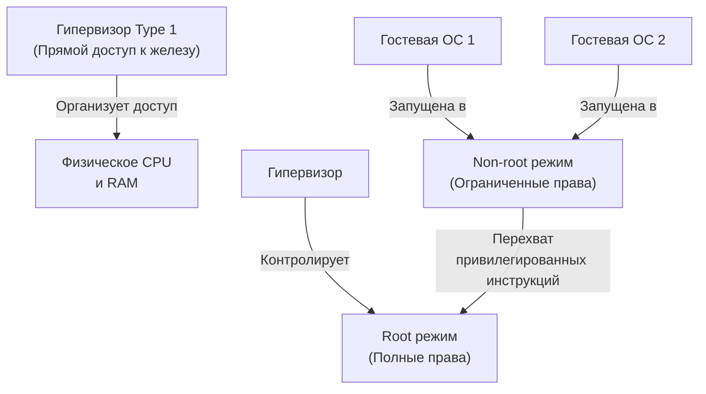

## Введение

В современной бэкенд-индустрии наши Go-приложения редко живут на «голом» железе. Они упакованы в виртуальные машины (ВМ) или контейнеры, которые разворачиваются в облаках или на bare-metal серверах. Понимание того, как ВМ работают на уровне процессора и памяти, критически важно для:
*   Понимания границ изоляции и безопасности.
*   Диагностики «магических» лагов и джиттера в высоконагруженных сервисах.
*   Осознанного выбора между ВМ и контейнерами (`[[53. Контейнеры под капотом. namespaces и cgroups.md]]`).
*   Правильной настройки ресурсов (CPU pinning, hugepages, NUMA) для Go-рантайма.

Гипервизор — это слой абстракции, который позволяет нескольким гостевым операционным системам безопасно и изолированно делить физические ресурсы. Но эта абстракция имеет цену. Давайте разберем, как именно гипервизор обманывает процессор и память, и что это значит для Go-разработчика.

## Типы гипервизоров и архитектура

Гипервизоры делятся на два фундаментальных типа по месту их расположения относительно железа:

1. **Type 1 (Bare-metal / Native)**: Работает напрямую на физическом процессоре, без промежуточной хостовой ОС. Примеры: KVM (на Linux), VMware ESXi, Xen, Proxmox VE. Это стандарт для production-инфраструктуры.
2. **Type 2 (Hosted)**: Работает как обычное приложение поверх существующей ОС (Windows, macOS, Linux). Примеры: VirtualBox, VMware Workstation. Подходит для разработки, но добавляет лишний слой контекстных переключений.



> [!info] Под капотом
> Исторически гипервизоры были программными: они эмулировали архитектуру процессора, перехватывая каждую инструкцию гостя. Это работало крайне медленно. Современный подход — **аппаратная виртуализация**, когда процессор сам предоставляет механизмы для безопасного переключения между гостем и гипервизором.

## Под капотом: Аппаратная виртуализация CPU

До появления расширений виртуализации (Intel VT-x, AMD-V) процессор имел только кольца привилегий `Ring 0` (ядро) и `Ring 3` (пользователь). Гостевая ОС пыталась выполнить привилегированные инструкции в `Ring 0`, что приводило к аппаратным ошибкам, которые гипервизор должен был перехватывать и эмулировать вручную. Это называлось **Trap-and-Emulate** и было очень дорого.

С VT-x/AMD-V архитектура процессора расширилась до **Ring 2** (Non-root) и сохранила **Ring 0** (Root):
*   **Root Mode (Ring 0)**: Гипервизор. Имеет полный контроль над физическим железом.
*   **Non-root Mode (Ring 2)**: Гостевая ОС. Думает, что работает в `Ring 0`, но на самом деле находится в ограниченном режиме.
*   **VMCS (Virtual Machine Control Structure)**: Специальный блок в памяти, который хранит состояние гостя и инструкции для гипервизора. При возникновении события (например, гость пытается выполнить `in`/`out` для портов I/O) процессор автоматически делает **VM-Exit** (переход в Root), выполняет эмуляцию гипервизором, а затем **VM-Entry** (возврат в Non-root).

> [!tip] Собеседование
> **Вопрос:** Как гипервизор обрабатывает системный вызов гостевой ОС?
> **Ответ:** Гостевая ОС выполняет `syscall` (например, через `SYSCALL` инструкцию в Linux). Процессор фиксирует переход в привилегированный режим, но так как гость находится в `Non-root`, вместо перехода в ядро хоста происходит `VM-Exit`. Гипервизор читает `VMCS`, определяет, что это вызов `write` или `read`, и либо выполняет его напрямую (если хост-ядро поддерживает `kvm`/`virtio`), либо эмулирует устройство гостя. Затем происходит `VM-Entry`.

## Виртуализация памяти и I/O

### Память: EPT и NPT
Гостевая ОС создает **Физическую память (GPA)**. Но физически на сервере есть только **Хостовая физическая память (HPA)**. Чтобы гость не писал в чужую память, используется вложенная адресация:
*   **Гостевая страница (GVA) -> Гостевой физический адрес (GPA)**: Таблица страниц гостя.
*   **GPA -> Хостовый физический адрес (HPA)**: **EPT** (Intel) или **NPT** (AMD). Это аппаратная структура, которую заполняет гипервизор. Процессор автоматически переводит адреса на уровне MMU, без участия ОС.

> [!warning] Ловушка / Gotcha
> **TLB Shootdowns**: При изменении маппинга EPT/NPT на одном ядре, другие ядра процессора должны очистить свои кэши TLB (Translation Lookaside Buffer), иначе они будут использовать старые, невалидные маппинги. Это синхронизационная операция, которая генерирует межпроцессорные прерывания (IPI) и может стать узким местом при динамическом масштабировании ВМ.

### I/O: Virtio и Paravirtualization
Эмуляция реальных устройств (например, эмуляция `Intel e1000` сетевой карты) съедает много CPU. Решение — **Paravirtualization**: гипервизор предоставляет гостю упрощенные виртуальные устройства (чаще всего стек `virtio`). Гостевой драйвер знает, что работает в виртуальной среде, и обменивается данными через `virtqueues` напрямую в разделяемой памяти, минуя эмуляцию.

## Mechanical Sympathy: Стоимость виртуализации

Для бэкенд-разработчика важно понимать, где «горят» циклы процессора в ВМ:

1.  **VM-Exit / VM-Entry**: Переключение контекста между Non-root и Root режимами. Требует сохранения/восстановления регистров, очистки TLB, обновления VMCS. Стоит в сотни тактов CPU.
2.  **Context Switch**: Гипервизор работает как планировщик ОС. Если вы выделите 4 ядра ВМ, а на хосте загрузится 8 процессов, ваш Go-рантайм будет страдать от переключений контекста уровня хоста.
3.  **Cache Locality**: Процессоры кэшируют данные в L1/L2/L3. При миграции ВМ (Live Migration) или перепланировании потоков гипервизором, кэш-линии инвалидируются, что вызывает **cache misses** и падение производительности на 10-30%.
4.  **I/O Overhead**: Сетевые пакеты проходят путь: `Гость -> Virtio Queue -> Hypervisor -> Host Network Stack -> Physical NIC`. Каждый шаг — копирование данных и контекстный переход.

> [!info] Под капотом
> Go не знает, работает ли он в ВМ. `runtime` и планировщик горутин (`G-M-P`) работают идентично. Но **GOMAXPROCS** должен отражать количество *физических* ядер, доступных хосту, а не виртуальных. Если вы зададите `GOMAXPROCS=32` на ВМ с 32 виртуальными ядрами, а физически сервер имеет 24 ядра с Hyper-Threading, вы получите contention на уровне хостового планировщика и джиттер GC.

## Влияние на Go-приложения и бэкенд-архитектуру

1.  **Deploy Strategy**: ВМ дают полную ОС-изоляцию (свой kernel, драйверы, ulimits), что полезно для легаси-стеков или строгих compliance-требований. Контейнеры (`[[53. Контейнеры под капотом. namespaces и cgroups.md]]`) делят ядро хоста, что дает почти нативную производительность, но снижает границы безопасности.
2.  **Tuning для Go**:
    *   **CPU Pinning**: Закрепление виртуальных ядер ВМ за физическими ядрами (via `numactl` или гипервизором) исключает миграцию потоков и сохраняет L3 кэш.
    *   **Hugepages**: Включение `transparent_hugepages` или `hugetlbfs` снижает нагрузку на TLB и ускоряет маппинг памяти для Go-кучи.
    *   **Network**: Использование `virtio-net` с offloading (TSO, GSO, LRO) вычисляет checksumming и сегментацию на уровне драйвера/гипервизора, разгружая CPU.
3.  **Observability**: При использовании `pprof` или `perf` в ВМ вы увидите накладные расходы гипервизора. Важно фильтровать `kvm` / `qemu` / `containerd` фреймы, чтобы не интерпретировать их как узкие места вашего сервиса.

```go
// Пример: принудительное управление CPU affinity для критичного worker
// В production обычно делается на уровне systemd или k8s (cpuset),
// но для отладки или специфичных случаев в Go это реализуемо.
package main

import (
	"log"
	"runtime"
)

func main() {
	// Устанавливаем количество рабочих потоков Go
	runtime.GOMAXPROCS(4)
	
	// Привязка текущего потока к конкретному физическому ядру
	// (требует root или cap_sys_nice на хосте)
	cpuSet := runtime.NewCPUPin()
	if err := cpuSet.Set(0); err != nil {
		log.Printf("CPU pinning failed: %v", err)
	}
	// ... логика сервиса
}
```

## Ловушки и вопросы на собеседованиях

> [!warning] Ловушка / Gotcha
> **Live Migration и GC**: При миграции ВМ (vMotion / libvirt live-migrate) гипервизор временно приостанавливает гостя, синхронизирует память и перезапускает на другом хосте. Если в этот момент в Go работает тяжелый STW (Stop-The-World) этап GC, пауза удваивается. В высоконагруженных системах это может вызвать таймауты балансировщиков.

**Типичные вопросы:**
1.  В чем принципиальная разница между Type 1 и Type 2 гипервизорами с точки зрения производительности I/O?
2.  Как работает EPT и почему он быстрее shadow page tables? (Ответ: аппаратный MMU делает перевод, нет soft-context switch для каждого промаха TLB).
3.  Почему контейнеры легче виртуальных машин? (Ответ: отсутствие эмуляции CPU, разделение ядра, namespaces вместо full virtualization).
4.  Как гипервизор обрабатывает `syscall` гостя? (VM-Exit -> гипервизор -> либо прямой вызов хост-ядра, либо эмуляция устройства).
5.  Что такое TLB shootdown и как он влияет на распределенные системы? (Задержка синхронизации кэшей при изменении маппингов памяти).

## Итог

Виртуализация — это компромисс между гибкостью/изоляцией и производительностью. Гипервизоры Type 1 используют аппаратные расширения процессора (VT-x/AMD-V) для безопасного переключения контекста между Root и Non-root режимами, а механизмы EPT/NPT решают проблему маппинга памяти без софтверной эмуляции.

Для Go-разработчика это означает:
1.  `GOMAXPROCS` и планирование горутин работают поверх хостового планировщика.
2.  Производительность сети и диска сильно зависит от типа драйверов (`virtio` vs эмуляция).
3.  Настройка CPU affinity и hugepages на уровне инфраструктуры напрямую влияет на джиттер GC и latency вашего сервиса.

Мы разобрали, как гипервизоры управляют ресурсами. Следующий шаг — понять, как ОС защищает процессы друг от друга на уровне прав и пользователей, что критично для безопасной деплоймент-инфраструктуры: [[56. Безопасность ОС. Права доступа, users, groups.md]].