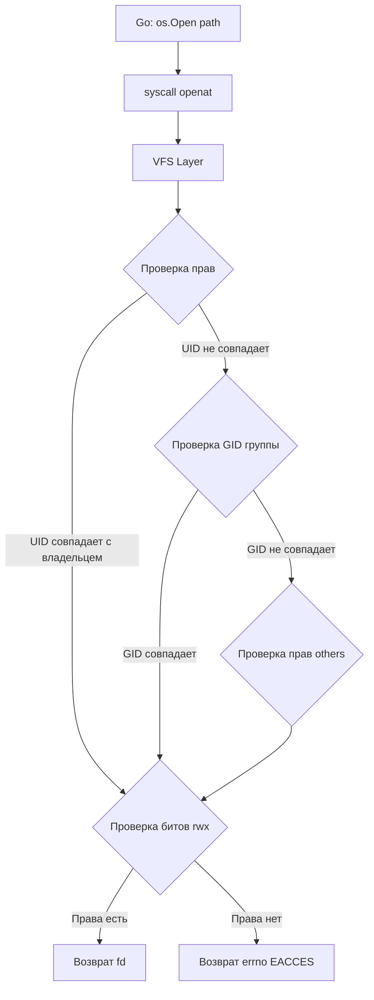

## Фундамент безопасности Linux: пользователи, группы и права доступа

Для бэкенд-разработчика, переходящего из экосистем с централизованными менеджерами безопасности (Java Security Manager, .NET Code Access Security), Linux кажется «диким западом»: здесь нет встроенных в язык механизмов контроля доступа. Go делегирует всю безопасность операционной системе. Понимание того, как ядро Linux управляет пользователями, группами и правами, критически важно для проектирования отказоустойчивых сервисов, настройки контейнеров и предотвращения катастрофических уязвимостей.

## Пользователи и группы: UIDs, GIDs и иерархия доверия

В Linux безопасность строится на числовых идентификаторах, а не на строковых именах. Когда вы видите `root` или `www-data` в терминале, это лишь удобные алиасы, которые система разрешает в **UID** (User ID) и **GID** (Group ID) через `/etc/passwd` и `/etc/group`.

Каждый процесс в Linux рождается с тремя наборами идентификаторов:
1. **Real UID/GID** — кто запустил процесс. Используется для аудита и ограничения ресурсов.
2. **Effective UID/GID** — какие права процесс использует *прямо сейчас*. Именно этот UID проверяет ядро при доступе к файлам, сетевым портам и межпроцессному взаимодействию.
3. **Saved UID/GID** — сохраненный идентификатор. Позволяет процессу временно повысить привилегии, выполнить операцию и вернуть себе исходные права (ключевой механизм для `setuid`/`setgid` бинарников).

> [!tip] Собеседование
> **Вопрос:** В чем разница между `os.Getuid()` и `os.Geteuid()` в Go?
> **Ответ:** `os.Getuid()` возвращает Real UID (кто запустил процесс), а `os.Geteuid()` — Effective UID (какие права процесс использует для проверки доступа). Если процесс использует `setuid`, эти значения будут различаться. Go использует `Geteuid()` для всех проверок прав доступа к файлам и ресурсам.

## Права доступа к файлам: rwx и специальные биты

Каждый файл и каталог в Linux имеют три набора прав: для владельца, для группы и для остальных. Каждый набор состоит из трех флагов: `r` (чтение), `w` (запись), `x` (выполнение/доступ к содержимому).

Права записываются в восьмеричном формате (например, `755` или `644`), где каждая цифра — сумма флагов (`r=4`, `w=2`, `x=1`).

Помимо базовых прав, существуют три специальных бита, которые кардинально меняют поведение:
*   **SUID (4)**: При запуске бинарного файла процесс наследует UID владельца файла, а не UID запустившего его пользователя. Классический пример: `/usr/bin/passwd` (владелец `root`).
*   **SGID (2)**: Для файлов — процесс наследует GID владельца. Для каталогов — все новые файлы в этом каталоге наследуют GID каталога, а не GID пользователя.
*   **Sticky Bit (1)**: Работает только на каталоги. Разрешает удалять/переименовывать файлы только владельцу файла или владельцу каталога. Пример: `/tmp` (права `1777`).

> [!warning] Ловушка / Gotcha
> **SUID/SGID в Go-приложениях.** Если вы скомпилируете Go-бинарник с правами `4755` (SUID) и запустите его от имени обычного пользователя, процесс получит UID `0` (root). В Go это означает, что `os.Open("/etc/shadow")` сработает без ошибок, а `net.Listen(":80")` не выбросит `permission denied`. Это частая причина катастрофических уязвимостей, когда разработчики «для удобства» запускают сервисы от root или забывают сбрасывать SUID-биты после сборки.

## Под капотом: как ядро проверяет права

Когда вы вызываете `os.Open()` в Go, под капотом происходит системный вызов `sys_access` или `sys_openat`. Ядро Linux не проверяет права «на лету» как логическое условие. Все права хранятся в метаданных **inode** (индексируемого узла) файловой системы.

Проверка происходит в VFS (Virtual File System) layer:
1. Ядро извлекает UID процесса (Effective) и GID процесса.
2. Считывает UID/GID владельца и права доступа из `inode` запрашиваемого файла.
3. Выполняет битовую логическую проверку: `(uid == inode.owner) && (mode & rwx_owner)` или аналогично для группы/остальных.
4. Если проверка проходит, возвращается дескриптор файла. Если нет — `sys_access` возвращает `-1` и устанавливает `errno = EACCES`.



**Mechanical Sympathy:** Доступ к `inode` обычно находится в кэше ядра (`dentry` cache / `inode` cache). Если файл часто используется, проверка прав происходит полностью в RAM ядра за несколько тактов CPU. Если файл только что создан или удален, ядро должно обратиться к дисковому кэшу или подсистеме файловой системы, что добавляет задержку. В высоконагруженных сервисах частые `stat`/`access` вызовы на холодные файлы могут создавать микро-лагги из-за промахов по кэшу VFS.

## Работа с правами в Go: идиомы и типичные ошибки

Go не предоставляет абстракций поверх прав доступа. Вы работаете напрямую с `os.FileMode` и системными вызовами. Идиоматичный подход требует явной обработки ошибок и использования констант пакета `os`.

```go
package main

import (
	"fmt"
	"os"
	"path/filepath"
)

func setupServiceDir(dir string) error {
	// 1. Создаем каталог с правами 0750 (rwxr-x---)
	// 0750 в октальном представлении. Важно использовать 0xx для октальных чисел в Go.
	if err := os.MkdirAll(dir, 0750); err != nil {
		return fmt.Errorf("mkdirall: %w", err)
	}

	// 2. Устанавливаем владельца и группу
	// В production обычно берут UID/GID из конфигурации или env
	const targetUID = 1000
	const targetGID = 1000

	if err := os.Chown(dir, targetUID, targetGID); err != nil {
		// Chown требует CAP_CHOWN. Если запускаем от non-root, упадет с EPERM
		return fmt.Errorf("chown: %w", err)
	}

	// 3. Проверяем текущие права перед изменением (опционально, для audit log)
	info, err := os.Stat(dir)
	if err != nil {
		return fmt.Errorf("stat: %w", err)
	}

	// 4. Устанавливаем права явно (chmod)
	if err := os.Chmod(dir, 0750); err != nil {
		return fmt.Errorf("chmod: %w", err)
	}

	// 5. Верификация на уровне Go (не заменяет проверку ядра, но полезна для логики)
	if info.Mode().Perm() != 0750 {
		return fmt.Errorf("permissions mismatch: got %o", info.Mode().Perm())
	}

	return nil
}

func main() {
	if err := setupServiceDir("/var/run/myapp"); err != nil {
		fmt.Fprintf(os.Stderr, "fatal: %v\n", err)
		os.Exit(1)
	}
}
```

**Критические нюансы Go:**
*   `os.Chmod` и `os.Chown` на Windows работают иначе (ACL-модель). В Go принято оборачивать их в `runtime.GOOS == "linux"` или использовать кроссплатформенные обертки.
*   `os.FileMode` в Go использует тип `os.FileMode`, который является битовой маской. Константы: `os.ModePerm` (0777), `os.ModeSetuid` (04000), `os.ModeSticky` (01000).
*   Никогда не используйте `os.Chmod(path, 0777)` в production. Это отключает защиту от случайной записи и эксплойтов.

## Безопасность сервиса и принцип наименьших привилегий

В Go нет механизма «безопасного контейнера» внутри языка. Если ваш Go-сервис запускается от `root`, он имеет доступ ко всей файловой системе, сетевому стеку и процессам. Это нарушает **Принцип наименьших привилегий (PoLP)**.

Как правильно запускать Go-сервисы:
1. **Drop privileges:** Запуск от `root` только для привилегированных операций (биндинг на `<1024` порт, чтение `/etc/shadow`), затем немедленный вызов `os.Setuid()` и `os.Setgid()` с переходом на non-root пользователя.
2. **Containerization:** В Docker/K8s процесс внутри контейнера видит себя как `root` (UID 0), но cgroups и namespaces ограничивают его ресурсы и изолируют от хоста. Однако `CAP_SYS_ADMIN` или проброс устройств (/dev) могут обойти эту изоляцию.
3. **Capabilities:** Вместо `setuid` бинарников используйте Linux capabilities (`cap_net_bind_service`), чтобы разрешить биндинг на низкие порты без полного `root`.

> [!info] Под капотом
> Когда Go вызывает `os.Setuid(1000)`, он делает системный вызов `sys_setresuid`. Ядро проверяет, что процесс имеет `CAP_SETUID`, и меняет effective/saved UIDs. После этого все последующие `open`, `stat`, `write` будут проверяться против UID 1000. Если сервис попытается записать в `/root/`, ядро мгновенно вернет `EACCES`.

> [!tip] Собеседование
> **Вопрос:** Почему запуск веб-сервиса от root — это плохо, даже если он работает внутри контейнера?
> **Ответ:** 
> 1. **Container Escape:** Уязвимости в ядре (например, Dirty COW или CVE-2022-0492) позволяют процессу с UID 0 выйти за пределы namespaces.
> 2. **Resource Limits:** Без разделения прав сложно точно настроить cgroups и seccomp-фильтры.
> 3. **Attack Surface:** Если злоумышленник получит RCE (Remote Code Execution) через Go-приложение, он сразу получит контроль над хостом, файлы других контейнеров и сетевой стек.
> 4. **Compliance:** Стандарты безопасности (PCI DSS, ISO 27001) прямо запрещают работу сервисов от root.

## Итоги

1. **UID/GID** — основа безопасности Linux. Реальные, эффективные и сохраненные идентификаторы определяют, какие права процесс использует.
2. **Права доступа** хранятся в `inode` и проверяются VFS layer при каждом системном вызове доступа к файлу.
3. **SUID/SGID/Sticky** — специальные биты, меняющие поведение наследования прав. Их неконтролируемое использование ведет к эскалации привилегий.
4. **Go делегирует безопасность ОС.** Пакет `os` предоставляет прямые обертки над `chmod`, `chown`, `stat`. Идиоматичный код требует явной обработки ошибок и использования октальных констант (`0750`).
5. **Least Privilege** — обязательный стандарт. Запускайте сервисы от non-root пользователя, используйте capabilities вместо setuid, и никогда не игнорируйте `permission denied`.

Мы разобрали базовую модель безопасности Linux: пользователей, группы и файловые права. Но файловая модель ограничена и не подходит для тонкого контроля доступа к ресурсам, сетевым портам или системным вызовам. В следующей статье мы рассмотрим, как Linux расширяет эту модель без изменения файловых прав. Переходим к [[57. ACL, capabilities и привилегии процессов]].