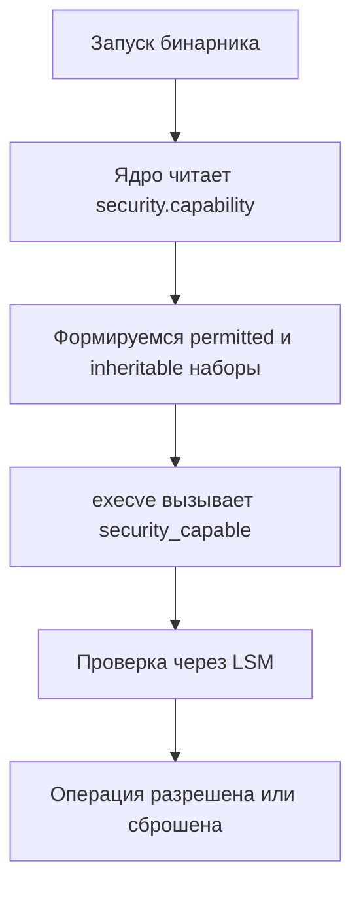

## Введение: Почему классических `rwx` недостаточно

В разделе [[56. Безопасность ОС. Права доступа, users, groups.md]] мы разобрали базовую модель Unix-прав: `owner`, `group`, `others` и биты `rwx`. Эта модель работает отлично для простых файлов, но в современных высоконагруженных и безопасных системах она оказывается слишком грубой.

Классическая модель имеет два критических недостатка:
1. **Отсутствие гранулярности.** Нельзя разрешить пользователю `read` и `execute`, но запретить `write` для конкретного каталога, не создавая отдельную группу.
2. **Бинарность `root`.** В Unix есть только два состояния: привилегированный (`UID=0`) и непривилегированный. Если процессу нужно открыть порт ниже 1024 или изменить системное время, ему часто дают полный `root`. Это нарушает принцип наименьших привилегий и создает огромную поверхность атаки.

Для решения этих проблем Linux внедрил две независимые, но дополняющие друг друга технологии: **POSIX ACL** и **Linux Capabilities**.

## POSIX ACL: Гранулярный контроль доступа

**Access Control List (ACL)** — это расширенная структура прав, которая позволяет задавать `rwx` не только для владельца и группы, но и для произвольных пользователей или групп, а также задавать маски и обязательные права.

### Как это работает
Вместо трех бит `rwx`, файловая система хранит список записей. Каждая запись имеет тип (`USER`, `GROUP`, `MASK`, `OTHER`) и идентификатор.

```bash
# Пример вывода getfacl
user:ivan:rwx
group:devs:r-x
mask::rwx
other::r--
```

### Под капотом
POSIX ACL не хранится в стандартных inode-битах. Linux использует **Extended Attributes (xattr)** — механизм хранения метаданных, привязанных к файлу.
*   ACL сохраняется в расширенном атрибуте с именем `system.posix_acl_access`.
*   При каждом обращении к файлу VFS (Virtual File System) вызывает `posix_acl_permission()`, который парсит этот xattr и накладывает его поверх базовых `rwx`.
*   **Влияние на производительность:** Парсинг ACL происходит в ядре при каждом системном вызове `openat`, `access` или `chmod`. Если атрибут большой, это вызывает дополнительные кэши-промахи в inode-кэше ядра. В высоконагруженных сервисах (например, веб-серверы, обрабатывающие миллионы запросов в секунду) избыточное использование ACL может стать узким местом. В Go это ощущается через `syscall.Stat` или `os.Stat`, которые возвращают `Errno` или `fs.FileInfo` с задержкой из-за кэширования VFS.

## Linux Capabilities: Дробление абсолютной власти

**Capabilities** — это механизм разделения полномочий `root` на мелкие, независимые блоки. Вместо того чтобы давать процессу полный `UID=0`, мы даем ему ровно те права, которые ему нужны.

### Основные возможности
*   `CAP_NET_BIND_SERVICE` — привязка к портам < 1024.
*   `CAP_DAC_OVERRIDE` — обход проверки прав доступа к файлам (аналог `chmod` для root).
*   `CAP_SYS_TIME` — изменение системных часов.
*   `CAP_NET_ADMIN` — настройка сетевых интерфейсов, iptables.

### Иерархия и хранение
Каждый процесс в Linux имеет три набора capabilities:
1.  **Permitted** — максимальный набор, который процесс может иметь.
2.  **Inheritable** — набор, который передается дочерним процессам через `execve`.
3.  **Effective** — текущий активный набор. Если бит установлен, процесс действует как root для этой операции.

Capabilities хранятся в расширенном атрибуте `security.capability`. Они привязаны к исполняемому файлу, а не к пользователю. Когда вы запускаете бинарник, ядро читает этот атрибут и формирует начальные наборы прав.



## Под капотом: VFS, extended attributes и проверка прав

Когда Go-приложение делает `os.Chmod()` или `os.Open()`, происходит следующий конвейер:

1. **User Space:** Go вызывает `syscall.Openat()` или `syscall.Chmod()`.
2. **Kernel Space:** Ядро находит `inode` в dentry-кэше.
3. **VFS Layer:** В зависимости от операции, VFS вызывает хуки безопасности.
   *   Для файлов: `posix_acl_permission()` проверяет ACL.
   *   Для системных операций: `security_capable()` проверяет capabilities текущего процесса.
4. **LSM (Linux Security Modules):** Если в системе включены `[[58. SELinux и AppArmor.md]]`, ядро передает контекст в LSM-модуль. LSM накладывает свои политики поверх нативных проверок.
5. **Результат:** Возврат `0` (success) или `-EPERM`/`-EACCES`.

> [!info] Под капотом
> Проверка capabilities происходит через атомарные операции в пространстве ядра. Ядро не делает полных переключений контекста на каждый bit-check. Однако, если процесс меняет свои права через `capset()` или `prctl(PR_CAP_AMBIENT)`, это требует перехода в Ring 0 и блокировки `cred_guard_mutex` в ядре, что может вызвать конкуренцию в высокопараллельных Go-приложениях, использующих `os.Setuid`/`os.Setgid`.

## Управление привилегиями в Go

В Go нет встроенного высокоуровневого API для работы с capabilities, поэтому мы работаем напрямую с `syscall` или используем проверенные сторонние обертки.

### Демонстрация: безопасное падение привилегий
Типичный сценарий в бэкенде: процесс стартует от `root` (чтобы забиндиться на порт 443 или прочитать защищенный конфиг), а затем мгновенно падает в непривилегированного пользователя.

```go
package main

import (
	"fmt"
	"log"
	"os"
	"syscall"
)

func dropPrivileges(uid, gid int) error {
	// 1. Сначала сбрасываем supplementary groups (дополнительные группы)
	// Это критично: если не сбросить, процесс сохранит доступ к группам root
	if err := syscall.Setgroups([]int{}); err != nil {
		return fmt.Errorf("setgroups: %w", err)
	}

	// 2. Меняем GID и UID
	// Порядок важен: сначала GID, потом UID
	if err := syscall.Setgid(gid); err != nil {
		return fmt.Errorf("setgid: %w", err)
	}
	if err := syscall.Setuid(uid); err != nil {
		return fmt.Errorf("setuid: %w", err)
	}

	// 3. Очищаем effective capabilities (для безопасности)
	// Go не имеет прямого syscall обертки, поэтому используем syscall.CAP_CLEAR
	// В production чаще используют capsh или nsenter, но для понимания сути:
	return nil
}

func main() {
	// Симуляция старта от root
	if os.Geteuid() != 0 {
		log.Fatal("Этот пример должен запускаться от root")
	}

	fmt.Println("UID:", os.Getuid(), "GID:", os.Getgid())

	// Падение привилегий
	if err := dropPrivileges(1000, 1000); err != nil {
		log.Fatalf("Не удалось сбросить права: %v", err)
	}

	fmt.Println("После дропа UID:", os.Getuid(), "GID:", os.Getgid())
	// os.Open теперь не сможет прочитать файлы, доступные только root
	// Это и есть принцип наименьших привилегий
}
```

> [!warning] Ловушка / Gotcha
> **Потеря capabilities при `execve`**
> Если вы используете `os/exec` для запуска дочерних процессов, по умолчанию capabilities **НЕ наследуются**, если не установлен флаг `NoSetuid`/`NoSetgid` или не настроен `Inheritable` набор. В контейнерной среде (Docker/K8s) runtime сам управляет `bounding set` и `effective set`. Попытка поднять права внутри контейнера (`capadd`) без соответствующих прав на хосте приведет к `EPERM`.
>
> **Опасность `CAP_SYS_ADMIN`**
> В Docker/K8s этот capability часто дают "на всякий случай". Но он эквивалентен полному `root` и позволяет монтировать ФС, менять системное время, использовать `ptrace` и обходить многие изоляции. В современных кластерах его следует отключать (`drop: [SYS_ADMIN]`) и заменять на точечные `CAP_NET_ADMIN`, `CAP_SYS_PTRACE` и т.д.

> [!tip] Собеседование
> **Вопрос:** В чем разница между `setuid` и capabilities? Почему в современных ОС предпочитают capabilities?
> **Ответ:** `setuid` дает процессу полный `UID=0` (абсолютную власть), включая доступ к `/proc`, изменение любых файлов и отключение безопасности. Capabilities дробят эту власть на независимые биты. Процесс с `CAP_NET_BIND_SERVICE` не сможет прочитать `/etc/shadow` или изменить системное время. Это снижает поверхность атаки: если в коде произойдет RCE, злоумышленник получит только те права, которые были нужны приложению, а не полный контроль над хостом.
>
> **Вопрос:** Как проверить, какие capabilities есть у текущего процесса в Go?
> **Ответ:** Стандартная библиотека не предоставляет прямого API. Используют `syscall.Getpid()` для получения PID, затем парсят `/proc/<pid>/status` (поле `CapEff`) или используют `github.com/capabilities/cap` / `github.com/syndtr/gocapability`. В production чаще используют `capsh --print` или `getpcaps`.

## Итог

1. **POSIX ACL** расширяет классические `rwx` до списка пользователей/групп, хранится в `xattr` и добавляет нагрузку на VFS при частых обращениях.
2. **Linux Capabilities** дробят власть `root` на независимые биты (`CAP_NET_BIND_SERVICE`, `CAP_DAC_OVERRIDE` и др.), хранятся в атрибуте `security.capability` и проверяются через LSM-хуки.
3. **В Go** управление привилегиями требует работы с `syscall.Setuid`, `syscall.Setgid`, `syscall.Setgroups` и понимания порядка сброса прав.
4. **Безопасность:** Всегда сбрасывайте `supplementary groups` перед `setuid`, отключайте `CAP_SYS_ADMIN` в контейнерах и используйте capabilities вместо `setuid` там, где это возможно.
5. **Производительность:** Частые проверки ACL и capabilities происходят в ядре и влияют на кэш inode/dentry. Избегайте избыточных ACL в высоконагруженных сервисах.

Мы разобрали гибкие механизмы контроля доступа. Но что делать, когда базовых capabilities и ACL недостаточно, и нужна политика на уровне ядра, изоляция процессов и принудительное разделение прав? Об этом в следующей статье.

[[58. SELinux и AppArmor.md]]