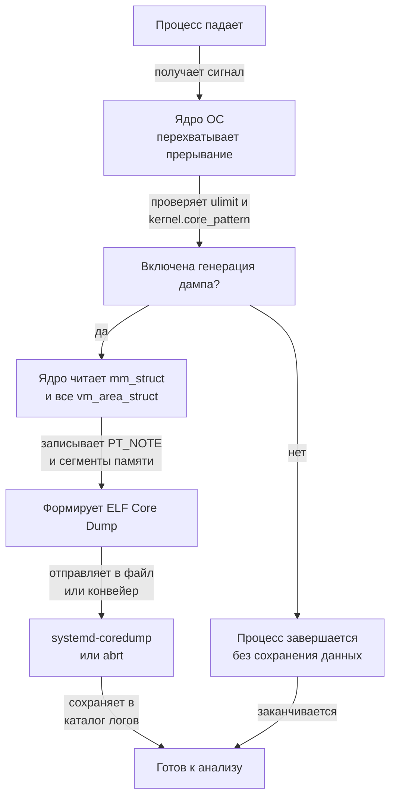

## Что такое Core Dump и зачем он Go-разработчику

Core dump (дамп памяти процесса) — это снимок виртуального адресного пространства процесса в момент его аварийного завершения. Для бэкенд-разработчика это единственный способ увидеть «мёртвое тело» программы: состояние всех тредов ОС, кучу, кэш-линии, открытые файлы и даже регистры CPU. 

В отличие от panic-стека Go, который показывает только текущую горутину и её состояние, core dump фиксирует процесс целиком, включая другие горутины, которые могли вызвать race condition, memory corruption или утечку дескрипторов. В продакшене без настроенного сбора дампов вы теряете 80% информации для root-cause анализа.

## Как ОС создаёт Core Dump (Под капотом)

Когда процесс падает из-за `SIGSEGV`, `SIGBUS` или `SIGABRT`, ядро перехватывает сигнал. Если для процесса включена генерация дампа (проверяется через `ulimit -c`), ядро инициирует асинхронную запись.

Ключевой механизм: `sysctl kernel.core_pattern`. Определяет, куда записывать дамп. Может быть локальным файлом (`/var/crash/core.%e.%p`) или конвейером (`|/usr/lib/systemd/systemd-coredump %p %u %s %t %c %h %E`), что используется в systemd.

Запись происходит через `do_coredump()` в ядре Linux. Ядро:
1. Проходит по `mm_struct` процесса (структура описания адресного пространства).
2. Считывает все `vm_area_struct` (VMA) — отображённые регионы памяти (стек, куча, mmap-файлы, библиотеки).
3. Записывает их в файл в формате `ELF Core Dump` (классические `NT_PRSTATUS`, `NT_PRPSINFO`, `NT_FILE` notes).

Важно: запись происходит в контексте ядра, но асинхронно. Если диск медленный или переполнен, дамп может не записаться или занять сотни секунд, блокируя процесс или вызывая `OOM` если память не освобождается.



> [!warning] Ловушка / Gotcha
> Если `kernel.core_pattern` настроен на конвейер, а процесс-обработчик упал или не запустился, дамп будет потерян навсегда. В продакшене всегда проверяйте логи `systemd-coredump` или `abrt`. Пустой core dump часто означает, что `ulimit -c` равен `0`.

## Что внутри Core Dump файла?

Файл дампа имеет формат ELF с специальными секциями `PT_NOTE`. Основные данные:
- `NT_PRSTATUS`: состояние регистров CPU (RIP, RSP, RAX, RSP, etc.)
- `NT_PRPSINFO`: имя процесса, UID/GID, состояние
- `NT_SIGINFO`: причина падения (сигнал, адрес ошибки)
- `NT_FILE`: маппинг страниц памяти на файлы (для mmap/анонимной памяти)
- Состояние всех тредов ОС (в Go это `P`/`M` и их стеки)

Для Go-разработчика критично: дамп содержит полные стеки всех горутин, но **не содержит** информации о состоянии `G`-структуры в понятном виде. Это нужно восстанавливать через отладчик, парся память процесса.

## Go Runtime vs Core Dump

Go runtime перехватывает `panic` и `fatal error`, выводя стек в stderr и завершая процесс с кодом 2. Это **не** core dump.

Однако если падает C-extension, происходит `SIGSEGV` (например, из-за unsafe pointer или CGo), Go runtime не может вывести читаемый стек. Тогда в дело вступает ядро ОС.

> [!info] Под капотом
> В Go 1.11+ runtime сохраняет состояние горутин в куче. При `SIGSEGV` планировщик пытается выполнить `sigpanic`, который раскручивает стек через `runtime.gopanic`. Но если повреждена куча, стековая область или таблица goroutines, runtime может упасть сам. Core dump в этом случае — единственный источник истины.

## Анализ падений: Практика и инструменты

1. `gdb core` + плагин Go: `gdb -c core` -> `source /usr/lib/golang/go/src/runtime/runtime-gdb.py` -> `goroutine 1 bt` (покажет все горутины, их статус, стеки, waitreason).
2. `dlv core core` — современный отладчик Delve, нативно понимает Go. Показывает `goroutines`, `stacks`, `heap`.
3. `crash` (kernel debugger) — для анализа ядра, но полезен, если дамп ядра или `vmcore`.
4. `pstack <pid>` / `bt` — быстрые бэктрейсы.

Пример использования GDB с Go:
```bash
gdb -c core.12345.app
(gdb) source /usr/lib/golang/go/src/runtime/runtime-gdb.py
(gdb) goroutine 1 bt
```

> [!tip] Собеседование
> **Вопрос:** Как найти утечку памяти или race condition по core dump?
> **Ответ:** Core dump не покажет race напрямую. Но можно:
> 1. Загрузить дамп в GDB/Delve.
> 2. Пройтись по `heap` (в Delve: `heap`) или использовать `gdb` с плагинами для анализа `runtime.mheap`.
> 3. Вручную проверить `mcentral`/`mspan` структуры.
> 4. Для race лучше использовать `go run -race` или `valgrind`, так как race требует детального отслеживания доступа к памяти в реальном времени. Core dump фиксирует состояние в один момент, а race — это временная аномалия.

## Ловушки и особенности в продакшене

- **Пустые дамп-ы:** `ulimit -c 0` или `sysctl vm.core_uses_pid=0` или `kernel.core_pattern` не настроен.
- **Огромные дамп-ы:** Включают всю память процесса. Если у сервиса 10 ГБ RAM, дамп будет ~10 ГБ. Используйте `kernel.core_uses_pid`, сжатие (`|/usr/bin/bzip2 > /var/crash/core.%e.%p.bz2`) или `systemd-coredump` с лимитами.
- **Async write и блокировки:** Если процесс находится в системном вызове (например, `write` на медленном NFS), дамп может не записаться. Ядро пытается отключить процесс от диска, но это не всегда срабатывает.
- **Core dump vs coredumpctl:** В systemd-системах дамп-ы хранятся в `/var/lib/systemd/coredump/`. Используйте `coredumpctl list` и `coredumpctl dump <pid>` для безопасного извлечения.

## Итог

Core dump — это снимок состояния процесса на уровне ОС. Для Go-разработчика он незаменим при падении C-кода, повреждении кучи или сложных race condition. Анализ требует понимания ELF-формата, работы отладчиков и специфики Go runtime. Всегда настраивайте сбор дампов в продакшене, но контролируйте их размер и асинхронную запись.

В следующей статье мы разберем [[60. perf, top, vmstat, iostat и другие инструменты Linux]], чтобы научиться мониторить производительность и находить узкие места без падения процесса.