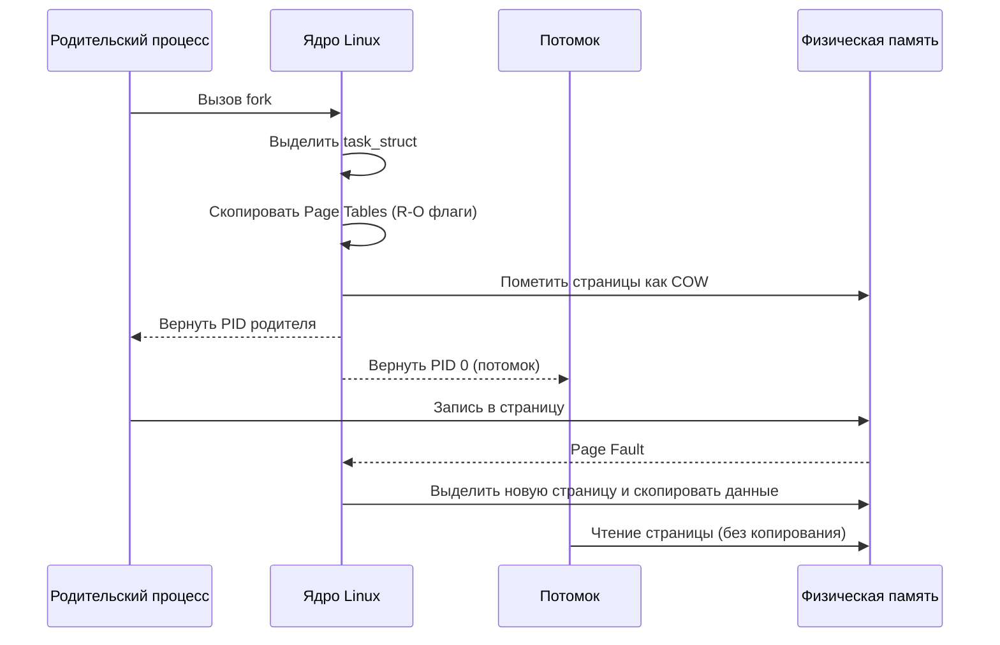

## Как Linux создает процессы. fork, exec, wait

В бэкенд-разработке на Go мы редко пишем код, который работает в вакууме. Каждый раз, когда мы запускаем CLI-утилиту, спавним воркера, выполняем миграцию или общаемся с внешним сервисом через `os/exec`, мы сталкиваемся с операционной системой на уровне управления процессами. Понимание того, как Linux создает, заменяет и завершает процессы, критически важно для предотвращения утечек ресурсов, корректной обработки ошибок и оптимизации производительности.

## Модель создания процессов: Fork + Exec

В POSIX-системах (включая Linux) создание нового процесса с загрузкой новой программы реализовано через двухэтапную модель: `fork` и `exec`. Это не случайность, а архитектурное решение, продиктованное историей и эффективностью.

1. **`fork()`**: Создает точную копию текущего процесса. Новый процесс (потомок) получает свой уникальный PID, но наследует копию адресного пространства, файловых дескрипторов, переменных окружения и состояния выполнения.
2. **`exec()`**: Полностью заменяет адресное пространство потомка новым исполняемым файлом. Память, код и стек очищаются, загружается новый бинарник, и выполнение начинается с точки входа (`entry point`).

> [!info] Под капотом
> Почему не один системный вызов `create_process(path)`? Исторически `fork` был первым механизмом клонирования, появившимся в Unix. Позже добавили `exec` для замены образа процесса. Разделение на два шага позволило реализовать оптимизацию **Copy-On-Write (COW)**, о которой мы подробно говорили в [[Copy On Write. Почему fork не копирует всю память сразу]]. Если бы создание процесса было одним вызовом, ядру пришлось бы копировать все страницы памяти сразу, что убило бы производительность при частом спавне рабочих процессов.

## Под капотом: что делает fork?

Когда вы вызываете `fork()`, ядро Linux выполняет сложный путь в пространстве ядра. Основной структурный элемент процесса в Linux — это `task_struct`.

1. Выделение нового `task_struct` и привязка к процессорному пулу.
2. Дублирование PID и PPID (Parent PID).
3. **Самое важное: копирование адресного пространства.** Вместо физического копирования байтов в RAM, ядро копирует **таблицы страниц (Page Tables)**. Оно создает новые записи в таблице страниц потомка, указывающие на те же физические страницы памяти, что и у родителя, но помечает их как **только для чтения (Read-Only)**.
4. Дублирование дескрипторов файлов, сокетов и состояний ввода-вывода.

Как только `fork` возвращает управление, оба процесса (родитель и потомок) исполняются параллельно. Если потомок или родитель попытается записать в унаследованную страницу, произойдет `Page Fault`. Ядро перехватит его, выделит новую физическую страницу, скопирует туда данные и обновит запись в таблице страниц. Это и есть **Copy-On-Write**.



## Под капотом: что делает exec?

После `fork` потомок все еще является копией родителя. Чтобы превратить его в новую программу, вызывается `execve()` (или его обертки `execl`, `execv` и т.д.).

1. **Очистка:** Ядро выгружает старый код, данные, стек и кучу. Высвобождает страницы из таблицы страниц.
2. **Загрузка ELF:** Парсится заголовок нового бинарного файла (формат ELF). Определяются сегменты `.text` (код), `.data` (инициализированные данные), `.bss` (неинициализированные данные), стек.
3. **Маппинг:** Ядро создает новые отображения в виртуальной памяти процесса, указывая на файлы на диске или выделяя новую память.
4. **Инициализация:** На стек кладутся аргументы командной строки и переменные окружения. Устанавливается новый `esp` (указатель стека).
5. **Переход:** Процессор прыгает на адрес `entry_point` (обычно `_start` в libc), который инициализирует среду выполнения, вызывает `__libc_start_main` и переходит в `main()`.

> [!warning] Ловушка / Gotcha
> `exec` **не завершает** процесс. Он лишь заменяет его образ. Если вы вызываете `exec` в потоке, который не был получен через `fork`, вы получите `Segmentation fault` или неопределенное поведение, так как стек и структура данных процесса не подготовлены для нового бинарника.

## Синхронизация и жизненный цикл: wait и сигналы

После `exec` потомок исполняется независимо. Родительский процесс должен знать, когда он завершится, и получить код возврата. Здесь вступают в игру `wait()` и сигналы.

1. **Zombie (Зомби):** Если потомок завершается, но родитель еще не вызвал `wait()`, его `task_struct` остается в таблице процессов. Память освобождена, но запись в таблице процессов висит, ожидая, пока родитель прочитает статус выхода. Это зомби.
2. **Orphan (Сирота):** Если родитель завершается до потомка, ядро переназначает потомка инициализационному процессу (PID 1, обычно `systemd` или `init`). Сирота не может завершиться в зомби, так как `init` автоматически вызывает за него `wait()`.
3. **`waitpid()`:** Системный вызов, который блокирует родителя до завершения потомка и возвращает его PID и статус выхода.
4. **`SIGCHLD`:** Ядро отправляет родительскому процессу этот сигнал при завершении потомка. В высоконагруженных системах (например, веб-серверы) блокирующий `wait` недопустим. Используют обработчик сигнала, который вызывает `waitpid()` с флагом `WNOHANG` (неблокирующий режим).

## Реализация в Go: os/exec и особенности рантайма

Go абстрагирует эти низкоуровневые механизмы в пакет `os/exec`. Однако за простой поверхностью скрывается внимательная работа с системными вызовами.

```go
package main

import (
	"fmt"
	"os"
	"os/exec"
)

func runCommand() error {
	// 1. Инициализация команды
	cmd := exec.Command("ls", "-la", "/tmp")
	
	// 2. Перехват stdout/stderr
	var stdout, stderr []byte
	cmd.Stdout = &stdout
	cmd.Stderr = &stderr

	// 3. Запуск (внутренне: fork + execve)
	if err := cmd.Start(); err != nil {
		return fmt.Errorf("failed to start: %w", err)
	}

	// 4. Ожидание завершения (внутренне: waitpid)
	if err := cmd.Wait(); err != nil {
		return fmt.Errorf("process exited with error: %w", err)
	}

	fmt.Printf("Output: %s\n", string(stdout))
	return nil
}
```

**Как `os/exec` работает под капотом в Go:**
1. `cmd.Start()` вызывает `os.ForkExec`.
2. Рантайм Go использует `fork()` с флагами `CLONE_FILES` и `CLONE_FS` (начиная с Go 1.10). Это разделяет только структуру `task_struct` и таблицы страниц, но **делит открытые файловые дескрипторы** между родителем и потомком. Это экономит память и ускоряет запуск.
3. В потомке сразу вызывается `execve()`.
4. `cmd.Wait()` вызывает `syscall.Wait4` (обертка над `waitpid`). Если вы забудете вызвать `Wait`, процесс станет зомби, а файл-дескрипторы могут не закрыться корректно.

> [!tip] Собеседование
> **Вопрос:** В чем разница между `cmd.Run()` и `cmd.Start()` + `cmd.Wait()`?
> **Ответ:** `Run()` делает `Start()` и сразу `Wait()` в одном вызове. Разница в контроле над контекстом и таймаутами. `cmd.Start()` позволяет настроить каналы, передать контекст с таймаутом или подписаться на завершение. В высоконагруженных системах `cmd.Start()` + `cmd.Wait()` предпочтительнее, так как позволяет асинхронно управлять жизненным циклом процесса и корректно обрабатывать `context.Context`.

## Ловушки и вопросы на собеседованиях

1. **Утечка дескрипторов при `exec`:** Если родитель открыл файл, но не закрыл его до `fork`, потомок унаследует дескриптор. Если потомок делает `exec`, дескрипторы по умолчанию закрываются, но если установлен флаг `FD_CLOEXEC`, они закрываются автоматически. В Go это обрабатывается автоматически, но важно понимать, что `exec.Command` может наследовать сетевые соединения или файловые дескрипторы.
2. **Зомби-процессы в Go:** Если вы запускаете много процессов и забываете вызывать `Wait()`, таблица процессов переполнится. Go не собирает зомби автоматически. Всегда используйте `defer cmd.Wait()` или явную обработку.
3. **Сигналы и `os/exec`:** При отправке `SIGKILL` или `SIGINT` процессу через `cmd.Process.Kill()`, ядро прерывает выполнение. Но если процесс в состоянии `uninterruptible sleep` (например, ожидает I/O), сигнал не будет обработан до завершения I/O. В Go это означает, что `cmd.Wait()` может зависнуть. Решение: использовать `context.WithTimeout` и проверять контекст перед `Wait`.
4. **Производительность `fork`:** На системах с огромным RSS (например, 10 ГБ) `fork` все еще быстр благодаря COW. Но если потомок сразу делает `exec`, копирование страниц не происходит. Оптимизация Go с `CLONE_FILES` снижает накладные расходы на дублирование структур ядра на 10-20%.

## Итог

1. **`fork` + `exec`** — это стандарт POSIX, реализованный через разделение клонирования пространства и замены образа процесса.
2. **Copy-On-Write** делает `fork` эффективным даже при больших объемах памяти, откладывая копирование до первой записи.
3. **`wait` и сигналы** критичны для синхронизации. Игнорирование `Wait` приводит к зомби-процессам.
4. В Go `os/exec` инкапсулирует эти вызовы, но требует явного управления жизненным циклом (`Start` + `Wait`) и обработки контекстов для корректного завершения.
5. Понимание `task_struct`, Page Tables и `execve` позволяет предсказывать поведение процессов при высоких нагрузках и оптимизировать работу с файлами и сетью.

Мы разобрали механизм создания процессов. В следующей статье мы углубимся в [[7. Потоки выполнения. Thread vs Process]] и разберем фундаментальное отличие между процессами и потоками, а также посмотрим, как Go runtime управляет системными тредами для обеспечения высокой конкурентности.