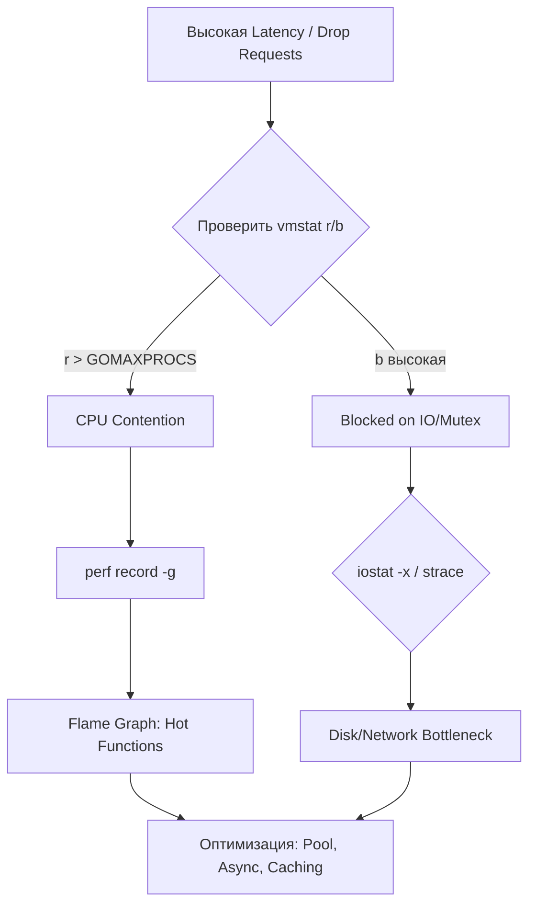

## Введение: От локального дебага к production-наблюдаемости

В разработке на PHP, Java или C# привыкли полагаться на встроенные профилировщики или runtime-метрики: Xdebug, jstat, dotnet-counters. В Go экосистема построена на философии **Minimalism + Composition**: runtime не навязывает тяжелую телеметрию, а делегирует сбор метрик операционной системе и сторонним утилитам.

Для Senior/Lead Go-инженера умение читать вывод `top`, `vmstat`, `iostat` и `perf` — это не просто «умение запускать команды», а навык механической симпатии. Вы должны уметь отличить паузу сборщика мусора от свопинга, CPU-контекст переключение от блокировки мьютекса, и асинхронный IO от синхронных системных вызовов в blocking mode.

В этом разделе мы разберем фундаментальные утилиты Linux, их внутреннее устройство и то, как их вывод интерпретировать в контексте Go-рантайма.

## top / htop / btop: Глаза поверх процесса

Утилиты семейства `top` показывают состояние процессов в реальном времени. В отличие от Java, где `jstack` может показать стек каждой нити, Go использует **M:N планировщик**. Один системный поток (M) может обслуживать множество горутин (G). Поэтому `top` показывает не горутины, а OS-threads.

### Под капотом
`top` собирает данные из `/proc/[pid]/stat`, `/proc/[pid]/status` и вызывает системные вызовы `getrusage()` и `sysconf()`. Он не читает память процесса напрямую, а полагается на ядро.

### Go-специфика
```bash
# Показать потоки (M) конкретного Go-процесса
top -p $(pgrep myapp) -H -o %CPU

# Отфильтровать только пользовательское время (без системных вызовов)
top -p $(pgrep myapp) -H -o %us
```

> [!info] Под капотом
> В Go количество потоков (M) динамически меняется. По умолчанию `GOMAXPROCS` равен количеству логических ядер CPU. Если вы видите, что процесс потребляет 400% CPU на 4-ядерном сервере — это нормально: Go активно использует мультипоточность для выполнения конкурентных задач, парсинга JSON или работы с сетью.

> [!warning] Ловушка / Gotcha
> Высокий показатель `%sy` (system time) в `top` для Go-приложения почти всегда указывает на:
> 1. Частые системные вызовы (например, `write` в файл без буферизации).
> 2. Блокирующие сетевые операции в `net/http` или `database/sql`.
> 3. Активную работу GC, которая вызывает `madvise`, `munmap` и аллокации в ядре.
> Если `%sy` превышает 20-30% от `%us`, пришло время искать горячие точки через [[24. strace, ltrace и чтение поведения процесса.md]] или `perf`.

## vmstat: Пульс виртуальной памяти и контекстных переключений

`vmstat` (Virtual Memory Statistics) — один из самых информативных инструментов для бэкенда. Он показывает состояние runqueue, контекстных переключений, прерываний и использования памяти.

### Ключевые колонки и их интерпретация для Go
```bash
vmstat 1 10
```

| Колонка | Значение | Go-интерпретация |
|---------|----------|------------------|
| `r` | Runnable processes | Горутины в состоянии `runnable` (Gwaiting -> Grunnable). Высокое значение > `GOMAXPROCS` = CPU contention. |
| `b` | Blocked processes | Горутины/потоки в состоянии `block` (ожидание IO, mutex, channel). |
| `si` / `so` | Swap in / Swap out | **Критично!** Если `so > 0`, Go-процесс свопится. GC pauses + swapping = катастрофа для latency. |
| `cs` | Context switches | Высокий `cs` указывает на частое переключение контекста между G и M, или между ядром и user space. |
| `wa` | IO wait | Время CPU, простоявшее в ожидании завершения IO. В Go скрывает блокирующие `read`/`write` системные вызовы. |

> [!tip] Собеседование
> **Вопрос:** Как по `vmstat` отличить, что Go-приложение тормозит из-за GC, а не из-за нехватки CPU?
> **Ответ:** Если `r` (runqueue) близка к нулю, а `b` (blocked) высокая — приложение ждет IO или блокировки. Если `r` высокая, а `wa` низкая — CPU contention. Если при этом в логах Go (`GODEBUG=gctrace=1`) видны длительные паузы, а `si/so` в `vmstat` = 0 — это чистые GC pauses. Если же `so > 0`, то память вытеснена в swap, и GC не при чем.

## iostat: Пульс дисковой подсистемы

Go-приложения активно работают с файловой системой: логирование, кэширование, загрузка файлов, работа с БД (WAL, индексы). `iostat` показывает загрузку дисков и задержки.

```bash
iostat -x 1 5
```

### Ключевые метрики
- `%util`: Заполненность очереди дисковых запросов. >80% = узкое место.
- `await`: Среднее время (мс) выполнения запроса. Включает время в очереди и реальное выполнение.
- `r/s`, `w/s`: Чтение/запись в секунду.
- `rkB/s`, `wkB/s`: Пропускная способность.

### Go-специфика
Go по умолчанию использует **Page Cache** ядра для файлового IO. Это означает, что данные сначала копируются из диска в RAM (kernel page cache), а затем в user space. Это быстро, но увеличивает потребление памяти.

> [!info] Под капотом
> Для обхода Page Cache Go использует `mmap` или `io_uring` (в ядре 5.1+). Если вы видите высокий `%util` при низкой пропускной способности, значит, диск не успевает обрабатывать очередь запросов. В Go это лечится:
> 1. Асинхронным IO (`io_uring` в новых версиях).
> 2. Буферизацией (`bufio`).
> 3. Отключением WAL в БД для read-heavy нагрузок (если допустимо).

## perf: Hardware counters и профилирование

`perf` — это интерфейс к подсистеме `perf_events` ядра Linux. Она позволяет читать аппаратные счетчики CPU (циклы, кэш-промахи, прерывания) и строить flame graphs.

### Как работает perf
1. Ядро выделяет кольцевой буфер (ring buffer) в памяти.
2. При срабатывании счетчика (например, каждые 1000 тактов) ядро записывает в буфер событие: PID, IP, регистры.
3. `perf` читает буфер и строит статистику.

### Профилирование Go-приложения
```bash
# Запись профиля с раскруткой стеков (99 Hz)
perf record -g -F 99 -- ./myapp

# Вывод отчета
perf report --sort=dso,symbol

# Отрисовка flame graph (требует perf-tools)
perf script | stackcollapse-perf.pl | flamegraph.pl > flame.svg
```

> [!warning] Ловушка / Gotcha
> `perf` по умолчанию не умеет раскручивать стеки Go, так как Go использует **non-standard stack frames** (горутины могут перемещаться между стеками, используют `mmap`-allocated stacks). Чтобы `perf` показывал корректные названия функций Go, нужно:
> 1. Собирать приложение с `-buildmode=pie` и флагом `-ldflags="-s -w"` (для отладки убрать `-s -w`).
> 2. Использовать `GOEXPERIMENT=strictfipsruntime` или настроить `GODEBUG=gctrace=1,asyncpreempt=1`.
> 3. В современных версиях Go (1.18+) DWARF unwind info встроен автоматически, но `perf` должен знать о DWARF: `perf record --call-graph dwarf`.

> [!tip] Собеседование
> **Вопрос:** Чем `perf` отличается от `pprof`?
> **Ответ:** `pprof` — это user-space профилировщик Go-рантайма. Он знает о горутинах, каналах, мьютексах, GC и netpoller. `perf` — это kernel-space инструмент. Он видит реальное время CPU, кэш-промахи (L1/L2/L3), предсказание ветвлений и syscall-ы. Идеальный пайплайн: `pprof` для поиска горячих функций в Go, `perf` для анализа их поведения на уровне CPU и ядра.

## Go-специфика: Как читать эти инструменты для бэкенда

Ниже приведена типовая диагностическая цепочка для Go-приложения.



### Практические сценарии

1. **GC pauses вызывают latency spikes**
   - Симптомы: `top` показывает резкие падения `%us`, `vmstat` `b` растет, запросы timeout.
   - Проверка: `GODEBUG=gctrace=1 | grep gcwait` или `pprof -alloc_objects`.
   - Лечится: `GOGC=50` (временно), уменьшение аллокаций, `sync.Pool`, `mmap` вместо `[]byte`.

2. **Goroutine leak**
   - Симптомы: `top` RSS растет линейно, `vmstat` `si/so` начинает расти.
   - Проверка: `pprof -inuse_space` или `pprof -alloc_space`.
   - Лечится: Анализ каналов, контекстов, HTTP clients.

3. **CPU contention на mutex**
   - Симптомы: `top` `%sy` высокий, `vmstat` `cs` (context switches) аномально высок.
   - Проверка: `perf sched` или `perf c2c` (Last Cache Miss).
   - Лечится: `sync.RWMutex` вместо `sync.Mutex`, уменьшение времени удержания блокировки, `atomic` операции.

## Сравнение с другими языками

| Инструмент | Java | C# | Go |
|------------|------|----|----|
| Process Monitor | `jcmd`, `VisualVM` | `dotnet-counters` | `top` / `htop` |
| Memory / GC | `jstat`, `jmap` | `dotnet-gcdump` | `GODEBUG=gctrace=1`, `pprof` |
| Profiling | `async-profiler` | `dotnet-trace` | `perf`, `pprof` |
| IO / Syscall | `strace` / `ltrace` | `dotnet-trace` | `strace`, `iostat` |

Go делает ставку на **стандартные утилиты Linux**. Это преимущество для DevOps и SRE: нет необходимости устанавливать тяжелые runtime-агенты. Вы можете подключиться к production-серверу через SSH и сразу начать диагностику.

## Итог

Инструменты `top`, `vmstat`, `iostat` и `perf` образуют фундамент production-наблюдаемости в Go. Они не заменяют `pprof` или OpenTelemetry, но дополняют их, показывая реальное поведение процесса на уровне ядра и железа. Понимание того, как Go-рантайм взаимодействует с этими утилитами, позволяет отличать проблемы приложения от ограничений ОС и железа.

В следующей статье мы заглянем глубже в ядро Linux и разберем [[61. eBPF. Современный способ наблюдать за ОС.md]], который позволяет отслеживать syscalls, сетевые пакеты и работу памяти без перезагрузки и перезапуска процессов.