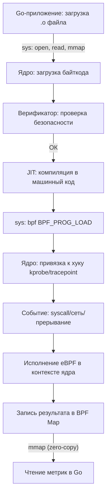

## eBPF: Расширяемый фильтр пакетов как универсальный инструмент наблюдения

Традиционные инструменты мониторинга на базе агентов (`node_exporter`, `telegraf`, `sysdig`) требуют установки стороннего кода, постоянного опроса метрик и значительного потребления CPU/RAM. **eBPF** (extended Berkeley Packet Filter) революционизировал подход к наблюдаемости и безопасности, позволив безопасно выполнять пользовательский код прямо внутри ядра Linux без его перезагрузки или изменения исходников.

Для Go-разработчика eBPF — это не просто «еще один инструмент сбора метрик». Это механизм, который позволяет отслеживать системные вызовы, сетевые пакеты, время выполнения горутин и блокировки мьютексов с минимальным оверхедом, оставаясь в том же пространстве процессов, что и ваше приложение.

## Как eBPF работает под капотом

eBPF не является интерпретируемым языком. Это **песочница на уровне ядра**, состоящая из трех ключевых компонентов:

### 1. Верификатор (Verifier)
Перед загрузкой программы ядро проверяет каждый байткоманд eBPF. Верификатор гарантирует:
- Отсутствие бесконечных циклов (циклы должны иметь верхнюю границу, обычно до 1 млн итераций).
- Фиксированный размер стека (обычно 512 байт на кадр, не растет динамически).
- Отсутствие косвенных вызовов функций и указателей на произвольные адреса.
- Корректное освобождение ресурсов и чтение/запись только в разрешенных картах (BPF maps).

Это делает eBPF безопаснее, чем классические `kprobes` или `LD_PRELOAD`, так как невозможно вызвать `panic` в ядре или повредить память других процессов.

### 2. JIT-компилятор (Just-In-Time)
После верификации байткоды eBPF транслируется в нативные машинные инструкции процессора (x86_64, ARM64, RISC-V). Компиляция происходит один раз при загрузке программы. Дальнейшее исполнение происходит со скоростью, близкой к нативному C-коду, внутри контекста ядра.

### 3. BPF Maps (Карты)
Пользовательское пространство (ваш Go-приложение) и пространство ядра не могут напрямую обмениваться данными через обычные переменные. Для этого используются **BPF maps** — хеш-таблицы, массивы, LRU-кэши и per-CPU структуры, выделенные в ядре. Они отображаются в память пользователя через `mmap`, позволяя читать/записывать данные без дополнительных системных вызовов в hot-path.

### 4. Точки входа (Hooks)
eBPF-программа выполняется только при наступлении определенного события:
- **kprobes/kretprobes**: Вставка кода в начало/конец любой функции ядра.
- **tracepoints**: Статические точки вставки в коде ядра (безопаснее kprobes).
- **cgroup**: Фильтрация или мониторинг процессов, принадлежащих к конкретной группе контроля.
- **XDP/TC**: Обработка пакетов на уровне сетевого стека (до попадания в netfilter).

## Жизненный цикл eBPF-программы

Загрузка и исполнение eBPF-программы в Linux следует строгому паттерну:



## eBPF в Go: Практика и `cilium/ebpf`

В экосистеме Go стандартом де-факто является библиотека `github.com/cilium/ebpf`. Она предоставляет высокоуровневый Go-интерфейс для работы с eBPF, абстрагируя низкоуровневые syscalls и структуру `bpf_attr`.

```go
package main

import (
	"fmt"
	"log"
	"os"
	"time"

	"github.com/cilium/ebpf"
	"github.com/cilium/ebpf/link"
)

//go:embed ebpf_program.bpf.o
var ebpfBytes []byte

// Структура данных, передаваемая из ядра в пользовательское пространство
type MetricEvent struct {
	Timestamp uint64
	Pid       uint32
	Syscall   uint32
	Duration  uint64
}

func main() {
	// 1. Загрузка eBPF-программы из байтов
	collectionSpec, err := ebpf.LoadCollectionSpecFromReader(bytes.NewReader(ebpfBytes))
	if err != nil {
		log.Fatalf("Ошибка загрузки spec: %v", err)
	}

	collection, err := ebpf.NewCollection(collectionSpec)
	if err != nil {
		log.Fatalf("Ошибка создания collection: %v", err)
	}
	defer collection.Close()

	// 2. Привязка карты для передачи данных
	var metricsMap ebpf.Map
	if err := collection.Maps.Lookup("metrics_map").Lookup(&metricsMap); err != nil {
		log.Fatalf("Ошибка поиска карты: %v", err)
	}

	// 3. Подключение к tracepoint (например, syscalls:sys_enter_write)
	prog, ok := collection.Programs["tracepoint__syscalls__sys_enter_write"]
	if !ok {
		log.Fatal("Программа tracepoint__syscalls__sys_enter_write не найдена")
	}

	lk, err := link.Tracepoint("syscalls", "sys_enter_write", prog, nil)
	if err != nil {
		log.Fatalf("Ошибка привязки к tracepoint: %v", err)
	}
	defer lk.Close()

	// 4. Чтение метрик в реальном времени
	events := make(chan MetricEvent)
	go func() {
		for {
			var val MetricEvent
			// Чтение из карты (первый ключ всегда 0 для простых случаев)
			if err := metricsMap.Lookup(uint32(0), &val); err != nil {
				continue
			}
			events <- val
		}
	}()

	fmt.Println("Наблюдение за sys_enter_write... Нажмите Ctrl+C для выхода")
	for ev := range events {
		fmt.Printf("PID: %d, Длительность: %d ns\n", ev.Pid, ev.Duration)
	}
}
```

> [!info] Под капотом
> При вызове `ebpf.NewCollection` Go-программа выполняет серию syscalls: `open` для загрузки `.o` файла, `mmap` для маппинга секций `.rodata` и `.data`, и `bpf(BPF_PROG_LOAD)` для передачи байткода в ядро. Верификатор анализирует программу, JIT-компилятор генерирует машинный код, и ядро возвращает файловый дескриптор программы.

## Mechanical Sympathy и стоимость наблюдения

Для бэкенд-разработчика критически важно понимать, что eBPF **не является бесплатным**. Он переносит вычисления из пользовательского пространства в пространство ядра.

1. **Контекст исполнения**: Код eBPF выполняется в контексте прерывания или системного вызова. Это означает, что он разделяет CPU-кэш и память с другими ядрами. Плохо написанная программа может вызвать `cache thrashing` или блокировать прерывания дольше допустимого.
2. **Системные вызовы**: Загрузка eBPF-программы требует прав `CAP_BPF` или `CAP_SYS_ADMIN`. В контейнерных средах (Docker/K8s) это часто требует настройки `seccomp` или `apparmor`.
3. **Zero-Copy через `mmap`**: Карты eBPF отображаются в память пользователя. Чтение метрик не вызывает дополнительных syscalls в hot-path, что делает eBPF на порядки эффективнее традиционных агентов, опрашивающих `/proc` или `/sys`.
4. **Влияние на Go runtime**: Go планировщик и netpoller не знают о существовании eBPF. Однако вы можете использовать eBPF для сбора метрик о времени блокировки `runtime.lock` или о задержках в `epoll_wait`, не внося изменений в сам рантайм.

> [!warning] Ловушка / Gotcha
> **Лимит верификатора**: Несмотря на то, что современные ядра (5.5+) увеличили лимит инструкций до 1 млн, верификатор все равно накладывает строгие ограничения на стек (512 байт) и запрещает работу с указателями на произвольную память. Если ваша eBPF-программа не загружается с ошибкой ` verifier error: invalid mem stack`, проверьте:
> - Использование глобальных переменных в `.rodata` вместо локальных стековых.
> - Слишком глубокие вложенные условия или циклы без корректных `#pragma unroll`.
> - Попытки чтения данных за пределами выделенной карты.

> [!tip] Собеседование
> **Вопрос:** Как eBPF обеспечивает безопасность выполнения кода в ядре, и какие ограничения накладывает верификатор?
> **Ответ:** eBPF использует статический верификатор, который проверяет байткод до загрузки: отсутствие бесконечных циклов (ограничение итераций), фиксированный размер стека (обычно 512 байт), запрет на косвенные вызовы и работу с произвольными указателями. Данные передаются только через BPF maps, выделенные ядром. Это гарантирует, что ошибка в eBPF-программе не приведет к kernel panic или утечке памяти, в отличие от `LD_PRELOAD` или прямых `kprobes`.
> 
> **Вопрос:** Почему eBPF быстрее традиционных агентов мониторинга?
> **Ответ:** Традиционные агенты используют polling (опрос) или тяжелые syscalls (`/proc`, `stat`), что создает высокую нагрузку на CPU и контекстные переключения. eBPF работает на событиях (event-driven), исполняется JIT-компилированным кодом в ядре, а данные передаются через `mmap` (zero-copy). Это устраняет накладные расходы на опрос и копирование данных.

## Итог

eBPF превратил Linux из статической системы в динамическую платформу для наблюдаемости и безопасности. Для Go-разработчика это означает возможность:
- Снимать метрики производительности без изменения кода приложения.
- Отслеживать сетевые задержки на уровне ядра (XDP/TC).
- Заменять тяжелые агенты легковесными eBPF-программами, собранными в статический бинарник.
- Понимать, как системные вызовы и сетевой стек взаимодействуют с Go runtime на уровне процессора и памяти.

Мы разобрали, как ядро Linux безопасно исполняет пользовательский код. В следующей статье мы перейдем к прямой интеграции: [[62. Как Go runtime взаимодействует с ОС.md]], чтобы понять, как планировщик горутин, netpoller и сборщик мусора используют эти же механизмы для управления вашей программой.