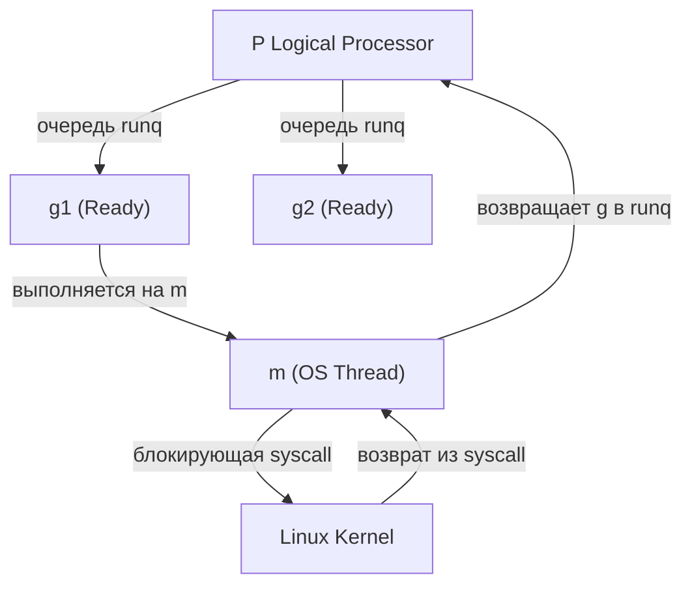

## Почему Go нужна своя среда выполнения

В отличие от PHP или Python, которые работают поверх интерпретатора, Go компилируется в нативный машинный код. Однако это не означает, что программа может работать «голой» на ядре ОС. Go-бинарник содержит **встроенный рантайм** (`runtime`), который выступает посредником между вашим кодом и примитивами ОС.

Зачем это нужно? ОС предоставляет дешевые (относительно) примитивы: потоки (`pthread`), страницы памяти, файловые дескрипторы, системные вызовы. Но для высококонкурентных нагрузок (десятки тысяч одновременных соединений, микросервисы, event-driven архитектуры) прямая работа с этими примитивами приводит к:
- **Context Switch** на уровне ядра (дорого, тысячи тактов CPU).
- **Memory fragmentation** при частых `malloc/free`.
- **Thread pool exhaustion**, когда ОС ограничивает количество потоков.

Go runtime решает эти проблемы, создавая собственную виртуальную машину поверх ОС. Мы разберем, как именно Go обманывает ОС, чтобы выдавать иллюзию миллионов легких горутин.

## Модель планирования G-M-P: Мост между горутинами и потоками ОС

Планировщик Go не работает напрямую с OS-потоками. Он оперирует абстракцией **G-M-P**:

| Сущность | Аналог в ОС | Назначение |
|----------|-------------|------------|
| `g` (goroutine) | Поток в стеке ядра / легковесный поток | Контекст выполнения (стек ~2KB, регистры, статус) |
| `m` (machine) | `pthread` / `sched_getaffinity` | Реальный системный тред, привязанный к ядру CPU |
| `p` (logical processor) | Виртуальное ядро / `SMP` | Менеджер очереди горутин, локальный кэш, счетчик GC |

Планировщик Go (`runtime.schedule`) работает в **User Space**. Он не делает `syscall` для переключения контекста между горутинами. Вместо этого он использует собственные ассемблерные вставки (gogo, gopark, goready в `src/runtime/asm_*.s`), которые напрямую манипулируют регистрами sp (указатель стека) и pc (счётчик команд) без участия POSIX-функций. Это дает **zero-cost context switch** для goroutines.

> [!info] Под капотом
> Структура `p` в исходниках Go (`src/runtime/proc.go`) содержит массив runq (обычно 256 элементов `*g`), runqhead, runqtail, runqsize, `schedtick` (счетчик для fair scheduling), `syscall` (флаг блокировки на syscall). `p` создается один раз при запуске (по умолчанию 1, управляется через `GOMAXPROCS`) и живет до конца программы.

## Управление памятью: `mmap`, `mprotect` и `madvise` под капотом

Go не использует классический `brk/sbrk` (как glibc `malloc`) для управления heap. Вместо этого рантайм работает напрямую с `mmap`:

1. **Выделение виртуальной памяти**: При старте Go вызывает `sysAlloc` → `mmap` с флагом `MAP_ANONYMOUS | MAP_PRIVATE`. Это резервирует большой диапазон виртуальной памяти (например, 100MB+), но **не выделяет физическую RAM**.
2. **Коммит страниц**: При необходимости рантайм вызывает `mprotect(addr, size, PROT_READ | PROT_WRITE)`. Только здесь ядро выделяет реальные физические страницы и инициализирует `Page Table`.
3. **Возврат памяти**: При GC или деаллокации Go не вызывает `munmap` сразу. Вместо этого используется `madvise(addr, size, MADV_DONTNEED)` или `MADV_FREE`. Это говорит ядру: «страницы больше не нужны, можешь их сбросить в swap или отдать другому процессу». Физическая память освобождается лениво, что снижает нагрузку на ядро.

> [!warning] Ловушка / Gotcha
> Если вы видите, что RSS вашего Go-процесса не уменьшается после освобождения данных, это не утечка. Это `madvise` + `Page Cache` + `Memory Fragmentation`. Go отдает память ядру только при сильном давлении (например, при вызове `mmap` с большим размером или при `GOGC=1`). Для продакшена это нормальное поведение, оптимизированное под throughput, а не под мгновенное освобождение RAM.

## Обработка блокирующих вызовов и парковка горутин

Когда горутина делает блокирующий syscall (например, `os.File.Read`, `net.Dial`), системный тред `m` блокируется в ядре. Если бы Go просто блокировал `m`, это привело бы к утечке OS-потоков и падению производительности.

Решение Go: **Hand-off и Parker**.

1. При входе в blocking syscall планировчик видит флаг `g.lockedm != 0`.
2. Он вызывает `gopark`, который сохраняет контекст `g`, переводит его в статус `Gwaiting`.
3. Текущий `m` вызывается `revoke` из `p`, освобождая `p` для других горутин.
4. Ядро ОС видит, что `m` заблокирован, и планировщик Linux перераспределяет CPU.
5. Когда syscall завершается, `m` просыпается, вызывает `goready`, который переводит `g` в статус `Grunnable` и кладет в очередь `p`.
6. Если `p` исчерпал свои `m`, Go динамически создает новый `pthread` через `pthread_create` (лимит растет до ~10000, потом ограничивается `GOMAXPROCS`-подобными механизмами в новых версиях через `sched` и `netpoll`).

> [!tip] Собеседование
> **Вопрос:** Почему Go может создавать больше 10000 OS-потоков при высокой нагрузке?
> **Ответ:** Это происходит при массовом блокировании на syscall или network IO. Планировщик Go не знает заранее, когда закончится syscall, поэтому он «подставляет» новые `m`, чтобы `p` не простаивал. При снижении нагрузки `m` уничтожаются через `pthread_exit` (но не сразу, а лениво, чтобы избежать overhead на создание).

## Сетевой поллер (`netpoll`) и мультиплексирование IO

Go не создает отдельный тред на каждое соединение. Он использует **event-driven IO** через `netpoll`:

- Linux: `epoll`
- BSD/macOS: `kqueue`
- Windows: `IOCP`

При создании `net.Listener` или `net.Dialer`, Go вызывает `syscall.SetNonblock(fd, true)` и регистриует файловый дескриптор в poller. Когда данные приходят, ядро вызывает callback, который помещает дескриптор в `netpoll`-очередь и пробуждает `m` через `epoll_wait` (или `kqueue`).

> [!info] Под капотом
> `netpoll` хранит дескрипторы в `pollCache` (хеш-таблица). При вызове `epoll_wait` он получает список готовых `fd`, пробегается по ним, вызывает `netFD.Read/Write` в non-blocking режиме, и если данные поступили, переводит связанную горутину в `Grunnable`. Это полностью убирает блокировки на уровне OS для сетевых операций.

## Обработка сигналов и пробуждение планировщика

Go runtime перехватывает сигналы ОС для управления внутренним состоянием:

| Сигнал | Назначение в Go Runtime                                                                                                                                                                                                                                                                 |
| --------------------- | --------------------------------------------------------------------------------------------------------------------------------------------------------------------------------------------------------------------------------------------------------------------------------------- |
| `SIGUSR1` / `SIGUSR2` | Отладка, `SIGSTKFLT` (переполнение стека горутины)                                                                                                                                                                                                                                      |
| `SIGPOLL` / `SIGIO` | netpoll на современных платформах не является сигнальным. Пробуждение происходит через возврат из epoll_wait / kevent / IOCP. Сигналы (SIGIO/SIGPOLL) используются Go крайне редко (в основном для legacy-совместимости или специфичных BSD-путей) и не являются механизмом event-loop. |
| `SIGURG` | Обработка out-of-band данных (редко используется)                                                                                                                                                                                                                                       |
| `SIGWINCH` | Обновление terminal size (для `os.Stdout`)                                                                                                                                                                                                                                              |

При получении `SIGPOLL` или `SIGIO`, Go вызывает `netpoll` в отдельном тред-локальном обработчике, который пробуждает `m` через `epoll` или `kqueue`. Это позволяет Go реагировать на сеть без постоянных опросов (`polling`).

## Mechanical Sympathy: Влияние на производительность и кэш CPU

Понимание взаимодействия Go с ОС критично для оптимизации:

1. **Context Switch Cost**: Переключение `g` -> `g` стоит ~100-500 нс (user-space). Переключение `m` -> `m` (через ядро) стоит ~1000-5000 нс + инвалидация кэшей TLB. Поэтому Go минимизирует создание `m` и использует `GOMAXPROCS` для балансировки.
2. **Cache Locality**: Горутины, связанные с одним `p`, используют один `m` и делят L1/L2 кэш этого ядра. Это снижает `cache miss` по сравнению с распределением задач по разным потокам ОС.
3. **NUMA Awareness**: На серверах с NUMA память Go не учитывает это явно, но `GOMAXPROCS` + `taskset`/`numactl` позволяют привязать `m` к конкретным сокетам CPU, избегая удаленного доступа к RAM.
4. **GC и Syscalls**: При GC Go делает `mmap`/`mprotect` для сканирования памяти. Если `mmap` не может выделить виртуальную память, программа упадет с `fatal error: cannot allocate memory`, даже если свободной RAM много.

> [!warning] Ловушка / Gotcha
> Установка `GOMAXPROCS` больше, чем количество физических ядер, не ускорит CPU-bound задачи. Это увеличит количество `context switch` и `cache thrashing`. Используйте `GOMAXPROCS` только для IO-bound нагрузок, где нужно параллельно обрабатывать сетевые/файловые события.

## Типичные вопросы на собеседованиях (Middle+/Senior)

1. **Как Go обрабатывает блокирующие системные вызовы, не блокируя весь процесс?**
   *Планировщик паркует горутину (`gopark`), освобождает `m` от `p`, ядро переключает контекст. При возврате `m` просыпается, `goready` возвращает горутину в очередь `p`. Если `p` не имеет `m`, создается новый `pthread`.*

2. **Почему RSS Go-процесса не падает после `runtime.GC()`?**
   *Go использует `madvise(MADV_DONTNEED)` вместо `munmap`. Физическая память возвращается ядру лениво. Это компромисс между скоростью аллокации и использованием RAM. Для принудительного возврата можно использовать `debug.FreeOSMemory()`.*

3. **Чем `GOMAXPROCS` отличается от количества ядер CPU?**
   *`GOMAXPROCS` управляет количеством `p` (логических процессоров), а не `m`. По умолчанию равно количеству ядер. Увеличение помогает при IO-bound нагрузках (сеть, диск), но вредит CPU-bound задачам из-за `cache thrashing` и `context switch`.*

4. **Как `netpoll` избегает `epoll`-storm (thundering herd)?**
   *Go не использует `EPOLLONESHOT`. Он обрабатывает события в цикле до опустошения очереди, снимая fd из мониторинга через `EPOLL_CTL_DEL` и возвращая через `EPOLL_CTL_MOD`. Проблема thundering herd решается тем, что epoll сам по себе не будит все потоки, а Go синхронизирует доступ через netpoll lock и fair scheduling.*

## Итог

Go runtime — это не просто «библиотека», а полноценная виртуальная машина поверх ОС. Он абстрагирует:
- **Планирование**: G-M-P модель заменяет тяжелые OS-потоки легковесными горутинами с пользовательским контекст-свитчем.
- **Память**: `mmap` + `mprotect` + `madvise` дают контроль над RSS и аллокациями, минуя стандартный `malloc`.
- **IO**: `netpoll` (epoll/kqueue/IOCP) обеспечивает event-driven сетевой стек без блокировок.
- **Сигналы**: Перехват `SIGPOLL`/`SIGIO` пробуждает планировщик при готовности данных.

Понимание этих механизмов позволяет писать код, который не борется с ОС, а использует её примитивы синхронно. В следующей статье мы соберем всю картину раздела [[63. Итоги раздела. Картина ОС целиком для Go-разработчика]], чтобы увидеть, как архитектура компьютера, ядро, память и сеть складываются в единую систему для высоконагруженного бэкенда.