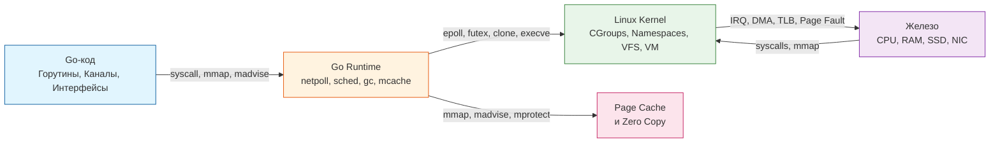

## Философия раздела: OS как со-исполнитель, а не абстракция

Раздел по устройству операционной системы закрывает фундаментальный пробел в понимании Go-рантайма. Многие разработчики воспринимают ОС как «чёрный ящик», который просто «запускает бинарник». Для уровня Senior/Lead это критическая ошибка. Go не заменяет ОС, он выстраивает с ней двусторонний диалог на уровне системных вызовов, памяти и планирования. Понимание того, как ядро выделяет память, переключает контекст, обслуживает сокетные очереди и управляет кэшем страниц, напрямую определяет ваш умение писать производительный, предсказуемый и безопасный код.

В этой статье мы соберём разрозненные концепции в единую ментальную модель и покажем, как каждый слой ОС транслируется в абстракции Go.

## Единая ментальная модель: Слои взаимодействия

Go-приложение живёт в трёх пересекающихся пространствах: пользовательское пространство (User Space), пространство ядра (Kernel Space) и пространство рантайма Go. Границы между ними размыты благодаря интеллектуальному слою `runtime`.

## Ключевые инсайты по основным подсистемам

### 1. Память и аллокации
Виртуальная память (`[[12. Виртуальная память. Почему процессу кажется, что у него своя память]]`) даёт каждому процессу изолированное адресное пространство. Go использует это для реализации своей модели памяти:
- **Стек горутин:** Динамически растущий/сжимаемый. В отличие от C++ или Java, где размер стека фиксирован (часто 1-8 МБ), Go начинает с 2 КБ. Это позволяет создавать миллионы горутин без `SIGSEGV`.
- **Куча (Heap):** Аллоцируется через `mmap` с флагом `MAP_ANONYMOUS`. Go не вызывает `brk`/`sbrk` для каждого объекта. Вместо этого он работает с большими `mmap`-анонимусами (huge pages), деля их на `mspan` и `mcache`.
- **Page Cache и Zero Copy:** Когда вы читаете файл через `os.File`, данные сначала попадают в `Page Cache` ядра. Если вы используете `io.Copy` с `io.ReaderFrom`/`io.WriterTo`, Go может вызвать `sendfile` или `copy_file_range`, минуя пользовательское пространство полностью. Это Zero Copy на уровне ядра.

> [!info] Под капотом
> В Go 1.18+ появился `GOMEMLIMIT`. Раньше GC работал по эвристике (`GOGC=100`). Теперь рантайм может запрашивать у ядра освобождение неиспользуемой памяти через `madvise(MADV_DONTNEED)`, возвращая страницы обратно в OS, не уничтожая сами маппинги. Это критично для серверов с переменной нагрузкой.

### 2. Планирование и конкурентность
ОС планирует потоки (threads), а Go планирует горутины (goroutines). Это разные абстракции с разной стоимостью переключения.
- **Context Switch:** Переключение между потоками ОС требует сохранения контекста в Ring 0, инвалидации TLB и кэшей. Это стоит тысячи тактов CPU.
- **Goroutine:** Переключение между горутинами происходит в User Space через `m` и `p` (структуры `runtime.m` и `runtime.p`). Рантайм сохраняет только регистры `rip`, `rsp`, `r12-r15` и указатели на локальные кэши. Это cost-effective переключение.
- **Сравнение:** В Java/Go `Thread` = `OS Thread` (тяжело, дорогое переключение). В Go `Goroutine` = `M:N` мультиплексирование на `OS Thread` (легковесно, управляется рантаймом).

> [!warning] Ловушка
> `GOMAXPROCS` не означает «колько горутин одновременно». Это количество потоков ОС, на которых может выполняться Go-код. Если вы ставите `GOMAXPROCS = 1`, все горутины будут выполняться кооперативно на одном ядре. При блокирующем IO все остальные горутины встанут в очередь, даже если CPU свободен.

### 3. IO и сеть
Go-рантайм не блокирует потоки ОС при ожидании сетевых событий. Он использует `epoll` (Linux) или `kqueue` (BSD/macOS) через `netpoller`.
- Когда горутина делает `conn.Read()`, рантайм регистрирует сокет в `epoll` и передаёт управление планировщику.
- Когда данные приходят, ядро вызывает callback, который пробуждает `netpoll` и возвращает горутину в очередь готовых (`runnable`).
- В отличие от PHP или Node.js, где IO часто асинхронен на уровне приложения, Go делает его синхронным для кода, но асинхронным на уровне рантайма. Это сохраняет читаемость кода без потери производительности.

> [!tip] Собеседование
> **Вопрос:** Что произойдёт, если вы закроете сокет из одной горутины, пока другая читает его?
> **Ответ:** `epoll` мгновенно вернёт событие `EPOLLHUP` или `EPOLLERR`. `netpoll` пробудит блокирующую горутину, которая получит `io.EOF` или `syscall.EBADF`. В отличие от POSIX `select`, где нужно опрашивать дескрипторы, `epoll` работает по принципу push: ядро сам уведомляет рантайм о готовности.

### 4. Архитектура и изоляция
Современный Go-бэкенд почти всегда работает в контейнерах. Понимание `[[53. Контейнеры под капотом. namespaces и cgroups]]` критично:
- **Namespaces:** Дают процессу иллюзию изоляции (PID, NET, MNT). Go-рантайм видит только свой PID и свою сеть.
- **Cgroups:** Ограничивают ресурсы (CPU, Memory). Если вы не настроите `memory.limit_in_bytes` или `cgroup v2` лимиты, Go будет аллоцировать память до `OOM Killer` убьёт процесс, не успев запустить GC.
- **CPU Affinity:** В кластерах K8s пулы горутин могут «утекать» между ядрами из-за `GOMAXPROCS` и миграции потоков ОС. Это вызывает потерю кэша L1/L2. Нагрузочные тесты в K8s должны учитывать `CPU Manager` и `Guaranteed` QoS классы.

## Go-рантайм: Мост между абстракцией и железом

Go не абстрагирует ОС, он оптимизирует взаимодействие с ней. Вот как ключевые примитивы рантайма используют системные механизмы:

| Абстракция Go | Системный примитив / Механизм | Зачем это нужно |
|:---|:---|:---|
| `sync.Mutex` | `futex` (Fast Userspace Mutex) | Блокировка в User Space. Только при коллизии идёт syscall `futex(LOCK|WAIT)`. |
| `Channel` | `runtime.sema` + `epoll`/`futex` | Очередь сообщений на уровне рантайма. Блокировка/разблокировка через `gopark`. |
| `goroutine` | `clone(CLONE_VM \| CLONE_FS \| CLONE_FILES)` | Создание потока с общим адресным пространством, но своим стеком. |
| `mmap` | `mmap(MAP_PRIVATE \| MAP_ANONYMOUS)` | Выделение кучи и стеков. `madvise` управляет политикой страниц. |
| `net/http` | `epoll`/`kqueue` + `setsockopt(TCP_NODELAY)` | Неблокирующий IO и отключение алгоритма Нейгла для низкой задержки. |
| `runtime.GC` | `madvise(MADV_DONTNEED)` / `mprotect` | Возврат неиспользуемой памяти OS без разрушения маппингов. |

> [!info] Под капотом
> Структура `runtime.m` содержит указатель на текущий поток ОС (`sys`), список горутин (`curg`), и `schedtick` для кооперативного переключения. Каждый `runtime.p` (logical processor) связан с одним или несколькими потоками ОС. Когда поток уходит в syscall, `p` отцепляется и передается другому потоку (`handoff`), чтобы горутины не простаивали. Это решает проблему блокировки `GOMAXPROCS` на одном тредe.

## Практические паттерны и оптимизации

1. **Минимизация аллокаций:** Избегайте создания слайсов в циклах. Используйте `make` с резервом или `sync.Pool`. Каждая аллокация в куче = `mmap`-фрагмент + потенциальная нагрузка на GC.
2. **Buffered IO:** `bufio.Reader` и `bufio.Writer` сокращают количество syscall `read`/`write` в десятки раз. Буфер работает в User Space, syscall вызывается только при заполнении/опустошении.
3. **Non-blocking IO:** Для высоконагруженных сервисов используйте `syscall.SetNonblock` или `golang.org/x/sys/unix`. Это позволяет обрабатывать тысячи соединений в одном потоке ОС.
4. **Signal Handling:** Go перехватывает `SIGTERM` и `SIGINT` через `os/signal`. Никогда не блокируйте `signal channel` без `select` с таймаутом. Graceful shutdown должен завершаться за 30 секунд, иначе K8s убьёт процесс (`SIGKILL`).

> [!warning] Ловушка
> Использование `sync.WaitGroup` внутри `goroutine` без контроля контекста (`context.WithTimeout`) приведёт к утечке горутин при отмене запроса. В Go горутины не умирают сами по себе. Всегда привязывайте их к `context` и отслеживайте через `errgroup`.

> [!tip] Собеседование
> **Вопрос:** Как Go справляется с блокирующими системными вызовами (например, `fsync` или `connect`), не блокируя весь процесс?
> **Ответ:** Рантайм видит, что поток `m` ушёл в syscall. Если есть свободные потоки, `p` передаётся им. Если нет, создаётся новый поток ОС (`sysmon` или `sched`), который заберёт `p` после завершения syscall. Горутина, ожидающая syscall, переводится в состояние `waiting` и вытесняется из `p`'й run queue. Когда syscall вернёт результат, `runtime` пробудит горутину и вернёт её в `runnable`.

## Итог

Операционная система и Go-рантайм — это не конкуренты, а партнёры. Ядро управляет физическим ресурсом (CPU, RAM, Disk, Network), а Go предоставляет высокоуровневые примитивы, которые сводят стоимость этого управления к минимуму. Понимание `Page Fault`, `TLB miss`, `futex`, `epoll` и `mmap` переводит разработчика из категории «писатель кода» в категорию «архитектор систем». Вы перестаёте гадать, почему приложение тормозит, и начинаете читать `pprof`, `strace` и `vmstat` как карту местности.

Мы завершили глубокое погружение в устройство ОС. Следующий логический шаг — как данные перемещаются между процессами и сервисами, и как проектировать надёжные интерфейсы взаимодействия. В следующем разделе мы разберём: компьютерные сети и сетевой стек, чтобы заложить фундамент для проектирования высоконагруженных и отказоустойчивых систем.