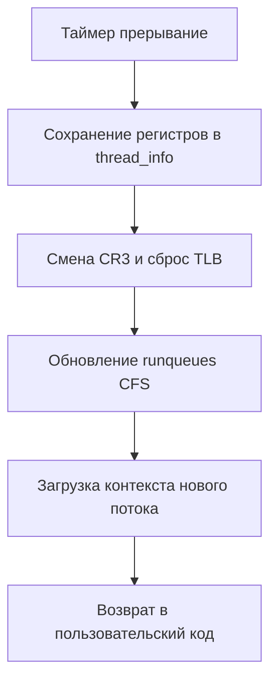

## Фундамент: Кто решает, кто исполняется?

Вы пишете код на Go, оперируете горутинами, каналами и контекстами. Но физически CPU не исполняет горутины. Он исполняет **потоки выполнения (threads)** операционной системы. Планировщик ОС (OS Scheduler) — это подсистема ядра, которая решает, какой именно поток получит доступ к ядру CPU в данный момент времени.

Для Go-разработчика понимание планировщика ОС критично, потому что:
1. **Go Runtime не управляет CPU напрямую.** Он запрашивает у ядра N потоков (`GOMAXPROCS`), а затем распределяет горутины по этим потокам. Если OS scheduler не отдаст поток CPU, ваша горутина будет простаивать, даже если CPU свободен.
2. **Производительность зависит от локальности.** Планировщик перемещает потоки между ядрами. Это разрушает кэш-линии L1/L2 и сбрасывает TLB, что стоит сотни тактов CPU.
3. **Поведение `time.Sleep`, блокировок и IO** напрямую зависит от того, как ядро управляет runqueues и приоритетами.

В Linux стандартом де-факто является алгоритм **CFS (Completely Fair Scheduler)**. Он отказался от жестких временных квантов в пользу динамического веса, что кардинально изменило подход к многозадачности.

## Алгоритм CFS: Справедливость через vruntime

CFS не делит CPU на фиксированные slices (например, 100 мс). Вместо этого он отслеживает **virtual runtime (vruntime)** для каждой задачи. Задача с наименьшим `vruntime` получает CPU.

### Как работает vruntime?

Каждое ядро CPU имеет свой `runqueue`. Когда задача выполняется, её `vruntime` увеличивается. Скорость увеличения зависит от приоритета (nice value):
```math
vruntime_{next} = vruntime_{current} + (delta_exec * NICE_0_LOAD) / load.weight
```
- `load.weight` вычисляется на основе nice-значения. Чем выше приоритет (ниже nice), тем больше `weight`, тем медленнее растёт `vruntime`.
- Задача с высоким приоритетом будет получать больше реального времени, но её `vruntime` будет расти медленнее, поэтому она не будет "захватывать" CPU вечно.

CFS также использует пороги `sched_latency_ns` и `sched_min_granularity_ns` (по умолчанию ~6 мс и ~0.75 мс на современных ядрах). Если в runqueue мало задач, ядро может дать одной задаче больше времени, чтобы избежать избыточного переключения контекста.

> [!info] Под капотом
> В исходниках ядра Linux (`kernel/sched/fair.c`) ключевая структура:
> ```c
> struct sched_entity {
>     u64             vruntime;
>     u64             exec_start;
>     u64             sum_exec_runtime;
>     struct sched_vruntime vruntime;
>     // ...
> };
> ```
> Планировщик использует красно-черное дерево (RB-tree), отсортированное по `vruntime`. Выбор следующей задачи — это просто взятие левого потомка (`rb_first`), что работает за O(1).

## Context Switch: Что происходит за кулисами

Когда таймер прерывает текущий поток, ядро вызывает `schedule()`. Это не просто "переключение кода". Это дорогостоящая операция, которая включает:

1. **Сохранение контекста:** Все регистры CPU (RAX, RBX, RSP, RIP, флаги) записываются в `thread_info` текущего потока.
2. **Смена стека:** Переключение `RSP` на стек ядра нового потока.
3. **Смена адресного пространства:** Если потоки принадлежат разным процессам, обновляются регистры CR3 (Page Directory Base Register). Это **сбрасывает TLB** (Translation Lookaside Buffer), так как виртуальные адреса теперь маппятся на другие физические страницы.
4. **Обновление runqueues:** Удаление задачи из текущего дерева CFS и вставка в дерево следующего CPU (если мигрирует).
5. **Загрузка контекста:** Чтение сохраненных регистров нового потока и прыжок на его `RIP`.

Стоимость context switch: **1000–5000 тактов CPU** (на современных x86-64). При тысячах переключений в секунду это становится узким местом.



## Go Runtime и OS Scheduler: Границы взаимодействия

Go пытается минимизировать зависимость от OS scheduler для переключения горутин, но не может игнорировать его полностью.

### Модель G-M-P
Go runtime создает `GOMAXPROCS` потоков ОС (структура `m`), каждый из которых связан с `P` (processor, пул для горутин). Горутины (`g`) планируются внутри Go runtime через `runtime.schedule` и `findrunnable`. 

- **CPU-bound задачи:** Все `P` активны, горутины переключаются быстро внутри одного `m`. OS scheduler видит одну тяжелую задачу на ядро.
- **IO-bound задачи:** Горутина блокируется (channel, syscall), вызывает `gopark()`. Текущий `m` может уснуть или взять другую горуутину. Если все `m` заблокированы, runtime делает `syscall` к ядру для создания новых потоков (до лимита `GOMAXPROCS`).

> [!warning] Ловушка / Gotcha
> `GOMAXPROCS` управляет **потоками ОС**, а не горутинами. 
> Если вы установите `GOMAXPROCS(1)`, все горутины будут выполняться на одном потоке ОС. Даже если у сервера 64 ядра, конкурентность упадет до одной нити. Современные версии Go (1.5+) ставят `GOMAXPROCS` в `runtime.NumCPU()` по умолчанию именно для использования всех ядер на уровне OS scheduler.

### NUMA и миграция потоков
Современные серверы используют NUMA (Non-Uniform Memory Access). Память привязана к конкретным сокетам CPU. Если OS scheduler переместит поток на ядро другого сокета, доступ к памяти становится медленнее (~50-100 нс vs ~20 нс). Go runtime пока не управляет жестко NUMA-локальностью, поэтому тяжелые CPU-bound приложения стоит запускать с `numactl --cpunodebind=0`.

> [!tip] Собеседование
> **Вопрос:** Почему `runtime.LockOSThread()` может убить производительность?
> **Ответ:** Флаг `MLOCKED` у потока `m` запрещает планировщику Go перемещать горутины между потоками. Если такой поток заблокируется на syscall или channel, горутина навсегда зависнет на этом потоке, пока она не разблокируется. Это ломает work-stealing и может привести к deadlocks в конкурентном коде. Используйте только для специфичных случаев (например, привязка к CPU через `pthread_setaffinity_np` или работа с CGO).

## Практика и отладка

Как отследить влияние OS scheduler на ваше Go-приложение?

1. **Проверка привязки к ядру:**
   ```bash
   # Показать, на каком ядре исполняется процесс
   ps -eo pid,comm,psr | grep myapp
   ```
2. **Наблюдение за context switches:**
   ```bash
   # /proc/[pid]/sched содержит stats по переключениям
   cat /proc/$(pgrep myapp)/sched | grep -E "voluntary|involuntary"
   ```
   - `voluntary`: поток сам отдал CPU (sleep, IO, mutex). Нормально.
   - `involuntary`: поток вытеснен таймером или более приоритетным процессом. Индикатор перегрузки или неоптимального кванта.
3. **Влияние на Go:** Если `involuntary` контекст-свитчи растут, значит, OS scheduler постоянно перемешивает ваши потоки. Это часто случается при:
   - Избыточном `GOMAXPROCS` на слабых машинах.
   - Запуске в контейнерах без ограничения CPU (`resources.limits.cpu`).
   - Конкуренции с другими тяжелыми процессами (логгеры, мониторинг).

## Итог

1. **OS Scheduler** — это арбитр доступа к CPU. В Linux используется CFS с динамическим `vruntime`.
2. **Context Switch** стоит тысяч тактов CPU из-за сброса TLB и смены стеков. Избегайте их, когда возможно.
3. **Go Runtime** работает поверх потоков ОС. `GOMAXPROCS` определяет сколько потоков запросить у ядра. Go пытается минимизировать зависимость от OS scheduler через work-stealing и пул `P`, но не может обойти его полностью.
4. **Производительность** зависит от NUMA-локальности, приоритетов (nice) и количества контекст-свитчей.

Мы разобрали, как ядро решает, кто исполняется. Теперь нужно понять, **что именно происходит при переключении** и почему это становится критичным при высокой конкурентности. В следующей статье мы углубимся в механизм переключения контекста и его влияние на кэш-память и производительность: [[9. Context Switch. Почему переключение между потоками дорого]].