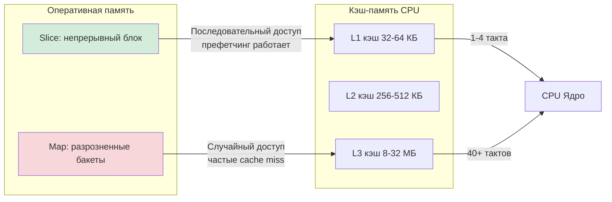
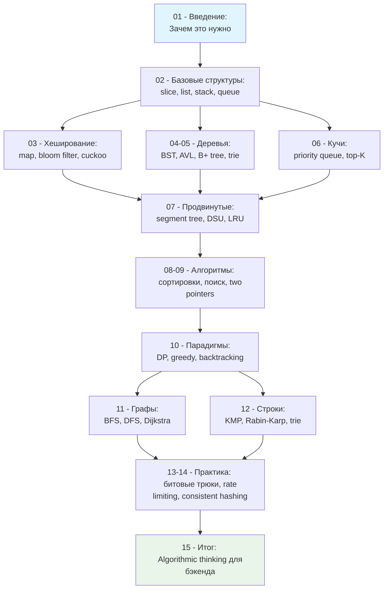

## Почему это важно именно для бэкенд-разработчика

Часто можно услышать мнение, что алгоритмы и структуры данных — это удел олимпиадников, участников Codeforces и тех, кто готовится к собеседованиям в FAANG. «В реальной работе я просто использую `map` и `slice`, а остальное сделает компилятор» — такая позиция распространена, но опасна, особенно если ваша цель — позиция Senior/Lead Go Engineer.

В высоконагруженном бэкенде разница между знанием и незнанием фундаментальных алгоритмов измеряется не в баллах за решённую задачку, а в:
*   **Латентности**: 50 мс против 500 мс на 99-м перцентиле.
*   **Потреблении памяти**: 200 МБ против 2 ГБ на инстанс, что напрямую влияет на частоту срабатываний [[7. Глубокий Go (Внутреннее устройство)|сборщика мусора]].
*   **Масштабируемости**: система, которая линейно масштабируется с ростом нагрузки, против системы, которая «падает» при увеличении данных в 10 раз.
*   **Стоимости инфраструктуры**: тысячи долларов в месяц на облачных провайдерах.

Этот раздел — не про заучивание кода для [[21. Задачи с LeetCode и собеседований на Go|собеседований]]. Это про формирование **инженерной интуиции**: способности смотреть на бизнес-требование и сразу видеть, какая структура данных будет наиболее эффективной с учётом паттернов доступа, объёма данных и ограничений железа.

> [!tip] Собеседование
> **Вопрос:** «У вас есть сервис, который хранит метрики по пользователям. Нужно быстро проверять, был ли пользователь активен за последние 24 часа. Предложите решение».
>
> **Слабый ответ:** «Буду хранить в `map[userID]bool`».
>
> **Сильный ответ:** «Зависит от масштаба. Если пользователей до 100к — `map` подойдёт. Если миллионы — нужно учитывать, что `map` в Go не упорядочен и при росте вызывает реаллокации. Лучше рассмотреть:
> 1.  [[6. Кучи и приоритетные очереди|Min-heap]] с таймстемпами для эффективного удаления устаревших записей.
> 2.  [[3. Хеширование/7. Cuckoo hashing|Cuckoo hashing]] для детерминированного времени доступа и экономии памяти.
> 3.  [[3. Хеширование/6. Bloom filter - вероятностная структура данных|Bloom filter]] если допустимы ложные срабатывания, но критична экономия памяти.
> 4.  [[14. Практические паттерны/2. Rate limiting алгоритмы|Sliding window log]] если нужна точность и учёт временных окон».

## От абстракции к железу: Mechanical Sympathy в действии

Знание алгоритмов без понимания того, как они исполняются на реальном железе — это половина знания. В этом разделе мы всегда будем связывать высокоуровневые концепции с тем, что происходит «под капотом».

### Пример: Почему `map` не всегда быстрее `slice`

Новичок в Go часто думает: «`map` — это O(1), значит всегда быстрее, чем линейный поиск по слайсу». Это верно только в вакууме. Рассмотрим реалистичный сценарий: у вас есть небольшой набор конфигурационных ключей (5-10 элементов), и вы часто проверяете их наличие.

```go
// Вариант 1: Поиск в slice
func hasKeySlice(keys []string, target string) bool {
    for _, k := range keys {
        if k == target {
            return true
        }
    }
    return false
}

// Вариант 2: Поиск в map
func hasKeyMap(lookup map[string]struct{}, target string) bool {
    _, exists := lookup[target]
    return exists
}
```

На первый взгляд, `map` должен выигрывать. Но давайте посмотрим на механику:

> [!info] Под капотом
> **Slice-поиск для малых N:**
> *   Данные хранятся в непрерывном блоке памяти.
> *   Процессор предзагружает кэш-линии (обычно 64 байта) при последовательном обходе — это **аппаратная префетчинг-оптимизация**.
> *   Нет аллокаций в куче, нет косвенных обращений через указатели.
> *   Компилятор Go может применить оптимизации: loop unrolling, векторизацию (в будущем).
>
> **Map-поиск:**
> *   Внутренняя структура `hmap` (описана в [[5. Внутреннее устройство map в Go]]) — это массив бакетов с цепочками.
> *   Доступ к ключу требует: вычисления хеша, маскирования, доступа к бакету, возможного перехода по указателю на overflow-бакет.
> *   Каждый шаг — это потенциальный **cache miss**, так как данные разбросаны по куче.
> *   При создании `map` происходит аллокация в куче, что создаёт давление на [[7. Глубокий Go (Внутреннее устройство)|гарбедж-коллектор]].

```go
//go:build ignore

package main

import (
    "testing"
)

var sink bool

func BenchmarkHasKeySlice(b *testing.B) {
    keys := []string{"auth", "db", "cache", "log", "metrics"}
    target := "cache"
    b.ResetTimer()
    for i := 0; i < b.N; i++ {
        sink = hasKeySlice(keys, target)
    }
}

func BenchmarkHasKeyMap(b *testing.B) {
    lookup := map[string]struct{}{
        "auth": {}, "db": {}, "cache": {}, "log": {}, "metrics": {},
    }
    target := "cache"
    b.ResetTimer()
    for i := 0; i < b.N; i++ {
        sink = hasKeyMap(lookup, target)
    }
}
```

```bash
$ go test -bench=. -benchmem
goos: linux
goarch: amd64
BenchmarkHasKeySlice-8    284519234    4.21 ns/op    0 B/op    0 allocs/op
BenchmarkHasKeyMap-8       45678912   26.43 ns/op    0 B/op    0 allocs/op
```

**Вывод:** Для малых наборов данных линейный поиск по слайсу может быть **в 6 раз быстрее** благодаря **cache locality**. Это и есть механическая симпатия: писать код, который дружит с архитектурой процессора.



## Go-специфика: ваши инструменты уже оптимизированы, но не бесконечно

Одно из преимуществ Go — богатая стандартная библиотека с эффективными структурами данных. Но «эффективная по умолчанию» не значит «оптимальная для вашей задачи».

### Слайсы: не просто динамический массив

[[2. Слайсы в Go как структура данных]] — это абстракция над массивом, но с важными нюансами:
*   При `append` может происходить реаллокация с копированием данных (амортизированная сложность O(1), но с пиками).
*   Слайс — это дескриптор: указатель, длина, ёмкость. Передача слайса в функцию — это копирование 24 байт (на amd64), но не самих данных.
*   **Ловушка**: слайс, созданный как `s := large[:0]`, всё ещё удерживает в памяти весь `large` массив, пока не будет явно переаллоцирован.

### Map: хеш-таблица с открытой адресацией

Внутреннее устройство `map` в Go — это не классическая хеш-таблица с цепочками. Это гибрид с открытой адресацией и линейным пробингом внутри бакетов, что улучшает cache locality. Но:
*   Итерация по `map` не детерминирована — это защита от зависимости от порядка, но может быть неожиданно.
*   Удаление элемента не освобождает память сразу — бакет остаётся, что может привести к «утечке» памяти в долгоживущих мапах.

### Каналы и горутины: структуры данных для конкурентности

[[5. Учебник по Go (Основы и синтаксис)|Горутины]] и каналы — это не просто «потоки и очереди». Это структуры данных рантайма:
*   Канал — это кольцевой буфер с мьютексом и условием (`sync.Mutex` + `sync.Cond`), оптимизированный под паттерны передачи данных.
*   При переполнении канала отправитель блокируется, но не через системный вызов, а через парковку горутины в планировщике Go — это дешевле, чем блокировка потока ОС.

> [!warning] Ловушка / Gotcha
> **Канал не является потокобезопасным хранилищем произвольного доступа.**
> Вы не можете «заглянуть» в канал без извлечения элемента. Если вам нужен приоритетный доступ или произвольный поиск — канал не подходит. Используйте [[6. Кучи и приоритетные очереди|кучу]] с мьютексом или специализированную структуру.

## Когда алгоритмы спасают продакшен: реальные кейсы

### Кейс 1: Rate Limiter для высоконагруженного API

**Задача:** Ограничить количество запросов от одного клиента до 100 в секунду.

**Наивное решение:** Хранить таймстемпы запросов в `[]time.Time` для каждого клиента и при каждом запросе фильтровать старые.
*   Сложность: O(N) на запрос, где N — число запросов за окно.
*   При 100 запросах/сек и 10к клиентов — 1 млн операций в секунду, плюс аллокации под слайсы.

**Оптимальное решение:** [[14. Практические паттерны/2. Rate limiting алгоритмы|Sliding window log]] с кольцевым буфером.
*   Используем [[2. Базовые структуры данных/7. Кольцевой буфер|ring buffer]] фиксированного размера.
*   Сложность: O(1) на добавление и удаление, память предсказуема.
*   В коде: `atomic` операции для индексов, чтобы избежать мьютексов в hot path.

### Кейс 2: Кэширование результатов запросов к БД

**Задача:** Кэшировать результаты запросов с ключом по параметрам, инвалидировать по таймауту.

**Наивное решение:** `map[Query]Result` + `time.AfterFunc` для каждого ключа.
*   Проблема: при высокой частоте запросов создаются тысячи таймеров, каждый — аллокация и нагрузка на GC.

**Оптимальное решение:** [[7. Продвинутые структуры данных/7. LRU кэш|LRU-кэш]] на основе двусвязного списка + хеш-таблицы.
*   Удаление старых элементов — O(1).
*   Можно добавить фоновую горутину для периодической очистки, а не по таймеру на каждый ключ.
*   Используем `sync.Pool` для переиспользования узлов списка, снижая давление на GC.

```go
// Упрощённая структура узла для LRU
type cacheNode struct {
    key   string
    value any
    prev  *cacheNode // nil если голова
    next  *cacheNode // nil если хвост
}

// Пул для переиспользования узлов, снижаем аллокации
var nodePool = sync.Pool{
    New: func() any { return new(cacheNode) },
}
```

## Как мы будем изучать: дорожная карта раздела

Этот раздел построен по принципу «от фундамента к практике». Мы начнём с теории, без которой невозможно осознанно выбирать инструменты, и закончим паттернами, которые можно применять завтра в продакшене.



Каждая статья будет содержать:
1.  **Теорию** с акцентом на Go-реализацию и внутреннее устройство.
2.  **Код** с идиоматичным использованием стандартной библиотеки и пояснениями.
3.  **Бенчмарки** и анализ производительности с учётом аллокаций, кэш-локальности и работы GC.
4.  **Ловушки** и типичные ошибки, которые всплывают на собеседованиях и в продакшене.
5.  **Сравнение** с подходами из других языков (C++, Java, Python), чтобы вы могли переносить опыт.

## Что вы получите в итоге

После прохождения этого раздела вы сможете:
*   **Осознанно выбирать** структуры данных под конкретную задачу, а не по принципу «что первое пришло в голову».
*   **Предсказывать** поведение кода под нагрузкой: где будут узкие места, как поведёт себя память, как отреагирует планировщик Go.
*   **Аргументированно обсуждать** архитектурные решения на код-ревью и проектировании, опираясь на сложность и механику исполнения.
*   **Эффективно готовиться** к собеседованиям: не зазубривая решения, а понимая принципы, которые позволяют вывести решение за 15 минут.
*   **Писать код, который масштабируется**: с первого раза закладывая фундамент для роста нагрузки в 10-100 раз.

> [!tip] Собеседование
> **Вопрос:** «В чём разница между `sync.Map` и обычной `map` с `Mutex`? Когда что использовать?»
>
> **Ответ:** `sync.Map` оптимизирован под два сценария: 1) когда ключи только добавляются и не удаляются, 2) когда несколько горутин читают одни и те же ключи, а пишут в разные. Внутри он использует разделение на «read» и «dirty» части с атомарными операциями, чтобы минимизировать блокировки. Но для общего случая (произвольные чтения/записи) обычная `map` + `RWMutex` часто проще и быстрее из-за меньшего оверхеда. Всегда профилируйте!

## С чего начнём

Следующая статья — фундамент всего раздела. Мы разберём, **как измерять и сравнивать эффективность алгоритмов**, не полагаясь на интуицию или случайные бенчмарки. Вы научитесь различать `O(1)`, `O(log n)` и `O(n²)` не как абстрактные символы, а как реальные паттерны роста времени выполнения и потребления памяти. Поймёте, почему амортизированная сложность `slice` — это не магия, а результат геометрического роста ёмкости, и как это связано с аллокациями в куче.

[[2. Асимптотическая сложность. Big O, Big Theta, Big Omega]]