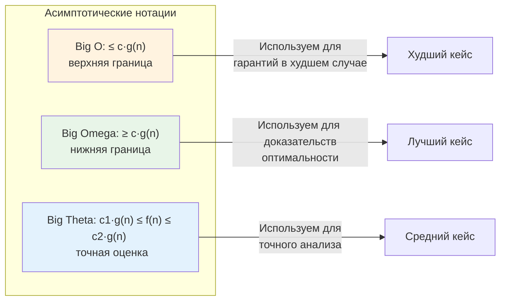
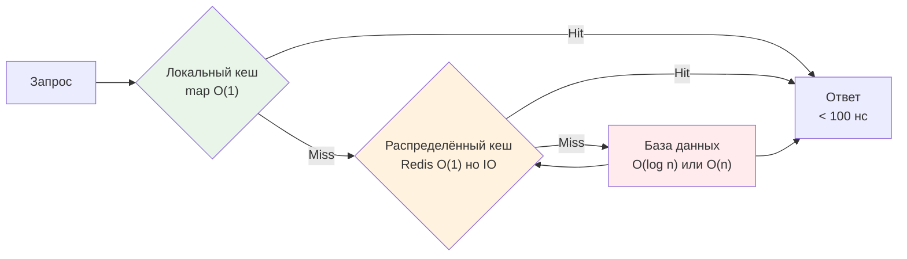

## Зачем бэкенд-разработчику асимптотическая сложность

«Зачем мне знать разницу между O(n) и O(n log n), если у меня есть профилировщик?» — частый вопрос. Ответ прост: профилировщик показывает **что** тормозит, но не объясняет **почему** и **как это будет масштабироваться**.

Асимптотический анализ — это не академическая абстракция, а инструмент предсказания. Когда вы проектируете сервис, который сегодня обрабатывает 1000 запросов в секунду, а завтра должен выдержать 100 000, вы не можете позволить себе «попробовать и посмотреть». Вы должны **спроектировать** систему с правильной сложностью с первого раза.

> [!tip] Собеседование
> **Вопрос:** «У вас есть функция, которая работает быстро на 100 элементах, но «падает» на 100 000. С чего начнёте диагностику?»
>
> **Сильный ответ:** «Сначала оценю асимптотическую сложность ключевых операций. Если вижу вложенные циклы — O(n²) — это первый кандидат. Затем посмотрю на аллокации памяти: возможно, каждый шаг создаёт новый слайс или мапу, что даёт нагрузку на GC. Проверю, нет ли блокировок на мьютексах при росте числа горутин. И только потом запущу pprof, чтобы подтвердить гипотезы».

## Три нотации: не только Big O

В индустрии прижилось говорить «это O(n)», но для глубокого понимания важно различать три асимптотические нотации. Они описывают **границы** роста функции времени выполнения T(n) от размера входных данных n.

### Big O (O) — верхняя граница («не хуже чем»)

**O(g(n))** — это множество функций, которые растут **не быстрее**, чем g(n), с точностью до константы.

```go
// Пример: линейный поиск в слайсе
func LinearSearch(slice []int, target int) bool {
    for _, v := range slice { // O(n) итераций
        if v == target {
            return true
        }
    }
    return false
}
```

Здесь T(n) ≤ c·n для некоторой константы c. Мы говорим: «алгоритм работает за O(n)», имея в виду, что в худшем случае время растёт линейно.

> [!info] Под капотом
> В Go линейный проход по слайсу — это не просто «n шагов». Каждый шаг:
> *   Читает 8 байт (int на amd64) из памяти.
> *   При последовательном доступе работает аппаратный префетчинг: процессор заранее подгружает следующие кэш-линии (64 байта) в L1.
> *   Поэтому реальное время — не просто c·n, а c·n / k, где k — эффективность кэширования.
> *   Но асимптотика остаётся O(n): удвоение n удвоит время, если данные не помещаются в кэш.

### Big Omega (Ω) — нижняя граница («не лучше чем»)

**Ω(g(n))** — функции, которые растут **не медленнее**, чем g(n).

```go
// Пример: доступ к элементу слайса по индексу
func GetByIndex(slice []int, i int) (int, error) {
    if i < 0 || i >= len(slice) {
        return 0, errors.New("index out of range") // O(1) проверка
    }
    return slice[i], nil // O(1) доступ
}
```

Доступ по индексу в слайсе — это Ω(1): он **не может** быть быстрее константного времени, потому что требует хотя бы одного обращения к памяти.

### Big Theta (Θ) — точная оценка («растёт как»)

**Θ(g(n))** — пересечение O(g(n)) и Ω(g(n)). Функция растёт **пропорционально** g(n).

```go
// Пример: суммирование элементов слайса
func Sum(slice []int) int {
    total := 0
    for _, v := range slice { // Ровно n итераций
        total += v
    }
    return total
}
```

Здесь T(n) = c·n + d, что есть Θ(n). Мы знаем и верхнюю, и нижнюю границу.



> [!warning] Ловушка / Gotcha
> **Big O — это не про скорость, это про рост.**
> Алгоритм O(n) может быть медленнее O(n²) на малых n из-за констант. Например, сортировка вставками (O(n²)) часто быстрее быстрой сортировки (O(n log n)) на массивах до 10-20 элементов. Компилятор Go использует это в [[8. Сортировки/9. Внутренности пакета sort в Go]]: для малых слайсов переключается на insertion sort.

## Практическая таблица сложностей для бэкенда

| Сложность | Название | Пример в бэкенде | Реальное влияние в Go |
|-----------|----------|-----------------|---------------------|
| **O(1)** | Константная | Доступ к `map` по ключу, атомарная операция | Один хоп в кэш, нет аллокаций, минимальное давление на GC |
| **O(log n)** | Логарифмическая | Поиск в [[4. Деревья. Основы/3. Двоичное дерево поиска|BST]], бинарный поиск | ~20 шагов для 1 млн элементов, но каждый шаг — потенциальный cache miss |
| **O(n)** | Линейная | Обработка запроса, линейный поиск, копирование слайса | Пропорционально данным, но последовательный доступ дружит с префетчингом |
| **O(n log n)** | Линейно-логарифмическая | Сортировка, агрегация с группировкой | Стандарт для эффективных алгоритмов, но может аллоцировать временные буферы |
| **O(n²)** | Квадратичная | Вложенные циклы, наивное сравнение всех пар | Опасно при росте: 1000 элементов → 1 млн операций, 10 000 → 100 млн |
| **O(2ⁿ)** | Экспоненциальная | Перебор всех подмножеств, рекурсия без мемоизации | Практически неприменимо в продакшене даже для n > 30 |

## Go-специфика: как сложность проявляется в рантайме

### Аллокации и сборщик мусора

Асимптотика описывает время, но в Go **память — это тоже время**. Каждая аллокация в куче:
1.  Требует работы аллокатора рантайма (быстрый bump-pointer для малых объектов, но с оверхедом).
2.  Создаёт работу для [[7. Глубокий Go (Внутреннее устройство)|сборщика мусора]], который сканирует кучу пропорционально её размеру.

```go
// Плохо: создаём новый слайс на каждой итерации — O(n²) аллокаций
func BadConcat(strings []string) string {
    result := ""
    for _, s := range strings { // n итераций
        result += s // Создаёт новый string каждый раз!
    }
    return result
}

// Хорошо: используем strings.Builder — O(n) аллокаций
func GoodConcat(strings []string) string {
    var b strings.Builder
    b.Grow(estimateSize(strings)) // Предварительное выделение, избегает реаллокаций
    for _, s := range strings {
        b.WriteString(s)
    }
    return b.String()
}
```

> [!info] Под капотом
> Операция `result += s` для строк создаёт новый объект в куче, копируя старое содержимое и добавляя новое. Для n строк длиной m это даёт:
> *   Время: O(n²·m) из-за повторных копирований.
> *   Память: O(n²·m) временно, пока старые строки не собраны GC.
> *   Давление на GC: пропорционально числу аллокаций, что может увеличить паузы.

### Конкурентность не спасает от плохой сложности

Частая ошибка: «У меня O(n²), но я запущу в 100 горутин — и будет быстро». Это заблуждение.

```go
// Не делайте так: параллелизм не меняет асимптотику
func ParallelBad(data [][]int) []int {
    results := make([]int, len(data))
    var wg sync.WaitGroup
    for i, row := range data { // n строк
        wg.Add(1)
        go func(idx int, r []int) {
            defer wg.Done()
            // O(n) на строку → общая сложность O(n²)
            results[idx] = expensiveOp(r) 
        }(i, row)
    }
    wg.Wait()
    return results
}
```

Горутины позволяют утилизировать несколько ядер, но если каждый поток делает O(n) работы, а потоков n — общий объём работы остаётся O(n²). Плюс добавляется оверхед на планировщик и синхронизацию.

> [!tip] Собеседование
> **Вопрос:** «Может ли параллельный алгоритм иметь меньшую асимптотическую сложность, чем последовательный?»
>
> **Ответ:** В модели с неограниченным числом процессоров — теоретически да (например, параллельное суммирование за O(log n)). Но в реальности с фиксированным числом ядер сложность по времени не может стать лучше, чем работа / ядра. Для бэкенда важнее **пропускная способность** (через параллелизм), а не латентность одного запроса.

## Бенчмарки: когда теория встречается с практикой

Давайте сравним два подхода к поиску дубликатов в слайсе:

```go
// O(n²): наивное сравнение всех пар
func HasDuplicatesNaive(slice []int) bool {
    for i := 0; i < len(slice); i++ {
        for j := i + 1; j < len(slice); j++ {
            if slice[i] == slice[j] {
                return true
            }
        }
    }
    return false
}

// O(n): использование map для отслеживания увиденных значений
func HasDuplicatesMap(slice []int) bool {
    seen := make(map[int]struct{}, len(slice))
    for _, v := range slice {
        if _, exists := seen[v]; exists {
            return true
        }
        seen[v] = struct{}{}
    }
    return false
}
```

```go
//go:build ignore

package main

import "testing"

func BenchmarkDuplicatesNaive(b *testing.B) {
    data := make([]int, 1000)
    for i := range data {
        data[i] = i % 500 // Гарантируем дубликаты
    }
    b.ResetTimer()
    for i := 0; i < b.N; i++ {
        _ = HasDuplicatesNaive(data)
    }
}

func BenchmarkDuplicatesMap(b *testing.B) {
    data := make([]int, 1000)
    for i := range data {
        data[i] = i % 500
    }
    b.ResetTimer()
    for i := 0; i < b.N; i++ {
        _ = HasDuplicatesMap(data)
    }
}
```

```bash
$ go test -bench=. -benchmem
goos: linux
goarch: amd64
BenchmarkDuplicatesNaive-8      12543    95234 ns/op    0 B/op    0 allocs/op
BenchmarkDuplicatesMap-8       187654     6421 ns/op  8192 B/op    1 allocs/op
```

**Анализ:**
*   Naive: O(n²) = 1 млн сравнений для n=1000 → ~95 мкс.
*   Map: O(n) = 1000 хеш-операций → ~6.4 мкс, **в 15 раз быстрее**.
*   Но: map аллоцирует ~8 КБ в куче. Для разового вызова — не проблема. Для 10 000 вызовов в секунду — 80 МБ/с аллокаций, что создаст нагрузку на GC.

> [!warning] Ловушка / Gotcha
> **Не оптимизируйте сложность в ущерб простоте без профилирования.**
> Если слайс гарантированно мал (например, ≤ 10 элементов), наивный O(n²) код может быть быстрее из-за отсутствия аллокаций и лучшего предсказания ветвлений. Всегда измеряйте на реальных данных!

## Сложность и системный дизайн: масштабирование архитектур

Асимптотика определяет не только код, но и архитектуру.

### Пример: кеширование запросов

*   **Кеш в памяти на одном инстансе**: `map[Request]Response` → O(1) доступ, но память ограничена, нет распределённости.
*   **Распределённый кеш (Redis)**: сетевой вызов → O(1) по сложности, но латентность 0.5-2 мс из-за IO.
*   **Локальный кеш + распределённый (L1/L2)**: сначала проверяем локальную map (O(1), наносекунды), при промахе — идём в Redis. Это паттерн [[14. Практические паттерны/1. Проектирование кэшей]].



**Вывод:** Даже если все операции имеют сложность O(1), их **реальная стоимость** различается на порядки из-за иерархии памяти и сетевых задержек. Асимптотика — первый фильтр, но не последний.

## Как оценивать сложность: чеклист для код-ревью

1.  **Определите входные данные**: что такое «n»? Число пользователей? Размер файла? Глубина вложенности JSON?
2.  **Найдите доминирующую операцию**: вложенный цикл? Рекурсия? Блокировка на мьютексе?
3.  **Учтите аллокации**: создаются ли новые слайсы/мапы внутри цикла? Это может превратить O(n) по времени в O(n) по памяти с нагрузкой на GC.
4.  **Проверьте худший случай**: алгоритм может быть быстрым на средних данных, но деградировать на краевых (например, хеш-таблица при коллизиях).
5.  **Спросите «что если данных станет в 10 раз больше?»**: если ответ «будет работать в 10 раз дольше» — это O(n). Если «в 100 раз» — O(n²), тревога.

> [!tip] Собеседование
> **Вопрос:** «Какова сложность этой функции?» (показывают код с `sort.Slice` внутри цикла)
>
> **Подход к ответу:**
> 1.  Внешний цикл: O(m) итераций.
> 2.  `sort.Slice` внутри: O(k log k), где k — размер слайса.
> 3.  Если k зависит от m (например, k = m), то общая сложность: O(m · m log m) = O(m² log m).
> 4.  Уточните: «Зависит ли размер слайса от числа итераций? Если k константно, то сложность O(m)».

## Итог

*   **Big O** — ваш щит против деградации производительности при росте данных.
*   **Big Omega и Theta** — инструменты для точного анализа и доказательств оптимальности.
*   **В Go сложность — это не только время**: учитывайте аллокации, работу GC, кэш-локальность и конкурентность.
*   **Параллелизм не меняет асимптотику**, но может улучшить пропускную способность.
*   **Всегда профилируйте**: теория задаёт направление, но реальные данные и рантайм вносят коррективы.

Следующая статья углубит понимание: мы разберём, почему `append` к слайсу считается O(1), хотя иногда он делает дорогую реаллокацию. Вы узнаете, как работает **амортизированный анализ** и почему он критически важен для проектирования динамических структур данных в высоконагруженных системах.

[[3. Амортизированный анализ]]