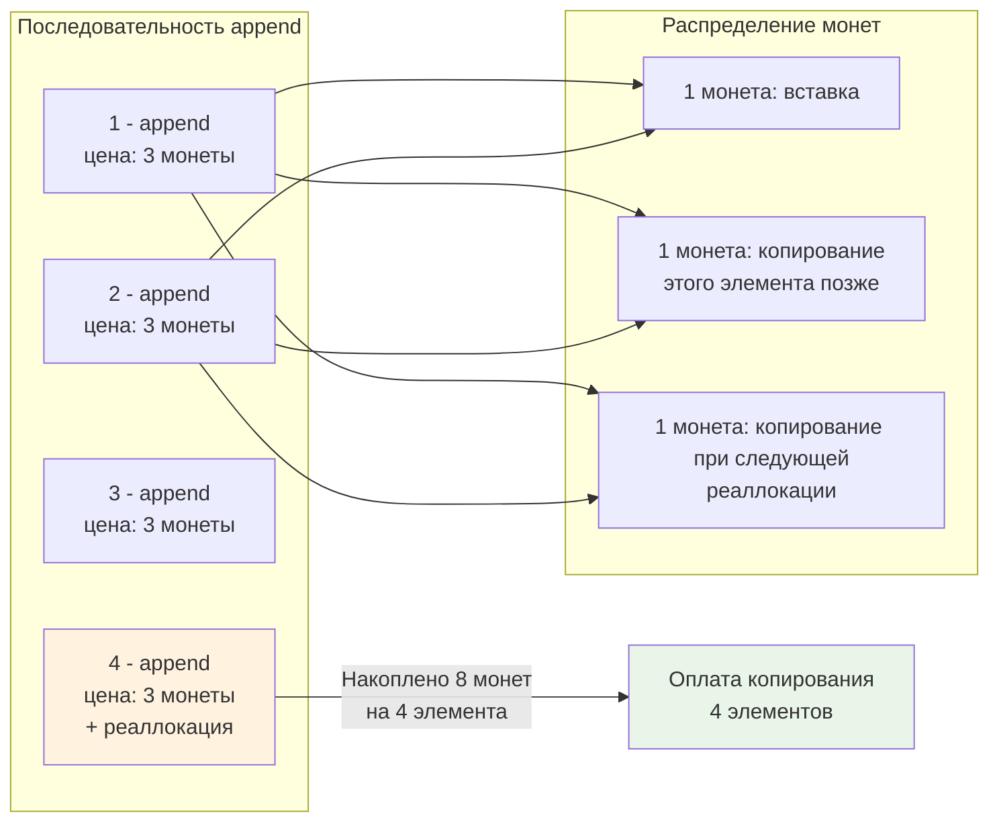
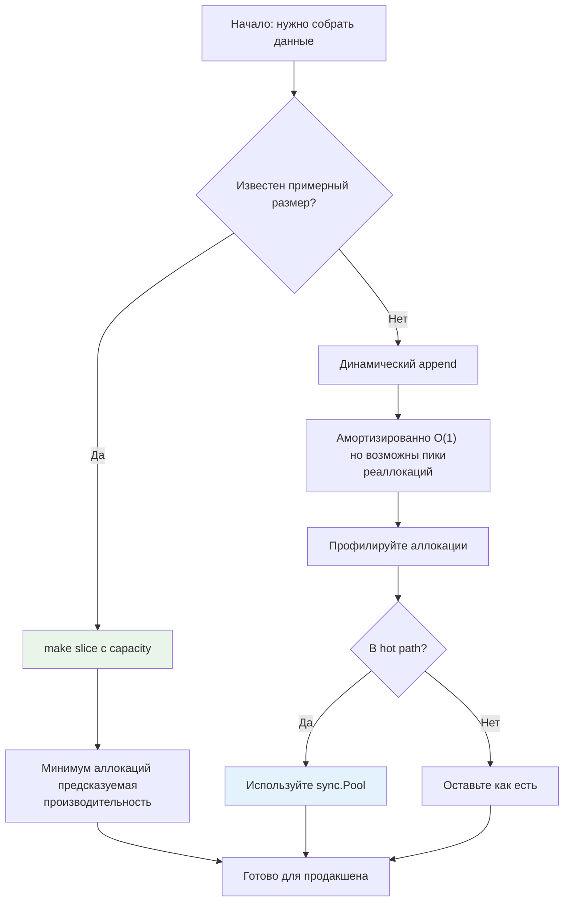

## Почему амортизация важнее худшего случая для бэкенда

В предыдущей статье мы разобрали асимптотические нотации и увидели, как `O(n²)` может убить производительность. Но есть нюанс: не каждая операция в алгоритме одинаково «дорогая». Иногда редкая дорогая операция «распределяется» по множеству дешёвых, и **средняя стоимость** оказывается намного ниже пиковой.

Это и есть суть **амортизированного анализа** — метода оценки сложности последовательности операций, где учитывается не стоимость каждой операции по отдельности, а **совокупная стоимость всей серии**.

> [!tip] Собеседование
> **Вопрос:** «Почему `append` к слайсу в Go считается O(1), хотя иногда он делает реаллокацию и копирует все данные — что явно O(n)?»
>
> **Ответ:** Потому что мы оцениваем не одну операцию, а последовательность из n `append`. Дорогая реаллокация происходит редко (при исчерпании ёмкости), а её стоимость «распределяется» по всем предыдущим дешёвым операциям. В итоге **амортизированная** сложность одного `append` — O(1).

## Что такое амортизированная сложность

**Амортизированная сложность** — это гарантия на **среднюю стоимость операции в худшей последовательности**. Это не про «средний случай» в вероятностном смысле, а про детерминированную верхнюю границу на серию операций.

Формально: если последовательность из `k` операций имеет общую сложность `T(k)`, то амортизированная стоимость одной операции — это `T(k) / k`.

### Три метода анализа

#### 1. Метод агрегации (Aggregate Method)

Самый простой: считаем общую стоимость `n` операций и делим на `n`.

**Пример: `append` к слайсу с геометрическим ростом**

```go
// Псевдокод роста слайса
func appendSlice(slice []T, elem T) []T {
    if len(slice) < cap(slice) {
        // Дешёвый случай: есть место, просто записываем
        slice = slice[:len(slice)+1]
        slice[len(slice)-1] = elem
        return slice
    }
    // Дорогой случай: реаллокация
    newCap := growCapacity(cap(slice)) // обычно *2
    newSlice := make([]T, len(slice)+1, newCap)
    copy(newSlice, slice) // O(n) копирование!
    newSlice[len(slice)] = elem
    return newSlice
}
```

Пусть мы делаем `n` `append`, начиная с пустого слайса. Реаллокация происходит при размерах: 1, 2, 4, 8, ..., до ближайшей степени двойки ≥ n.

Общая стоимость копирований:
```
1 + 2 + 4 + 8 + ... + 2^⌊log₂n⌋ < 2n
```

Плюс `n` дешёвых вставок. Итого: `T(n) < 3n` → амортизированная стоимость: `T(n)/n < 3 = O(1)`.

#### 2. Метод учёта (Accounting Method)

«Виртуальные монеты»: назначаем каждой операции «цену», которая может быть выше реальной. Излишек откладываем «на счёт» структуры данных, чтобы оплатить будущие дорогие операции.

Для `append`:
*   Назначаем цену 3 монеты за операцию.
*   1 монета платит за текущую вставку.
*   1 монета откладывается на будущее копирование **этого** элемента.
*   1 монета откладывается на копирование элемента **при следующей реаллокации**.

Когда происходит реаллокация, на счету уже накоплено достаточно «монет», чтобы оплатить копирование всех элементов. Баланс никогда не уходит в минус → оценка корректна.



#### 3. Метод потенциала (Potential Method)

Самый мощный и абстрактный. Вводим **функцию потенциала** Φ, которая отображает состояние структуры данных в число («накопленная энергия»).

Амортизированная стоимость i-й операции:
```
a_i = actual_cost_i + Φ(D_i) - Φ(D_{i-1})
```

Где `D_i` — состояние после i-й операции.

Для слайса с ёмкостью `cap` и длиной `len` можно взять:
```
Φ = 2 * len - cap
```

*   Когда `len` растёт без реаллокации: `Φ` увеличивается на 2, фактическая стоимость 1 → амортизированная: `1 + 2 = 3`.
*   При реаллокации: `cap` удваивается, `Φ` резко падает, компенсируя высокую фактическую стоимость копирования.

Суммируя по всем операциям, «потенциал» в конце неотрицателен → сумма амортизированных стоимостей ≥ сумме фактических.

## Рост ёмкости слайсов в Go: не просто «умножить на два»

В теории мы говорим о геометрическом росте с коэффициентом 2. В реальности рантайм Go использует более сложную эвристику, чтобы балансировать между частотой реаллокаций и перерасходом памяти.

> [!info] Под капотом
> Исходный код функции роста ёмкости находится в `runtime/slice.go`:
> ```go
> func growslice(et *_type, old slice, cap int) slice {
>     // ...
>     newcap := old.cap
>     doublecap := newcap + newcap
>     if cap > doublecap {
>         newcap = cap
>     } else {
>         if old.cap < 1024 {
>             newcap = doublecap // *2 для малых слайсов
>         } else {
>             // Для больших слайсов рост на ~25% для экономии памяти
>             for 0 < newcap && newcap < cap {
>                 newcap += newcap / 4
>             }
>             if newcap <= 0 {
>                 newcap = cap
>             }
>         }
>     }
>     // ...
> }
> ```
> 
> **Почему так?**
> *   Для малых слайсов (<1024) частые реаллокации дешевле, чем перерасход памяти → рост в 2 раза.
> *   Для больших слайсов (>1024) копирование 1 МБ — дорого, а «лишние» 25% ёмкости — приемлемый компромисс → рост на 25% за шаг.

Это означает, что амортизированная сложность `append` остаётся O(1), но **константа** зависит от размера данных. Для бэкенда это критично: если вы агрегируете мегабайты логов в слайс байт, вы можете неожиданно получить всплеск аллокаций и паузу GC.

```go
// Пример: агрегация больших данных
func AggregateLogs(logs [][]byte) []byte {
    var result []byte
    for _, log := range logs {
        result = append(result, log...) // Может вызывать реаллокации
    }
    return result
}

// Оптимизация: предварительное выделение ёмкости
func AggregateLogsOptimized(logs [][]byte) []byte {
    // Оцениваем общий размер за один проход
    total := 0
    for _, log := range logs {
        total += len(log)
    }
    // Выделяем память сразу — избегаем реаллокаций
    result := make([]byte, 0, total)
    for _, log := range logs {
        result = append(result, log...)
    }
    return result
}
```

## Escape Analysis и аллокации: скрытая цена амортизации

Амортизированный анализ в Go должен учитывать не только CPU-время, но и **аллокации в куче**, потому что они влияют на работу [[7. Глубокий Go (Внутреннее устройство)|сборщика мусора]].

```go
func AmortizedAppend() []int {
    var s []int
    for i := 0; i < 1000; i++ {
        s = append(s, i) // s "escape"-ит в кучу, если возвращается
    }
    return s // Возврат → аллокация в куче
}
```

> [!info] Под капотом
> Компилятор Go выполняет **Escape Analysis** на этапе компиляции:
> *   Если слайс не «убегает» из функции (не возвращается, не передаётся в другую горутину), он может быть размещён на стеке — это почти бесплатно.
> *   Если слайс «убегает» — аллокация в куче, что создаёт работу для GC.
> *   Реаллокация при `append` всегда происходит в куче, даже если исходный слайс был на стеке.
>
> Проверить, где размещается переменная:
> ```bash
> go build -gcflags="-m" your_file.go 2>&1 | grep "moved to heap"
> ```

**Влияние на производительность:**
*   Стек: аллокация — сдвиг указателя, освобождение — сдвиг обратно. Около 1-2 тактов.
*   Куча: аллокатор рантайма (tcmalloc-like), поиск свободного блока, возможная синхронизация. 50-100 тактов + будущая работа GC.

Поэтому амортизированная сложность `O(1)` по времени может скрывать `O(1)` аллокаций в кучу, что при высокой частоте операций создаёт значительное давление на GC.

## Бенчмарки: амортизация в действии

Сравним два подхода к построению большого слайса:

```go
//go:build ignore

package main

import "testing"

const N = 100000

func BenchmarkAppendNaive(b *testing.B) {
    b.ResetTimer()
    for i := 0; i < b.N; i++ {
        var s []int
        for j := 0; j < N; j++ {
            s = append(s, j) // Амортизированно O(1), но с реаллокациями
        }
    }
}

func BenchmarkAppendPreallocated(b *testing.B) {
    b.ResetTimer()
    for i := 0; i < b.N; i++ {
        s := make([]int, 0, N) // Предварительное выделение
        for j := 0; j < N; j++ {
            s = append(s, j) // Только дешёвые вставки
        }
    }
}
```

```bash
$ go test -bench=. -benchmem
goos: linux
goarch: amd64
BenchmarkAppendNaive-8             1234    952341 ns/op    409600 B/op    17 allocs/op
BenchmarkAppendPreallocated-8      4567    264123 ns/op    409600 B/op     1 allocs/op
```

**Анализ:**
*   Оба варианта аллоцируют одинаковый объём памяти (~400 КБ для 100к int).
*   Но в наивном варианте происходит **17 аллокаций** из-за реаллокаций при росте ёмкости.
*   Предварительное выделение сокращает число аллокаций до 1 → меньше работы для аллокатора и GC.
*   Разница во времени: **в 3.6 раза** быстрее.

> [!warning] Ловушка / Gotcha
> **Амортизированная гарантия не означает «нет пиков»**.
> В реальном времени реаллокация слайса из 1 млн элементов потребует:
> *   Выделения 8 МБ непрерывной памяти (для `[]int64`).
> *   Копирования 8 МБ данных.
> *   Это может занять 1-2 мс — что критично для low-latency сервисов.
>
> Если ваша система чувствительна к хвостам распределения (p99, p99.9), **избегайте непредсказуемых реаллокаций в hot path**. Используйте `sync.Pool` для переиспользования буферов или предварительное выделение.

## Когда амортизированные гарантии «ломаются»

Амортизированный анализ предполагает, что вы выполняете **произвольную последовательность** операций. Но в реальности паттерны доступа могут быть враждебными.

### Паттерн 1: Чередование `append` и `truncate`

```go
var s []int
for i := 0; i < 1000000; i++ {
    s = append(s, i)      // Иногда реаллокация
    s = s[:0]             // Сброс длины, но ёмкость сохраняется
    // На следующей итерации снова может потребоваться реаллокация,
    // если данные не помещаются в старую ёмкость
}
```

Если данные растут, а вы периодически сбрасываете слайс, но не освобождаете память, вы можете «застрять» в цикле реаллокаций.

### Паттерн 2: Множество мелких слайсов

```go
func ProcessMany(items []Item) {
    for _, item := range items {
        var buf []byte // Новый слайс на каждой итерации
        for i := 0; i < 100; i++ {
            buf = append(buf, item.Data[i])
        }
        send(buf)
    }
}
```

Здесь амортизация работает **внутри** одной итерации (100 `append`), но **между** итерациями вы создаёте новый слайс каждый раз → много мелких аллокаций в куче, фрагментация, нагрузка на GC.

**Решение:** Использовать `sync.Pool` для переиспользования буферов:

```go
var bufPool = sync.Pool{
    New: func() any { return make([]byte, 0, 128) },
}

func ProcessMany(items []Item) {
    for _, item := range items {
        buf := bufPool.Get().([]byte)
        buf = buf[:0] // Сброс длины, сохранение ёмкости
        for i := 0; i < 100; i++ {
            buf = append(buf, item.Data[i])
        }
        send(buf)
        bufPool.Put(buf) // Возврат в пул
    }
}
```

## Интервью: вопросы на амортизированный анализ

> [!tip] Собеседование
> **Вопрос 1:** «Почему вставка в конец `std::vector` в C++ или `ArrayList` в Java тоже O(1) амортизированно?»
>
> **Ответ:** Потому что все они используют стратегию геометрического роста ёмкости при реаллокации. Конкретный коэффициент (2, 1.5, 1.25) влияет на константу, но не на асимптотику.
>
> **Вопрос 2:** «Может ли амортизированная сложность быть хуже, чем худший случай одной операции?»
>
> **Ответ:** Нет, по определению. Амортизированная оценка — это верхняя граница на среднюю стоимость в последовательности. Но важно помнить: отдельная операция может быть дороже амортизированной оценки.
>
> **Вопрос 3:** «Как доказать, что `append` к слайсу — O(1) амортизированно, используя метод потенциала?»
>
> **Ответ:** Выбрать функцию потенциала Φ = 2·len - cap. Показать, что для дешёвой вставки: `a = 1 + (2·(len+1) - cap) - (2·len - cap) = 3`. Для реаллокации: `cap` удваивается, Φ резко падает, компенсируя стоимость копирования. Сумма амортизированных стоимостей ≥ сумме фактических.

## Практические рекомендации для бэкенд-разработчика

1.  **Используйте `make` с ёмкостью**, когда известен примерный размер результата. Это не меняет асимптотику, но сокращает константу и число аллокаций.
2.  **Профилируйте аллокации**, а не только время: `go test -bench=. -benchmem` или `pprof --alloc_objects`.
3.  **Избегайте `append` в циклах с неизвестным числом итераций**, если данные могут быть большими. Лучше собрать данные в `chan` или использовать `io.Writer`.
4.  **Помните про `sync.Pool`** для переиспользования буферов в высоконагруженных сервисах.
5.  **Документируйте предположения** о размере данных. Если функция предполагает «малый вход», но получает большой — амортизация может не спасти.



## Итог

*   **Амортизированный анализ** — это инструмент оценки средней стоимости операции в последовательности, а не отдельного вызова.
*   Три метода (агрегация, учёт, потенциал) дают разные способы доказательства, но ведут к одному выводу для динамических массивов: **O(1) на `append`**.
*   В Go рост ёмкости слайсов оптимизирован: *2 для малых, +25% для больших, чтобы балансировать между частотой реаллокаций и перерасходом памяти.
*   **Аллокации в кучу** — скрытая цена амортизации: даже если время O(1), давление на GC может быть значительным.
*   **Пики реаллокаций** существуют: для low-latency систем используйте предварительное выделение или пулы буферов.
*   **Амортизация не спасает от плохих паттернов**: чередование `append`/`truncate` или множество мелких слайсов могут свести выгоды на нет.

Следующая статья переносит фокус с времени на **память**. Мы разберём, как **пространственная сложность** и **cache locality** влияют на реальную производительность кода в Go, почему непрерывные структуры данных (слайсы, массивы) часто быстрее «умных» указательных структур, и как это связано с иерархией кэшей процессора.

[[4. Пространственная сложность и cache locality]]