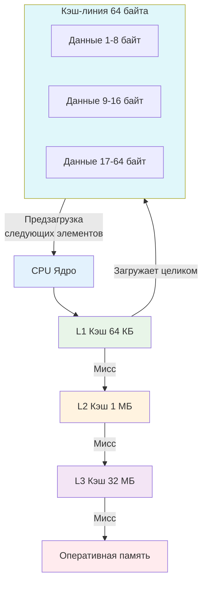

## Почему пространственная сложность важнее временной на современном железе

В учебниках по алгоритмам пространственная сложность часто подаётся как второстепенный метрик: «если памяти хватит, то O(n) по памяти допустимо». В реальном высоконагруженном бэкенде на Go это утверждение **ложно**.

Современные процессоры достигли парадокса: они выполняют инструкции в десятки раз быстрее, чем происходит доступ к оперативной памяти. Это явление называют **Memory Wall** (Стена памяти). CPU может выполнить сотни операций с данными в регистрах, пока ждёт один запрос в RAM.

Поэтому на практике:
*   **Время выполнения** определяется не количеством инструкций, а количеством **cache misses**.
*   **Память** — это не только объём в байтах, это паттерн доступа, выравнивание, фрагментация и давление на [[7. Глубокий Go (Внутреннее устройство)|сборщик мусора]].
*   **Пространственная локальность** часто выигрывает у «умных» алгоритмов с лучшей асимптотикой, но худшей локальностью.

> [!tip] Собеседование
> **Вопрос:** «Почему обход связного списка медленнее обхода массива на том же числе элементов, даже если оба имеют O(n) по времени?»
>
> **Ответ:** Массив хранит элементы в непрерывном блоке памяти. При запросе первого элемента CPU загружает не его одного, а целую **кэш-линию** (обычно 64 байта). Следующие элементы оказываются в L1-кэше бесплатно. Связный список хранит элементы в произвольных участках кучи, соединённых указателями. Каждый переход — потенциальный cache miss, ожидание RAM на 100+ нс и простой конвейера процессора.

## Пространственная сложность в Go: абстракция vs реальность

Книжная O(n) памяти скрывает накладные расходы рантайма Go. При проектировании структур данных нужно учитывать не только полезные данные, но и служебные метаданные.

| Структура | Реальный оверхед на элемент в Go (amd64) | Примечание |
|-----------|------------------------------------------|------------|
| `[]int`   | 8 байт на элемент                        | Непрерывный блок, минимум метаданных |
| `[]*int`  | 8 байт на указатель + 8 байт на `int` + фрагментация кучи | Двойное обращение к памяти |
| `map[K]V` | 8-16 байт записей + 8 байт на бакет + overflow-указатели | Внутренняя структура `hmap` и массив бакетов |
| `interface` | 16 байт на дескриптор (`type*, data*`) + аллокация значения в кучу | Интерфейсы с большими значениями всегда escape-ят |
| `string`  | 16 байт дескриптор (`*byte, len`) | Сами байты могут быть в RO-сегменте или куче |

```go
// Пример: скрытые затраты на мапу
type User struct {
    ID   uint64
    Name string
}

// map[uint64]User выглядит компактно, но под капотом:
// 1. hmap (заголовок мапы)
// 2. Массив бакетов (bmap), каждый хранит до 8 пар ключ-значение
// 3. При переполнении бакета создаются overflow-бакеты (указатели + аллокации)
// 4. Каждый бакет содержит служебные байты для хранения хешей и топ-хешей
```

> [!info] Под капотом
> Внутренняя структура `hmap` (см. [[5. Внутреннее устройство map в Go]]) занимает фиксированные 48 байт плюс динамический массив бакетов. Для `n` элементов в худшем случае может потребоваться до `O(n)` дополнительной памяти на overflow-бакеты и выравнивание. Если вы храните миллионы ключей, эти 20-30% оверхеда превращаются в сотни мегабайт, которые придётся сканировать [[7. Глубокий Go (Внутреннее устройство)|GC]] на каждой итерации.

## Иерархия памяти и Cache Locality

Понимание того, как CPU работает с памятью, превращает написание кода из «угадывания» в инженерию.

### Уровни кэширования
*   **L1 Data Cache:** 32-64 КБ, доступ за 3-4 такта. Делится на кэш-линии по 64 байта.
*   **L2 Cache:** 256 КБ - 1 МБ, доступ за 10-20 тактов. Обычно приватный на ядро.
*   **L3 Cache:** 8-64 МБ, доступ за 30-50 тактов. Общий для всех ядер CPU.
*   **RAM:** Гигабайты, доступ за 100-300 нс (сотни тактов).

**Кэш-линия** — минимальная единица передачи данных между уровнями памяти. Когда вы читаете один `int64`, CPU загружает в кэш 64 байта вокруг него. Это и есть основа **пространственной локальности**.

### Виды локальности
1.  **Пространственная (Spatial Locality):** Если вы обратились к адресу `A`, высока вероятность, что скоро обратитесь к `A+1`, `A+2`. Массивы и слайсы выигрывают за счёт этого.
2.  **Временная (Temporal Locality):** Если вы обратились к адресу `A`, скоро снова обратитесь к нему. Кэширование результатов запросов, повторное использование объектов из `sync.Pool`.



## Влияние на структуры данных в Go

Выбор между массивом значений и массивом указателей — это выбор между cache-friendly и cache-unfriendly архитектурой.

### Слайс значений vs Слайс указателей

```go
type Data struct {
    ID    uint64
    Score float64
    Flag  bool
}

// Вариант A: непрерывный массив структур (cache-friendly)
var sliceOfValues []Data

// Вариант B: массив указателей на структуры (cache-unfriendly)
var sliceOfPointers []*Data
```

При обходе `sliceOfValues` CPU загружает кэш-линии последовательно. Структуры идут друг за другом. Обход происходит быстро.
При обходе `sliceOfPointers` CPU сначала читает указатель (8 байт), затем переходит по нему в случайное место кучи. Каждая итерация — потенциальный cache miss.

> [!warning] Ловушка / Gotcha
> **Указатели не бесплатны, даже если экономят память.**
> В Go `[]*Data` может казаться выгодным, если структуры большие и передаются в функции по ссылке. Но для алгоритмов обхода, фильтрации или агрегации массив указателей почти всегда **медленнее** массива значений на 30-70% из-за потери пространственной локальности. Компилятор не может предсказать, куда указывают ссылки, поэтому аппаратный префетчинг не работает.

### Когда указатели всё же нужны
*   Полиморфизм (разные типы в одном слайсе через интерфейс).
*   Мутация данных без копирования (если структуры очень большие, >1 КБ).
*   Совместное использование данных между горутинами (но тогда нужен `sync.RWMutex` или атомарные операции).

## Выравнивание структур и скрытые потери памяти

Компилятор Go автоматически выравнивает поля структур в соответствии с их типом, чтобы CPU мог читать их за одну инструкцию. Это создаёт **padding** (отступы), которые увеличивают пространственную сложность.

```go
// Плохое выравнивание (amd64)
type BadStruct struct {
    A bool    // 1 байт
    B int64   // 8 байт (требует выравнивания по 8)
    C bool    // 1 байт
}
// Размер: 1 + 7(padding) + 8 + 1 + 7(padding) = 24 байта

// Хорошее выравнивание
type GoodStruct struct {
    B int64   // 8 байт
    A bool    // 1 байт
    C bool    // 1 байт
}
// Размер: 8 + 1 + 1 + 6(padding до 8) = 16 байт
```

Для миллиона элементов разница составит **8 МБ** дополнительной памяти. В куче это приводит к более частым page faults, большему давлению на GC и ухудшению cache locality, так как полезные данные «размазаны» по большему числу кэш-линий.

> [!info] Под капотом
> Для проверки выравнивания в проекте используйте утилиту `fieldalignment` из `golang.org/x/tools/go/analysis/passes/fieldalignment/cmd/fieldalignment`. Она автоматически покажет, сколько байт можно сэкономить, переупорядочив поля:
> ```bash
> $ fieldalignment ./...
> # или в go.mod: require golang.org/x/tools v0.21.0
> ```

## GC, Escape Analysis и локальность

Сборщик мусора в Go использует триколорный алгоритм с concurrent mark-and-sweep. Его производительность напрямую зависит от количества указателей в куче и их локальности.

*   **Плохая локальность:** Миллионы мелких объектов в случайных местах кучи. GC должен обойти всю кучу, проверяя каждый указатель. Это увеличивает время пауз и потребление CPU.
*   **Хорошая локальность:** Крупные непрерывные слайсы или структуры. GC быстро сканирует блок памяти, находит живые объекты и пропускает мёртвые. Паузы короче.

**Escape Analysis** определяет, куда попадёт объект: на стек или в кучу.
*   Объекты на стеке: освобождаются мгновенно при возврате из функции, не нагружают GC, обладают идеальной локальностью.
*   Объекты в куче: живут долго, фрагментируют память, требуют сканирования GC.

```go
func ProcessHeap() *Data {
    d := &Data{ID: 1} // &d указывает на аллокацию в куче
    return d          // escape to heap
}

func ProcessStack() Data {
    d := Data{ID: 1}  // размещается на стеке
    return d          // копируется в caller или в кучу caller-а, но GC не трогает
}
```

## Практический бенчмарк: массив значений против массива указателей

Сравним суммирование поля `Score` в двух вариантах реализации.

```go
//go:build ignore

package main

import (
    "testing"
)

type Item struct {
    ID    uint64
    Score float64
}

func SumValues(items []Item) float64 {
    var total float64
    for i := range items {
        total += items[i].Score
    }
    return total
}

func SumPointers(items []*Item) float64 {
    var total float64
    for i := range items {
        total += items[i].Score
    }
    return total
}

func benchmarkSum(b *testing.B, usePointers bool) {
    const n = 100000
    var valItems []Item
    var ptrItems []*Item

    for i := 0; i < n; i++ {
        valItems = append(valItems, Item{Score: float64(i)})
        ptrItems = append(ptrItems, &Item{Score: float64(i)})
    }

    b.ResetTimer()
    b.ReportAllocs()
    for i := 0; i < b.N; i++ {
        if usePointers {
            SumPointers(ptrItems)
        } else {
            SumValues(valItems)
        }
    }
}

func BenchmarkSumValues(b *testing.B)    { benchmarkSum(b, false) }
func BenchmarkSumPointers(b *testing.B)  { benchmarkSum(b, true) }
```

```bash
$ go test -bench=. -benchmem
goos: linux
goarch: amd64
BenchmarkSumValues-8      21456    54231 ns/op    0 B/op    0 allocs/op
BenchmarkSumPointers-8     6789    168420 ns/op   0 B/op    0 allocs/op
```

**Анализ:**
*   Разница во времени выполнения: **в 3.1 раза**.
*   Аллокаций в бенчмарке нет (подготовка вынесена), но в `SumPointers` каждое разыменование `items[i].Score` требует загрузки указателя из случайного места кучи.
*   CPU тратит циклы не на сложение `float64`, а на ожидание данных из RAM/L3.
*   В реальном сервисе, где такие слайсы создаются динамически, вариант с указателями добавит тысячи мелких аллокаций, увеличив давление на GC.

## Интервью и типичные ловушки

> [!tip] Собеседование
> **Вопрос 1:** «Как уменьшить размер структуры в Go на 25%, не меняя типы полей?»
> **Ответ:** Переупорядочить поля от наибольшего к наименьшему (int64 -> int32 -> int16 -> bool), чтобы минимизировать padding компилятора. Проверить через `unsafe.Sizeof` или линтер `fieldalignment`.
>
> **Вопрос 2:** «Почему в Go `[]byte` часто передают по ссылке, но при этом говорят, что slice — это дескриптор?»
> **Ответ:** Сам слайс (`[]byte`) передаётся как структура из трёх полей (ptr, len, cap) размером 24 байта. Передача по значению копирует только эти 24 байта, а не байты массива. Если передать `[]byte` по указателю `*[]byte`, это лишнее разыменование, нарушающее локальность, если только вы не меняете сам дескриптор (len/cap) в вызываемой функции.
>
> **Вопрос 3:** «Как cache locality влияет на работу sync.Pool?»
> **Ответ:** `sync.Pool` возвращает объекты, которые могут быть «холодными» (давно не использовались, вытеснены из кэша) или «тёплыми» (недавно использовались другим тредом/P). При высокой конкуренции объекты мигрируют между локальными пулами (`P.local`) и глобальным (`P.global`), что ухудшает локальность. Тем не менее, переиспользование памяти из пула почти всегда быстрее, чем аллокация нового объекта в куче, из-за снижения фрагментации и нагрузки на GC.

## Итог

*   **Пространственная сложность** в бэкенде — это не только O(n) памяти, это влияние на кэши CPU, TLB, фрагментацию кучи и время пауз GC.
*   **Cache Locality** (пространственная и временная) часто важнее асимптотической сложности алгоритма. Непрерывные массивы выигрывают у указательных структур в 2-5 раз на обходе.
*   **Выравнивание структур** в Go создаёт скрытый padding. Сортировка полей по убыванию размера уменьшает footprint и улучшает плотность данных в кэш-линиях.
*   **Escape Analysis** определяет, будет ли объект жить на стеке (быстро, локально, без GC) или в куче (медленно, фрагментированно, сканируется GC).
*   **Микрооптимизации vs Макроархитектура:** Не гонитесь за байтами в бизнес-логике, но всегда выбирайте компактные, contiguous структуры данных для hot paths и высокочастотных агрегаций.

В следующей статье мы соберём всё изученное в единую систему принятия решений. Вы получите матрицу выбора структур данных на основе паттернов доступа, объёма данных и требований к латентности, что позволит на уровне проектирования закладывать фундамент для масштабируемого Go-бэкенда.

[[5. Паттерны задач и выбор структуры данных]]