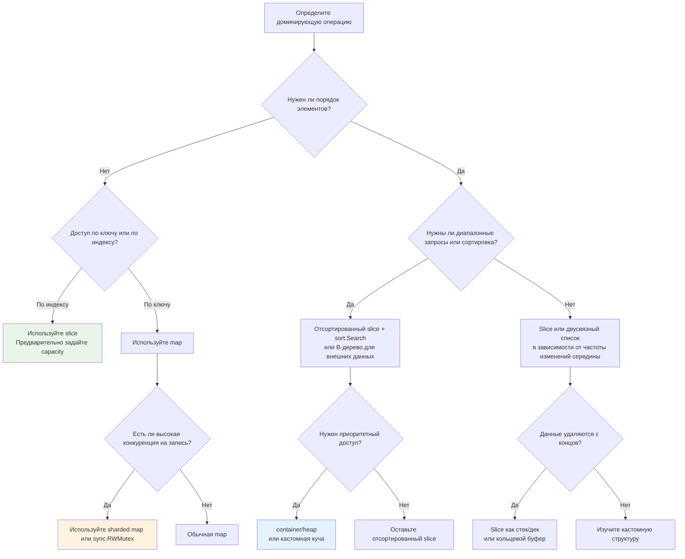

## От асимптотики к инженерным решениям

В предыдущих статьях мы разобрали математический аппарат: Big O, амортизированный анализ, пространственную сложность и влияние кэш-локальности на производительность. Но знание формул не даёт ответа на главный вопрос продакшен-разработчика: **«Что использовать здесь и сейчас?»**.

В реальном бэкенде выбор структуры данных редко сводится к поиску в Google «best data structure for X». Это всегда компромисс между:
*   Паттерном доступа (чтение/запись, последовательный/случайный, диапазон/точечный).
*   Объёмом и временем жизни данных (эфемерные vs долгоживущие, малые vs большие).
*   Требованиями к конкурентности (одна горутина vs тысячи).
*   Ограничениями рантайма Go (давление на GC, аллокации, кэш-линии CPU).

Эта статья — практический мостик между теорией и проектированием систем. Мы создадим каркас принятия решений, который позволит вам осознанно выбирать инструменты, а не надеяться на удачу.

### 1. Классификация паттернов доступа

Первый шаг в выборе структуры — определение доминирующего паттерна доступа к данным. От него зависит, какая механика будет работать эффективно, а какая станет бутылочным горлышком.

| Паттерн доступа | Пример из бэкенда | Идеальная структура | Почему |
|----------------|-------------------|---------------------|--------|
| **Прямой доступ по индексу** | Обработка пакетов, буферы IO, обработка HTTP-заголовков по позиции | `slice` / массив | Непрерывная память, O(1) доступ, идеальный аппаратный префетчинг |
| **Произвольный доступ по ключу** | Сессии пользователей, кэш метаданных, конфигурации | `map` | O(1) амортизированно, хеширование ключей, быстрый поиск |
| **Вставка/удаление в начало/конец** | Логирование, очереди задач, обработка потоков событий | `slice` (стек/очередь), кольцевой буфер, канал | `slice` эффективен при push/pop без смещения элементов |
| **Вставка/удаление в середину** | Редакторы документов, планировщики с приоритетами, активные сессии | Двусвязный список, дерево, куча | Избегает сдвига O(n) элементов, но теряет cache locality |
| **Диапазонные запросы / сортировка** | Пагинация списков, поиск по временным окнам, top-N отчёты | Отсортированный `slice` + бинарный поиск, B-дерево, куча | Гарантирует порядок, эффективные срезы, предсказуемая память |
| **Поиск по префиксу** | Автодополнение, маршрутизация по путям API, DNS-резолвинг | Trie (префиксное дерево), отсортированный слайс + `binary search` | Быстрый поиск подстрок, экономия памяти на общих частях ключей |

> [!warning] Ловушка / Gotcha
> **Избегайте двусвязных списков в Go без крайней необходимости.**
> В C++ или Java `LinkedList` часто используется как «универсальное решение для вставок». В Go пакет `container/list` реализован через указатели. Каждый узел живёт в отдельном месте кучи, что уничтожает пространственную локальность. На обходе или частом доступе список из 10 000 элементов будет **в 5-10 раз медленнее** слайса, даже если алгоритмическая сложность вставки O(1). Используйте его только для LRU-кэшей или специфических задач, где O(1) удаление критично, а обход редок.

### 2. Матрица принятия решений для Go

Ниже приведён алгоритм выбора, адаптированный под особенности рантайма Go и типичные бэкенд-задачи.



### 3. Go-специфика: когда стандартные структуры не подходят

Стандартная библиотека Go deliberately консервативна. В ней нет сбалансированных деревьев, графов или продвинутых очередей. Это не недостаток, а философия: «предоставить примитивы, а не фреймворки». Но для продакшена этого часто мало.

#### Мапы и конкурентность
`map` в Go **не потокобезопасен**. Параллельные чтение и запись вызывают панику. Типичные решения:
1.  `sync.RWMutex` вокруг `map`: просто, но создаёт contention при высокой частоте операций.
2.  `sync.Map`: оптимизирован под сценарии «много чтений, редкие записи» или «ключи только добавляются». Внутренне использует атомарные операции и разделение на `read` и `dirty` части. Не подходит для часто изменяемых ключей.
3.  **Sharded maps** (разделение на N мап с хеш-префиксом): снижает contention, каждый шард защищён отдельным мьютексом. Стандартный паттерн для высоконагруженных кэшей.

#### Слайсы как очереди и стеки
В Go слайс — это уже готовый стек. Для очереди часто используют `slice` с операцией `append` в конец и сдвигом указателя, или кольцевой буфер.

```go
// Идиоматичный стек на slice
type Stack[T any] struct {
    items []T
}

func (s *Stack[T]) Push(v T) {
    s.items = append(s.items, v)
}

func (s *Stack[T]) Pop() (T, error) {
    if len(s.items) == 0 {
        var zero T
        return zero, errors.New("stack is empty")
    }
    n := len(s.items) - 1
    item := s.items[n]
    s.items[n] = zero // Освобождаем ссылку для GC!
    s.items = s.items[:n]
    return item, nil
}
```

> [!info] Под капотом
> Обратите внимание на строку `s.items[n] = zero`. Если `T` — это указатель, интерфейс или слайс, обрезка слайса `s.items = s.items[:n]` **не обнуляет** ссылку на последний элемент. Указатель остаётся в памяти слайса, препятствуя сборке мусора. Явное обнуление предотвращает утечки памяти в долгоживущих структурах.

#### Очереди сообщений в памяти
Для межгорутинной передачи данных используйте `chan`. Для буферизации внутри одной горутины или процессинга пакетов — `container/list` (если нужны указатели) или кастомный кольцевой буфер на слайсе (если важна производительность и предсказуемость).

### 4. Механическая симпатия в выборе структуры

Выбор структуры данных напрямую влияет на работу железа и рантайма Go. Вот как оценивать решение через призму Mechanical Sympathy:

| Критерий | Cache-Friendly выбор | Cache-Unfriendly выбор | Влияние на Go Runtime |
|----------|---------------------|------------------------|-----------------------|
| **Плотность данных** | Слайс структур, массив примитивов | Слайс указателей, map, list | Плотные данные лучше упаковываются в кэш-линии, GC сканирует быстрее |
| **Аллокации** | `make` с capacity, `sync.Pool` | `append` без capacity, создание объектов в цикле | Частые мелкие аллокации → фрагментация кучи → рост пауз GC |
| **Размер элементов** | ≤ 64 байта (влезает в кэш-линию) | > 256 байт с указателями | Большие элементы вытесняют соседние данные, снижая hit rate |
| **Конкурентность** | Read-heavy: `sync.Map`, lock-free атомики | Write-heavy: `sync.Mutex`, sharding | Блокировки вызывают переключение контекста горутин, атомики быстрее, но ограничены |

> [!tip] Собеседование
> **Вопрос:** «У вас есть сервис, который обрабатывает 50 000 запросов в секунду. Каждый запрос создаёт структуру `RequestContext` на 1 КБ, заполняет её, обрабатывает и забывает. Как оптимизировать?»
>
> **Сильный ответ:** «Поскольку объекты однотипные, короткоживущие и создаются в огромных количествах, они генерируют давление на GC. Решение: использовать `sync.Pool` для переиспользования буферов. Важно: в `Put` нужно очищать структуру (reset), чтобы не передавать мусор между запросами. Также стоит рассмотреть, можно ли заменить указательную структуру на слайс байт или компактный дескриптор, чтобы улучшить cache locality. Если данные не должны пережить запрос, убедитесь через `go build -gcflags="-m"`, что аллокация остаётся на стеке, а не утекает в кучу».

### 5. Разбор кейсов и типичные ошибки

#### Кейс 1: Уникальные элементы с сохранением порядка
**Задача:** Отфильтровать дубликаты из потока ID, сохраняя порядок первого появления.
**Наивный подход:** `map[int]bool` + отдельный `slice` для порядка.
**Проблема:** Две структуры данных, двойная память, рассинхронизация при удалении.
**Оптимально в Go:** `slice` для порядка + `map[int]struct{}` для проверки вхождения. При удалении из `map` слайс остаётся разреженным, но если удаление не требуется, это O(1) проверка и O(n) итерация в нужном порядке. Для удаления используйте `[[7. Продвинутые структуры данных/7. LRU кэш|LRU-кэш]]` на основе мапы + двусвязного списка, либо mark-and-sweep подход с периодической пересборкой слайса.

#### Кейс 2: Топ-K элементов по частоте
**Задача:** Найти 10 самых популярных товаров за час.
**Подход 1:** Сортировка всей мапы → O(n log n), дорого.
**Подход 2:** [[6. Кучи и приоритетные очереди|Куча]] размера K → O(n log K). При n=100 000 и K=10 это ~100 000 * 3.3 операций вместо ~1 700 000. Значительно быстрее.
**Реализация:** В Go используйте `container/heap`. Для production-сервисов с агрегацией по времени комбинируйте с [[14. Практические паттерны/2. Rate limiting алгоритмы|скользящим окном]], чтобы не хранить весь объём данных в памяти.

#### Кейс 3: Поиск в отсортированном слайсе
Часто разработчики пишут линейный поиск `for _, v := range slice`, забывая, что данные уже отсортированы.
```go
// Идиоматичный бинарный поиск в Go
import "sort"

// sort.Search возвращает индекс первого элемента, удовлетворяющего условию
idx := sort.Search(len(data), func(i int) bool {
    return data[i] >= target
})
// Важно: всегда проверяйте границы и равенство!
if idx < len(data) && data[idx] == target {
    // найдено
}
```
Сложность падает с O(n) до O(log n), а благодаря последовательному доступу к памяти (в отличие от дерева) бинарный поиск по слайсу часто быстрее `map` для диапазонов до 10 000 элементов.

### Итог

Выбор структуры данных в Go — это не поиск «самого быстрого алгоритма», а поиск **наиболее подходящего паттерна для конкретного контекста**:
1.  **Определите доминирующую операцию**: доступ по ключу, диапазону, вставка в начало/конец или частые изменения в середине.
2.  **Оцените объём и время жизни**: малые данные → стек/слайс; большие/долгоживущие → кастомные структуры с `sync.Pool` или внешние хранилища.
3.  **Учитывайте рантайм**: `map` аллоцирует в кучу и не потокобезопасна; `slice` дружит с кэшем, но дорог при удалении из середины; указатели убивают locality.
4.  **Профилируйте паттерны доступа**: амортизированная сложность работает только при случайных данных. При враждебных паттернах (худшие коллизии, частые реаллокации) выбирайте детерминированные структуры.
5.  **Начинайте с простого**: `slice` + `map` покрывают 80% задач бэкенда. Переходите к кастомным деревьям, кучам или кольцевым буферам только когда профилировщик покажет узкое место.

С этим фундаментом мы переходим от теории выбора к детальному разбору конкретных структур. В следующем разделе мы начнём с самого базового, но мощного инструмента Go — массивов и их динамической эволюции. Мы разберём, как работает выделение памяти, почему `slice` — это не просто массив, и как писать код, который предсказуемо масштабируется.

[[1. Массивы и динамические массивы]]