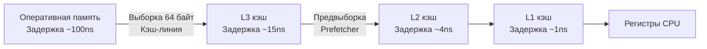

Статический массив — это фундаментальная, самая простая и одновременно самая "железо-ориентированная" структура данных в информатике. Практически все более сложные структуры (динамические массивы, хеш-таблицы, кучи) под капотом опираются на непрерывные блоки памяти, то есть на статические массивы.

Для бэкенд-разработчика понимание работы массивов — это не просто знание синтаксиса `[N]T`, а понимание того, как данные перемещаются между оперативной памятью (RAM) и процессором.

## Mechanical Sympathy: Массивы и кэш CPU

Почему массивы считаются самой быстрой структурой данных для линейного обхода? Ответ кроется в архитектуре современных процессоров и подсистеме памяти. 

Процессор **никогда** не читает данные из оперативной памяти по одному байту. Оперативная память (DRAM) работает чудовищно медленно по меркам CPU (сотни тактов на доступ). Чтобы сгладить эту разницу, процессоры используют иерархию кэшей (L1, L2, L3) и читают данные из RAM блоками фиксированного размера — **кэш-линиями (Cache Lines)**, размер которых на современных архитектурах x86/ARM обычно составляет 64 байта.

> [!info] Под капотом: Spatial Locality
> Когда вы обращаетесь к нулевому элементу массива `arr[0]` (типа `int64`, размер 8 байт), процессор не просто берет 8 байт. Он вытягивает целую кэш-линию в 64 байта из RAM в L1 кэш. Это означает, что элементы с `arr[1]` по `arr[7]` **уже оказываются в сверхбыстром кэше L1 (доступ за ~1-3 такта)** до того, как ваш код явно к ним обратится. Это явление называется **Пространственной локальностью (Spatial Locality)**. См. подробнее в [[4. Пространственная сложность и cache locality]].

Более того, в процессорах есть аппаратный **Prefetcher** (предсказатель выборок). Он анализирует паттерны доступа к памяти. Если он видит, что вы читаете память строго последовательно (`arr[0]`, `arr[1]`, `arr[2]`), он начинает асинхронно подтягивать следующие кэш-линии из RAM в L3/L2/L1 кэш *до* того, как процессор дойдет до этих данных. Никакая другая структура данных (например, связный список) не дает такого буста производительности на уровне железа.



## Статические массивы в Go

В языке Go статический массив объявляется с жестко заданным размером: `[N]T`, где `N` — константа, известная на этапе компиляции, а `T` — тип элементов.

### Внутреннее устройство
В отличие от языков вроде Java или C#, где массивы — это всегда объекты в куче с заголовком (Object Header), массив в Go — это просто непрерывный кусок памяти. В рантайме Go (да и в скомпилированном бинарнике) у статического массива нет скрытых полей, указателей или метаданных. Переменная типа `[5]int` — это буквально 40 байт (5 * 8 байт) чистых данных.

> [!warning] Ловушка / Gotcha: Value Semantics
> Одно из главных отличий Go от C++ или Java заключается в том, что массивы в Go — это **значения (values)**, а не указатели на первый элемент (как в C) или ссылки (как в Java).

Размер массива является частью его типа. Тип `[5]int` не совместим с типом `[6]int`. 
Если вы присваиваете массив другой переменной или передаете его в функцию, происходит **полное копирование всего участка памяти**.

```go
package main

import "fmt"

func modifyArray(arr [5]int) {
    // arr здесь — это полная копия оригинального массива
    arr[0] = 99
}

func main() {
    original := [5]int{1, 2, 3, 4, 5}
    
    modifyArray(original)
    
    // Выведет [1 2 3 4 5]. Оригинал не изменился!
    fmt.Println(original) 
}
```

> [!tip] Собеседование
> **Вопрос:** Что произойдет, если передать массив `[1000000]int` в функцию по значению?
> **Ответ:** Go-рантайм скопирует 8 мегабайт (1 млн * 8 байт) данных. Если это происходит на стеке горутины (начальный размер которого всего 2 КБ), это моментально вызовет цепочку вызовов `runtime.morestack` для увеличения размера стека. Операция копирования заблокирует CPU, вымоет полезные данные из L1/L2 кэша (cache pollution) и сильно ударит по производительности. Передавать большие массивы нужно исключительно по указателю: `func process(arr *[1000000]int)`.

## Динамические массивы: Алгоритмический концепт

Статические массивы невероятно быстры, но их фиксированный размер делает их непригодными для большинства реальных бизнес-задач, где объем данных заранее неизвестен. Нам нужна структура, которая сохраняет кэш-локальность статического массива, но может расти. Это — **Динамический массив** (например, `std::vector` в C++, `ArrayList` в Java).

В Go роль динамического массива выполняет встроенная структура **Slice (слайс)**. Однако, прежде чем разбирать "магию" слайсов, мы обязаны понять алгоритмический фундамент динамических массивов.

### Архитектура динамического массива
Динамический массив строится поверх статического и управляет тремя переменными:
1. `pointer` — указатель на базовый статический массив в памяти (backing array).
2. `length` (длина) — количество реально используемых элементов в данный момент.
3. `capacity` (вместимость) — физический размер выделенного базового массива.

### Алгоритм изменения размера (Resizing / Reallocation)
Когда мы добавляем новый элемент, и `length == capacity` (массив заполнен), происходит следующее:
1. Выделяется новый статический массив большего размера (обычно `capacity * 2` или `capacity * 1.5`).
2. Данные из старого массива копируются в новый (через низкоуровневые инструкции копирования блоков памяти, вроде `memmove`).
3. В новый массив добавляется новый элемент.
4. Указатель переключается на новый массив, а старый отдается на растерзание Garbage Collector-у (или освобождается вручную в языках с ручным управлением памятью).

> [!info] Под капотом: Амортизированная сложность
> Операция реаллокации очень дорогая (O(N)), так как требует аллокации в куче и копирования всех существующих элементов. Но поскольку мы увеличиваем размер мультипликативно (например, в 2 раза), реаллокации происходят логарифмически редко. Поэтому добавление в конец массива оценивается как **Амортизированное O(1)**. Подробнее этот математический фокус разобран в статье [[3. Амортизированный анализ]].

### Реализация концепта динамического массива на Go (Educational purpose)

Чтобы глубоко понять механику, напишем простейшую Thread-Unsafe реализацию динамического массива с использованием дженериков (эмулируем поведение слайса).

```go
package main

import (
	"errors"
	"fmt"
)

// DynamicArray инкапсулирует логику управления памятью.
// В Go встроенный слайс имеет ровно такую же структуру (SliceHeader).
type DynamicArray[T any] struct {
	data     []T // В реальности здесь был бы unsafe.Pointer на массив
	length   int
	capacity int
}

// NewDynamicArray создает массив с начальной вместимостью.
func NewDynamicArray[T any](initialCapacity int) *DynamicArray[T] {
	if initialCapacity < 1 {
		initialCapacity = 1
	}
	return &DynamicArray[T]{
		// Имитируем сырой статический массив через слайс с фиксированным размером
		data:     make([]T, initialCapacity), 
		length:   0,
		capacity: initialCapacity,
	}
}

// Append добавляет элемент в конец, прозрачно управляя памятью
func (da *DynamicArray[T]) Append(value T) {
	// Если места нет, запускаем тяжелую операцию реаллокации
	if da.length == da.capacity {
		da.grow()
	}
	
	// Теперь место гарантированно есть, вставляем за O(1)
	da.data[da.length] = value
	da.length++
}

// grow выполняет реаллокацию (увеличение capacity в 2 раза)
func (da *DynamicArray[T]) grow() {
	newCapacity := da.capacity * 2
	newData := make([]T, newCapacity)
	
	// Копируем старые данные в новый кусок памяти.
	// Это O(N) операция. В рантайме Go это делается оптимизированным memmove.
	copy(newData, da.data)
	
	da.data = newData
	da.capacity = newCapacity
}

func (da *DynamicArray[T]) Get(index int) (T, error) {
	var zero T // Нулевое значение для типа T
	if index < 0 || index >= da.length {
		return zero, errors.New("index out of bounds") // Защита от выхода за границы
	}
	// Доступ по индексу — O(1)
	return da.data[index], nil
}
```

> [!warning] Ловушка / Gotcha: Утечки памяти (Memory Leaks) при реаллокации
> В коде выше, когда мы делаем `da.data = newData`, старый массив теряет единственную ссылку на себя. В Go в дело вступит Garbage Collector (GC), который в фоне (во время фазы Mark & Sweep) найдет этот "осиротевший" кусок памяти и освободит его. 
> Если реаллокации происходят слишком часто (например, вы в цикле добавляете миллион элементов, начиная с capacity=1), это создаст огромную нагрузку на GC, который будет вынужден постоянно очищать старые массивы. Возникнет **GC Churn**. Поэтому всегда старайтесь аллоцировать структуры с заранее известным `capacity`!

## Временная сложность (Time Complexity)

Для массивов и динамических массивов (при условии отсутствия реаллокации на каждом шаге) справедлива следующая сложность (см. [[2. Асимптотическая сложность. Big O, Big Theta, Big Omega]]):

* **Доступ по индексу (`arr[i]`):** O(1). Вычисляется по формуле `Адрес = Базовый_Адрес + Индекс * Размер_Типа`.
* **Поиск значения:** O(N) в худшем случае (приходится сканировать массив линейно).
* **Вставка в конец:** O(1) амортизированное.
* **Вставка/Удаление в середине:** O(N). Требуется сдвинуть все последующие элементы на одну позицию вправо или влево.

## Итог

Массивы — это основа производительного кода благодаря идеальной совместимости с архитектурой процессорных кэшей. Однако жесткий размер делает их неприменимыми напрямую во многих задачах. 

Динамические массивы решают проблему масштабирования за счет техники реаллокации и копирования `backing array`, обеспечивая амортизированную O(1) сложность добавления элементов.

В Go вам никогда не придется писать структуру `DynamicArray` вручную. Язык предоставляет встроенный, глубоко интегрированный в рантайм и компилятор инструмент, который реализует паттерн динамического массива с дополнительной магией "срезания" (slicing) участков памяти. 

В следующей статье мы разберем главный инструмент работы с последовательностями в Go, заглянем в исходники `runtime/slice.go`, изучим `SliceHeader` и посмотрим, как компилятор оптимизирует `growslice`: [[2. Слайсы в Go как структура данных]].