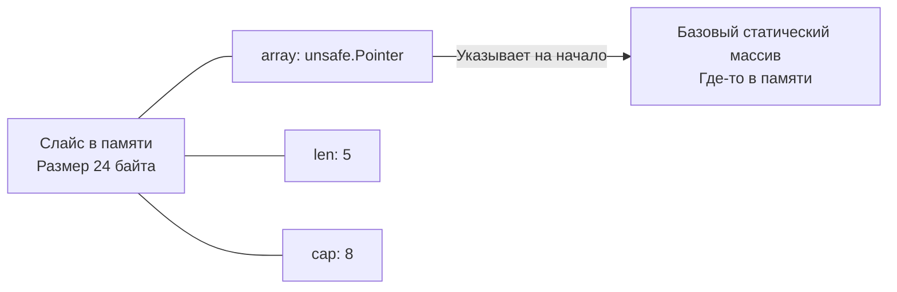
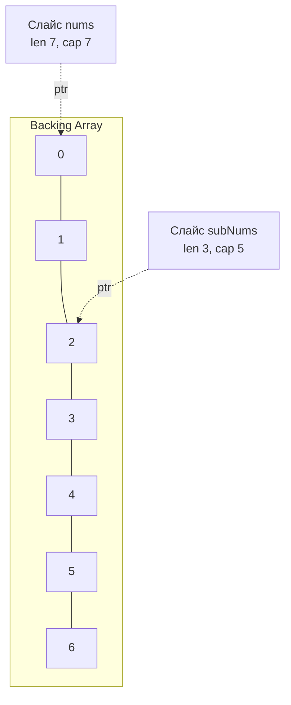

В прошлой статье [[1. Массивы и динамические массивы]] мы выяснили, что статические массивы — это фундамент производительности, но их фиксированный размер неудобен для реальных задач. Чтобы решить эту проблему, алгоритмы используют паттерн "динамического массива". 

В языке Go этот паттерн реализован на уровне компилятора и рантайма в виде **слайсов (срез, slice)**. Слайсы — это альфа и омега работы с данными в Go. Без глубокого понимания их внутреннего устройства невозможно писать ни производительный, ни даже просто корректный код на этом языке.

## Что такое слайс под капотом?

Многие разработчики, приходящие из Java или C#, ошибочно считают слайс неким "объектом-коллекцией", живущим в куче. Это фатальное заблуждение.

В Go слайс — это **всего лишь легковесная структура из трех полей**, передаваемая по значению. В исходном коде рантайма Go (в файле `src/runtime/slice.go`) слайс описывается структурой `slice`:

```go
// Исходный код рантайма Go
type slice struct {
	array unsafe.Pointer // Указатель на базовый статический массив
	len   int            // Текущее количество элементов
	cap   int            // Вместимость базового массива (от указателя array до конца)
}
```

На 64-битных системах размер этой структуры составляет ровно **24 байта** (8 байт указатель + 8 байт `len` + 8 байт `cap`).

Когда вы передаете слайс в функцию, вы копируете **только эти 24 байта**. Базовый массив (backing array), на который указывает поле `array`, **не копируется**.



> [!info] Под капотом: Escape Analysis и аллокации
> Где физически выделяется память под базовый массив слайса? 
> Если размер слайса известен на этапе компиляции, он невелик, и слайс не "утекает" из функции (не возвращается наружу, не передается по указателю в другие горутины), компилятор Go может разместить базовый массив прямо на **стеке** (Stack Allocation). Это дает колоссальный прирост производительности, так как не нагружает Garbage Collector.
> Если же размер вычисляется в рантайме (например, `make([]int, n)`) или слайс живет дольше функции, компилятор переносит (escapes) его в **кучу** (Heap Allocation). Проверить это можно флагом компилятора: `go build -gcflags="-m"`.

## Операция Slicing: Магия нулевого копирования

Синтаксис `s[i:j]` называется "slicing" (срезка). Эта операция создает **новый 24-байтный заголовок** слайса, который ссылается на **тот же самый** базовый массив, но с измененными указателем, длиной и вместимостью.

```go
nums := []int{0, 1, 2, 3, 4, 5, 6} // len: 7, cap: 7
subNums := nums[2:5]               // len: 3, cap: 5
```

Как это вычисляется аппаратно за $O(1)$:
1. `array` нового слайса = `array` старого + `2 * размер_типа`.
2. `len` = `5 - 2` = `3`.
3. `cap` = `старый_cap - 2` = `5`.



> [!warning] Ловушка / Gotcha: Утечка памяти (Memory Leak)
> Поскольку `subNums` ссылается на тот же базовый массив, что и `nums`, этот огромный базовый массив не будет собран Garbage Collector-ом, пока существует хотя бы один маленький слайс-наследник.
> **Пример:** Вы вычитываете из файла `[]byte` размером 100 МБ, берете из него первые 10 байт: `header := fileData[:10]` и сохраняете `header` в кэш. Поздравляю, вы закрепили в памяти все 100 МБ!
> **Решение:** Явно скопировать данные в новый слайс с помощью функции `copy()` или нового синтаксиса пакета `slices.Clone()` из Go 1.21.

## Функция append и алгоритм реаллокации

Встроенная функция `append` добавляет элементы в конец слайса.
Если текущая длина `len` меньше вместимости `cap`, `append` работает за $O(1)$: просто записывает данные в базовый массив по смещению `len` и возвращает новый заголовок с `len + 1`.

Но если `len == cap`, в дело вступает функция рантайма `growslice`. Она должна выделить новый, более просторный кусок памяти, скопировать туда старые данные и вставить новые. 

### Как растет слайс (Go 1.18+)
До версии Go 1.18 слайс удваивался при `cap < 1024`, а затем рос на 25%. Однако это создавало резкий скачок ("ступеньку") в потреблении памяти на границе 1024 элементов. 
В современных версиях Go алгоритм сглажен:
1. Если требуемая вместимость больше двойной текущей, выделяем столько, сколько требуется.
2. Если текущая `cap < 256`, удваиваем ее.
3. Если текущая `cap >= 256`, применяем формулу плавного роста: `newcap += (newcap + 3*256) / 4`. Это обеспечивает плавный переход фактора роста от 2.0 (для малых слайсов) к 1.25 (для гигантских слайсов).

> [!info] Под капотом: Выравнивание памяти (Memory Alignment)
> Запрошенный размер `newcap` — это еще не финал. Go-рантайм не выделяет память с точностью до байта. Для эффективной работы аллокатора (TCMalloc), память выделяется "классами размеров" (size classes), например 32 байта, 48 байт, 64 байта и т.д. Компилятор округлит `newcap` до ближайшего подходящего класса размеров, поэтому реальный `cap` после `append` часто бывает немного больше, чем вы ожидаете математически.

## Типичные ошибки и корнер-кейсы

### 1. The Append Trap (Ловушка передачи по значению)

> [!tip] Собеседование
> **Вопрос:** Что выведет этот код?
> ```go
> func modify(s []int) {
>     s = append(s, 4)
>     s[0] = 99
> }
> 
> func main() {
>     s := make([]int, 3, 4) // len 3, cap 4
>     s[0], s[1], s[2] = 1, 2, 3
>     modify(s)
>     fmt.Println(s)
> }
> ```
> **Ответ:** Код выведет `[99 2 3]`. 
> Почему? Мы передали 24 байта заголовка слайса в `modify` **по значению**.
> Функция `modify` получила свою локальную копию заголовка. Она сделала `append`. Так как `cap == 4`, реаллокации не было! Элемент `4` был записан в базовый массив. Но `len` увеличился до `4` **только в локальной копии заголовка** внутри функции `modify`.
> Заголовок в `main` ничего не знает об этом `append`, его `len` остался равен `3`.
> Зато операция `s[0] = 99` изменила базовый массив, который является общим для обоих заголовков. 
> *Именно поэтому функции, изменяющие слайс, всегда должны возвращать его обратно: `s = appendFunc(s)`.*

### 2. Скрытое перезаписывание (Shadowing)
Следствие предыдущей ловушки, но с другой стороны:

```go
s := make([]int, 0, 5)
s = append(s, 1, 2, 3)

s1 := append(s, 4) // Создает новый слайс s1: len 4, cap 5
s2 := append(s, 5) // Создает новый слайс s2: len 4, cap 5

// s1 и s2 ссылаются на один массив! 
// При создании s2 мы перезаписали четвертый элемент, который только что поставили для s1.
```
В таких случаях нужно использовать полный синтаксис среза (Full Slice Expression): `s[low:high:max]`. Вызов `s[0:3:3]` жестко ограничит `cap` слайса тремя элементами, и любой `append` гарантированно вызовет аллокацию нового массива, не портя чужие данные.

### 3. Nil vs Empty Slice
В Go есть два состояния "пустого" слайса:

```go
var s1 []int       // nil-слайс. len=0, cap=0, array=nil. Аллокаций не было.
s2 := make([]int, 0) // Пустой слайс. len=0, cap=0, array=указатель на zerobase.
s3 := []int{}      // Аналогично s2.
```

С точки зрения `len()` и `append()` они ведут себя одинаково. `append` к `nil`-слайсу безопасно выделит память.
Но с точки зрения сериализации (например, `encoding/json`) `nil`-слайс превратится в `null`, а пустой слайс — в `[]`. 
**Best practice:** Всегда объявляйте слайс через `var`, если вы не собираетесь сразу класть туда данные, чтобы избежать бессмысленной работы аллокатора по привязке к `zerobase` (глобальной константе для пустых аллокаций).

## Итог

1. **Слайс — это не массив.** Это структура (24 байта), управляющая скрытым базовым массивом.
2. **Нулевое копирование:** Срезка `s[i:j]` не копирует данные массива. Она создает новый заголовок слайса, ссылающийся на ту же память.
3. **Mechanical Sympathy:** Слайсы обеспечивают ту же пространственную локальность (Spatial Locality) и попадание в кэш процессора, что и статические массивы. Это структура данных №1 (default choice) в Go.
4. **Контроль памяти:** Всегда используйте `make([]T, 0, expectedCapacity)`, чтобы избежать множественных реаллокаций при `append`.

Разобравшись с массивами и их динамической оберткой (слайсами), мы переходим к структурам, где элементы разбросаны по памяти случайным образом, но связаны между собой ссылками. В следующей статье мы разберем: [[3. Связные списки]].