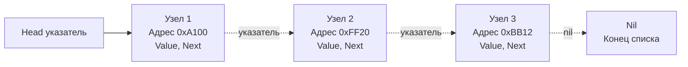

В статьях [[1. Массивы и динамические массивы]] и [[2. Слайсы в Go как структура данных]] мы изучили структуры, основанные на непрерывных блоках памяти. Их главная сила — скорость доступа и идеальная совместимость с железом. 

Но что если нам нужно часто вставлять и удалять элементы в середине коллекции? Сдвиг половины слайса при каждой вставке $O(N)$ уничтожит производительность. В таких случаях на помощь приходит концепция **Связного списка (Linked List)**.

## Архитектура связного списка

Связный список — это структура данных, состоящая из независимых узлов (Nodes). Каждый узел хранит само значение и указатель (pointer) на следующий (а в случае двусвязного списка — и на предыдущий) узел.

Узлы не обязаны лежать в памяти друг за другом. Они могут быть разбросаны по всей куче (heap) в случайном порядке.



### Виды связных списков
1. **Односвязный (Singly Linked List):** Узел знает только о следующем элементе.
2. **Двусвязный (Doubly Linked List):** Узел содержит указатели `Next` и `Prev`. Позволяет обходить список в обе стороны.
3. **Кольцевой (Circular Linked List):** `Next` последнего элемента указывает на `Head`.

## Mechanical Sympathy: Почему списки ненавидят процессоры

Для Senior/Lead разработчика крайне важно понимать, что связные списки в реальном системном программировании применяются очень осторожно. С точки зрения "голой" алгоритмики вставка в список работает за $O(1)$ (если у нас уже есть указатель на место вставки). Но с точки зрения железа связные списки — это катастрофа.

### 1. Pointer Chasing и промахи кэша (Cache Misses)
Как мы помним из статьи [[4. Пространственная сложность и cache locality]], процессор подтягивает данные из RAM кэш-линиями по 64 байта. Аппаратный Prefetcher отлично угадывает последовательный доступ в слайсах.
Но в связном списке адреса случайны. Чтобы прочитать `Узел 2`, процессор сначала должен прочитать `Узел 1`, достать из него адрес 0xFF20, и только потом пойти за `Узлом 2`. 

Это называется **Pointer Chasing (Погоня за указателями)**. Prefetcher здесь бессилен. Почти каждый переход по указателю `Next` — это L1/L2 Cache Miss и дорогое обращение к оперативной памяти (сотни тактов CPU простоя). Итерация по слайсу из 10 000 элементов на современных машинах в десятки раз быстрее, чем итерация по связному списку такого же размера, несмотря на одинаковую асимптотику $O(N)$.

### 2. Нагрузка на Garbage Collector (GC Pressure)
В Go каждый новый узел — это, как правило, отдельная аллокация в куче (Escape Analysis почти всегда отправляет узлы списка в heap, так как время их жизни неизвестно). 

Миллион элементов в списке = миллион мелких объектов в куче.
В фазе **Mark (Разметка)** сборщик мусора Go будет вынужден прыгать по всем этим указателям, чтобы понять, какие узлы живы. Это значительно увеличивает паузы и общее потребление CPU сборщиком мусора.

> [!tip] Собеседование
> **Вопрос:** В чем разница между слайсом и связным списком, и что выбрать?
> **Ответ уровня Middle+:** Слайс использует непрерывную память, что дает $O(1)$ доступ по индексу и максимальную утилизацию кэша CPU (Spatial Locality). Вставка в середину слайса стоит $O(N)$ из-за сдвига.
> Список дает $O(1)$ на вставку/удаление (если узел найден), но доступ по индексу занимает $O(N)$. Главная проблема списка — cache misses и нагрузка на GC из-за множества мелких аллокаций. По умолчанию в Go всегда используется слайс. Список применяется только в специфичных сценариях (например, LRU кэш, очереди с lock-free доступом).

## Реализация на Go: Идиоматичный подход

До появления дженериков (Go 1.18) реализация универсальных структур была болью. Стандартный пакет `container/list` использует `interface{}` (об этом ниже). Сегодня мы можем написать строгий, типобезопасный код.

Реализуем простой односвязный список:

```go
package main

import "fmt"

// Node представляет узел списка с использованием дженериков
type Node[T any] struct {
	Value T
	Next  *Node[T]
}

// LinkedList инкапсулирует логику работы
type LinkedList[T any] struct {
	head *Node[T]
	tail *Node[T] // Храним указатель на хвост для O(1) вставки в конец
	size int
}

// Append добавляет элемент в конец за O(1)
func (l *LinkedList[T]) Append(value T) {
	newNode := &Node[T]{Value: value}
	
	if l.head == nil {
		l.head = newNode
		l.tail = newNode
	} else {
		l.tail.Next = newNode
		l.tail = newNode
	}
	l.size++
}

// Print обходит список. Внимание: это O(N) операция с потенциальными Cache Misses
func (l *LinkedList[T]) Print() {
	current := l.head
	for current != nil {
		fmt.Printf("%v -> ", current.Value)
		current = current.Next
	}
	fmt.Println("nil")
}
```

> [!warning] Ловушка / Gotcha: Потеря хвоста
> Обратите внимание на наличие поля `tail`. Классическая ошибка новичков — хранить только `head`. В таком случае операция `Append` (добавление в конец) будет занимать $O(N)$, так как придется каждый раз "бежать" по всему списку от начала до конца, чтобы найти последний элемент.

## Проблема стандартного пакета container/list

В стандартной библиотеке Go есть двусвязный список — `container/list`. 
Взглянем на исходники рантайма:

```go
// src/container/list/list.go
type Element struct {
	next, prev *Element
	list *List
	Value any // <- Ключевая проблема
}
```

Поле `Value` имеет тип `any` (алиас для `interface{}`). 
Это несет **две огромные проблемы производительности**:
1. **Boxing/Unboxing:** Если вы кладете туда примитив (например, `int`), Go вынужден обернуть его в интерфейс. Интерфейс под капотом (структура `eface`) содержит два указателя: на информацию о типе и на сами данные. Это гарантированно вызывает аллокацию данных в куче, даже если это просто число `5`.
2. **Type Assertion:** При чтении данных вы обязаны делать приведение типов: `val := e.Value.(int)`. Это добавляет инструкции в рантайме на проверку безопасности типов (panic при несовпадении).

**Вердикт Архитектора:** Избегайте `container/list` в высоконагруженных участках кода. Используйте либо слайсы, либо напишите свой двусвязный список на Generics `[T any]`, который не требует boxing-а и проверок типов в рантайме.

## Алгоритмические задачи (LeetCode паттерны)

На собеседованиях связные списки любят использовать для проверки навыков работы с указателями. Вот основные паттерны:

### 1. Переворот списка (Reverse Linked List)
Классика алгоритмических интервью. Требуется перевернуть список за $O(1)$ по памяти (in-place), меняя только указатели.

```go
func reverseList[T any](head *Node[T]) *Node[T] {
	var prev *Node[T] // Изначально указывает на nil
	curr := head
	
	for curr != nil {
		nextTemp := curr.Next // Запоминаем следующий узел
		curr.Next = prev      // Разворачиваем указатель текущего
		prev = curr           // Сдвигаем окно (prev) вперед
		curr = nextTemp       // Сдвигаем окно (curr) вперед
	}
	
	return prev // prev станет новым head
}
```

### 2. Алгоритм зайца и черепахи (Floyd's Cycle Detection)
Спрашивают: *Как проверить, есть ли в связном списке цикл (зацикливание), используя $O(1)$ памяти?*

Используются два указателя (Two Pointers):
* `slow` (черепаха) — делает шаг на 1 узел.
* `fast` (заяц) — делает шаг на 2 узла.
Если цикл есть, `fast` рано или поздно догонит `slow` и они будут указывать на один и тот же участок памяти. Если `fast` достигнет `nil` — цикла нет.

> [!info] Под капотом: Массивы узлов (Memory Pool)
> Можно ли получить плюсы связных списков ($O(1)$ вставка) и плюсы массивов (Cache Locality)? Да! Это делается паттерном "Пул объектов". 
> Мы создаем большой слайс узлов: `pool := make([]Node, 10000)`. Вместо указателей `*Node` мы используем индексы в этом слайсе: `Next int`. 
> Данные лежат непрерывно в памяти, GC не страдает (один большой объект вместо 10000 мелких), а логика связей работает как в связном списке. Подобные трюки часто применяются внутри баз данных и самом рантайме Go (например, пулы страниц памяти `mspan`).

## Итог

1. **Связи вместо индексов:** Узлы связного списка объединены указателями, а не физическим соседством в памяти.
2. **Асимптотика:** Вставка/удаление за $O(1)$ (если узел известен), поиск — строго $O(N)$.
3. **Производительность железа:** Худшая структура для кэша CPU (Pointer chasing) и суровое испытание для Garbage Collector-а в Go.
4. **container/list:** Исторический артефакт, использующий `any`. В современном Go предпочтительнее писать кастомные списки на дженериках.

Связные списки редко выступают самостоятельной бизнес-структурой в Go, но они являются важнейшим "строительным материалом" для более сложных систем (например, очередей сообщений или вытеснения страниц кэша, что мы рассмотрим в [[7. LRU кэш]]). 

А пока, опираясь на понимание массивов и списков, мы переходим к абстрактным типам данных, которые накладывают строгие ограничения на порядок доступа. Следующая статья: [[4. Стек]].