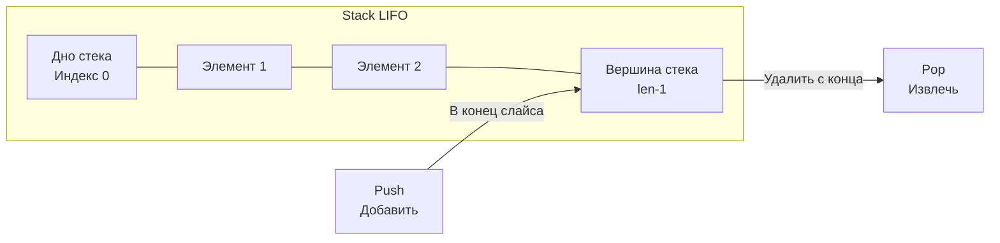

Стек (Stack) — это абстрактный тип данных, который, в отличие от массивов или связных списков, жестко регламентирует порядок добавления и извлечения элементов. Он работает по принципу **LIFO (Last-In, First-Out — Последним пришел, первым ушел)**. 

Ближайшая физическая аналогия — стопка тарелок. Вы можете положить новую тарелку только на самый верх, и взять тарелку вы тоже можете только с самого верха. Попытка вытащить тарелку из середины приведет к крушению (в программировании — к нарушению инварианта структуры).

Для бэкенд-разработчика стек — это не просто абстракция из учебника, это основа исполнения любой программы на уровне архитектуры компьютера.

## Mechanical Sympathy: Стек вызовов (Call Stack) в Go

Любая запущенная программа использует стек для управления вызовами функций. В операционных системах (Linux/Windows) потоки ОС (OS threads) обычно получают фиксированный стек большого размера (часто 2-8 МБ). 

Но Go использует свою абстракцию — **горутины**. Если бы каждая из миллиона горутин потребляла по 2 МБ памяти на стек, рантайм бы мгновенно исчерпал всю RAM.

> [!info] Под капотом: Непрерывные стеки (Continuous Stacks)
> В Go горутина стартует с крошечным стеком размером всего **2 КБ**. 
> Что происходит, когда глубина вызовов функций (call depth) превышает этот объем? 
> В начале каждой функции компилятор Go вставляет невидимую инструкцию проверки размера стека. Если места не хватает, вызывается системная функция рантайма `runtime.morestack`.
> Рантайм выделяет новый, в 2 раза больший участок памяти, **копирует** туда все данные старого стека (`runtime.copystack`), пересчитывает все внутренние указатели, и только затем продолжает выполнение. Старый стек отдается Garbage Collector-у.
> Именно поэтому в Go нет проблемы `StackOverflowError` (до достижения жесткого лимита в 1 ГБ), но глубокая рекурсия все равно обходится дорого из-за постоянного копирования памяти.

## Реализация стека в Go: Выбор базы

Стек — это абстракция. Физически он должен быть построен поверх базовой структуры. У нас есть два кандидата, изученных ранее:
1. **Связный список** (см. [[3. Связные списки]]) — вставка в `head` и удаление из `head` стоят $O(1)$.
2. **Динамический массив / Слайс** (см. [[2. Слайсы в Go как структура данных]]) — вставка в конец и удаление с конца стоят амортизированное $O(1)$.

**Что выбрать? Всегда выбирайте слайс.**
Связный список страдает от промахов кэша процессора (Cache Misses) и создает излишнюю нагрузку на GC из-за аллокации каждого нового узла. Слайс же гарантирует идеальную пространственную локальность (Spatial Locality) и работает на порядки быстрее.



## Production-Ready реализация на Go

Напишем идиоматичный, типобезопасный стек на основе слайса с использованием дженериков.

```go
package main

import (
	"errors"
	"fmt"
)

var ErrStackEmpty = errors.New("stack is empty")

// Stack реализует структуру данных стек на базе слайса.
type Stack[T any] struct {
	items []T
}

// NewStack создает новый стек с опциональным резервированием памяти.
// Предварительная аллокация (capacity) спасает от лишних вызовов runtime.growslice.
func NewStack[T any](capacity int) *Stack[T] {
	return &Stack[T]{
		items: make([]T, 0, capacity),
	}
}

// Push добавляет элемент на вершину стека (в конец слайса).
func (s *Stack[T]) Push(item T) {
	s.items = append(s.items, item)
}

// Pop извлекает и возвращает элемент с вершины стека.
func (s *Stack[T]) Pop() (T, error) {
	var zero T // Нулевое значение для типа T
	
	if len(s.items) == 0 {
		return zero, ErrStackEmpty
	}

	lastIndex := len(s.items) - 1
	item := s.items[lastIndex]
	
	// Важно: зачищаем ссылку, чтобы помочь Garbage Collector-у!
	s.items[lastIndex] = zero
	
	// Сужаем слайс (slicing)
	s.items = s.items[:lastIndex]
	
	return item, nil
}

// Peek возвращает элемент на вершине без его удаления.
func (s *Stack[T]) Peek() (T, error) {
	if len(s.items) == 0 {
		var zero T
		return zero, ErrStackEmpty
	}
	return s.items[len(s.items)-1], nil
}

// IsEmpty проверяет, пуст ли стек.
func (s *Stack[T]) IsEmpty() bool {
	return len(s.items) == 0
}
```

> [!warning] Ловушка / Gotcha: Утечки памяти (Memory Leaks) при Pop
> Обратите внимание на строку `s.items[lastIndex] = zero`. 
> Многие новички пишут просто `s.items = s.items[:lastIndex]`. Математически это работает: длина слайса уменьшается, и элемент больше недоступен.
> Но физически базовый массив (backing array) **остается прежним**! Если тип `T` содержит указатели (например, `*struct` или слайс), то в скрытой части базового массива останется висеть ссылка на этот объект. Garbage Collector не сможет удалить этот объект из кучи, так как базовый массив всё ещё "держит" его. Явное присвоение нулевого значения (`nil` для указателей) обрывает эту связь.

## Применение стека в алгоритмах (Паттерны собеседований)

Стек — один из самых частых "гостей" на алгоритмических секциях собеседований (LeetCode). Он незаменим там, где нужно возвращаться к предыдущему состоянию или парсить вложенные структуры.

### 1. Валидация скобочных последовательностей (Valid Parentheses)
Классическая задача: проверить, правильно ли закрыты скобки в строке `{[()()]}`.
**Решение:** Встретили открывающую скобку — делаем `Push` в стек. Встретили закрывающую — делаем `Pop` и проверяем, совпадает ли тип скобки. Если в конце стек пуст — строка валидна.

### 2. Обратная польская запись (Reverse Polish Notation)
Вычисление математических выражений, где оператор идет после операндов: `2 3 + 4 *` (означает `(2 + 3) * 4`).
**Решение:** Идем по массиву. Видим число — `Push` в стек. Видим оператор (например, `+`) — делаем два `Pop`, складываем результаты и делаем `Push` суммы обратно в стек.

> [!tip] Собеседование: Монотонный стек (Monotonic Stack)
> **Вопрос:** Дан массив температур по дням `[73, 74, 75, 71, 69, 72, 76, 73]`. Для каждого дня найдите, через сколько дней будет более теплая погода. Требуется алгоритм за $O(N)$.
> **Ответ:** Используем паттерн "Монотонный стек". Мы храним в стеке индексы элементов так, чтобы значения по этим индексам всегда шли по убыванию (строго монотонно убывающий стек). 
> Как только мы встречаем день `X`, который теплее, чем день на вершине стека, мы начинаем делать `Pop` всех дней с вершины, для которых `X` является ответом. Так каждый элемент попадает в стек 1 раз и выходит 1 раз, что дает честное $O(N)$ вместо $O(N^2)$ при вложенных циклах. Этот паттерн нужно знать наизусть для секций на Middle+/Senior.

## Итог

1. **Стек (LIFO)** — фундаментальная концепция, управляющая выполнением программ (Call Stack) и рекурсией.
2. В Go стеки горутин динамически растут путем копирования в новую область памяти (`runtime.morestack`).
3. В прикладном коде стек реализуется поверх **слайса**, а не связного списка, ради высокой производительности и дружественности к кэшу процессора.
4. При извлечении элемента (`Pop`) из кастомного стека всегда зачищайте освободившийся слот нулевым значением, чтобы избежать утечек памяти (GC Leaks) в базовом массиве.

Стек позволяет нам "запоминать" путь и возвращаться назад. Но что если нам нужно обрабатывать данные строго в порядке их поступления, например, при балансировке запросов или парсинге сетевых пакетов? Для этого мы инвертируем принцип доступа и переходим к следующей структуре данных: [[5. Очередь]].