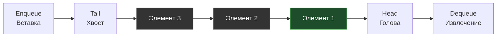

В прошлой статье [[4. Стек]] мы разобрали структуру LIFO (Last-In, First-Out), которая отлично подходит для возврата к предыдущим состояниям. Однако в бэкенд-разработке мы чаще сталкиваемся с задачами, где важна справедливость и порядок поступления: обработка HTTP-запросов, фоновые воркеры, маршрутизация сообщений. 

Для этого используется **Очередь (Queue)** — абстрактная структура данных, работающая по принципу **FIFO (First-In, First-Out — Первым пришел, первым ушел)**.

## Архитектура и операции

Механика очереди предельно проста и полностью копирует очередь в супермаркете:
* **Enqueue (Push)** — добавление элемента в конец очереди (Хвост / Tail).
* **Dequeue (Pop)** — извлечение элемента из начала очереди (Голова / Head).



## Mechanical Sympathy: Проблема реализации на массивах

Если со стеком мы выяснили, что обычный слайс — это идеальный выбор, то с очередью начинаются серьезные проблемы на уровне работы с памятью.

Представьте, что мы реализовали очередь на базе обычного массива: `[A, B, C, D]`.
Мы извлекаем `A` (Dequeue). Что делать с остальными элементами?
1. **Сдвинуть все элементы влево:** `[B, C, D, _]`. Это $O(N)$ операция. Если в очереди миллион элементов, перенос мегабайтов памяти при каждом Dequeue сожжет весь CPU.
2. **Сдвинуть указатель начала (Head):** `[_ , B, C, D]`. Операция $O(1)$. Но массив конечен! Если мы постоянно добавляем в конец и двигаем Head вправо, наша очередь будет "ползти" по памяти, как гусеница, оставляя за собой мертвую зону. Рано или поздно мы упремся в конец выделенной памяти, даже если реальных элементов в очереди всего два.

> [!warning] Ловушка / Gotcha: Наивная очередь на слайсах в Go
> Самый частый (и опасный для highload) паттерн, который пишут джуниоры:
> ```go
> q := make([]int, 0)
> q = append(q, 1)       // Enqueue
> val := q[0]; q = q[1:] // Dequeue
> ```
> **Почему это плохо?** Операция `q = q[1:]` не удаляет данные физически и не сдвигает их. Она просто создает новый заголовок слайса, чей указатель сдвинут на 8 байт вперед. Базовый массив продолжает расти вправо при `append`. Когда `cap` исчерпывается, Go аллоцирует новый, больший массив, копирует туда "живую" часть слайса, а старый массив отправляет в Garbage Collector.
> В бесконечном цикле (например, worker pool) это создаст **GC Churn** — постоянные бессмысленные аллокации памяти и работу для сборщика мусора. Кроме того, ссылки на старые объекты остаются в "мертвой" зоне массива, вызывая утечки памяти (Memory Leaks).

## Правильные способы реализации в Go

### 1. Очередь на базе связного списка
Если размер очереди заранее неизвестен (Unbounded Queue), классическим решением является односвязный список (см. [[3. Связные списки]]). Мы храним указатели на `Head` и `Tail`. 
Вставка в `Tail` — $O(1)$. Извлечение из `Head` — $O(1)$. 
Минус: плохой Cache Locality и аллокация в куче на каждый новый элемент.

### 2. Очередь на двух стеках (Amortized Array)
Чтобы сохранить скорость кэша CPU (как у слайсов) и избежать сдвигов памяти, применяют элегантный алгоритмический трюк — две стопки. 
Одна стопка (`in`) работает только на прием, вторая (`out`) — только на выдачу.

> [!tip] Собеседование
> **Вопрос:** Реализуйте очередь с $O(1)$ амортизированным временем, используя только стеки (слайсы). Это классическая задача LeetCode №232 (Implement Queue using Stacks).
> **Решение:**

```go
package main

import "errors"

var ErrQueueEmpty = errors.New("queue is empty")

// Queue реализует FIFO через два LIFO стека (слайса)
type Queue[T any] struct {
	in  []T // Слайс для Enqueue
	out []T // Слайс для Dequeue
}

func NewQueue[T any]() *Queue[T] {
	return &Queue[T]{
		in:  make([]T, 0, 64),
		out: make([]T, 0, 64),
	}
}

// Enqueue добавляет элемент за O(1)
func (q *Queue[T]) Enqueue(val T) {
	q.in = append(q.in, val)
}

// Dequeue извлекает элемент за амортизированное O(1)
func (q *Queue[T]) Dequeue() (T, error) {
	var zero T
	
	// Если out пуст, перекладываем всё из in в out в обратном порядке
	if len(q.out) == 0 {
		if len(q.in) == 0 {
			return zero, ErrQueueEmpty
		}
		
		// Переносим элементы. Последний вошедший в 'in' станет первым на выход в 'out'
		for i := len(q.in) - 1; i >= 0; i-- {
			q.out = append(q.out, q.in[i])
		}
		
		// Очищаем 'in', сохраняя capacity
		clear(q.in) // Встроенная функция clear появилась в Go 1.21
		q.in = q.in[:0]
	}

	// Извлекаем с конца 'out' (как из обычного стека)
	lastIdx := len(q.out) - 1
	val := q.out[lastIdx]
	q.out[lastIdx] = zero // Защита от утечек памяти
	q.out = q.out[:lastIdx]

	return val, nil
}
```
**Почему это эффективно?** Да, перекладывание из `in` в `out` стоит $O(N)$. Но оно происходит редко! Каждый элемент ровно один раз кладется в `in`, один раз перекладывается в `out` и один раз извлекается. В среднем на операцию тратится константное время $O(1)$, при этом мы работаем с непрерывной памятью слайсов.

### 3. Ограниченная очередь (Bounded Queue) / Ring Buffer
Если мы знаем максимальный размер очереди (например, пул соединений с БД имеет лимит), лучшим вариантом будет **Кольцевой буфер (Ring Buffer)**. 
Мы используем фиксированный массив и два указателя (`head` и `tail`), которые ходят по кругу, используя операцию остатка от деления (`%`). Это дает $O(1)$ без аллокаций вообще. Подробно эту красивую структуру мы разберем в отдельной статье: [[7. Кольцевой буфер]].

## Под капотом Go: Каналы (Channels)

Для бэкенд-разработчика на Go самая важная реализация очереди спрятана в самом рантайме языка. **Буферизированный канал (Buffered Channel)** — это, по сути, потокобезопасная (thread-safe) очередь.

> [!info] Под капотом: Структура hchan
> В исходниках Go (`src/runtime/chan.go`) канал описан структурой `hchan`. 
> ```go
> type hchan struct {
> 	qcount   uint           // Количество элементов в очереди
> 	dataqsiz uint           // Размер буфера
> 	buf      unsafe.Pointer // Указатель на массив (Ring Buffer)
> 	sendx    uint           // Индекс для Enqueue (tail)
> 	recvx    uint           // Индекс для Dequeue (head)
> 	lock     mutex          // Мьютекс для синхронизации горутин
> }
> ```
> Как видите, под капотом канала лежит тот самый **Кольцевой буфер** (`buf`, `sendx`, `recvx`), защищенный мьютексом. Поэтому отправка в буферизированный канал работает исключительно быстро, не аллоцирует новую память и не сдвигает элементы, а просто инкрементирует `sendx` по модулю размера буфера.

## Итог

1. **Очередь (FIFO)** гарантирует обработку элементов в порядке их поступления.
2. Наивная реализация через срез слайса (`q = q[1:]`) в Go чревата утечками памяти и постоянными реаллокациями базового массива при интенсивной работе.
3. Для **неограниченных (unbounded)** очередей лучше использовать связный список или паттерн "Два стека" на слайсах.
4. Для **ограниченных (bounded)** очередей стандартом индустрии является Ring Buffer (именно он лежит в основе буферизированных каналов `hchan` в Go).

Часто возникают ситуации, когда нам нужна гибридная структура: возможность добавлять и забирать элементы как с начала, так и с конца за $O(1)$ (например, при реализации алгоритма Stealing-очередей в планировщике горутин). Для этого мы переходим к следующей статье: [[6. Дек - двусторонняя очередь]].