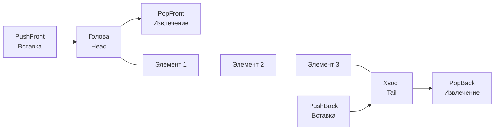
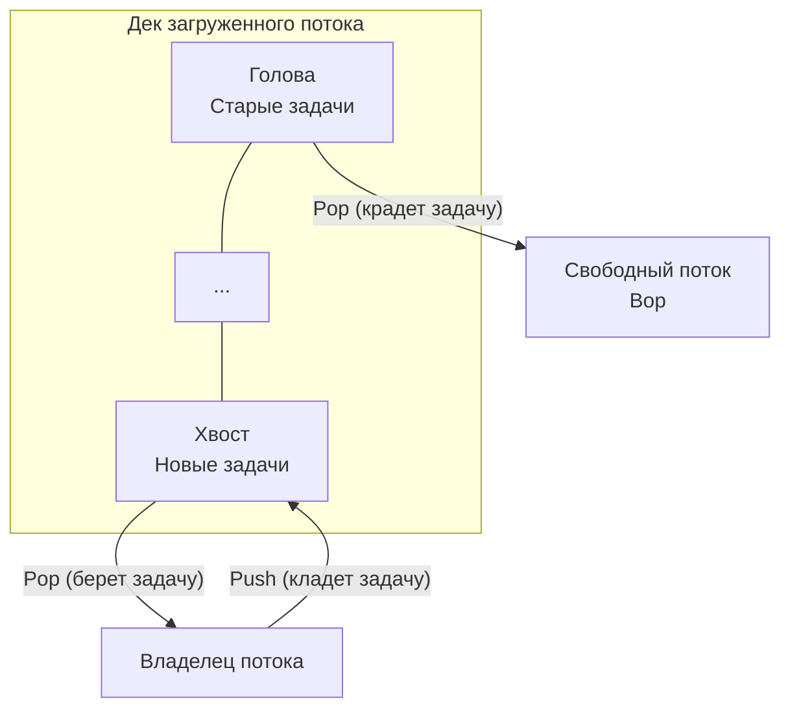

В предыдущих статьях мы разобрали две фундаментальные абстракции: [[4. Стек]] с его строгим LIFO (последним пришел — первым ушел) и [[5. Очередь]] с ее справедливым FIFO (первым пришел — первым ушел). Но архитектура реальных высоконагруженных систем часто требует гибридных подходов. 

Что если нам нужно обрабатывать задачи по очереди (FIFO), но при этом иметь возможность "отменить" или "вернуть" задачу в начало очереди при ошибке? Или если мы хотим реализовать умный балансировщик нагрузки? 

Для таких задач используется **Дек (Deque — Double-Ended Queue, двусторонняя очередь)**.

## Архитектура Дека

Дек снимает жесткие ограничения стека и очереди, позволяя добавлять и извлекать элементы с **обоих концов** за константное время $O(1)$. 

Дек поддерживает четыре основные операции:
1. `PushFront` — добавить элемент в начало (Голову).
2. `PushBack` — добавить элемент в конец (Хвост).
3. `PopFront` — извлечь элемент из начала.
4. `PopBack` — извлечь элемент из конца.



> [!info] Под капотом: Терминология
> В англоязычной литературе Deque часто произносится как "дек" (deck), чтобы не путать с функцией `dequeue` (процесс извлечения из обычной очереди).

## Mechanical Sympathy: Проблема наивной реализации

Как мы выяснили в статье про очередь, реализация вставки или удаления из начала (Head) обычного слайса — это алгоритмическое самоубийство.

Если мы попытаемся сделать `PushFront` через встроенный `append` в Go:
```go
// ХУДШИЙ КОД ДЛЯ ПРОДАКШЕНА
deque := []int{1, 2, 3}
deque = append([]int{0}, deque...) // PushFront
```
Для вставки одного элемента рантайму Go придется:
1. Аллоцировать новый базовый массив.
2. Скопировать туда `0`.
3. Скопировать весь старый `deque` (O(N) операция).
4. Оставить старый массив на растерзание Garbage Collector-у.

На 100 000 элементов эта операция поставит ваш бэкенд на колени из-за деградации кэша CPU и гигантского GC Churn.

## Выбор базы для Дека

У нас есть два пути для создания эффективного дека:

1. **Двусвязный список (Doubly Linked List):** У каждого узла есть `next` и `prev`. $O(1)$ на все операции. Но, как мы разбирали в [[3. Связные списки]], это сопровождается промахами кэша (Cache Misses) из-за случайного доступа к памяти (Pointer Chasing).
2. **Динамический кольцевой буфер (Dynamic Ring Buffer):** Мы используем непрерывный слайс, но "замыкаем" его концы в кольцо. Указатели `head` и `tail` бегают по кругу. Когда места не хватает, мы создаем новый слайс в 2 раза больше и "разворачиваем" старое кольцо в прямую линию. Это дает амортизированное $O(1)$ и **идеальный Cache Locality**.

Стандартом в высокопроизводительной инженерии является именно второй вариант.

## Production-Ready реализация на Go

Ниже представлена реализация быстрого, безопасного для памяти (без утечек) Дека на основе кольцевого буфера с использованием дженериков.

```go
package main

import "errors"

var ErrDequeEmpty = errors.New("deque is empty")

// Deque реализует двустороннюю очередь поверх закольцованного слайса.
type Deque[T any] struct {
	buf  []T
	head int
	tail int
	size int
}

func NewDeque[T any](initialCapacity int) *Deque[T] {
	if initialCapacity < 2 {
		initialCapacity = 2
	}
	return &Deque[T]{
		buf: make([]T, initialCapacity),
	}
}

// PushBack добавляет элемент в конец (как в обычную очередь/стек)
func (d *Deque[T]) PushBack(val T) {
	if d.size == len(d.buf) {
		d.grow()
	}
	d.buf[d.tail] = val
	// Сдвигаем хвост по кольцу
	d.tail = (d.tail + 1) % len(d.buf)
	d.size++
}

// PushFront добавляет элемент в начало
func (d *Deque[T]) PushFront(val T) {
	if d.size == len(d.buf) {
		d.grow()
	}
	// Сдвигаем голову по кольцу влево (с учетом перехода через 0)
	d.head = (d.head - 1 + len(d.buf)) % len(d.buf)
	d.buf[d.head] = val
	d.size++
}

// PopFront извлекает элемент из начала
func (d *Deque[T]) PopFront() (T, error) {
	var zero T
	if d.size == 0 {
		return zero, ErrDequeEmpty
	}

	val := d.buf[d.head]
	d.buf[d.head] = zero // Избегаем утечек памяти (GC Leak)
	
	d.head = (d.head + 1) % len(d.buf)
	d.size--
	return val, nil
}

// PopBack извлекает элемент из конца
func (d *Deque[T]) PopBack() (T, error) {
	var zero T
	if d.size == 0 {
		return zero, ErrDequeEmpty
	}

	// Сдвигаем хвост влево
	d.tail = (d.tail - 1 + len(d.buf)) % len(d.buf)
	val := d.buf[d.tail]
	d.buf[d.tail] = zero // Избегаем утечек памяти
	
	d.size--
	return val, nil
}

// grow удваивает capacity и "выпрямляет" кольцо
func (d *Deque[T]) grow() {
	newCap := len(d.buf) * 2
	newBuf := make([]T, newCap)

	// Если кольцо разорвано (tail находится до head), 
	// нужно аккуратно скопировать две части
	if d.tail <= d.head {
		// Копируем от head до конца старого массива
		copy(newBuf, d.buf[d.head:])
		// Копируем от начала старого массива до tail
		copy(newBuf[len(d.buf)-d.head:], d.buf[:d.tail])
	} else {
		// Кольцо не разорвано, просто копируем
		copy(newBuf, d.buf[d.head:d.tail])
	}

	d.buf = newBuf
	d.head = 0
	d.tail = d.size
}
```

> [!tip] Собеседование (Хардкорная оптимизация)
> **Вопрос:** Оператор остатка от деления `%` работает относительно медленно на уровне процессора (требует десятков тактов). Как ускорить кольцевой буфер?
> **Ответ:** Мы можем принудительно сделать размер буфера (capacity) **степенью двойки** (2, 4, 8, 16...). Тогда медленный оператор `% len` можно заменить на сверхбыструю побитовую операцию И (`&`). 
> Выражение `(head + 1) % 16` абсолютно идентично `(head + 1) & 15`. 
> Побитовое И выполняется процессором за 1 такт. Это классический прием (Mechanical Sympathy), который используется в исходниках Go и Linux-ядра для кольцевых структур.

## Где реально используется Дек? Паттерн Work Stealing

Вы можете спросить: "А зачем в реальном бэкенде нужна структура, в которую можно пихать данные с двух сторон?". 

Ответ кроется в алгоритме **Work Stealing (Кража работы)**, на котором базируется планировщик горутин в Go (а также пулы потоков в Java ForkJoinPool и Tokio в Rust).

Представьте, что у нас есть несколько рабочих потоков (тредов процессора). У каждого потока есть своя локальная очередь задач.
1. **Локальный поток** добавляет новые горутины и берет их на выполнение со **своего конца** дека (например, с хвоста). Для него дек работает как **Стек (LIFO)**. Это максимизирует Cache Locality: свежесозданная задача, скорее всего, всё ещё находится в L1 кэше процессора.
2. Но что если один поток закончил все свои задачи, а другой завален работой? 
3. Свободный поток становится "Вором" (Thief). Он идет к загруженному потоку и крадет задачи с **противоположного конца** дека (с головы). Для вора дек работает как **Очередь (FIFO)**.



Почему вор берет задачи с головы? Потому что там лежат самые старые задачи (возможно, тяжелые или создавшие целое поддерево новых горутин). Украв старую задачу, вор надолго обеспечит себя работой, снизив необходимость постоянно блокировать чужой дек. Дек делает этот элегантный алгоритм возможным.

## Итог

1. **Дек (Double-Ended Queue)** — это универсальная структура, объединяющая возможности стека и очереди. 
2. Наивная реализация на срезах слайсов (`append` с перераспределением) недопустима из-за сложности O(N).
3. Продакшен-решения используют **Кольцевой буфер (Ring Buffer)**, который разворачивается (реаллоцируется) только при полном заполнении, обеспечивая амортизированное $O(1)$ и прекрасную работу с кэшем CPU.
4. Дек является ключевой структурой для алгоритмов балансировки нагрузки, таких как **Work Stealing**.

В этой статье мы реализовали дек на базе концепции "кольцевого буфера". В следующей статье мы окончательно препарируем эту концепцию. Мы разберем, как кольцевой буфер работает в условиях жестких ограничений по памяти (без динамического расширения) и почему он является ядром сетевого программирования (I/O) и каналов в Go: [[7. Кольцевой буфер]].