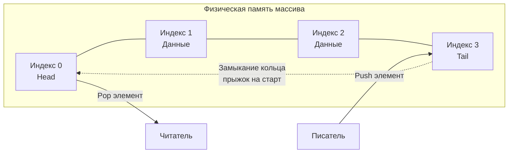

В предыдущих статьях мы прошли путь от примитивных [[1. Массивы и динамические массивы]] до гибридных структур вроде [[6. Дек - двусторонняя очередь]]. Мы увидели, как динамическое изменение размера (реаллокация) помогает строить универсальные коллекции, но бьет по производительности из-за аллокаций памяти и работы Garbage Collector (GC).

Однако в ядре любой высоконагруженной системы (будь то сетевой стек Linux, драйверы устройств или рантайм Go) динамические структуры запрещены. Когда вы обрабатываете миллионы сетевых пакетов в секунду, вы не можете позволить себе выделять память на лету. 

Здесь на сцену выходит **Кольцевой буфер (Ring Buffer / Circular Buffer)** — венец эволюции очередей с фиксированным размером.

## Архитектура кольцевого буфера

Кольцевой буфер — это статический массив заранее заданного размера, который логически замкнут в кольцо. У него нет конца в традиционном понимании. Когда указатель доходит до последней физической ячейки массива, он перепрыгивает обратно на нулевой индекс.

Он управляется двумя указателями:
* **Tail (Хвост / Писатель):** Указывает, куда будет записан следующий элемент.
* **Head (Голова / Читатель):** Указывает, откуда будет прочитан следующий элемент.



## Mechanical Sympathy: Почему это так быстро?

Кольцевой буфер — это святой Грааль системного программирования по трем причинам:

1. **Zero Allocations (Ноль аллокаций):** Буфер создается один раз при старте приложения (или при установке сетевого соединения). Больше не происходит ни одного вызова `malloc`. Garbage Collector в Go может спать спокойно — метрика GC Churn равна нулю.
2. **Perfect Cache Locality (Идеальная локальность):** Так как под капотом лежит непрерывный массив `[]T`, аппаратный Prefetcher процессора идеально предсказывает паттерн доступа и заранее подтягивает данные в кэш L1/L2.
3. **Отсутствие сдвигов:** При чтении (Pop) нам не нужно сдвигать остальные элементы влево (как это было в наивной очереди). Мы просто двигаем указатель `Head` на один шаг вперед.

## Хардкорная реализация: Магия степени двойки

В статье про Дек мы упоминали классический способ зацикливания индексов через остаток от деления: `index = tail % capacity`. 
Однако операция деления (и взятия остатка `%`) — одна из самых медленных инструкций в современных процессорах (занимает от 10 до 40 тактов).

**Секрет Senior-инженеров и создателей ядра Linux (алгоритм kfifo):**
Если мы принудительно сделаем размер буфера (capacity) **степенью двойки** (2, 4, 8, 16, 32...), мы можем заменить медленное деление `%` на сверхбыструю побитовую операцию И (`&`).
Инструкция `&` выполняется процессором ровно за **1 такт**.

Для массива размером 16 (в двоичном виде `10000`), маска будет равна 15 (`01111`).
* Если `tail` растет бесконечно и достигает 17 (`10001`):
* `17 & 15` = `10001 & 01111` = `00001` (индекс 1). Мы элегантно "срезали" лишние биты и вернулись в начало кольца!

### Production-Ready код на Go

Напишем эталонный кольцевой буфер. Мы позволим счетчикам `head` и `tail` расти бесконечно (на 64-битных системах `uint64` переполнится только через сотни лет работы при миллиардах операций в секунду). 
Разница `tail - head` всегда будет давать точное количество элементов в буфере.

```go
package main

import (
	"errors"
)

var (
	ErrBufferFull  = errors.New("ring buffer is full")
	ErrBufferEmpty = errors.New("ring buffer is empty")
)

// RingBuffer реализует быструю ограниченную очередь.
type RingBuffer[T any] struct {
	buf  []T
	head uint64 // Бесконечный счетчик прочитанных
	tail uint64 // Бесконечный счетчик записанных
	mask uint64 // Битовая маска (capacity - 1)
}

// roundUpToPowerOfTwo округляет число до ближайшей степени двойки сверху.
// Классический битовый хак из системного программирования.
func roundUpToPowerOfTwo(v uint64) uint64 {
	v--
	v |= v >> 1
	v |= v >> 2
	v |= v >> 4
	v |= v >> 8
	v |= v >> 16
	v |= v >> 32
	v++
	return v
}

// NewRingBuffer создает буфер. Реальный размер будет округлен до степени двойки.
func NewRingBuffer[T any](minCapacity uint64) *RingBuffer[T] {
	if minCapacity < 2 {
		minCapacity = 2
	}
	cap := roundUpToPowerOfTwo(minCapacity)
	return &RingBuffer[T]{
		buf:  make([]T, cap),
		mask: cap - 1,
	}
}

// Push добавляет элемент в буфер.
func (rb *RingBuffer[T]) Push(val T) error {
	// Если разница между писателем и читателем равна размеру буфера — места нет
	if rb.tail-rb.head == uint64(len(rb.buf)) {
		return ErrBufferFull
	}
	
	// Накладываем битовую маску для получения реального индекса массива
	idx := rb.tail & rb.mask
	rb.buf[idx] = val
	rb.tail++ // Просто инкрементируем виртуальный указатель
	
	return nil
}

// Pop извлекает элемент из буфера.
func (rb *RingBuffer[T]) Pop() (T, error) {
	var zero T
	
	// Если писатели и читатели на одной отметке — буфер пуст
	if rb.head == rb.tail {
		return zero, ErrBufferEmpty
	}
	
	idx := rb.head & rb.mask
	val := rb.buf[idx]
	
	// ОЧЕНЬ ВАЖНО: Зачищаем старое значение для Garbage Collector-а!
	rb.buf[idx] = zero 
	
	rb.head++
	return val, nil
}

// Len возвращает текущее количество элементов за O(1)
func (rb *RingBuffer[T]) Len() uint64 {
	return rb.tail - rb.head
}
```

> [!warning] Ловушка / Gotcha: Lossy vs Lossless поведение
> В нашем коде `Push` возвращает ошибку `ErrBufferFull`, когда буфер заполнен (Lossless режим). Это полезно, если мы не хотим терять данные.
> Однако в системах логирования, мониторинга метрик или стриминге аудио/видео часто применяют **Lossy (с потерями)** подход. Если буфер полон, новый элемент просто **перезаписывает** самый старый `(head++)`. Это позволяет приложению никогда не блокироваться на вводе-выводе логов.

## Где это используется в Go?

### 1. Буферизированные каналы (hchan)
Вы уже используете кольцевые буферы каждый день. Конструкция `make(chan int, 100)` создает внутри рантайма (`src/runtime/chan.go`) структуру `hchan`, в основе которой лежит классический кольцевой массив.
Горутины-писатели инкрементируют `sendx` (tail), а горутины-читатели — `recvx` (head). Встроенный мьютекс защищает эти указатели от состояния гонки (race condition).

### 2. Сетевой I/O (пакет bufio)
При чтении данных из TCP-сокета по одному байту вы убьете систему системными вызовами `read`. Пакет `bufio` создает кольцевой буфер в User Space. Он читает из ОС сразу 4 КБ данных в буфер, а ваш код затем построчно вычитывает данные уже из оперативной памяти.

> [!tip] Собеседование на Senior: Lock-Free структуры
> **Вопрос:** Как сделать этот кольцевой буфер потокобезопасным (Thread-Safe) для работы из множества горутин без использования тяжелого `sync.Mutex`?
> **Ответ:** Использовать паттерн **Lock-Free Ring Buffer** (например, паттерн Disruptor). 
> Идея в том, чтобы использовать атомарные операции (`sync/atomic.AddUint64` и `CompareAndSwap`) для инкремента счетчиков `head` и `tail`. Горутина атомарно "столбит" за собой слот в массиве, записывает туда данные и затем публикует изменение. Это позволяет достичь пропускной способности в десятки миллионов сообщений в секунду между горутинами, полностью избегая переключений контекста ОС, которые вызывает мьютекс.

## Итог

1. **Кольцевой буфер** — это очередь с фиксированным размером (Bounded Queue), закольцованная сама на себя.
2. **Производительность:** Гарантирует $O(1)$ для вставки и извлечения без единой аллокации памяти, что критически важно для latency-sensitive бэкендов.
3. **Оптимизация:** Размер буфера, равный степени двойки, позволяет заменить медленную операцию деления `%` на молниеносное побитовое И `&`.
4. В Go это фундамент для работы буферизированных каналов и системного ввода-вывода (I/O).

На этом мы завершаем блок, посвященный линейным структурам и управлению физической памятью. Впереди нас ждет новый класс структур, которые отказываются от идеи "соседства" данных ради мгновенного поиска по ключу. В следующей статье мы открываем раздел ассоциативных массивов: [[1. Хеш функции и равномерность распределения]].