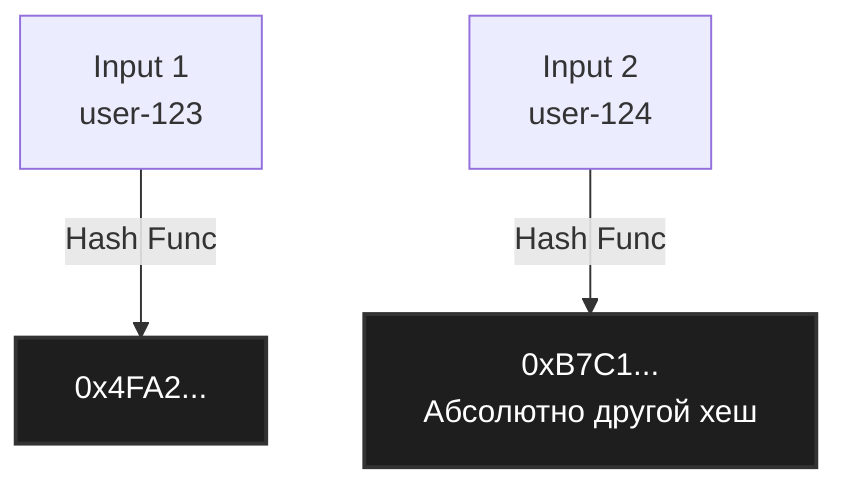

Хеширование — это математический фундамент множества высокопроизводительных систем. Без него не было бы быстрых баз данных, балансировщиков нагрузки, распределенных кэшей и словарей (`map`). На базовом уровне хеш-функция — это алгоритм, который преобразует данные произвольного размера в битовую строку фиксированной длины (хеш-сумму, хеш-код или просто хеш).

Но для бэкенд-инженера хеш-функция — это не просто абстрактная математика. Это инструмент балансировки нагрузки на CPU-кэши, способ защиты от распределенных атак и основа для обеспечения $O(1)$ сложности в ключевых структурах данных.

## Анатомия идеальной хеш-функции

Для использования в структурах данных (например, в хеш-таблицах) хеш-функция должна обладать тремя критическими свойствами.

### 1. Детерминированность
Одни и те же входные данные **всегда** должны давать одинаковый хеш. Если `hash("go") == 42` сегодня, то и через год на этой же машине (при том же `seed`, о котором поговорим позже) оно должно равняться `42`.

### 2. Скорость вычисления
Мы используем хеш-таблицы для быстрого поиска. Если вычисление хеша от строки занимает больше времени, чем линейный поиск по массиву этих строк, смысл структуры теряется. Поэтому некриптографические хеш-функции проектируются так, чтобы использовать самые быстрые инструкции процессора: побитовые сдвиги `<<`, `>>`, XOR `^` и умножение.

### 3. Равномерность распределения и лавинный эффект
Это самое важное свойство для производительности. Хорошая хеш-функция должна распределять ключи по всему пространству возможных значений максимально равномерно, независимо от того, насколько похожи входные данные.

**Лавинный эффект (Avalanche effect)** — если изменить хотя бы один бит во входных данных, в идеале должна измениться ровно половина битов выходного хеша.



## Mechanical Sympathy: Почему равномерность так важна?

Представим, что хеш-функция распределяет значения неравномерно (образует кластеры). В контексте хеш-таблиц это приводит к **коллизиям** — ситуациям, когда разные ключи получают один и тот же хеш (или попадают в один и тот же бакет после применения операции деления по модулю: `hash % array_size`).

На уровне железа коллизии уничтожают производительность:
1. **Деградация сложности**: Поиск из $O(1)$ превращается в $O(n)$, так как нам приходится линейно обходить все элементы, попавшие в один бакет (о методах разрешения поговорим в [[4. Открытая адресация и метод цепочек]]).
2. **Уничтожение Cache Locality**: Если мы используем метод цепочек (linked lists) для разрешения коллизий, каждый элемент списка аллоцируется в случайном месте кучи. При обходе такой цепочки процессор постоянно получает **Cache Miss** (промахи мимо L1/L2 кэша). Вместо того чтобы прочитать данные за 1-3 такта из L1-кэша, CPU ждет сотни тактов, чтобы подтянуть следующий узел из основной памяти (RAM).

> [!info] Под капотом
> Чтобы минимизировать промахи кэша, рантайм Go в своей реализации `map` группирует элементы в бакеты (структура `bmap`) по 8 штук. Размер бакета подобран так, чтобы он и ключи в нем оптимально помещались в кэш-линию современного процессора (обычно 64 байта). Если хеш-функция равномерна, бакеты заполняются равномерно, и CPU эффективно подтягивает целые бакеты в L1-кэш за одно чтение памяти. Подробности будут в статье [[5. Внутреннее устройство map в Go]].

## Некриптографические vs Криптографические хеши

Важно жестко разделять эти два класса.

1. **Криптографические (SHA-256, `golang.org/x/crypto/...`)**: 
   - Главная цель: необратимость и криптографическая стойкость к коллизиям (невозможно подобрать данные под заданный хеш).
   - Скорость: Медленные.
   - Использование: Пароли, подписи, блокчейн.
2. **Некриптографические (MurmurHash, FNV-1a, CityHash, xxHash)**:
   - Главная цель: Скорость и равномерность распределения.
   - Скорость: Очень быстрые.
   - Использование: Хеш-таблицы, балансировка (Consistent Hashing), Bloom Filters.

### Пример простой некриптографической функции: FNV-1a

FNV (Fowler-Noll-Vo) — классический пример того, как достигается лавинный эффект простыми побитовыми операциями.

```go
package main

import (
	"fmt"
)

// FNV-1a 64-bit константы
const (
	offsetBasis uint64 = 14695981039346656037
	fnvPrime    uint64 = 1099511628211
)

// HashStringFNV1a вычисляет 64-битный FNV-1a хеш для строки.
// Функция невероятно проста, но дает отличное распределение.
func HashStringFNV1a(data string) uint64 {
	hash := offsetBasis
	for i := 0; i < len(data); i++ {
		// 1. XOR текущего байта с хешом (смешивание)
		hash ^= uint64(data[i])
		// 2. Умножение на простое число (рассеивание/лавинный эффект)
		hash *= fnvPrime
	}
	return hash
}

func main() {
	// Обратите внимание: изменение одного символа полностью меняет результат
	fmt.Printf("user_1: %x\n", HashStringFNV1a("user_1")) // 8e2e9c15d7e48347
	fmt.Printf("user_2: %x\n", HashStringFNV1a("user_2")) // 8e2e9f15d7e48860
}
```

## Hash DoS и как Go с ним борется

Долгое время многие языки (PHP, ранние версии Java, Python, Ruby) использовали простые хеш-функции типа MurmurHash для своих словарей. 

> [!warning] Ловушка / Gotcha
> Хакеры поняли: если заранее вычислить множество строк, которые дают **одинаковый хеш** в целевом языке, и отправить их в JSON-payload (например, в теле POST-запроса), бэкенд попытается положить их все в один бакет `map`. Вставка деградирует до $O(n^2)$, процессор зависнет на 100%, обрабатывая крошечный запрос в 1-2 мегабайта. Это называется **Hash DoS** (Hash Denial of Service).

Чтобы предотвратить это, современные языки (и Go в первую очередь) используют **рандомизацию хеш-функций**.

### Как это устроено в Go?

Когда рантайм Go создает новую `map`, он генерирует случайное 32-битное число — seed (в исходниках `hmap.hash0`). Этот seed подмешивается в хеш-функцию. 

В результате строка `"password"` в одной мапе будет иметь `hash = 0x123`, а в другой мапе (даже в рамках того же процесса, но созданной в другой момент) — `hash = 0x999`. Злоумышленник больше не может предсказать хеш, так как он не знает случайный `hash0`.

> [!info] Под капотом
> Рантайм Go не использует FNV или MurmurHash для `map`. На x86-64 процессорах Go использует **аппаратное ускорение**. 
> В функции `runtime.aeshash` язык задействует инструкции процессора **AES-NI** (Advanced Encryption Standard New Instructions). Да, Go использует раунды AES шифрования для хеширования ключей мапы! Это дает потрясающую равномерность, защиту от Hash DoS и, благодаря аппаратному ускорению на уровне кремния, работает невероятно быстро. 
> Если процессор не поддерживает AES-NI (например, старые ARM или экзотические архитектуры), Go откатывается на программную реализацию `memhash` (вариация алгоритма Wyhash).

## Что можно хешировать в Go?

В Go вы не можете переопределить хеш-функцию для стандартной `map` (в отличие от C++, где можно передать свой `std::hash`). Go генерирует хеш-функции автоматически во время компиляции для всех типов, удовлетворяющих ограничению `comparable`.

> [!tip] Собеседование
> **Вопрос:** Какие типы можно использовать в качестве ключа для `map` в Go? Почему нельзя использовать `slice`?
> **Ответ:** Ключом может быть любой тип, для которого определена операция `==` (ограничение `comparable`): примитивы, строки, каналы, указатели, интерфейсы, массивы (arrays, фиксированной длины) и структуры, если все их поля `comparable`. 
> Слайсы (`slice`), мапы (`map`) и функции использовать нельзя, так как для них не определено глубокое сравнение `==` на уровне рантайма (только проверка на `nil`), а значит, рантайм не может безопасно разрешать коллизии, когда хеши совпадают. Если нужно использовать слайс как ключ — его нужно конвертировать в строку (с аллокацией) или в фиксированный массив `[N]T` (без аллокации).

Понимая, как работает хеш-функция и как важно равномерное распределение для спасения кэша процессора от промахов, мы можем перейти к тому, как именно эти хеши укладываются в память. В следующей статье мы разберем саму структуру: [[2. Хеш таблица. Реализация]].