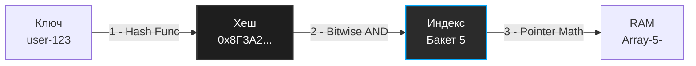

В предыдущей статье [[1. Хеш функции и равномерность распределения]] мы разобрали, как превратить любые входные данные в псевдослучайное число фиксированной длины (хеш). Однако само по себе это число бесполезно. Чтобы получить структуру данных с константным временем доступа $O(1)$, нам нужно связать это абстрактное математическое значение с реальной физической памятью.

Хеш-таблица (Hash Table, словарь, ассоциативный массив) — это, по своей сути, просто надстройка над обычным массивом, которая использует хеш-функцию для вычисления адреса в памяти.

## Как достигается $O(1)$? Mechanical Sympathy

Процессор ничего не знает про хеш-таблицы, ключи или строки. Единственная структура данных, к которой процессор может обратиться за $O(1)$ — это непрерывный блок памяти (массив).

Доступ к элементу массива работает мгновенно, потому что вычисление адреса нужной ячейки сводится к простейшей арифметике указателей:

`Адрес = Базовый_Адрес_Массива + (Индекс * Размер_Элемента)`

Задача хеш-таблицы — максимально быстро и без коллизий превратить строковый (или любой другой) ключ в числовой **индекс** этого внутреннего массива.



## Магия вычисления индекса (Деление vs Битовое И)

Получив 64-битный хеш от функции (например, `12034912389123`), мы не можем просто создать массив такого размера — нам не хватит всей оперативной памяти мира. Мы выделяем массив разумного размера (например, 8 бакетов) и должны "сжать" огромный хеш до диапазона `[0...7]`.

Наивный подход, который часто показывают в академических курсах — это деление по модулю (Modulo):

`index = hash % capacity`

> [!info] Под капотом
> 
> Операция взятия остатка от деления (`DIV` в ассемблере x86) — это одна из самых медленных арифметических инструкций в современном процессоре. Она занимает от 20 до 40 тактов CPU. Для структуры данных, которая должна работать за наносекунды, тратить 40 тактов только на вычисление индекса — непозволительная роскошь.

**Как это решается в production-ready системах (включая Go)?**

Размер внутреннего массива (capacity) **всегда** выбирается как степень двойки ($2^N$: 8, 16, 32, 64 и т.д.).

Если размер массива является степенью двойки, мы можем заменить медленное деление на молниеносную побитовую операцию И (`AND`, `&`), которая выполняется за **1 такт CPU**.

Математическое правило: `hash % (2^N) == hash & (2^N - 1)`

Если наш массив имеет размер 8 ($2^3$), то `capacity - 1` равно 7. В двоичном виде 7 — это `00000111`. Битовое И (`&`) с таким числом просто отсекает все старшие биты хеша, оставляя только 3 младших бита. А 3 бита — это как раз числа от 0 до 7!

## Базовая реализация на Go

Давайте напишем каркас хеш-таблицы, чтобы увидеть, как это работает в коде. В этой реализации мы намеренно опустим сложный механизм разрешения коллизий (оставим простейший вариант для наглядности), чтобы сфокусироваться на аллокациях и битовых сдвигах.

```go
package hashtable

import (
	"fmt"
	"hash/maphash"
)

// bucket представляет собой ячейку массива. 
// В реальном map в Go бакет хранит до 8 элементов для оптимизации L1 кэша.
type bucket struct {
	key   string
	value any
	// Указатель на следующий элемент нужен для разрешения коллизий (метод цепочек)
	next  *bucket 
}

// HashTable - структура нашей хеш-таблицы
type HashTable struct {
	buckets []*bucket
	size    uint64 // Текущее количество элементов
	mask    uint64 // Битовая маска для вычисления индекса (capacity - 1)
	seed    maphash.Seed // Защита от Hash DoS
}

// New создает новую хеш-таблицу.
// initialCapacity ОБЯЗАТЕЛЬНО должна быть степенью двойки.
func New(initialCapacity uint64) *HashTable {
	// Проверка на степень двойки: (n & (n-1)) == 0
	if initialCapacity == 0 || (initialCapacity&(initialCapacity-1)) != 0 {
		panic("capacity must be a power of 2")
	}

	return &HashTable{
		buckets: make([]*bucket, initialCapacity),
		mask:    initialCapacity - 1,
		seed:    maphash.MakeSeed(),
	}
}

// getIndex вычисляет индекс массива за 1 такт CPU
func (ht *HashTable) getIndex(key string) uint64 {
	var h maphash.Hash
	h.SetSeed(ht.seed)
	_, _ = h.WriteString(key) // Ошибок здесь не бывает
	hashValue := h.Sum64()
	
	// Механическое сочувствие (Mechanical Sympathy) в действии
	// Быстрая альтернатива hashValue % len(ht.buckets)
	return hashValue & ht.mask 
}

// Set добавляет или обновляет значение
func (ht *HashTable) Set(key string, value any) {
	index := ht.getIndex(key)
	
	// Если бакет пуст, просто кладем туда элемент
	if ht.buckets[index] == nil {
		ht.buckets[index] = &bucket{key: key, value: value}
		ht.size++
		return
	}

	// Если бакет занят, идем по цепочке (разрешение коллизий)
	curr := ht.buckets[index]
	for {
		// Если ключ уже существует, обновляем значение
		if curr.key == key {
			curr.value = value
			return
		}
		// Если дошли до конца цепочки, добавляем новый узел
		if curr.next == nil {
			curr.next = &bucket{key: key, value: value}
			ht.size++
			return
		}
		curr = curr.next
	}
}
```

## Load Factor и Реаллокация (Rehashing)

Что произойдет, когда количество элементов превысит размер массива? Если у нас массив на 8 элементов, а мы пытаемся вставить 100 ключей, коллизии неизбежны. Все элементы выстроятся в длинные связные списки, и наш $O(1)$ превратится в медленный $O(n)$, убивающий Cache Locality.

Здесь в игру вступает метрика **Load Factor (Коэффициент заполнения)**.

`Load Factor = Количество_элементов / Размер_массива`

Когда Load Factor достигает определенного предела (в Go для `map` этот предел равен `6.5` элементов на бакет), хеш-таблица инициирует **ресайз (Rehashing)**.

### Как происходит эвакуация памяти:

1. Выделяется новый массив, размер которого в 2 раза больше старого ($N * 2$, чтобы сохранить свойство степени двойки).
2. Обновляется битовая маска (`new_mask = new_capacity - 1`).
3. Берется каждый элемент из старого массива, для него **заново вычисляется индекс** (потому что маска изменилась!) и он копируется в новый массив.
4. Старый массив отдается на растерзание Garbage Collector.

> [!warning] Ловушка / Gotcha
> 
> Rehashing — это операция сложности $O(N)$. Если в вашей мапе лежат миллионы элементов, внезапный ресайз вызовет спайк задержки (latency spike). Процессор остановится, перекладывая мегабайты данных из одного места памяти в другое.
> 
> **Идиоматичный Go:** Если вы заранее знаете, сколько элементов будет в мапе, всегда инициализируйте ее с нужным объемом (capacity): `make(map[string]int, 100000)`. Это избавит рантайм от необходимости делать дорогостоящие ресайзы на лету.

> [!tip] Собеседование
> 
> **Вопрос:** Почему при ресайзе элементы часто оказываются совершенно в других бакетах, а не остаются на своих местах?
> 
> **Ответ:** Потому что меняется маска. Допустим, хеш ключа заканчивается на биты `...1011`. При маске старого массива (размер 8, маска `0111`) индекс был `011` (бакет 3). При новом размере 16, маска становится `1111`. Теперь индекс будет `1011` (бакет 11). Элемент "переехал". В Go внутренний механизм эвакуации устроен еще умнее и распределяет эвакуацию во времени (Incremental Resizing), чтобы не останавливать работу программы надолго, о чем мы детальнее поговорим в [[5. Внутреннее устройство map в Go]].

Мы рассмотрели фундамент — как ключи превращаются в индексы внутреннего массива. Но даже при идеальной хеш-функции коллизии (когда разные ключи получают один индекс) неизбежны (привет, Парадокс дней рождений). В нашей базовой реализации мы использовали `next *bucket` для решения этой проблемы. В следующей статье мы подробно и на глубоком уровне разберем все способы борьбы с этой физической неизбежностью: [[3. Разрешение коллизий]].