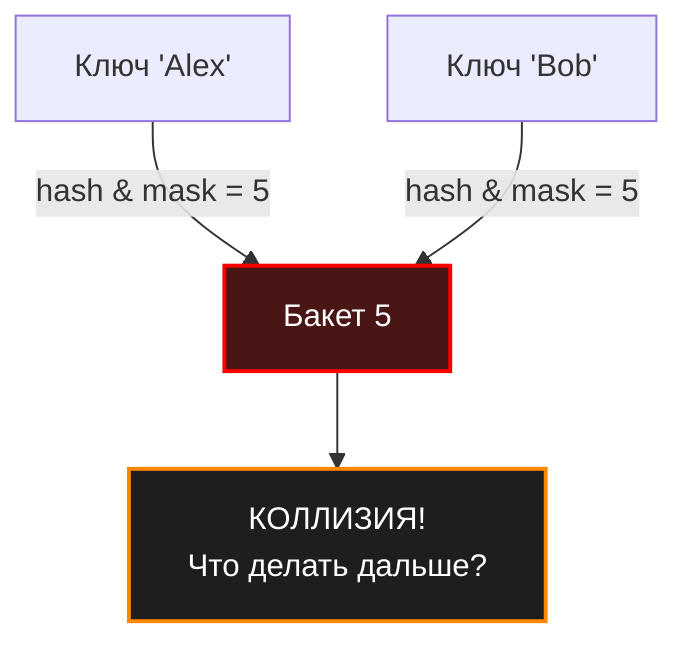

Давайте отбросим академические иллюзии: идеальных хеш-функций для динамических наборов данных не существует. Как бы хорошо ваша функция ни распределяла биты, рано или поздно два разных ключа сгенерируют один и тот же индекс в массиве. Эта ситуация называется **коллизией**.

Для бэкенд-разработчика коллизия — это не баг, а математическая неизбежность, с которой нужно уметь работать. Способность структуры данных элегантно и быстро обрабатывать коллизии отличает production-ready решения от студенческих поделок.

## Математика неизбежности

Почему коллизии происходят даже в огромных хеш-таблицах с отличными хеш-функциями? Здесь работают два фундаментальных математических закона.

### 1. Принцип Дирихле (Pigeonhole Principle)
Если у вас есть $N$ ящиков (бакетов) и $N+1$ голубей (ключей), как минимум в одном ящике окажется два голубя. Поскольку пространство возможных ключей (например, все возможные строки) бесконечно, а размер массива в оперативной памяти конечен, множественные ключи **обязательно** будут мапиться в один и тот же бакет.

### 2. Парадокс дней рождений (Birthday Paradox)
Это контринтуитивный закон вероятности, который часто всплывает на собеседованиях уровня Senior. 

> [!tip] Собеседование
> **Вопрос:** Если мы используем 32-битный хеш (более 4 миллиардов возможных значений), сколько ключей нужно добавить, чтобы вероятность коллизии превысила 50%?
> **Ответ:** Около $65\,536$ ключей ($\sqrt{2^{32}}$). 
> Человеческий мозг думает линейно: "Ну, если бакетов 4 миллиарда, то коллизия будет где-то на 2-х миллиардах". Но математика работает иначе: каждый новый добавленный элемент может столкнуться со **всеми** ранее добавленными. Вероятность растет экспоненциально.

Вот почему мы не можем просто игнорировать коллизии, надеясь на большой размер таблицы.

## Mechanical Sympathy: Цена коллизии для процессора

В идеальном мире (без коллизий) чтение из хеш-таблицы выглядит так: вычисляем хеш -> применяем битовую маску -> читаем ячейку массива. Это занимает около $5-10$ наносекунд, и данные подтягиваются прямо из L1-кэша процессора.

Когда происходит коллизия, алгоритмическая сложность поиска начинает деградировать от $O(1)$ к $O(N)$. Но хуже того — начинает деградировать взаимодействие с железом:

1. **Branch Misprediction (Ошибка предсказания ветвлений):** Коллизии заставляют писать код с условиями `if key == targetKey`. Процессор пытается угадать, куда пойдет выполнение, но при коллизиях паттерн доступа становится хаотичным, конвейер CPU сбрасывается (Pipeline flush), теряя драгоценные такты.
2. **Cache Misses (Промахи кэша):** Если алгоритм разрешения коллизий требует перехода по указателям в другие области памяти, мы получаем промах L1/L2 кэша. Ожидание данных из основной RAM (Main Memory) заставит процессор простаивать $100-200$ тактов.

## Глобальные стратегии разрешения коллизий

Исторически инженерия выработала два фундаментально разных подхода к обработке ситуаций, когда два ключа претендуют на один бакет. В этой статье мы сделаем их обзор, а в следующей разберем детально на уровне байтов.

### 1. Метод цепочек (Separate Chaining / Closed Addressing)

Суть подхода: массив хеш-таблицы хранит не сами элементы, а **указатели на связные списки** (или другие структуры). Если происходит коллизия, новый элемент просто добавляется в конец списка в этом бакете.

* **Плюс:** Таблица никогда не "переполняется" в абсолютном смысле. Даже если Load Factor > 1, мы просто будем иметь длинные списки. Удаление элементов тривиально.
* **Минус (Hardware):** Это кошмар для CPU. Связные списки аллоцируют узлы случайным образом по всей куче (Heap). Обход цепочки генерирует промахи кэша на каждом узле.
* **Где используется:** Классическая Java `HashMap` (с оптимизацией до красно-черных деревьев при длинных цепочках), C++ `std::unordered_map`.

### 2. Открытая адресация (Open Addressing)

Суть подхода: все элементы хранятся **прямо в массиве**. Никаких внешних узлов и списков. Если вычисленный бакет уже занят другим ключом, алгоритм начинает искать следующую **свободную ячейку** по определенному правилу (Probe Sequence).

* **Плюс (Hardware):** Идеально для кэша процессора (Cache Locality). Если бакет занят, мы просто проверяем соседнюю ячейку. Процессор уже предзагрузил (Prefetch) соседние ячейки в кэш-линию, поэтому проверка бесплатна.
* **Минус:** Сложность удаления элементов (требуются маркеры Tombstones/"Мертвые души") и проблема кластеризации (когда занятые ячейки слипаются в большие блоки, замедляя вставку).
* **Где используется:** Python `dict`, Rust `HashMap`, современные высокопроизводительные in-memory кэши.

> [!info] Под капотом
> Рантайм Go в своей `map` использует хитрый **гибридный подход**. Он применяет идею "цепочек" (Chaining), но связывает не отдельные узлы (что убило бы кэш), а целые **блоки-массивы** (структура `bmap`), каждый из которых вмещает ровно 8 пар ключ-значение.
> Если бакет из 8 элементов заполняется, Go аллоцирует новый бакет-переполнение (overflow bucket) и связывает их указателем. Это дает идеальный баланс: внутри бакета элементы лежат плотно (как в открытой адресации, радуя кэш CPU), а при переполнении таблица элегантно растет (как в методе цепочек). Подробнее об этом мы поговорим в статье про внутренности `map`.

## Идеальное хеширование (Perfect Hashing)

Существует особый случай разрешения коллизий — **их полное отсутствие**. 
Если набор ключей известен нам **заранее** и никогда не меняется (например, зарезервированные слова языка программирования, список HTTP-статусов или статический словарь конфигурации), мы можем потратить время на этапе компиляции, чтобы подобрать такую хеш-функцию, которая не даст ни одной коллизии для этого конкретного набора. 

Такой подход называется **Perfect Hashing**. Он гарантирует строгую сложность поиска $O(1)$ в худшем случае (Worst-case) без деградации, но абсолютно неприменим для динамических данных, где ключи добавляются в рантайме.

## Резюме для архитектора

Коллизии — это главный враг производительности хеш-таблиц. Выбор алгоритма разрешения влияет не столько на абстрактное $O(1)$ vs $O(N)$, сколько на количество аллокаций памяти, работу Garbage Collector и утилизацию кэшей процессора.

Теперь, когда мы понимаем физику и математику коллизий, пришло время нырнуть в исходный код и разобрать два главных паттерна их разрешения с позиции хардкорной инженерии. В следующей статье мы детально разберем: [[4. Открытая адресация и метод цепочек]].