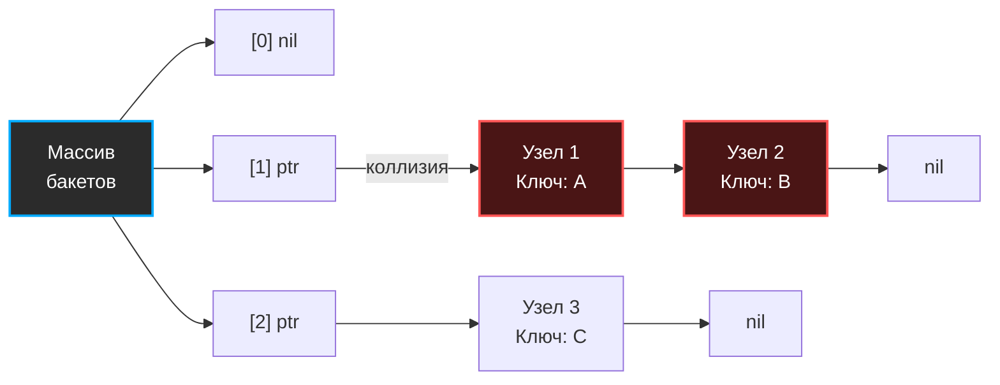
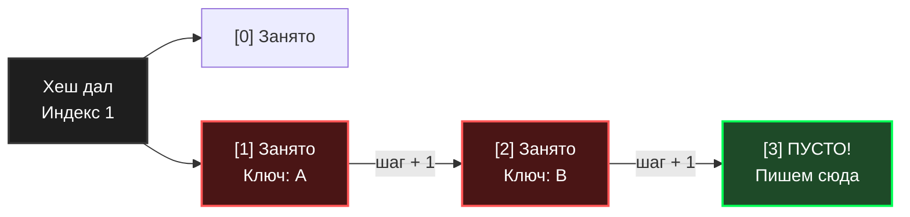

В предыдущих статьях мы установили математический факт: коллизии неизбежны. Когда два разных ключа получают один и тот же индекс (бакет), мы больше не можем просто записать значение в ячейку памяти — она уже занята. 

Для решения этой проблемы инженерия выработала два фундаментальных подхода: **Метод цепочек (Separate Chaining)** и **Открытая адресация (Open Addressing)**. Понимание того, как они работают на уровне железа, отличает рядового разработчика от инженера, способного писать высокопроизводительные системы и in-memory кэши.

## Метод цепочек (Separate Chaining)

Идея метода цепочек проста: массив хеш-таблицы хранит не сами элементы, а указатели на связные списки. Если при вставке бакет уже занят, мы просто создаем новый узел (Node) и добавляем его в конец (или начало) списка в этом бакете.

### Mechanical Sympathy: Боль для процессора

С алгоритмической точки зрения метод цепочек прекрасен. Он легко переносит высокий Load Factor (даже если элементов больше, чем бакетов, таблица продолжает работать, просто списки становятся длиннее). Удаление элементов сводится к тривиальному перекидыванию указателей в связном списке.

Но на уровне "железа" (Hardware) метод цепочек — это катастрофа:

1. **Pointer Chasing (Погоня за указателями):** Узлы связного списка разбросаны по всей куче (Heap) в случайных местах. Когда мы ищем элемент в цепочке, мы читаем Узел 1, достаем оттуда адрес Узла 2, и процессор вынужден делать запрос в оперативную память (RAM). 
2. **Убийство Cache Locality:** Каждое обращение к новому узлу в куче — это почти гарантированный **Cache Miss** (промах кэша). Процессор простаивает сотни тактов, ожидая данные из медленной RAM. Предсказатель ветвлений (Prefetcher) не может угадать, по какому адресу в куче лежит следующий элемент.
3. **Нагрузка на GC:** Каждая вставка нового элемента — это аллокация в куче. Для высоконагруженного бэкенда миллионы таких аллокаций создают огромную работу для Garbage Collector, вызывая микрофризы (STW паузы).

> [!info] Под капотом
> Именно из-за этих проблем стандартный `std::unordered_map` в C++ часто проигрывает кастомным хеш-таблицам. Стандарт C++ требует, чтобы указатели на элементы оставались валидными при реаллокациях таблицы, что де-факто вынуждает реализовывать словари через метод цепочек (отдельные аллокации узлов).

---

## Открытая адресация (Open Addressing)

Открытая адресация предлагает радикально иной подход: **все элементы лежат в одном плоском массиве**. Никаких связных списков, никаких указателей, никаких лишних аллокаций в куче.

Если бакет занят, алгоритм начинает искать **следующую свободную ячейку** по определенному правилу (Probe Sequence). Самое популярное правило — **Линейное пробирование (Linear Probing)**: если индекс `i` занят, проверяем `i+1`, затем `i+2` и так далее (с зацикливанием в конец массива).

### Mechanical Sympathy: Радость кэша

Открытая адресация работает на стороне процессора:
1. **Идеальный Cache Locality:** Массив лежит в памяти непрерывным куском. Когда CPU читает ячейку `[1]`, он автоматически загружает в кэш-линию (Cache Line) L1-кэша ячейки `[2]`, `[3]`, `[4]` и т.д. (обычно блоком 64 байта). 
2. **Никаких Cache Misses:** Проверка соседних ячеек при линейном пробировании происходит за **1 такт CPU**, так как данные уже лежат в сверхбыстром кэше процессора.
3. **Zero Allocations:** Вставка элемента не требует `malloc` (выделения памяти в куче). Мы просто пишем в уже выделенный массив.

> [!warning] Ловушка / Gotcha (Проблема удаления)
> Представьте: мы положили ключ `X` в ячейку `[1]`. Из-за коллизии ключ `Y` (который тоже должен был быть в `[1]`) мы положили в `[2]`. 
> Что будет, если мы удалим `X` (очистим ячейку `[1]`), а потом попытаемся найти `Y`? Мы вычислим хеш для `Y` -> `[1]`. Увидим, что ячейка `[1]` пуста, и алгоритм скажет: "Ключа `Y` в таблице нет!".
> **Решение:** При удалении элементы нельзя просто стирать. Их нужно помечать специальным флагом **Tombstone (Надгробие / Мертвая душа)**. Этот флаг говорит поиску: "Иди дальше, элемент был удален", а при вставке: "Сюда можно писать новый элемент". Обилие Tombstone-ов сильно загрязняет массив и требует частых реаллокаций.

Вторая проблема открытой адресации — **Кластеризация (Clustering)**. При линейном пробировании занятые ячейки имеют свойство слипаться в огромные блоки. Вставка в такой блок вырождается в линейный обход $O(N)$. Чтобы таблица "дышала", Load Factor при открытой адресации не должен превышать 0.6 - 0.7.

---

## Архитектурный компромисс в Go

Создатели Go (Роб Пайк, Кен Томпсон) прекрасно понимали проблемы обоих подходов. Метод цепочек убивает кэш процессора, а открытая адресация страдает от кластеризации и требует жесткого контроля за Load Factor.

> [!tip] Собеседование
> **Вопрос:** Какой метод разрешения коллизий используется в `map` в Go?
> **Ответ:** Go использует **гибридный подход**, который берет лучшее от обоих миров. 

В основе словаря в Go лежит массив структур `bmap` (бакетов). Но хитрость в том, что один `bmap` — это не одиночный узел, а мини-массив, который вмещает ровно **8 пар ключ-значение**. 

1. **Внутри бакета — Открытая адресация (почти):** Пары лежат плотно в непрерывном куске памяти. Это идеально укладывается в кэш-линию процессора (Cache Locality) и позволяет за 1 такт проверять сразу 8 элементов без промахов кэша.
2. **Между бакетами — Метод цепочек:** Если все 8 слотов в бакете заняты (коллизия 9-го уровня для одного индекса), Go аллоцирует **overflow bucket** (бакет переполнения) и связывает их указателем, как в методе цепочек. 

Таким образом, Go избегает проблем кластеризации (типичных для открытой адресации) и минимизирует количество хождений по указателям (так как мы прыгаем по узлам кучи только после проверки 8 элементов подряд в кэше).

Мы подобрались к самому интересному. Теперь, когда мы знаем базу, математику и подходы к решению коллизий, пришло время нырнуть прямо в исходный код `runtime` и разобрать главную структуру бэкендера на атомы. В следующей статье мы рассмотрим: [[5. Внутреннее устройство map в Go]].