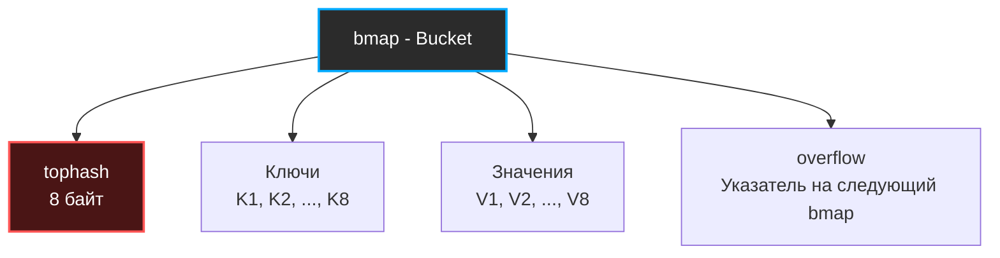

В предыдущих статьях мы разобрали теорию: хеш-функции, битовые маски для индексов и способы разрешения коллизий ([[4. Открытая адресация и метод цепочек]]). Теперь мы спустимся на уровень исходного кода языка Go (пакет `runtime`, файл `map.go`) и посмотрим, как эти концепции воплощены в одной из самых используемых и оптимизированных структур бэкендера — встроенной `map`.

В Go `map` — это классическая хеш-таблица, но она скрывает в себе гениальные инженерные решения, направленные на идеальное взаимодействие с кэшем процессора (Mechanical Sympathy), минимизацию аллокаций и плавную дефрагментацию памяти.

## Структура hmap: Заголовок словаря

Когда вы пишете `m := make(map[string]int)`, рантайм Go не возвращает вам саму мапу. Он возвращает **указатель** на структуру `hmap` (Header of map). Именно поэтому `map` в Go передается по ссылке, и изменение мапы внутри функции отразится на оригинале.

Вот как выглядит структура `hmap` в рантайме (упрощенно):

```go
// runtime/map.go
type hmap struct {
	count     int // Количество элементов в мапе (выдается при len(m))
	flags     uint8 // Флаги состояния -например, флаг конкурентной записи-
	B         uint8 // Логарифм от количества бакетов -capacity = 2^B-
	noverflow uint16 // Примерное число бакетов переполнения
	hash0     uint32 // Рандомный seed для хеш-функции -защита от Hash DoS-

	buckets    unsafe.Pointer // Указатель на массив из 2^B бакетов -bmap-
	oldbuckets unsafe.Pointer // Указатель на старый массив при ресайзе
	nevacuate  uintptr        // Индекс бакета, который эвакуируется прямо сейчас
}
```

Ключевой параметр здесь — `B`. Go всегда держит размер массива бакетов равным степени двойки ($2^B$). Это, как мы помним из статьи [[2. Хеш таблица. Реализация]], позволяет использовать побитовое И (`&`) вместо медленного деления для вычисления индекса.

## Структура bmap: Искусство упаковки памяти

Поле `buckets` в `hmap` указывает на массив структур `bmap` (Bucket map). И вот здесь начинается магия оптимизации.

В исходниках рантайма `bmap` описан крайне просто:
```go
type bmap struct {
	tophash [8]uint8 // Массив из 8 байт
}
```
Кажется, что здесь ничего нет, кроме 8 байт. Но это иллюзия, созданная для компилятора. На самом деле во время компиляции Go динамически генерирует реальную структуру бакета под конкретные типы ключа и значения.

В памяти реальный `bmap` выглядит так:



Каждый бакет строго вмещает **8 пар ключ-значение**. 

### Умное выравнивание (Memory Alignment)

Обратите внимание на порядок полей: сначала идут **все ключи**, а потом **все значения**. Почему не парами: ключ 1, значение 1, ключ 2, значение 2?

Это блестящий пример Mechanical Sympathy. Если ключ и значение имеют разный размер (например, ключ `int64` — 8 байт, а значение `int8` — 1 байт), чередование привело бы к огромным потерям памяти из-за паддинга (Memory Padding) — процессор требует выравнивания адресов.

Если хранить как `K V K V`:
`8 байт (K)` + `1 байт (V)` + `7 байт (Padding)` + `8 байт (K)` ... 
Мы тратим 7 байт впустую на каждую пару.

Если хранить `K K K K ... V V V V`:
`8+8+8+8 (Ключи)` + `1+1+1+1 (Значения)` + `4 байта (Padding в самом конце)`. 
Мы экономим десятки байт на каждом бакете и делаем структуру максимально плотной для L1-кэша!

## Как работает поиск (Read Path)

Когда вы делаете `val := m["my_key"]`, происходит следующая цепочка:

1. **Вычисление хеша**: Рантайм берет ключ `"my_key"`, добавляет к нему `hmap.hash0` и прогоняет через AES-акселератор процессора. На выходе получается 64-битное число.
2. **Поиск бакета (Low bits)**: Берутся младшие `B` бит хеша. Если `B=3`, мы берем 3 младших бита (например, `101` — это 5). Значит, наш бакет — `buckets[5]`.
3. **Поиск внутри бакета (High bits и tophash)**: Процессор не бежит сразу сравнивать тяжелые строки-ключи. Он берет **старшие 8 бит** нашего 64-битного хеша. Затем он сравнивает этот байт с массивом `tophash` в бакете.

> [!info] Под капотом
> Массив `tophash` из 8 байт идеально помещается в один регистр процессора. Сравнение старшего байта хеша со всеми 8 элементами `tophash` происходит за **1 такт CPU** без промахов кэша.
> И только если байты совпали (что случается редко), Go идет в память и делает дорогое сравнение самих ключей (`K1 == "my_key"`).

4. **Коллизии (Overflow)**: Если в бакете все 8 слотов заняты, а нашего ключа там нет, мы идем по указателю `overflow` в следующий бакет (гибридный метод цепочек).

## Инкрементальная эвакуация (Incremental Resizing)

Когда Load Factor (отношение числа элементов к числу бакетов) превышает порог **6.5** (в среднем 6.5 элементов в каждом бакете), `map` инициирует ресайз.

Массив `buckets` увеличивается ровно в 2 раза. Но здесь кроется главная проблема: если в мапе миллион элементов, перенос их всех разом остановит выполнение программы на десятки миллисекунд.

Поэтому Go использует **инкрементальную эвакуацию**:
1. Старый массив бакетов сохраняется в указатель `oldbuckets`.
2. Выделяется память под новый массив `buckets` (в 2 раза больше).
3. Мапа продолжает работать. Но теперь **при каждой операции записи или удаления** (`m[k] = v` или `delete(m, k)`) рантайм берет ровно **2 бакета** из `oldbuckets` и переносит их в новый массив.
4. Поле `nevacuate` сдвигается, отмечая прогресс.

Это размазывает тяжелую операцию во времени ($O(1)$ амортизированное). 

> [!warning] Ловушка / Gotcha
> Во время эвакуации `map` потребляет в 3 раза больше памяти, чем до начала ресайза (старый массив + новый массив х2). Если вы начнете массово заливать данные в мапу без указания `capacity`, вы вызовете серию ресайзов, что нагрузит CPU и GC. 
> **Всегда используйте `make(map[K]V, capacity)`**, если размер известен заранее!

> [!tip] Собеседование
> **Вопрос:** Почему итерация по `map` в Go (через `for k, v := range m`) не гарантирует порядок элементов, а при каждом запуске он разный?
> **Ответ:** Во-первых, хеш-таблица по своей природе не упорядочена — индекс зависит от хеша, а не от времени вставки. Во-вторых, защита от Hash DoS подмешивает рандомный `seed` при создании `map`, поэтому хеши меняются от запуска к запуску. В-третьих, рантайм Go **намеренно** начинает итерацию со случайного бакета и случайного смещения внутри него. Это сделано специально, чтобы разработчики не полагались на случайный порядок (который мог бы сохраниться, если не было ресайзов) и писали надежный код.

## Потокобезопасность (Concurrency)

Встроенная `map` в Go **не является потокобезопасной (thread-safe)**. 

Если одна горутина читает из `map`, а другая в этот же момент в нее пишет, рантайм Go моментально выбросит фатальную ошибку `fatal error. concurrent map read and map write` и уронит весь процесс (никакой `recover` не спасет).

Почему разработчики Go не встроили `Mutex` прямо в `hmap`? 
Ответ — **Mechanical Sympathy**. Мьютексы дороги. Блокировка всей хеш-таблицы на каждую операцию чтения убила бы производительность языка. В 95% случаев мапы используются локально внутри одной горутины, где синхронизация не нужна.

Защита от конкурентной записи реализована через поле `flags` в `hmap`. Когда горутина начинает запись, она выставляет бит `hashWriting`. Любая другая горутина (читающая или пишущая), зайдя в мапу и увидев этот бит, немедленно вызывает панику.

Для конкурентной работы следует использовать `sync.RWMutex` в обертке над вашей мапой, либо специализированную `sync.Map` (о которой мы поговорим в будущем).

Разобравшись с сердцем хеш-таблиц, мы завершаем тему точного поиска. В следующей статье мы перейдем к вероятностным структурам данных, которые позволяют за копейки памяти отвечать на вопрос "есть ли элемент в базе?", жертвуя 100% точностью: [[6. Bloom filter - вероятностная структура данных]].