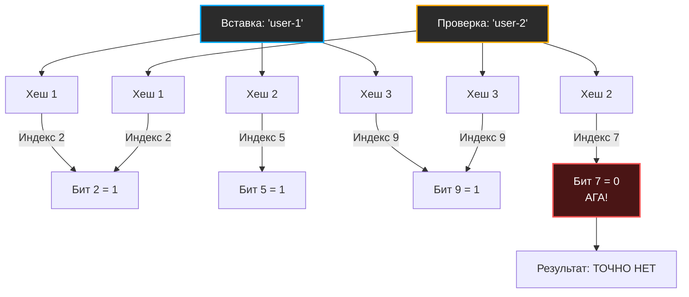

В предыдущей статье [[5. Внутреннее устройство map в Go]] мы разобрали классическую хеш-таблицу, которая дает 100% гарантию точного ответа на вопрос: «Есть ли такой ключ в словаре, и если да, то какое у него значение?». Но за эту абсолютную точность мы платим оперативной памятью: `map` вынуждена хранить и сами ключи, и значения, и служебные структуры (`bmap`, `tophash`).

В мире высоконагруженных систем (особенно в базах данных и распределенных кэшах) часто возникает другая задача: нам не нужно само значение, нам нужно **максимально быстро и дешево узнать, существует ли элемент в огромном наборе данных**.

Если элементов миллиарды, обычная хеш-таблица не поместится в RAM. И здесь на сцену выходит **Bloom filter (Фильтр Блума)** — структура данных, которая сжимает информацию о присутствии миллиардов ключей в несколько мегабайт, жертвуя абсолютной точностью ради фантастической экономии памяти.

## Суть вероятностного подхода

Фильтр Блума отвечает на вопрос «Есть ли элемент в множестве?» с небольшой оговоркой. Его ответы звучат так:
1. **«Абсолютно точно НЕТ»** (False Negatives невозможны).
2. **«Возможно ДА»** (Возможны False Positives — ложноположительные срабатывания).

Если фильтр сказал «нет», вы можете на 100% быть уверены, что элемента нет, и не делать дорогой запрос к диску или внешней БД. Если фильтр сказал «да», элемент *скорее всего* есть, но есть небольшая вероятность (например, 1%), что это совпадение, и вам придется проверить базу данных.

## Архитектура фильтра Блума

Внутри фильтр состоит всего из двух компонентов:
1. **Битовый массив (Bit array)** длины `m`, изначально заполненный нулями.
2. **Набор из `k` независимых хеш-функций**, каждая из которых выдает индекс от `0` до `m-1`.

### Операция вставки (Add)
Когда мы добавляем элемент, мы прогоняем его через все `k` хеш-функций. Каждая функция выдает индекс. Мы идем в битовый массив и устанавливаем биты по этим индексам в `1`.

### Операция проверки (Contains)
Когда мы проверяем наличие элемента, мы снова прогоняем его через те же `k` хеш-функций. Затем мы проверяем биты по полученным индексам:
- Если **хотя бы один** бит равен `0` — элемента **точно нет**.
- Если **все** `k` битов равны `1` — элемент **вероятно есть**.



Почему «вероятно есть»? Потому что биты в эти позиции могли быть установлены в `1` при добавлении *других* элементов (коллизия на уровне битов).

> [!tip] Собеседование
> **Вопрос:** Можно ли удалить элемент из классического фильтра Блума?
> **Ответ:** Нет. Поскольку биты могут принадлежать сразу нескольким элементам (быть установленными разными ключами), сброс бита в `0` при удалении одного ключа может "сломать" другие ключи, для которых фильтр начнет ошибочно выдавать "Точно нет" (False Negative), что нарушает главную гарантию фильтра. Для поддержки удаления используют модификации, например, **Counting Bloom Filter**, где вместо 1 бита хранится счетчик (например, 4 бита).

## Математика ложных срабатываний (False Positives)

Инженеру важно понимать, как связаны параметры фильтра. Вероятность ложного срабатывания $p$ зависит от трех параметров:
* $n$ — количество элементов, которые мы планируем добавить.
* $m$ — размер битового массива (в битах).
* $k$ — количество хеш-функций.

Если сделать массив маленьким ($m$), он быстро заполнится единицами, и на любой запрос фильтр будет отвечать «Возможно ДА» (вероятность ошибки устремится к 100%).
Если сделать слишком много хеш-функций ($k$), каждый элемент будет "зажигать" слишком много битов, что тоже быстро заполнит массив.

На практике вам не нужно угадывать эти числа. Вы задаете желаемое количество элементов $n$ и приемлемую вероятность ошибки $p$ (например, 0.01 или 1%), а формулы выдают оптимальные $m$ и $k$:

$m = -\frac{n \ln p}{(\ln 2)^2}$
$k = \frac{m}{n} \ln 2$

Для ошибки в 1% вам потребуется всего около **9.6 бит на один элемент**. То есть 100 миллионов URL-адресов можно хранить в фильтре размером всего около **120 МБ**! В виде строк в `map` это заняло бы гигабайты.

## Mechanical Sympathy: Экономия диска и кэша

Почему Bloom filter так популярен в бэкенде? Его главное предназначение — защита от дорогих операций I/O (Input/Output).

Самый классический пример — базы данных на основе [[4. LSM дерево]] (Cassandra, ClickHouse, RocksDB). В таких БД данные размазаны по множеству файлов на диске (SSTables). Если пользователь делает `SELECT * FROM users WHERE id = 999`, а такого пользователя в природе не существует, базе пришлось бы прочитать с диска все файлы, чтобы в этом убедиться. Чтение с диска — это миллисекунды.

Вместо этого база держит в оперативной памяти (RAM) небольшие фильтры Блума для каждого файла. 
1. CPU проверяет фильтр (операции побитового И — наносекунды, массив легко ложится в L1/L2 кэш).
2. Фильтр говорит "Точно нет".
3. База мгновенно возвращает `Not Found`, не сделав **ни одного** обращения к диску.

## Реализация на Go: Идиоматичный подход

Для реализации нам нужен битовый массив. В Go нет типа `bit`, поэтому мы используем `[]uint64`, где каждое число содержит 64 бита. Это позволяет процессору обрабатывать данные машинными словами (оптимально для 64-битных архитектур).

Кроме того, вычислять 5-7 разных криптографических хешей для каждого ключа — слишком дорого для CPU. В production-системах используют трюк **Double Hashing** (Двойное хеширование). Из одной хорошей 64-битной хеш-функции мы извлекаем два значения, и комбинируем их для симуляции любого количества $k$ функций: $h_i = h_1 + i * h_2$.

В Go 1.14+ появился пакет `hash/maphash`, который использует встроенные AES-инструкции процессора (то же самое, что внутри мап, как мы обсуждали в [[1. Хеш функции и равномерность распределения]]). Он невероятно быстрый и защищен от коллизий.

```go
package bloom

import (
	"hash/maphash"
)

// BloomFilter представляет собой вероятностную структуру данных.
type BloomFilter struct {
	bitset []uint64     // Наш битовый массив (слайс 64-битных слов)
	m      uint64       // Общее количество бит
	k      uint64       // Количество хеш-функций
	seed1  maphash.Seed // Seed для первой хеш-функции
	seed2  maphash.Seed // Seed для второй хеш-функции
}

// New создает новый фильтр Блума.
// На практике m и k должны вычисляться по формулам на основе n и p.
func New(mBits uint64, k uint64) *BloomFilter {
	return &BloomFilter{
		// Делим на 64 с округлением вверх, чтобы узнать количество uint64
		bitset: make([]uint64, (mBits+63)/64),
		m:      mBits,
		k:      k,
		seed1:  maphash.MakeSeed(),
		seed2:  maphash.MakeSeed(),
	}
}

// getHashes вычисляет два базовых хеша для трюка Double Hashing
func (b *BloomFilter) getHashes(data string) (uint64, uint64) {
	var h maphash.Hash
	
	h.SetSeed(b.seed1)
	_, _ = h.WriteString(data)
	h1 := h.Sum64()

	h.Reset()
	h.SetSeed(b.seed2)
	_, _ = h.WriteString(data)
	h2 := h.Sum64()

	return h1, h2
}

// Add вставляет элемент в фильтр.
func (b *BloomFilter) Add(data string) {
	h1, h2 := b.getHashes(data)

	for i := uint64(0); i < b.k; i++ {
		// Трюк: Double Hashing. Симулируем k функций.
		idx := (h1 + i*h2) % b.m
		
		// Битовая магия
		wordIdx := idx / 64   // Находим нужный uint64 в слайсе
		bitIdx := idx % 64    // Находим нужный бит внутри этого uint64
		
		// Устанавливаем бит в 1 с помощью побитового ИЛИ (OR)
		b.bitset[wordIdx] |= (1 << bitIdx)
	}
}

// Contains проверяет, возможно ли наличие элемента в фильтре.
func (b *BloomFilter) Contains(data string) bool {
	h1, h2 := b.getHashes(data)

	for i := uint64(0); i < b.k; i++ {
		idx := (h1 + i*h2) % b.m
		wordIdx := idx / 64
		bitIdx := idx % 64

		// Проверяем, установлен ли бит, с помощью побитового И (AND)
		if (b.bitset[wordIdx] & (1 << bitIdx)) == 0 {
			return false // Если хотя бы один бит 0, элемента ТОЧНО НЕТ
		}
	}
	return true // Все биты 1, элемент ВОЗМОЖНО ЕСТЬ
}
```

> [!warning] Ловушка / Gotcha
> Фильтр Блума **нельзя расширять (resize)**. Если вы создали фильтр на 1 миллион элементов, а залили в него 10 миллионов, он не упадет с ошибкой (ведь это просто биты). Но почти все биты станут единицами, и фильтр начнет возвращать `true` абсолютно для любого ключа, теряя весь свой смысл. Если вы не знаете размер данных заранее, вам нужен **Scalable Bloom Filter** (набор обычных фильтров Блума, которые аллоцируются по мере заполнения).

## Итог

Фильтр Блума — это идеальный инструмент отсечения. Он перехватывает "мусорные" запросы (несуществующие ключи, плохие пароли, вредоносные IP-адреса) в оперативной памяти за микросекунды, защищая медленные подсистемы от перегрузок.

До сих пор мы рассматривали классическое хеширование, где коллизии — это норма (в мапах) или полезный побочный эффект (в фильтрах Блума). Но что, если нам нужна хеш-таблица с гарантированным $O(1)$ в худшем случае, которая сама разрешает коллизии путем выселения элементов? В следующей статье мы разберем продвинутый алгоритм, используемый в высоконагруженных маршрутизаторах и кэшах: [[7. Cuckoo hashing]].