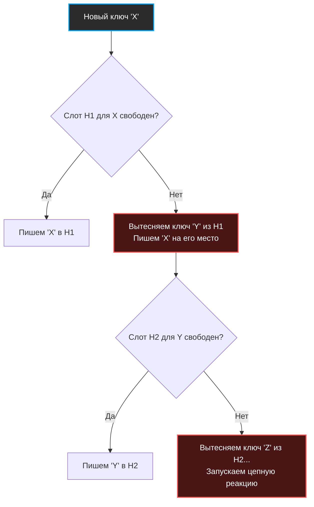

Встроенная `map` в Go и большинство стандартных хеш-таблиц (с открытой адресацией или цепочками) обеспечивают сложность поиска $O(1)$ только **в среднем** (Amortized). В худшем случае (Worst-case), когда множество ключей образуют длинную цепочку коллизий, сложность деградирует до $O(N)$. 

Для обычного бэкенда (CRUD, REST API) это приемлемо. Но если вы пишете сетевой маршрутизатор (Data Plane Development Kit - DPDK), высокочастотную торговую систему (HFT) или in-memory кэш с жесткими SLA по тайм-аутам, **непредсказуемая задержка недопустима**. Вам нужен гарантированный ответ за константное время, независимо от коллизий.

Именно эту задачу решает **Кукушкино хеширование (Cuckoo Hashing)**.

## Концепция: Поведение кукушки

Название алгоритма происходит от поведения птицы кукушки, которая подкидывает свои яйца в чужие гнезда, выталкивая оттуда яйца хозяев.

В классическом Cuckoo Hashing используются:
1. **Две независимые хеш-функции** (H1 и H2).
2. **Две таблицы** (или одна таблица, разбитая логически, где H1 указывает на первую половину, а H2 — на вторую).

Главное правило: **Каждый ключ может находиться только в двух конкретных ячейках**. Никаких связных списков, никакого линейного пробирования. 

### Чтение — Гарантированный $O(1)$
Чтобы найти элемент, мы проверяем **только две ячейки**: `H1(key)` и `H2(key)`.
* Если ключ есть в одной из них — мы его нашли.
* Если его нет ни там, ни там — ключа в таблице нет.
Всё. Максимум два чтения из памяти. Строгий Worst-case $O(1)$.

### Вставка — Вытеснение соседей
Вставка происходит по агрессивному сценарию:
1. Вычисляем `idx1 = H1(key)`. Если ячейка пуста, пишем туда.
2. Если `idx1` занят, вычисляем `idx2 = H2(key)`. Если пуста, пишем туда.
3. Если **обе ячейки заняты**, мы берем наш новый ключ и "выкидываем" старый ключ из `idx1`, занимая его место.
4. "Выкинутый" (сирота) ключ теперь должен найти себе место. Мы вычисляем для него *его* альтернативный индекс (`H2(old_key)`) и пытаемся вставить туда.
5. Если там тоже занято, сирота выкидывает того, кто там сидит.
6. Процесс продолжается до тех пор, пока все ключи не найдут свободное место.



## Mechanical Sympathy: Почему это быстро?

Для процессора предсказуемость — ключ к производительности.
В классической открытой адресации (Linear Probing), процессор идет по массиву последовательно. Это хорошо для кэша, но если кластер занятых ячеек большой, процессор сделает десятки проверок (Branching), нагружая конвейер инструкций.

В Cuckoo Hashing процессор делает **ровно два независимых запроса в память**. 
Да, эти два запроса могут вызвать два Cache Miss (промахи мимо L1/L2), потому что индексы случайны. Но это **максимально возможная деградация**. Время ответа системы становится абсолютно плоским — график Latency (p99 и p100) выравнивается в идеальную прямую линию. Это критически важно для систем реального времени.

## Проблема зацикливания (Cycles) и Ресайз

Что произойдет, если ключи образуют бесконечный цикл вытеснений? Например: `X` вытесняет `Y`, `Y` вытесняет `Z`, а `Z` вытесняет `X`.

> [!warning] Ловушка / Gotcha
> Бесконечный цикл — главная проблема Cuckoo Hashing. Чтобы его избежать, в алгоритм вводится жесткий лимит вытеснений — **Max Kicks** (обычно логарифм от размера таблицы или константа, например, 500). 
> Если счетчик вытеснений достигает `Max Kicks`, мы понимаем, что застряли в цикле. В этот момент таблица обязана сделать **Rehash**: выбрать новые seed-ы для хеш-функций и полностью пересобрать таблицу (или увеличить её размер).

> [!info] Под капотом
> Математически доказано, что при использовании 2-х хеш-функций вероятность зацикливания резко возрастает, когда таблица заполнена на **50%** (Load Factor = 0.5). То есть половина памяти простаивает.
> Чтобы повысить плотность до 80-90%, инженеры увеличивают количество хеш-функций до 3-4 (D-ary Cuckoo Hashing) или делают бакеты вместительными (по 4-8 слотов в одном индексе, аналогично тому, как это сделано в [[5. Внутреннее устройство map в Go]]).

## Базовая реализация на Go

Давайте реализуем ядро алгоритма для словаря `map[string]string`. Для имитации двух таблиц мы используем один плоский массив, но два разных `seed` для получения независимых индексов.

```go
package cuckoo

import (
	"errors"
	"hash/maphash"
)

const maxKicks = 500

type entry struct {
	key   string
	value string
	empty bool
}

type CuckooTable struct {
	table []entry
	size  uint64
	seed1 maphash.Seed
	seed2 maphash.Seed
}

func New(capacity uint64) *CuckooTable {
	// Инициализируем массив пустых структур
	t := make([]entry, capacity)
	for i := range t {
		t[i].empty = true
	}
	return &CuckooTable{
		table: t,
		size:  capacity,
		seed1: maphash.MakeSeed(),
		seed2: maphash.MakeSeed(),
	}
}

// hash вычисляет индекс для переданного seed
func (c *CuckooTable) hash(key string, seed maphash.Seed) uint64 {
	var h maphash.Hash
	h.SetSeed(seed)
	_, _ = h.WriteString(key)
	return h.Sum64() % c.size // Для простоты используем %, в проде лучше битовую маску
}

// Get гарантирует O-1 в худшем случае
func (c *CuckooTable) Get(key string) (string, bool) {
	idx1 := c.hash(key, c.seed1)
	if !c.table[idx1].empty && c.table[idx1].key == key {
		return c.table[idx1].value, true
	}

	idx2 := c.hash(key, c.seed2)
	if !c.table[idx2].empty && c.table[idx2].key == key {
		return c.table[idx2].value, true
	}

	return "", false
}

// Set вставляет элемент с логикой вытеснения
func (c *CuckooTable) Set(key string, value string) error {
	// Сначала проверяем, нет ли уже такого ключа (обновление)
	// ... код проверки опущен для краткости ...

	currEntry := entry{key: key, value: value, empty: false}

	for i := 0; i < maxKicks; i++ {
		idx1 := c.hash(currEntry.key, c.seed1)
		if c.table[idx1].empty {
			c.table[idx1] = currEntry
			return nil
		}

		idx2 := c.hash(currEntry.key, c.seed2)
		if c.table[idx2].empty {
			c.table[idx2] = currEntry
			return nil
		}

		// Обе ячейки заняты. Рандомно (или детерминированно) выбираем кого выкинуть.
		// Для простоты всегда бьем в idx1
		evicted := c.table[idx1]
		c.table[idx1] = currEntry
		currEntry = evicted // Сирота становится текущим элементом для следующей итерации
	}

	// Если мы здесь - мы зациклились
	return errors.New("нужен rehash - превышен maxKicks")
}
```

## Cuckoo Filter: Эволюция фильтра Блума

В предыдущей статье мы обсуждали [[6. Bloom filter - вероятностная структура данных]]. У него есть серьезный фундаментальный недостаток — **из него нельзя удалять элементы**.

> [!tip] Собеседование
> **Вопрос:** Как реализовать вероятностную структуру данных с возможностью удаления элементов, не раздувая память счетчиками (как в Counting Bloom Filter)?
> **Ответ:** Использовать **Cuckoo Filter**.

**Cuckoo Filter** — это хеш-таблица на основе кукушкиного хеширования, в которой вместо самих ключей и значений хранятся только короткие отпечатки ключей (Fingerprints, например, 8 или 12 бит хеша). 
Поскольку мы знаем точное местоположение отпечатка в таблице (одно из двух), мы можем безопасно удалить его, просто очистив ячейку. Это делает Cuckoo Filter современным и более гибким стандартом де-факто, который постепенно вытесняет Bloom Filter в новых in-memory решениях (например, в некоторых подсистемах Redis).

## Резюме по разделу Хеширования

Мы прошли путь от базовых хеш-функций до сложнейших механизмов разрешения коллизий в Go и вероятностных структур:
1. Равномерность хеш-функции — фундамент защиты от коллизий и Hash DoS.
2. Битовые маски (степени двойки) экономят такты CPU при вычислении индексов.
3. Открытая адресация дружит с кэшем процессора, метод цепочек деградирует в куче.
4. Встроенная `map` в Go использует гибридный подход — бакеты по 8 элементов для идеального Cache Locality.
5. Фильтры Блума экономят диск ценой ложных срабатываний, а Cuckoo-структуры решают проблему долгих поисков и позволяют удаление.

Хеширование обеспечивает нам фантастический $O(1)$ для точного совпадения. Но что, если нам нужно найти "все элементы больше X"? Хеш-таблицы здесь бессильны, так как они уничтожают порядок. Для упорядоченных данных и поиска по диапазону (Range Queries) нам нужна совершенно иная геометрия связей. Мы переходим к фундаментальным структурам, управляющим всеми современными базами данных. Следующий большой раздел мы начнем с базы: [[1. Деревья и обходы]].